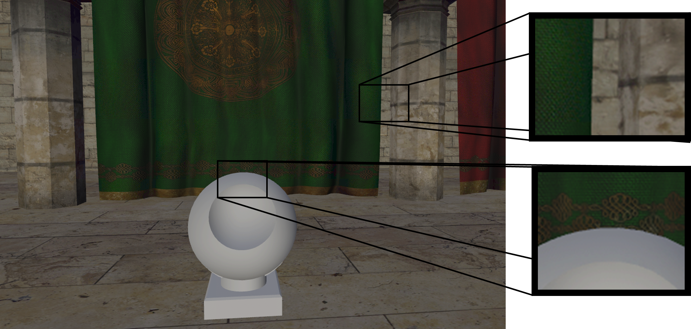
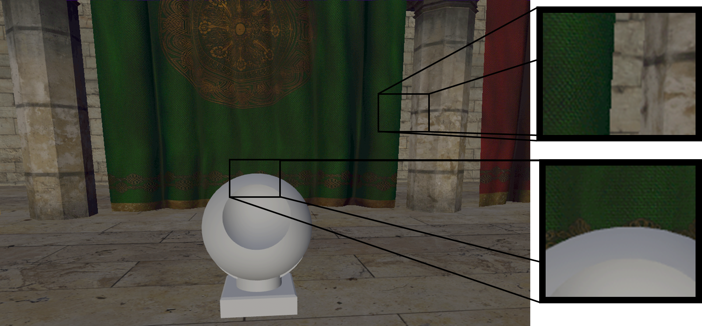

# Rendering modes

Remote Rendering offers two main modes of operation, **TileBasedComposition** mode and **DepthBasedComposition** mode. These modes determine how the workload is distributed across multiple GPUs on the server. The mode has to be specified at connection time and cannot be changed during runtime.

Both modes come with advantages but also with inherent feature limitations, so picking the most suitable mode is use case specific.

## Modes

The two modes are now discussed in more detail.

### 'TileBasedComposition' mode

In **TileBasedComposition** mode, every involved GPU renders specific subrectangles (tiles) on the screen. The main GPU composes the final image from the tiles before it is sent as a video frame to the client. Accordingly, all GPUs require to have the same set of resources for rendering, so the loaded assets need to fit into a single GPU's memory.

The rendering quality in this mode is slightly better than in **DepthBasedComposition** mode, since MSAA can work on the full set of geometry for every GPU. The following screenshot shows that antialiasing works properly for both edges likewise:



Furthermore, in this mode each part can be switched to a transparent material or switched to **see-through** mode via the [HierarchicalStateOverrideComponent](../overview/features/override-hierarchical-state.md)

### 'DepthBasedComposition' mode

In **DepthBasedComposition** mode, every involved GPU renders at full screen resolution but only a subset of meshes. The final image composition on the main GPU takes care that parts are properly merged according to their depth information. Naturally, memory payload is distributed across the GPUs, thus allowing for rendering models that would not fit into a single GPU's memory.

Every single GPU uses MSAA to antialias local content. However, there might be inherent aliasing between edges from distinct GPUs. This effect is mitigated by postprocessing the final image, but MSAA quality is still worse than in **TileBasedComposition** mode.

MSAA artifacts are illustrated in the following image:


Antialiasing works properly between the sculpture and the curtain, because both parts are rendered on the same GPU. On the other hand, the edge between curtain and wall shows some aliasing because these two parts are composed from distinct GPUs.

The biggest limitation of this mode is, that geometry parts cannot be switched to transparent materials dynamically nor does the **see-through** mode work for the [HierarchicalStateOverrideComponent](../overview/features/override-hierarchical-state.md). Other state override features (outline, color tint, ...) do work, though. Also materials that were marked as transparent at conversion time do work properly in this mode.

### Performance

The performance characteristics for both modes do vary based on the use case, and it is hard to reason or provide general recommendations. If you are not constrained by the limitations mentioned above (memory or transparency/see-through), it is recommended to try out both modes and monitor the performance using various camera positions.

## Setting the render mode

The render mode used on a Remote Rendering server is specified during `RenderingSession.ConnectAsync` via the `RendererInitOptions`.

```cs
async void ExampleConnect(RenderingSession session)
{
    RendererInitOptions parameters = new RendererInitOptions();

    // Connect with one rendering mode
    parameters.RenderMode = ServiceRenderMode.TileBasedComposition;
    await session.ConnectAsync(parameters);

    session.Disconnect();

    // Wait until session.IsConnected == false

    // Reconnect with a different rendering mode
    parameters.RenderMode = ServiceRenderMode.DepthBasedComposition;
    await session.ConnectAsync(parameters);
}
```

## API documentation

* [C# RenderingSession.ConnectAsync()](/dotnet/api/microsoft.azure.remoterendering.renderingsession.connectasync)
* [C# RendererInitOptions struct](/dotnet/api/microsoft.azure.remoterendering.rendererinitoptions)
* [C++ RenderingSession::ConnectToConnectAsyncRuntime()](/cpp/api/remote-rendering/renderingsession#connectasync)
* [C++ RendererInitOptions struct](/cpp/api/remote-rendering/rendererinitoptions)

## Next steps

* [Sessions](../concepts/sessions.md)
* [Hierarchical state override component](../overview/features/override-hierarchical-state.md)