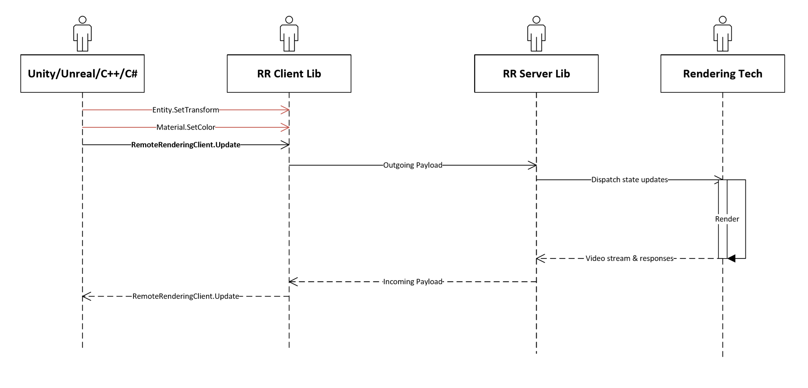

# SDK concepts

This chapter explains some high-level concepts of the Remote Rendering API.

## System initialization

Before any action can be performed in Azure Remote Rendering, the system must be initialized. ```RemoteManagerStatic.StartupRemoteRendering``` will start the system. When `StartupRemoteRendering` initializes Azure Remote Rendering, the rendering mode, the coordinate system for the host engine, and a string identifying the host engine must be provided via the `ClientInit` structure. Call `RemoteManagerStatic.StartupRemoteRendering` before any holographic APIs are called.

In its initialization, coordinate system conventions for the forward, right, and up vector must be set via ```ClientInit.up, forward, right```. The up/forward/right convention informs the Remote Rendering service of the host engine's expected 3d convention. Hosts should always work in their native coordinate space. Azure Remote Rendering converts user input to its internal convention inside the SDK.

When remote rendering is no longer needed by an application, ```RemoteManagerStatic.ShutdownRemoteRendering``` should be called to deinitialize the system. ```RemoteManagerStatic.ShutdownRemoteRendering``` will invalidate any outstanding RemoteRendering objects.

## Session management

A session is composed on an ```AzureFrontend``` class which contains the credential information required to perform ARR API calls, create new ARR runtimes in Azure  and open existing ARR runtimes.  Once an ```AzureFrontend``` class has been initialized with account credentials, an ```AzureSession``` can either be created or a previously created session can be opened.

```AzureFrontend.CreateRenderingSessionAsync``` will create a new VM on the Azure service.

This VM will transition from the ```Starting``` state to the ```Ready``` state over a number of minutes. Once the VM is in the ```Ready``` state,  ```AzureSession.ConnectToRuntime``` can be called to connect to the ARR runtime:

``` cs
ClientInit clientInit = new ClientInit();
// fill out clientInit parameters...

RemoteManagerStatic.StartupRemoteRendering(clientInit);

AzureFrontendAccountInfo accountInfo = new AzureFrontendAccountInfo();
// fill out accountInfo details...

AzureFrontend frontend = new AzureFrontend(accountInfo);

CreateRenderingSessionParams sessionCreationParams = new CreateRenderingSessionParams();
// fill out sessionCreationParams...

AzureSession session = await frontend.CreateNewRenderingSessionAsync(sessionCreationParams).AsTask();

RenderingSessionProperties sessionProperties;
while (true)
{
    sessionProperties = await session.GetPropertiesAsync().AsTask();
    if (sessionProperties.Status != RenderingSessionStatus.Starting &&
        sessionProperties.Status != RenderingSessionStatus.Unknown)
    {
        break;
    }
}

if (sessionProperties.Status != RenderingSessionStatus.Ready)
{
    // Do some error handling and either terminate or retry.
}

// Connect to server
Result connectResult = await session.ConnectToRuntime(new ConnectToRuntimeParams()).AsTask();

// Connected!

// Disconnect
session.DisconnectFromRuntime();

// Decommission the VM
await session.StopAsync().AsTask();

// Close connection
RemoteManagerStatic.ShutdownRemoteRendering();
```

The above code snippets creates a new session on Azure and, once the session is ready, connects to the runtime on the VM to stream images.

Multiple ```AzureFrontend``` and ```AzureSession``` instances can be maintained, manipulated, and queried from code. But, only a single ```AzureSession``` may be connected to a runtime at a time. If a second ```AzureSession.ConnectToRuntime``` is called by a different ```AzureSession``` instance, the call will fail.

> [!IMPORTANT]
> Only a single ```AzureSession``` may be connected to a runtime at a time.

The lifetime of a virtual machine is not tied to the ```AzureFrontend``` instance or the ```AzureSession``` instance. ```AzureSession.StopAsync``` must be called to decommission a virtual machine.

As a virtual machine may persist for multiple application runs, the persistent Session ID can be queried via `AzureSession.SessionUUID()` and cached locally. With the Session ID, an application can call `AzureFrontend.OpenSession` to bind to that session.

```AzureSession.Actions``` will return an instance of ```RemoteManager.``` ```RemoteManager``` contains the member functions to load content, manipulate content, and query information about the rendered scene. A ```RemoteManager```'s functionality is only available if ```AzureSession.IsConnected```.

After connecting, content can be loaded on the remote server via ```AzureSession.Actions.LoadModelAsync```. ```LoadModelAsync``` returns an asynchronous object which, if successful, contains an ```Entity``` representing the root of the loaded asset.

The remote server will never alter the state of client-side data. All mutations of data (transform updates, load requests, and other options available in the client-side API) must be performed by the client application. An action will immediately update the client state.

Messages to the server are buffered locally until  `AzureSession.Actions.Update` method is called. `Update` is responsible for pushing all pending messages to the server and for dispatching responses from the server back to the client.

Data does not persist on an `AzureSession` between connections. On disconnect, all existing data will be flushed from the local `AzureSession.Actions` and the remote server. For example, if you call `LoadModel` on a remote rendering instance, the model will exist in the Remote Rendering runtime. If the application then disconnects and then reconnects to the same session, the model will no longer be available and must be loaded again.

Any remote rendering objects that exist in the application after disconnect or from a previous connection are invalid.

The lifetime of a message from the host engine to the remote engine can be visualized as:



## Notes on Unity

Unity uses a special initialization function to bind to Unity's coordinate system which can be found in [Unity SDK concepts](../how-tos/unity/unity-concepts.md).

## Asynchronous operations and loading data

Data can be loaded through asynchronous APIs. Models that have been [converted](../how-tos/conversion/conversion-rest-api.md) can be loaded through the following APIs:

```cs
LoadModelAsync _pendingLoadTask = null;

void LoadModel(string modelId, Entity parent = null)
{
    AzureSession session = GetConnectedSession();

    _pendingLoadTask = session.Actions.LoadModelAsync(new LoadModelParams(modelId, parent));
    _pendingLoadTask.Completed += (LoadModelAsync res) =>
    {
        if (res.IsRanToCompletion)
        {
            //Do things with res.Result
        }

        _pendingLoadTask = null;
    };
}
```

A reference to an asynchronous operation must be held until the application is done with it. If the application uses the *Completed* event on the async, then the async operation must be held alive by the application until *Completed* has finished.

Asynchronous operations return an asynchronous object where *Completed* and *ProgressChanged* callbacks can be registered. Furthermore, all asynchronous objects have an ```AsTask``` member function to allow for the ```await``` pattern.

Sample code using ```await```:

```cs
async void LoadModel(string modelId, Entity parent = null)
{
    AzureSession session = GetConnectedSession();

    LoadModelResult result = await session.Actions.LoadModelAsync(new LoadModelParams(modelId, parent)).AsTask();

    Entity root = result.Root;
}
```

### Threading

All asynchronous calls from `Actions` and `Entity` are completed during the call to `AzureSession.Actions.Update`. [Azure Frontend APIs](../how-tos/frontend-apis.md) are completed in a background thread.

### Built-in and external resources

Azure Remote Rendering contains some built-in resources, which can be loaded by prepending their respective identifier with `builtin://` during the call to `AzureSession.Actions.LoadXXXAsync()`. The available built-in resources are listed in the documentation for each respective feature. For example, the [sky chapter](../overview/features/sky.md) lists the built-in sky textures.

Besides these built-in resources, the user may also use resources from external storage by specifying their blob storage URI. URIs are most frequently represented as a SAS URI to a [converted model](../how-tos/conversion/conversion-rest-api.md) in blob storage.

A SAS URI of a sample model can be found [here](../samples/sample-model.md).

## Objects and lifetime management

[Components](components.md) and [entities](entities.md) are unique objects with explicit lifetime management. Both objects have a `Destroy()` member function that will destroy the object when it can be freed from the remote rendering runtime. `Entity.Destroy()` will destroy the entity, its children, and all of its components.

The lifetime of these objects are not related to the lifetime of the user object representation such as the `Entity` class in C#. `Destroy` must be called to deallocate and remove the internal representation. The lifetimes are separate so that the user can work on smaller sections of large models in a less efficient user representation, while the compressed representation is stored inside the SDK.

## Resources and lifetime management

[Meshes](meshes.md), [materials](materials.md) and [textures](textures.md) are shared resources that are reference counted, which means their lifetime is managed by their reference count. Consequently, there is no explicit ```Destroy``` method for them. When the resource is not assigned anywhere in the scene tree (for example, a *Mesh* to a *MeshComponent*) and the user code does not hold a reference to the resource, then the resource gets destroyed on both the client and the server. The server will then release the native resource data and free the memory.

## General lifetime management

The lifetime of all API objects is bound to a connection. On disconnect all resources and objects are destroyed on both the client and the server. The log can be checked for information about unreleased resources that were destroyed.

## Next steps

* [Entities](entities.md)
* [Graphics bindings](graphics-bindings.md)
