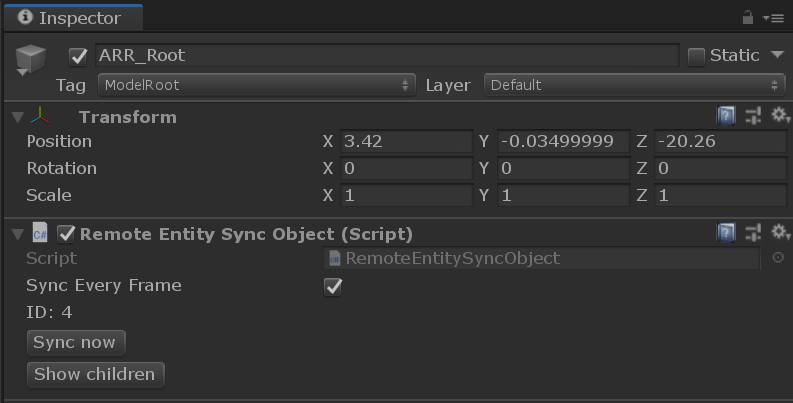

# Unity SDK concepts

Due to the nature of integrating into a third-party engine, there are some special considerations when interacting with Azure remote rendering in Unity.

## Session management

```RemoteManagerUnity.Initialize(RemoteUnityClientInit)``` should be called before any ```RemoteManager``` calls are issued and should be called instead of ```RemoteManager.Initialize```. If the ```RemoteManager``` has not been initialized, an exception will occur on access.

If the ```RemoteManager``` has already been initialized or ```RemoteManagerUnity``` has been initialized without being shut down, an exception will be thrown.

RemoteUnityClientInit initializes the session using Unity's coordinate system and bind the Azure remote rendering SDK's internal logging mechanisms to Unity. After initializing the ```RemoteManagerUnity```, ```RemoteManager``` can be accessed directly as normal.

On application shutdown, ```RemoteManager.ShutdownManager()``` should be called:

``` cs
RemoteUnityClientInit clientInit = new RemoteUnityClientInit;

// Fill out Unity init  properties
// ....

// Will also initialize the RemoteManager
RemoteManagerUnity.InitializeManager(clientInit);
RemoteManager.Connect, etc.

// Application logic.

RemoteManager.ShutdownManager();
```
### ARRServiceUnity

```ARRServiceUnity``` handles session management over a Unity game session. It enables the user to  stop any outstanding session automatically when the application is exiting or to automatically renew leases when the application is running. 

It will additionally emit events when the session status has changed (starting -> ready -> expired).

## Unity GameObjects and Azure remote rendering Entities

See InteractionSample.cs for an example of the binding between Azure remote rendering entities and Unity game objects.

Unity will lose performance if too many GameObjects are in the scene, yet Azure remote rendering content is often dense and complex. By default, an Azure remote rendering entity will have no Unity GameObject representation, but an on-demand version can be created with the extension method ```Entity.GetOrCreateGameObject(UnityCreationMode)```. ```Entity.GetOrCreateGameObject``` has a single argument of type UnityCreationMode that controls whether or not MonoBehaviors should be created for each Azure remote rendering Component. In general, UnityCreationMode should be set to ```DoNotCreateUnityComponents``` where possible to avoid additional performance overhead of MonoBehaviors.

As an example for loading a model and, on the load completion, creating a unity game object from the root:

```cs

    var loadingTask = RemoteManager.LoadModelAsync("UnitySampleModel");

    loadingTask.Completed += (IAsync<uint> res) =>
    {
        var gameObject = RemoteManager.GetEntity(res.Result)?.GetOrCreateGameObject(UnityCreationMode.DoNotCreateUnityComponents);
    };
    // also listen to progress updates: 
    loadingTask.ProgressChanged += (IAsync<uint> res) =>
    {
        // progress is a fraction in [0..1] range 
        int percentage = (int)(res.Progress * 100.0f); 
        // do something...
        // Since the updates are triggered by the main thread, we may access unity objects here.
    }

```

Using Unity coroutines:

```cs
IEnumerator SampleLoadModel(string modelId)
{
    IAsync<ObjectId> loadTask = RemoteManager.LoadModelAsync(modelId);
    while (!loadTask.IsCompleted)
    {
        int percentage = (int)(loadTask.Progress * 100.0f);
 
        yield return null;
    }
    var gameObject = RemoteManager.GetEntity(res.Result)?.GetOrCreateGameObject(UnityCreationMode.DoNotCreateUnityComponents);
}
```
Using the await pattern:

```cs
void async SampleLoadModel(string modelId)
{
    IAsync<ObjectId> loadTask = RemoteManager.LoadModelAsync(modelId);
    ObjectId id = await loadTask.AsTask();
    var gameObject = RemoteManager.GetEntity(id)?.GetOrCreateGameObject();
}

```


Creating the Unity GameObject will implicitly add a ```RemoteEntitySyncObject``` component to the GameObject. The default configuration of ```RemoteEntitySyncObject``` requires the user to explicitly call SyncToRemote to synchronize the local Unity state of the object to the remote engine. An object can be automatically synchronized if the property SyncEveryFrame can be enabled on ```RemoteEntitySyncObject```. 

Objects in the Unity Editor with a ```RemoteEntitySyncObject``` can have the Azure remote rendering children instantiated and shown in Unity through the 'Show Children' button.



### Lifetime

The lifetime of an Azure remote rendering Entity and a Unity Game Object is coupled while they are bound. To destroy Unity GameObject without destroying the Azure remote rendering Entity ```RemoteEntitySyncComponent.Unbind()``` has to be called before destroying the Unity Game Object or extension function ```Entity.DestroyGameObject()``` can be used.

## Application Flow

At application start, the ```RemoteManagerUnity``` should be initialized before doing any operations with Azure remote rendering.

At application quit, the ```RemoteManager``` should be shut down. After being shut down, a new instance can be freely initialized if necessary.

On Disconnect, all data will be erased. All changes to the components will not persist between connection events.

## Override SetFocusPoint

By default, the focus plane is computed by the remote app using the remotely rendered geometry. There are use cases however where this should be replaced by custom planes provided by the local application. Unfortunately the player cannot distinguish between manual calls to ```SetFocusPoint``` in user scripts and the default implementation provided by Unity. Accordingly, the user needs to set a global flag to indicate whether remote or local computation should be used. Scripts can set this flag via:

```cs
    RemoteManager.GraphicsBinding.FocusPointReprojectionMode(FocusPointMode.UseRemoteFocusPoint); 
    RemoteManager.GraphicsBinding.FocusPointReprojectionMode(FocusPointMode.UseLocalFocusPoint);
```

To switch to local mode, this function has to be called only once at the beginning, however the status can be changed at any point in time.

To retrieve the focus point from the remote side (regardless of the ```UnitySetUseLocalFocusPoint``` state), this function can be called from a script:

~~~~ cs
        Float3 position = new Float3(0,0,0);
        Float3 normal = new Float3(0, 0, 0);
        Float3 velocity = new Float3(0, 0, 0);
        validResult = RemoteManager.GraphicsBinding.GetRemoteFocusPoint(out position, out normal, out velocity);
 ~~~~

Coordinates are returned in Unity space, the only thing to do is a conversion from Float3 to Vector3:

~~~~ cs
      Vector3 focusPos = CommonExtensions.toUnity(position);
~~~~

Prefabs/FocusPointVisMarker.prefab can be added to the scene to visualize the focus point through a small sphere that changes color based on the current focus point.

## Component creation

Unity components wrap Azure remote rendering components in MonoBehaviors. There are two ways to instantiate a Unity component:

The ARRComponent ```Create``` method:

```cs
    var component = new ARRCutPlaneComponent(); // e.g. ARRCutPlaneComponent
    component.Create();
```

For each component, there is additionally an extension method on the Unity GameObject to create a component of that type, for example, for the ```ARRHierarchicalStateOverrideComponent```, you can create an instance as:

```cs
    GameObject object = GetGameObject();
    object.CreateArrComponent<ARRHierarchicalStateOverrideComponent>();
```

This function will fail if the component already exists on the GameObject. To either create a component or get an existing instance then ```EnsureArrComponent``` can be called:


```cs
    GameObject object = GetGameObject();
    object.EnsureArrComponent<ARRHierarchicalStateOverrideComponent>();
```

```EnsureArrComponent``` will return the component if it already exists, otherwise create a new instance of the component locally and remotely.
