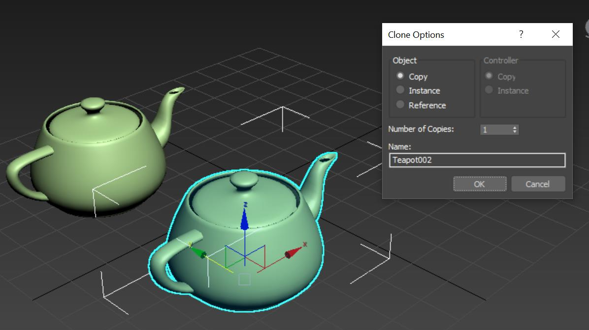

# Configure the model conversion

This chapter documents the options for the model conversion.

## Settings file

If a file called `<modelName>.ConversionSettings.json` is found in the input container beside the input model `<modelName>.<ext>`, then it will be used to provide extra configuration for the model conversion process.
For example, `box.ConversionSettings.json` would be used when converting `box.gltf`.

The contents of the file should satisfy the following json schema:

```json
{
    "$schema" : "http://json-schema.org/schema#",
    "description" : "ARR ConversionSettings Schema",
    "type" : "object",
    "definitions" : 
    {
        "position_attribute" : {"type" : "string", "description" : "Destination format of the position attribute", "enum" : [ "32_32_32_FLOAT", "16_16_16_16_FLOAT" ]},
        "color_attribute" : {"type" : "string", "description" : "Destination format of the color attribute", "enum" : [ "NONE", "8_8_8_8_UNSIGNED_NORMALIZED" ]},
        "vector_attribute" : {"type" : "string", "description" : "Destination format of the normals, tangents and binormals attributes", "enum" : [ "NONE", "8_8_8_8_SIGNED_NORMALIZED", "16_16_16_16_FLOAT" ]},
        "texcoord_attribute" : {"type" : "string", "description" : "Destination format of the texture coordinates attribute", "enum" : [ "NONE", "32_32_FLOAT", "16_16_FLOAT" ]}
    },
    "properties" : 
    {
        "scaling" : { "type" : "number", "exclusiveMinimum" : 0, "default" : 1.0 },
        "recenterToOrigin" : { "type" : "boolean", "default" : false },
        "opaqueMaterialDefaultSidedness" : {" type" : "string", "enum" : [ "SingleSided", "DoubleSided" ], "default" : "DoubleSided" },
        "material-override" : { "type" : "string", "default" : "" },
        "gammaToLinearMaterial" : { "type" : "boolean", "default" : false },
        "gammaToLinearVertex" : { "type" : "boolean", "default" : false },
        "sceneGraphMode" : { "type" : "string", "enum" : [ "none", "static", "dynamic" ], "default" : "dynamic" },
        "generateCollisionMesh" : { "type" : "boolean", "default" : true },
        "unlitMaterials" : { "type" : "boolean", "default" : false },
        "deduplicateMaterials" : {"type" : "boolean", "default" : true },
        "fbxAssumeMetallic" : {"type" : "boolean", "default" : true },
        "axis" : {
            "type" : "array",
            "items" : {
                "type" : "string",
                "enum" : [ "default", "+x", "-x", "+y", "-y", "+z", "-z" ]
            },
            "minItems" : 3,
            "maxItems" : 3
        },
        "vertex" : {
            "type" : "object",
            "properties" : {
                "position" : { "$ref" : "#/definitions/position_attribute" },
                "color0" : { "$ref" : "#/definitions/color_attribute" },
                "color1" : { "$ref" : "#/definitions/color_attribute" },
                "normal" : { "$ref" : "#/definitions/vector_attribute" },
                "tangent" : { "$ref" : "#/definitions/vector_attribute" },
                "binormal" : { "$ref" : "#/definitions/vector_attribute" },
                "texcoord0" : { "$ref" : "#/definitions/texcoord_attribute" },
                "texcoord1" : { "$ref" : "#/definitions/texcoord_attribute" }
            },
            "additionalProperties" : false
        },
        "metadataKeys" : {
            "type" : "array",
            "items" : {
              "type" : "string"
            }
        }
    },
    "additionalProperties" : false
}
```

An example file `box.ConversionSettings.json` might be:

```json
{
    "scaling" : 0.01,
    "recenterToOrigin" : true,
    "material-override" : "box_materials_override.json"
}
```

The schema is identical for converting triangular meshes and point clouds. However, a point cloud conversion uses only a strict subset of feature as discussed below.

## Settings for triangular meshes

When converting a triangular mesh, for instance from an .fbx file, all parameters from the schema above do affect the outcome. The parameters are explained in detail now:

### Geometry parameters

* `scaling` - This parameter scales a model uniformly. Scaling can be used to grow or shrink a model, for example to display a building model on a table top.
Scaling is also important when a model is defined in units other than meters, since the rendering engine expects meters.
For example, if a model is defined in centimeters, then applying a scale of 0.01 should render the model at the correct size.
Some source data formats (for example .fbx) provide a unit scaling hint, in which case the conversion implicitly scales the model to meter units. The implicit scaling provided by the source format will be applied on top of the scaling parameter.
The final scaling factor is applied to the geometry vertices and the local transforms of the scene graph nodes. The scaling for the root entity's transform remains unmodified.

* `recenterToOrigin` - States that a model should be converted so that its bounding box is centered at the origin.
If a source model is displaced far from the origin, floating point precision issues may cause rendering artifacts.
Centering the model can help in this situation.

* `opaqueMaterialDefaultSidedness` - The rendering engine assumes that opaque materials are double-sided.
if that assumption isn't true of a particular model, this parameter should be set to "SingleSided". For more information, see [:::no-loc text="single sided"::: rendering](../../overview/features/single-sided-rendering.md).

### Material de-duplication

* `deduplicateMaterials` - This parameter enables or disables automatic de-duplication of materials that share the same properties and textures. De-duplication happens after material overrides have been processed. It's enabled by default.

* If even after de-duplication a model has more than 65,535 materials, the service will attempt to merge materials with similar properties. As a last resort any materials exceeding the limit will be replaced by a red error material.


Two cubes of 68,921 colored triangles. Left: Before de-duplication with 68,921 color materials. Right: After de-duplication with 64,000 color materials. The limit is 65,535 materials. (See [limits](../../reference/limits.md).)

### Color space parameters

The rendering engine expects color values to be in linear space.
If a model is defined using gamma space, then these options should be set to true.

* `gammaToLinearMaterial` - Convert material colors from gamma space to linear space
* `gammaToLinearVertex` - Convert :::no-loc text="vertex"::: colors from gamma space to linear space

> [!NOTE]
> For FBX, E57, PLY, LAS, LAZ and XYZ files these settings are set to `true` by default. For all other file types, the default is `false`.

### Scene parameters

* `sceneGraphMode` - Defines how the scene graph in the source file is converted:
  * `dynamic` (default): All objects in the file are exposed as [entities](../../concepts/entities.md) in the API and can be transformed and reparented arbitrarily. The node hierarchy at runtime is identical to the structure in the source file.
  * `static`: Similar to `dynamic`, but objects in the scene graph can't be reparented to other objects dynamically at runtime. For dynamic models with many moving parts (for example, 'explosion view'), the `dynamic` option generates a model that is more efficient to render, but `static` mode still allows for individual part transforms. In case dynamic reparenting isn't required, the `static` option is the most suitable for models with many individual parts.
  * `none`: The scene graph is collapsed into one object.

Each mode has different runtime performance. In `dynamic` mode, the performance cost scales linearly with the number of [entities](../../concepts/entities.md) in the graph, even when no part is moved. Use `dynamic` mode only when it's necessary to move many parts or large subgraphs simultaneously, for example for an 'explosion view' animation.

The `static` mode also exports the full scene graph. [Spatial queries](../../overview/features/spatial-queries.md) will return individual parts and each part can be modified through [state overrides](../../overview/features/override-hierarchical-state.md). With this mode, the runtime overhead per object is negligible. It's ideal for large scenes where you need per-object inspection, occasional transform changes on individual parts, but no object reparenting.

The `none` mode has the least runtime overhead and also slightly better loading times. Inspection or transform of single objects isn't possible in this mode. Use cases are, for example, photogrammetry models that don't have a meaningful scene graph in the first place.

> [!TIP]
> Many applications will load multiple models. You should optimize the conversion parameters for each model depending on how it will be used. For example, if you want to display the model of a car for the user to take apart and inspect in detail, you need to convert it with `dynamic` mode. However, if you additionally want to place the car in a show room environment, that model can be converted with `sceneGraphMode` set to `static` or even `none`.

### Physics parameters

* `generateCollisionMesh` - If you need support for [spatial queries](../../overview/features/spatial-queries.md) on a model, this option has to be enabled. In the worst case, the creation of a collision mesh can double the conversion time. Models with collision meshes take longer to load and when using a `dynamic` scene graph, they also have a higher runtime performance overhead. For overall optimal performance, you should disable this option on all models on which you don't need spatial queries.

### Unlit materials

* `unlitMaterials` - By default the conversion will prefer to create [PBR materials](../../overview/features/pbr-materials.md). This option tells the converter to treat all materials as [color materials](../../overview/features/color-materials.md) instead. If you have data that already incorporates lighting, such as models created through photogrammetry, this option allows you to quickly enforce the correct conversion for all materials, without the need to [override each material](override-materials.md) individually.

### Converting from older FBX formats, with a Phong material model

* `fbxAssumeMetallic` - Older versions of the FBX format define their materials using a Phong material model. The conversion process has to infer how these materials map to the renderer's [PBR model](../../overview/features/pbr-materials.md). Usually this mapping works well, but an ambiguity can arise when a material has no textures, high specular values, and a non-grey albedo color. In this circumstance, the conversion has to choose between prioritizing the high specular values, defining a highly reflective, metallic material where the albedo color dissolves away, or prioritizing the albedo color, defining something like a shiny colorful plastic. By default, the conversion process assumes that highly specular values imply a metallic material in cases where ambiguity applies. This parameter can be set to `false` to switch to the opposite.

### Coordinate system overriding

* `axis` - To override coordinate system unit-vectors. Default values are `["+x", "+y", "+z"]`. In theory, the FBX format has a header where those vectors are defined and the conversion uses that information to transform the scene. The glTF format also defines a fixed coordinate system. In practice, some assets either have incorrect information in their header or were saved with a different coordinate system convention. This option allows you to override the coordinate system to compensate. For example: `"axis" : ["+x", "+z", "-y"]` will exchange the Z-axis and the Y-axis and keep coordinate system handedness by inverting the Y-axis direction.

### Node meta data

* `metadataKeys` - Allows you to specify keys of node metadata properties that you want to keep in the conversion result. You can specify exact keys or wildcard keys. Wildcard keys are of the format "ABC*" and match any key that starts with "ABC". Supported metadata value types are `bool`, `int`, `float`, and `string`.

    For GLTF files this data comes from the [extras object on nodes](https://github.com/KhronosGroup/glTF/tree/master/specification/2.0#nodeextras). For FBX files this data comes from the `Properties70` data on `Model nodes`. Consult the documentation of your 3D Asset Tool for further details.

### :::no-loc text="Vertex"::: format

It's possible to adjust the :::no-loc text="vertex"::: format for a mesh, to trade precision for memory savings. A lower memory footprint allows you to load larger models or achieve better performance. However, depending on your data, the wrong format can significantly impact rendering quality.

> [!CAUTION]
> Changing the :::no-loc text="vertex"::: format should be a last resort when models don't fit into memory anymore, or when optimizing for the best possible performance. Changes can easily introduce rendering artifacts, both obvious ones and subtle ones. Unless you know what to look out for, you should not change the default.

These adjustments are possible:

* Specific data streams can be explicitly included or excluded.
* The accuracy of data streams can be decreased to reduce the memory footprint.

The following `vertex` section in the `.json` file is optional. For each portion that isn't explicitly specified, the conversion service falls back to its default setting.

```json
{
    ...
    "vertex" : {
        "position"  : "32_32_32_FLOAT",
        "color0"    : "NONE",
        "color1"    : "NONE",
        "normal"    : "NONE",
        "tangent"   : "NONE",
        "binormal"  : "NONE",
        "texcoord0" : "32_32_FLOAT",
        "texcoord1" : "NONE"
    },
    ...
```

By forcing a component to `NONE`, it's guaranteed that the output mesh doesn't have the respective stream.

#### Component formats per :::no-loc text="vertex"::: stream

These formats are allowed for the respective components:

| :::no-loc text="Vertex"::: component | Supported formats (bold = default) |
|:-----------------|:------------------|
|position| **32_32_32_FLOAT**, 16_16_16_16_FLOAT |
|color0| **8_8_8_8_UNSIGNED_NORMALIZED**, NONE |
|color1| 8_8_8_8_UNSIGNED_NORMALIZED, **NONE**|
|normal| **8_8_8_8_SIGNED_NORMALIZED**, 16_16_16_16_FLOAT, NONE |
|tangent| **8_8_8_8_SIGNED_NORMALIZED**, 16_16_16_16_FLOAT, NONE |
|binormal| **8_8_8_8_SIGNED_NORMALIZED**, 16_16_16_16_FLOAT, NONE |
|texcoord0| **32_32_FLOAT**, 16_16_FLOAT, NONE |
|texcoord1| **32_32_FLOAT**, 16_16_FLOAT, NONE |

#### Supported component formats

The memory footprints of the formats are as follows:

| Format | Description | Bytes per :::no-loc text="vertex"::: |
|:-------|:------------|:---------------|
|32_32_FLOAT|two-component full floating point precision|8
|16_16_FLOAT|two-component half floating point precision|4
|32_32_32_FLOAT|three-component full floating point precision|12
|16_16_16_16_FLOAT|four-component half floating point precision|8
|8_8_8_8_UNSIGNED_NORMALIZED|four-component byte, normalized to `[0; 1]` range|4
|8_8_8_8_SIGNED_NORMALIZED|four-component byte, normalized to `[-1; 1]` range|4

#### Best practices for component format changes

* `position`: It's rare that reduced accuracy is sufficient. **16_16_16_16_FLOAT** introduces noticeable quantization artifacts, even for small models.
* `normal`, `tangent`, `binormal`: Typically these values are changed together. Unless there are noticeable lighting artifacts that result from normal quantization, there's no reason to increase their accuracy. In some cases, though, these components can be set to **NONE**:
  * `normal`, `tangent`, and `binormal` are only needed when at least one material in the model should be lit. In ARR this is the case when a [PBR material](../../overview/features/pbr-materials.md) is used on the model at any time.
  * `tangent` and `binormal` are only needed when any of the lit materials uses a normal map texture.
* `texcoord0`, `texcoord1` : Texture coordinates can use reduced accuracy (**16_16_FLOAT**) when their values stay in the `[0; 1]` range and when the addressed textures have a maximum size of 2048 x 2048 pixels. If those limits are exceeded, the quality of texture mapping will suffer.

#### Example

Assume you have a photogrammetry model, which has lighting baked into the textures. All that is needed to render the model are :::no-loc text="vertex"::: positions and texture coordinates.

By default the converter has to assume that you may want to use PBR materials on a model at some time, so it will generate `normal`, `tangent`, and `binormal` data for you. Consequently, the per vertex memory usage is `position` (12 bytes) + `texcoord0` (8 bytes) + `normal` (4 bytes) + `tangent` (4 bytes) + `binormal` (4 byte) = 32 bytes. Larger models of this type can easily have many millions of :::no-loc text="vertices"::: resulting in models that can take up multiple gigabytes of memory. Such large amounts of data will affect performance and you may even run out of memory.

Knowing that you never need dynamic lighting on the model, and knowing that all texture coordinates are in `[0; 1]` range, you can set `normal`, `tangent`, and `binormal` to `NONE` and `texcoord0` to half precision (`16_16_FLOAT`), resulting in only 16 bytes per :::no-loc text="vertex":::. Cutting the mesh data in half enables you to load larger models and potentially improves performance.

## Settings for point clouds

When converting a point cloud, only a small subset of properties from the schema is used. Other properties are being ignored, if specified.

The properties that do have an effect on point cloud conversion are:

* `scaling` - same meaning as for triangular meshes.
* `recenterToOrigin` - same meaning as for triangular meshes.
* `axis` - same meaning as for triangular meshes. Default values are `["+x", "+y", "+z"]`, however most point cloud data will be rotated compared to renderer's own coordinate system. To compensate, in most cases `["+x", "+z", "-y"]` fixes the rotation.
* `gammaToLinearVertex` - similar to triangular meshes, this flag indicates whether point colors should be converted from gamma space to linear space. Default value for point cloud formats (E57, PLY, LAS, LAZ and XYZ) is true.

* `generateCollisionMesh` - similar to triangular meshes, this flag needs to be enabled to support [spatial queries](../../overview/features/spatial-queries.md). But unlike for triangular meshes, this flag doesn't incurs longer conversion times, larger output file sizes, or longer runtime loading times. So disabling this flag can't be considered an optimization.

## Memory optimizations

Memory consumption of loaded content may become a bottleneck on the rendering system. If the memory payload becomes too large, it may compromise rendering performance, or cause the model to not load altogether. This paragraph discusses some important strategies to reduce the memory footprint.

> [!NOTE]
> The following optimizations apply to triangular meshes. There is no way to optimize the output of point clouds through conversion settings.

### Instancing

Instancing is a concept where meshes are reused for parts with distinct spatial transformations, as opposed to every part referencing its own unique geometry. Instancing has significant impact on the memory footprint.
Example use cases for instancing are the screws in an engine model or chairs in an architectural model.

> [!NOTE]
> Instancing can improve the memory consumption (and thus loading times) significantly, however the improvements on the rendering performance side are insignificant.

The conversion service respects instancing if parts are marked up accordingly in the source file. However, conversion doesn't perform extra deep analysis of mesh data to identify reusable parts. Thus the content creation tool and its export pipeline are the decisive criteria for proper instancing setup.

A simple way to test whether instancing information gets preserved during conversion is to have a look at the [output statistics](get-information.md#example-info-file), specifically the `numMeshPartsInstanced` member. If the value for `numMeshPartsInstanced` is larger than zero, it indicates that meshes are shared across instances.

#### Example: Instancing setup in 3ds Max

[Autodesk 3ds Max](https://www.autodesk.de/products/3ds-max) has distinct object cloning modes called **`Copy`**, **`Instance`**, and **`Reference`** that behave differently regarding instancing in the exported `.fbx` file.



* **`Copy`** : In this mode the mesh is cloned, so no instancing is used (`numMeshPartsInstanced` = 0).
* **`Instance`** : The two objects share the same mesh, so instancing is used (`numMeshPartsInstanced` = 1).
* **`Reference`** : Distinct modifiers can be applied to the geometries, so the exporter chooses a conservative approach and doesn't use instancing (`numMeshPartsInstanced` = 0).


### Depth-based composition mode

If memory is a concern, configure the renderer with the [depth-based composition mode](../../concepts/rendering-modes.md#depthbasedcomposition-mode). In this mode, GPU payload is distributed across multiple GPUs.

### Decrease vertex size

As discussed in the [best practices for component format changes](configure-model-conversion.md#best-practices-for-component-format-changes) section, adjusting the vertex format can decrease the memory footprint. However, this option should be the last resort.

### Texture sizes

Depending on the type of scenario, the amount of texture data may outweigh the memory used for mesh data. Photogrammetry models are candidates.
The conversion configuration doesn't provide a way to automatically scale down textures. If necessary, texture scaling has to be done as a client-side pre-processing step. The conversion step however does pick a suitable [texture compression format](/windows/win32/direct3d11/texture-block-compression-in-direct3d-11):

* `BC1` for opaque color textures
* `BC7` for source color textures with alpha channel

Since format `BC7` has twice the memory footprint compared to `BC1`, it's important to make sure that the input textures don't provide an alpha channel unnecessarily.

## Typical use cases

Finding good import settings for a given use case can be a tedious process. On the other hand, conversion settings may have a significant impact on runtime performance.

There are certain classes of use cases that qualify for specific optimizations. Some examples are given below.

### Use case: Architectural visualization / large outdoor maps

* These types of scenes tend to be static, meaning they don't need movable parts. Accordingly, the `sceneGraphMode` can be set to `static` or even `none`, which improves runtime performance. With `static` mode, the scene's root node can still be moved, rotated, and scaled, for example to dynamically switch between 1:1 scale (for first person view) and a table top view.

* When you need to move parts around, that typically also means that you need support for raycasts or other [spatial queries](../../overview/features/spatial-queries.md), so that you can pick those parts in the first place. On the other hand, if you don't intend to move something around, chances are high that you also don't need it to participate in spatial queries and therefore can turn off the `generateCollisionMesh` flag. This switch has significant impact on conversion times, loading times, and also runtime per-frame update costs.

* If the application doesn't use [cut planes](../../overview/features/cut-planes.md), the `opaqueMaterialDefaultSidedness` flag should be turned off. The performance gain is typically 20%-30%. Cut planes can still be used, but there won't be back-faces when looking into the inner parts of objects, which looks counter-intuitive. For more information, see [:::no-loc text="single sided"::: rendering](../../overview/features/single-sided-rendering.md).

### Use case: Photogrammetry models

When rendering photogrammetry models there's typically no need for a scene graph, so you could set the `sceneGraphMode` to `none`. Since those models rarely contain a complex scene graph to begin with, the impact of this option should be insignificant, though.

Because lighting is already baked into the textures, no dynamic lighting is needed. Therefore:

* Set the `unlitMaterials` flag to `true` to turn all materials into unlit [color materials](../../overview/features/color-materials.md).
* Remove unneeded data from the vertex format. See the [example](#example) above.

### Use case: Visualization of compact machines, etc.

In these use cases, the models often have high detail within a small volume. The renderer is heavily optimized to handle such cases well. However, most of the optimizations mentioned in the previous use case don't apply here:

* Individual parts should be selectable and movable, so the `sceneGraphMode` must be left to `dynamic`.
* Ray casts are typically an integral part of the application, so collision meshes must be generated.
* Cut planes look better with the `opaqueMaterialDefaultSidedness` flag enabled.

## Deprecated features

Providing settings using the non-model-specific filename `conversionSettings.json` is still supported but deprecated.
Use the model-specific filename `<modelName>.ConversionSettings.json` instead.

The use of a `material-override` setting to identify a [Material Override file](override-materials.md) in the conversion settings file is still supported but deprecated. 
Use the model-specific filename `<modelName>.MaterialOverrides.json` instead.

## Next steps

* [Model conversion](model-conversion.md)
* [Color materials](../../overview/features/color-materials.md)
* [PBR materials](../../overview/features/pbr-materials.md)
* [Override materials during model conversion](override-materials.md)