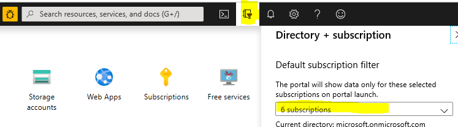
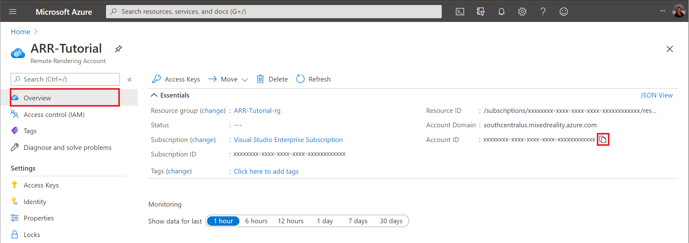
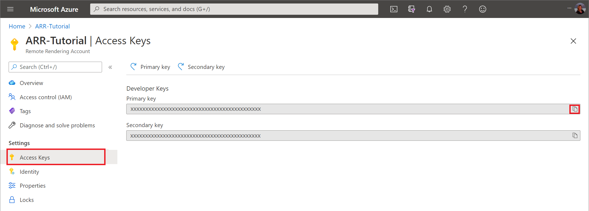
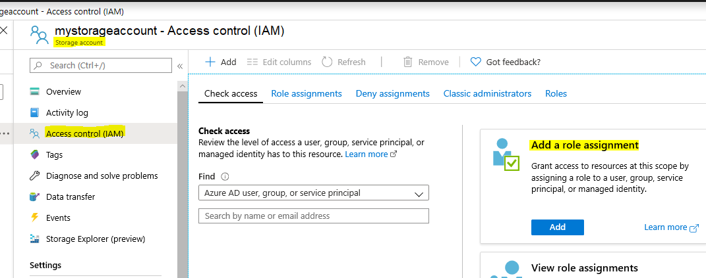

# Create an Azure Remote Rendering account

This chapter guides you through the steps to create an account for the **Azure Remote Rendering** service. A valid account is mandatory for completing any of the quickstarts or tutorials.

## Create an account

The following steps are needed to create an account for the Azure Remote Rendering service:

1. Go to the [Mixed Reality Preview page](https://aka.ms/MixedRealityPrivatePreview)
1. Click the 'Create a resource' button
1. In the search field ("Search the marketplace"), type in "Remote Rendering" and hit 'enter'.
1. In the result list, click on the "Remote Rendering" tile
1. In the next screen, click the "Create" button. A form opens to create a new Remote Rendering account:
    1. Set 'Resource Name' to the name of the account
    1. Update 'Subscription' if needed
    1. Set 'Resource group' to a resource group of your choice
1. Once the account is created, navigate to it and:
    1. In the *Overview* tab, note the 'Account ID'
    1. In the *Settings > Access Keys* tab, note the 'Primary key' - this is the account's secret account key

### Retrieve the account information

The samples and tutorials require that you provide the account ID and a key. For instance in the **arrconfig.json** file that is used for the PowerShell sample scripts:

```json
    "accountSettings": {
        "arrAccountId": "<fill in the account ID from the Azure portal>",
        "arrAccountKey": "<fill in the account key from the Azure portal>",
        "region": "<select from available regions>"
    },
```

See the [list of available regions](../reference/regions.md) for filling out the *region* option.

The values for **`arrAccountId`** and **`arrAccountKey`** can be found in the portal as described in the following steps:

* Go to the [Azure portal](https://www.portal.azure.com)
* Find your **"Remote Rendering Account"** - it should be in the **"Recent Resources"** list. You can also search for it in the search bar at the top. In that case, make sure that the subscription you want to use is selected in the Default subscription filter (filter icon next to search bar):



Clicking on your account brings you to this screen, which shows the  **Account ID** right away:



For the key, select **Access Keys** in the panel on the left. The next page shows a primary and a secondary key:



The value for **`arrAccountKey`** can either be primary or secondary key.

## Link storage accounts

This paragraph explains how to link storage accounts to your Remote Rendering account. When a storage account is linked it is not necessary to generate a SAS URI every time you want to interact with the data in your account, for instance when loading a model. Instead, you can use the storage account names directly as described in the [loading a model section](../concepts/models.md#loading-models).

The steps in this paragraph have to be performed for each storage account that should use this alternative access method. If you haven't created storage accounts yet, you can walk through the respective step in the [convert a model for rendering quickstart](../quickstarts/convert-model.md#storage-account-creation).

Now it is assumed you have a storage account. Navigate to the storage account in the portal and go to the **Access Control (IAM)** tab for that storage account:



 Ensure you have owner permissions over this storage account to ensure that you can add role assignments. If you don't have access, the **Add a role assignment** option will be disabled.

 You need to add three distinct roles as described in the next steps. If you do not provide all three levels of access, there will be permission issues while trying to access the storage account.

 Click on the **Add** button in the "Add a role assignment" tile to add the first role:


* The first role to assign is **Owner** as shown in the screenshot above.
* Select **Remote Rendering Account** from the **Assign access to** dropdown.
* Select your subscription and Remote Rendering account in the last dropdowns.

> [!WARNING]
> In case your Remote Rendering account is not listed, refer to this [troubleshoot section](../resources/troubleshoot.md#cant-link-storage-account-to-arr-account).

Repeat adding new roles two more times for the respective selections from the **Role** dropdown:
* **Storage Account Contributor**
* **Storage Blob Data Contributor**

The other dropdowns are selected as in the first step.

If you have added all three roles, your Azure Remote Rendering account has access to your storage account using system assigned Managed Service Identities.

## Next steps

* [Authentication](authentication.md)
* [Using the Azure Frontend APIs for authentication](frontend-apis.md)
* [Example PowerShell scripts](../samples/powershell-example-scripts.md)
