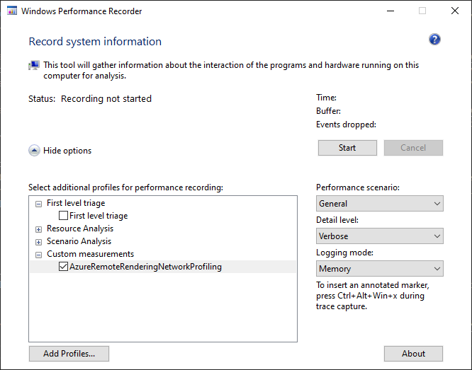
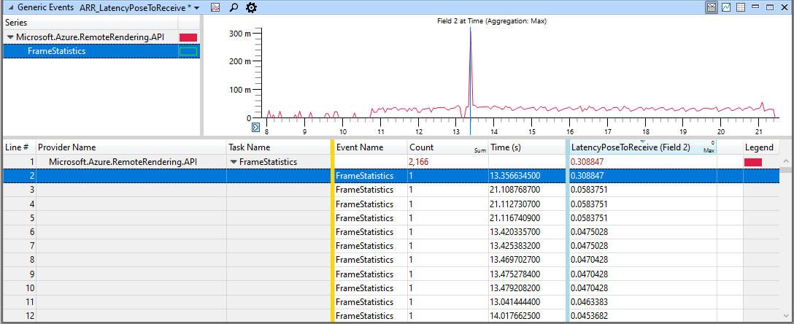
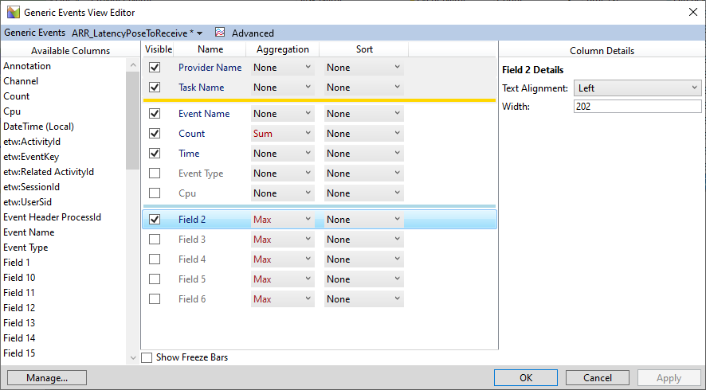
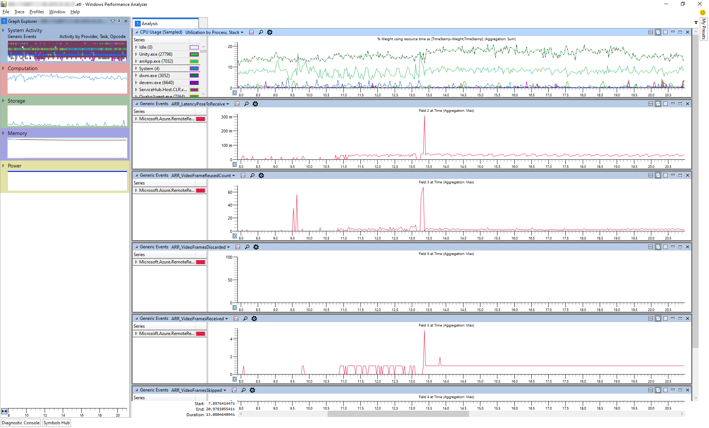

# Create client-side performance traces

There are many reasons why the performance of Azure Remote Rendering may not be as good as desired. Apart from pure rendering performance on the cloud server, especially the quality of the network connection has a significant influence on the experience. To profile the server's performance, refer to chapter [Server-side performance queries](../overview/features/performance-queries.md).

This chapter focuses on how to identify potential client-side bottlenecks through *:::no-loc text="performance traces":::*.

## Getting started

If you are new to the Windows :::no-loc text="performance tracing"::: functionality, this section will mention the most fundamental terms and applications to get you started.

### Installation

The applications used to do tracing with ARR are general purpose tools that can be used for all Windows development. They are provided through the [Windows Performance Toolkit](https://docs.microsoft.com/windows-hardware/test/wpt/). To get this toolkit, download the [Windows Assessment and Deployment Kit](https://docs.microsoft.com/windows-hardware/get-started/adk-install).

### Terminology

When searching for information about performance traces, you will inevitably come across a range of terms. The most important ones are:

* `ETW`
* `ETL`
* `WPR`
* `WPA`

**ETW** stands for [**E**vent **T**racing for **W**indows](https://docs.microsoft.com/windows/win32/etw/about-event-tracing). It is simply the overarching name for the efficient kernel-level tracing facility that is built into Windows. It is called *event* tracing, because applications that support ETW will emit events to log actions that may help to track down performance issues. By default, the operating system already emits events for things like disk accesses, task switches and such. Applications like ARR additionally emit custom events, for instance about dropped frames, network lag etc.

**ETL** stands for **E**vent **T**race **L**ogging. It simply means that a trace has been gathered (logged) and is therefore typically used as the file extension for files that store the tracing data. Thus when you do a trace, you typically will have an \*.etl file afterwards.

**WPR** stands for [**W**indows **P**erformance **R**ecorder](https://docs.microsoft.com/windows-hardware/test/wpt/windows-performance-recorder) and is the name of the application that starts and stops the recording of event traces. WPR takes a profile file (\*.wprp) that configures which exact events to log. Such a `wprp` file is provided with the ARR SDK. When doing traces on a desktop PC, you may launch WPR directly. When doing a trace on the HoloLens, you typically go through the web interface instead.

**WPA** stands for [**W**indows **P**erformance **A**nalyzer](https://docs.microsoft.com/windows-hardware/test/wpt/windows-performance-analyzer) and is the name of the GUI application that is used to open \*.etl files and sift through the data to identify performance issues. WPA allows you to sort data by various criteria, display the data in several ways, dig down into details, and correlate information.

While ETL traces can be created on any Windows device (local PC, HoloLens, cloud server, etc.), they are typically saved to disk and analyzed with WPA on a desktop PC. ETL files can be sent to other developers for them to have a look. Be aware that sensitive information, such as file-paths and IP addresses, may be captured in ETL traces, though. You can use ETW in two ways: to record traces, or to analyze traces. Recording traces is straight-forward and requires minimal setup. Analyzing traces on the other hand does require a decent understanding of both the WPA tool and the problem that you are investigating. General material for learning WPA will be given below, as well as guidelines for how to interpret ARR-specific traces.

## Recording a trace on a local PC

To identify ARR performance issues you should prefer to do a trace directly on a HoloLens, because that is the only way to get a snapshot of the true performance characteristics. However, if you specifically want to do a trace without the HoloLens performance restrictions or you just want to learn how to use WPA and do not need a realistic trace, here is how to do so.

### WPR configuration

1. Launch the [:::no-loc text="Windows Performance Recorder":::](https://docs.microsoft.com/windows-hardware/test/wpt/windows-performance-recorder) from the *start menu*.
1. Expand **More Options**
1. Click **Add Profiles...**
1. Select the file *AzureRemoteRenderingNetworkProfiling.wprp*. You can find this file in the ARR SDK under *Tools/ETLProfiles*.
   The profile will now be listed in WPR under *Custom measurements*. Make sure it is the only enabled profile.
1. Expand *First level triage*:
    * If all you want to do is capture a quick trace of the ARR networking events, **disable** this option.
    * If you need to correlate ARR network events with other system characteristics, such as CPU or memory usage, then **enable** this option.
    * If you do enable this option, the trace will most likely be multiple gigabytes in size and take a long time to save and open in WPA.

Afterwards your WPR configuration should look like this:

### Recording

Click **Start** to start recording a trace. You can start and stop recording at any time; you do not need to close your application before doing so. As you can see you do not need to specify which application to trace, as ETW will always record a trace for the entire system. The `wprp` file specifies which types of events to record.

Click **Save** to stop recording and specify where to store the ETL file.

You now have an ETL file that you can either open directly in WPA or send to someone else.

## Recording a trace on a HoloLens

To record a trace on a HoloLens, boot up your device and enter its IP address into a browser to open up the *Device Portal*.

1. On the left, navigate to *Performance > Performance Tracing*.
1. Select **Custom profiles**
1. Click **:::no-loc text="Browse...":::**
1. Select the file *AzureRemoteRenderingNetworkProfiling.wprp*. You can find this file in the ARR SDK under *Tools/ETLProfiles*.
1. Click **Start Trace**
1. The HoloLens is now recording a trace. Make sure to trigger the performance issues that you want to investigate. Then click **Stop Trace**.
1. The trace will be listed at the bottom of the webpage. Click the disk icon at the right-hand side to download the ETL file.

You now have an ETL file that you can either open directly in WPA or send to someone else.

## Analyzing traces with WPA

### WPA basics

Windows Performance Analyzer is the standard tool to open ETL files and inspect the traces. An explanation how WPA works is out of scope for this article. To get started, have a look at these resources:

* Watch the [introductory videos](https://docs.microsoft.com/windows-hardware/test/wpt/windows-performance-analyzer) for a first overview.
* WPA itself has a *Getting Started* tab, which explains common steps. Have a look at the available topics. Especially under "View Data" you get a quick introduction how to create graphs for specific data.
* There is excellent information [on this website](https://randomascii.wordpress.com/2015/09/24/etw-central/), however, not all of it is relevant for beginners.

### Graphing data

To get started with ARR tracing, the following pieces are good to know.

The image above shows a table of tracing data and a graph representation of the same data.

In the table at the bottom, note the yellow (golden) bar and the blue bar. You can drag these bars and place them at any position.

All **columns to the left of the yellow bar** are interpreted as **keys**. Keys are used to structure the tree in the top-left window. Here we have two *key* columns, "Provider Name" and "Task Name". Consequently the tree structure in the top-left window is two levels deep. If you reorder the columns or add or remove columns from the key area, the structure in the tree view changes.

**Columns to the right of the blue bar** are used for the **graph display** in the top-right window. Most of the time only the first column is used, but some graph modes require multiple columns of data. For line graphs to work, the *aggregation mode* on that column must be set. Use 'Avg' or 'Max'. The aggregation mode is used to determine the value of the graph at a given pixel, when a pixel covers a range with multiple events. This can be observed by setting aggregation to 'Sum' and then zooming in and out.

The columns in the middle have no special meaning.

In the *Generic Events View Editor* you can configure all the columns to display, the aggregation mode, sorting and which columns are used as keys or for graphing. In the example above, **Field 2** is enabled and Field 3 - 6 are disabled. Field 2 is typically the first *custom data* field of an ETW event and thus for ARR "FrameStatistics" events, which represent some network latency value. Enable other "Field" columns to see further values of this event.

### Presets

To properly analyze a trace, you will need to figure out your own workflow and preferred data display. However, to be able to get a quick overview over the ARR-specific events, we include Windows Software Protection Platform profile and presets files in the folder *Tools/ETLProfiles*. To load a full profile, select *Profiles > Apply...* from the WPA menu bar, or open the *My Presets* panel (*Window > My Presets*) and select *Import*. The former will set up a complete WPA configuration as in the image below. The latter will only make presets for the various view configurations available and allow you to quickly open a view to look at a specific piece of ARR event data.

The image above shows views of various ARR-specific events plus a view of the overall CPU utilization.

## Next steps

* [Server-side performance queries](../overview/features/performance-queries.md)
