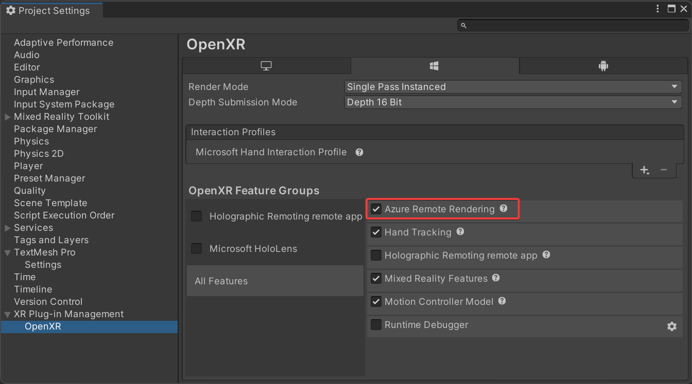

# Set up Remote Rendering for Unity

To enable Azure Remote Rendering (ARR) in Unity, some project configuration may be required. We also provide dedicated methods that take care of some Unity-specific aspects.

## Project configuration

When using **OpenXR**, the **Azure Remote Rendering** feature must be enabled in the Unity OpenXR settings.



For other required and recommended project settings, use the **Project Validator** included in the Azure Remote Rendering Unity package:
1. Choose the **ValidateProject** entry from the **Remote Rendering** menu in the Unity editor toolbar.
1. Review the **Project Validator** window for errors and fix project settings where necessary.

## Startup and shutdown

To initialize Remote Rendering, use `RemoteManagerUnity`. This class calls into the generic `RenderingConnection` but already implements Unity-specific details for you. For example, Unity uses a specific coordinate system. When calling `RemoteManagerUnity.Initialize`, the proper convention is set. The call also requires you to provide the Unity camera that should be used for displaying the remotely rendered content.

```cs
// initialize Azure Remote Rendering for use in Unity:
// it needs to know which camera is used for rendering the scene
RemoteUnityClientInit clientInit = new RemoteUnityClientInit(Camera.main);
RemoteManagerUnity.InitializeManager(clientInit);
```

For shutting down Remote Rendering, call `RemoteManagerStatic.ShutdownRemoteRendering()`.

After an `RenderingSession` has been created and chosen as the primary rendering session, it must be registered with `RemoteManagerUnity`:

```cs
RemoteManagerUnity.CurrentSession = ...
```

### Full example code

This code example demonstrates all the steps needed to initialize Azure Remote Rendering in Unity:

```cs
// initialize Remote Rendering
RemoteUnityClientInit clientInit = new RemoteUnityClientInit(Camera.main);
RemoteManagerUnity.InitializeManager(clientInit);

// create a frontend
SessionConfiguration sessionConfig = new SessionConfiguration();
// ... fill out sessionConfig ...
RemoteRenderingClient client = new RemoteRenderingClient(sessionConfig);

// start a session
CreateRenderingSessionResult result = await client.CreateNewRenderingSessionAsync(new RenderingSessionCreationOptions(RenderingSessionVmSize.Standard, 0, 30));
RenderingSession session = result.Session;

// let RemoteManagerUnity know about the session we want to use
RemoteManagerUnity.CurrentSession = session;

await session.ConnectAsync(new RendererInitOptions());

/// When connected, load and modify content

RemoteManagerStatic.ShutdownRemoteRendering();
```

## Convenience functions

### Session state events

`RemoteManagerUnity.OnSessionUpdate` emits events for when its session state changes, see the code documentation for details.

### ARRServiceUnity

`ARRServiceUnity` is an optional component to streamline setup and session management. It contains options to automatically stop its session when the application is exiting or play mode is exited in the editor. It automatically renews the session lease when needed. It caches data such as the session properties (see its `LastProperties` variable), and exposes events for session state changes and session errors.

There can't be more than one instance of `ARRServiceUnity` at a time. It's meant for getting you started quicker by implementing some common functionality. For a larger application it may be preferable to do those things yourself, though.

For an example how to set up and use `ARRServiceUnity` see [Tutorial: Viewing remotely rendered models](../../tutorials/unity/view-remote-models/view-remote-models.md).

## Next steps

* [Install the Remote Rendering package for Unity](install-remote-rendering-unity-package.md)
* [Unity Render Pipelines](unity-render-pipelines.md)
* [Tutorial: Viewing remotely rendered models](../../tutorials/unity/view-remote-models/view-remote-models.md)
