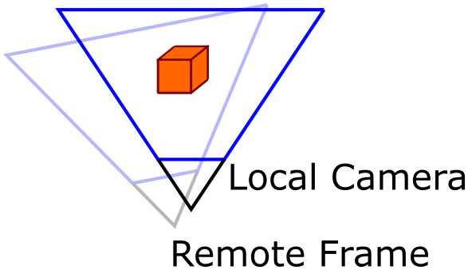

# Camera

To make sure that locally and remotely rendered content can be composited seamlessly, various camera properties need to remain in sync between server and client. Most notably the camera transform and projection. For example, the locally rendered content must use the same camera transform and projection that the latest remote frame was rendered with.



In the image above, the local camera has moved compared to the remote frame sent by the server. As a result, local content needs to be rendered from the same perspective as the remote frame and finally the resulting image is reprojected into the local camera space, which is explained in detail in [late stage reprojection](late-stage-reprojection.md).

The delay between the remote and local rendering means that any change of these settings is applied with a delay. Therefore, any new value can't be used immediately the same frame.

The near and far plane distances can be set on the camera settings. On the HoloLens 2, the remaining transform and projection data is defined by the hardware. When using the [desktop simulation](../../concepts/graphics-bindings.md), they are set via the input of its `Update` function.

The changed values can be used locally as soon as the first remote frame arrives that was rendered with them. On HoloLens 2, the data to be used for rendering is provided by the *HolographicFrame* just like in any other holographic application. On [desktop simulation](../../concepts/graphics-bindings.md), they are retrieved via the output of the `Update` function.

## Camera settings

The following properties can be changed on the camera settings:

**Near and far plane:**

To make sure no invalid ranges can be set, **NearPlane** and **FarPlane** properties are read-only and a separate function **SetNearAndFarPlane** exists to change the range. This data will be sent to the server at the end of the frame.

> [!IMPORTANT]
> In Unity this is handled automatically when changing the main camera near and far planes.

**EnableDepth**:

Sometimes it is helpful to disable the depth buffer write of the remote image for debugging purposes. Disabling depth will also stop the server from sending depth data, thus reducing bandwidth.

> [!TIP]
> In Unity a debug component called **EnableDepthComponent** is provided that can be used to toggle this feature in the editor UI.

Changing the camera settings can be done as follows:

```cs
void ChangeCameraSetting(AzureSession session)
{
    CameraSettings settings = session.Actions.CameraSettings;

    settings.SetNearAndFarPlane(0.1f, 20.0f);
    settings.EnableDepth = false;
}
```

```cpp
void ChangeStageSpace(ApiHandle<AzureSession> session)
{
    ApiHandle<CameraSettings> settings = session->Actions()->GetCameraSettings();

    settings->SetNearAndFarPlane(0.1f, 20.0f);
    settings->SetEnableDepth(false);
}
```

## API documentation

* [C# CameraSettings](https://docs.microsoft.com/dotnet/api/microsoft.azure.remoterendering.camerasettings)
* [C++ CameraSettings](https://docs.microsoft.com/cpp/api/remote-rendering/camerasettings)
* [C# GraphicsBindingSimD3d11.Update function](https://docs.microsoft.com/dotnet/api/microsoft.azure.remoterendering.graphicsbindingsimd3d11.update)
* [C++ GraphicsBindingSimD3d11::Update function](https://docs.microsoft.com/cpp/api/remote-rendering/graphicsbindingsimd3d11#update)

## Next steps

* [Graphics binding](../../concepts/graphics-bindings.md)
* [Late stage reprojection](late-stage-reprojection.md)
