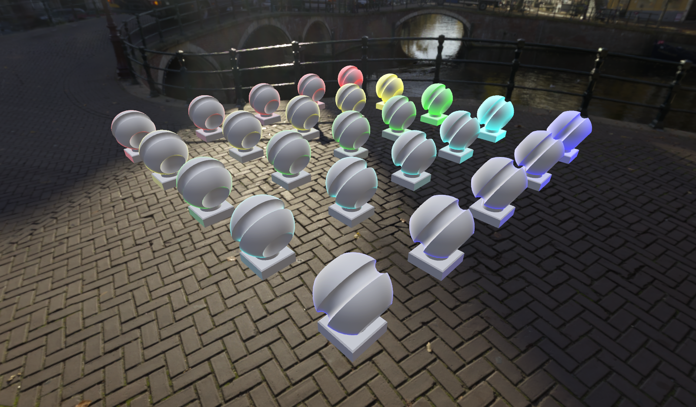
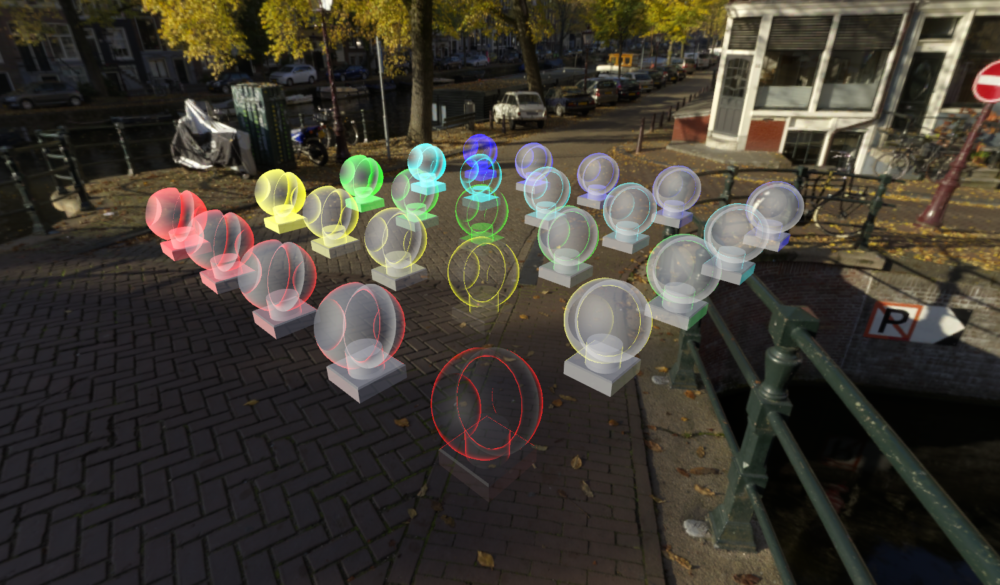

# Fresnel effect

The fresnel effect material feature is a non-physically correct, ad-hoc effect. The feature is based on the physical observation of objects becoming more reflective at these angles. Fresnel reflectance itself is already physically incorporated in the [PBR material model](../../overview/features/pbr-materials.md) used in Azure Remote Rendering. In contrast, the fresnel effect material feature is just an additive color effect with no dependency on [lights](../../overview/features/lights.md) or the [sky environment](../../overview/features/sky.md).

The fresnel effect gives affected objects a colored shine around their edges. Information about effect customization and examples of the rendering results can be found in the following sections.

> [!NOTE]
> The fresnel effect can't be applied to point clouds.

## Enabling the fresnel effect

To use the fresnel effect feature, it needs to be enabled on the materials in question. You can enable it by setting the FresnelEffect bit of the [PbrMaterialFeatures](/dotnet/api/microsoft.azure.remoterendering.pbrmaterialfeatures) on the [PBR material](../../overview/features/pbr-materials.md). The same pattern applies to the [ColorMaterialFeatures](/dotnet/api/microsoft.azure.remoterendering) and the [Color material](../../overview/features/color-materials.md). See the code samples section for a usage demonstration.

After enabled through the API, the fresnel effect will immediately be visible. By default the shine will be white (1, 1, 1, 1) and have an exponent of 1. You can customize these settings using the parameter setters below.

## Customizing the effect appearance

Currently, the fresnel effect can be customized per material using the following properties:

| Material property | Type | Explanation |
|-------------------|------|-------------|
| FresnelEffectColor | Color4 | The color that gets added at most as the fresnel shine. The alpha channel is currently ignored. |
| FresnelEffectExponent | float | The spread of the fresnel shine. Ranges from 0.01 (spread over all of the object) to 10 (only the most gracing angles). |

In practice, different color and exponent settings will look like this:



The fresnel effect's exponent is progressively increased from 1 to 10 for each color row. Doing so progressively pulls the fresnel shine to the edges of the viewed objects. The fresnel effect is also unaffected by transparency, as you can see in the following example:



As shown, the objects on the diagonal are fully transparent, but fresnel shine remains. The effect mimics physically based fresnel in that regard, which is also present in these screenshots.

## Code samples

The following code samples show enabling and customizing the fresnel effect for both a [PBR material](../../overview/features/pbr-materials.md) and a [Color material](../../overview/features/color-materials.md):

```cs
    void SetFresnelEffect(RenderingSession session, Material material)
    {
        if (material.MaterialSubType == MaterialType.Pbr)
        {
            var pbrMaterial = material as PbrMaterial;
            pbrMaterial.PbrFlags |= PbrMaterialFeatures.FresnelEffect;
            pbrMaterial.FresnelEffectColor = new Color4(1.0f, 0.5f, 0.1f, 1.0f);
            pbrMaterial.FresnelEffectExponent = 3.141592f;
        }
        else if (material.MaterialSubType == MaterialType.Color)
        {
            var colorMaterial = material as ColorMaterial;
            colorMaterial.ColorFlags |= ColorMaterialFeatures.FresnelEffect;
            colorMaterial.FresnelEffectColor = new Color4(0.25f, 1.0f, 0.25f, 1.0f);
            colorMaterial.FresnelEffectExponent = 7.654321f;
        }
    }
```

```cpp
void SetFresnelEffect(ApiHandle<RenderingSession> session, ApiHandle<Material> material)
{
    if (material->GetMaterialSubType() == MaterialType::Pbr)
    {
        auto pbrMaterial = material.as<PbrMaterial>();
        auto featureFlags = PbrMaterialFeatures((int32_t)pbrMaterial->GetPbrFlags() | (int32_t)PbrMaterialFeatures::FresnelEffect);
        pbrMaterial->SetPbrFlags(featureFlags);
        pbrMaterial->SetFresnelEffectColor(Color4{ 1.f, 0.5f, 0.1f, 1.f });
        pbrMaterial->SetFresnelEffectExponent(3.141592f);

    }
    else if (material->GetMaterialSubType() == MaterialType::Color)
    {
        auto colorMaterial = material.as<ColorMaterial>();
        auto featureFlags = ColorMaterialFeatures((int32_t)colorMaterial->GetColorFlags() | (int32_t)ColorMaterialFeatures::FresnelEffect);
        colorMaterial->SetColorFlags(featureFlags);
        colorMaterial->SetFresnelEffectColor(Color4{ 0.25f, 1.f, 0.25f, 1.f });
        colorMaterial->SetFresnelEffectExponent(7.654321f);
    }
}
```

## API documentation

* [C# PbrMaterialFeatures](/dotnet/api/microsoft.azure.remoterendering.pbrmaterialfeatures)
* [C++ PbrMaterialFeatures](/cpp/api/remote-rendering/pbrmaterialfeatures)
* [C# ColorMaterialFeatures](/dotnet/api/microsoft.azure.remoterendering.colormaterialfeatures)
* [C++ ColorMaterialFeatures](/cpp/api/remote-rendering/colormaterialfeatures)

## Next steps

* [Materials](../../concepts/materials.md)
* [PBR Materials](../../overview/features/pbr-materials.md)
* [Color Materials](../../overview/features/color-materials.md)