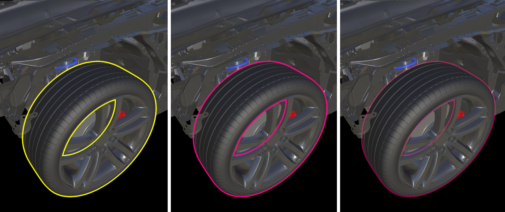
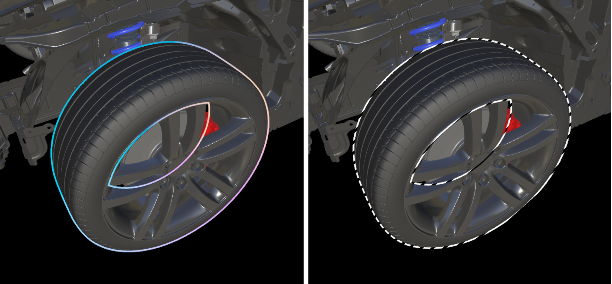

# Outline rendering

Selected objects can be highlighted visually by adding outline rendering via the [Hierarchical state override component](../../overview/features/override-hierarchical-state.md). This chapter explains how global parameters for outline rendering are changed through the client API.

Outline properties are a global setting. All objects that use outline rendering use the same setting - it isn't possible to use a per-object outline color.

> [!NOTE]
> The outline rendering effect can't be applied to point clouds.

## Parameters for `OutlineSettings`

Class `OutlineSettings` holds the settings related to global outline properties. It exposes the following members:

| Parameter      | Type    | Description                                             |
|----------------|---------|---------------------------------------------------------|
| `Color`          | Color4Ub | The color that is used for drawing the outline. The alpha portion is ignored.         |
| `PulseRateHz`    | float   | The rate at which the outline oscillates per second|
| `PulseIntensity` | float   | The intensity of the outline pulse effect. Must be between 0.0 for no pulsing and 1.0 for full pulsing. Intensity implicitly sets the minimum opacity of the outline as `MinOpacity = 1.0 - PulseIntensity`. |
| `MaskTexture` | 2D texture | If specified, the color of the outline will be tinted by this texture. The texture is sampled in screen-space coordinates and various parameters (`MaskScale`, `MaskScaleToFit`, `MaskOffset`, `MaskScrollSpeed`, `MaskRotationCenter`, `MaskRotationAngle`, `MaskRotationSpeed`) affect the stretching, rotation, and scrolling of that mapping. This feature can be used to achieve effects like a color gradient or dashed outlines. See second example image below. |

 The effect of changing the `color` parameter from yellow (left) to magenta (center) and `pulseIntensity` from 0 to 0.8 (right).

 The effect of applying a mask texture to the outlines: Screen aligned color gradients (left) or dashed outlines simulated by using a tiling texture with stripes (right).

## Example

The following code shows an example for setting outline parameters via the API:

```cs
void SetOutlineParameters(RenderingSession session)
{
    OutlineSettings outlineSettings = session.Connection.OutlineSettings;
    outlineSettings.Color = new Color4Ub(255, 255, 0, 255);
    outlineSettings.PulseRateHz = 2.0f;
    outlineSettings.PulseIntensity = 0.5f;
}
```

```cpp
void SetOutlineParameters(ApiHandle<RenderingSession> session)
{
    ApiHandle<OutlineSettings> outlineSettings = session->Connection()->GetOutlineSettings();
    Color4Ub outlineColor;
    outlineColor.channels = { 255, 255, 0, 255 };
    outlineSettings->SetColor(outlineColor);
    outlineSettings->SetPulseRateHz(2.0f);
    outlineSettings->SetPulseIntensity(0.5f);
}
```

## Performance

Outline rendering may have a significant impact on rendering performance. This impact varies based on screen-space spatial relation between selected and nonselected objects for a given frame.

## API documentation

* [C# RenderingConnection.OutlineSettings property](/dotnet/api/microsoft.azure.remoterendering.renderingconnection.outlinesettings)
* [C++ RenderingConnection::OutlineSettings()](/cpp/api/remote-rendering/renderingconnection#outlinesettings)

## Next steps

* [Hierarchical state override component](../../overview/features/override-hierarchical-state.md)