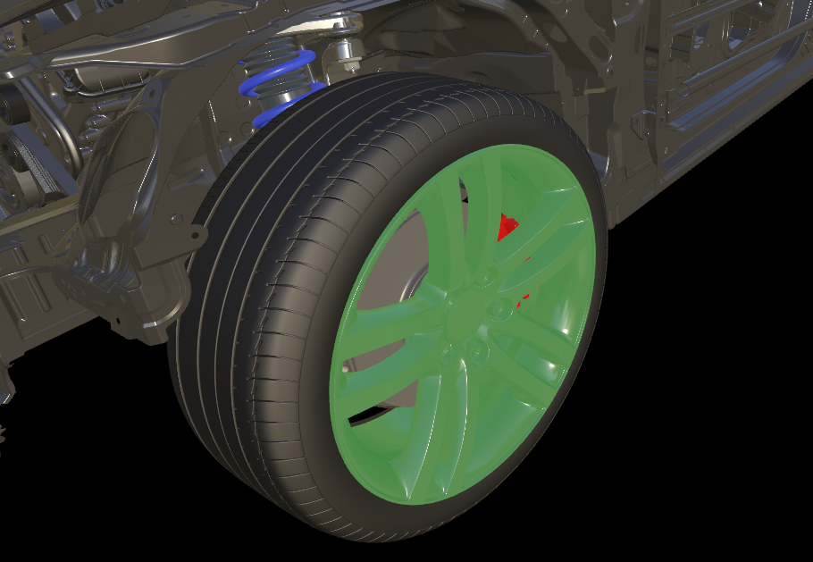
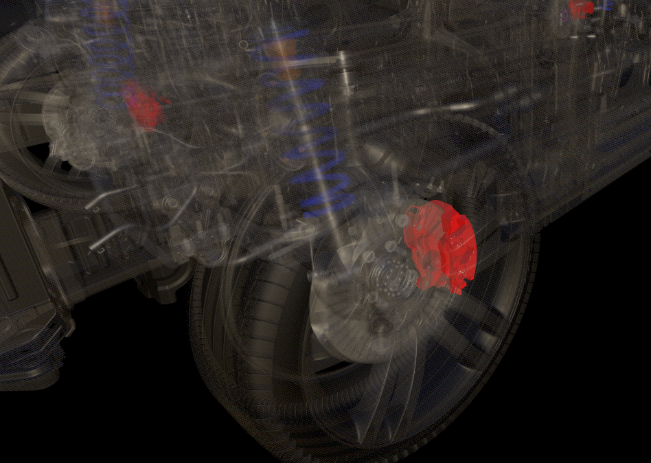
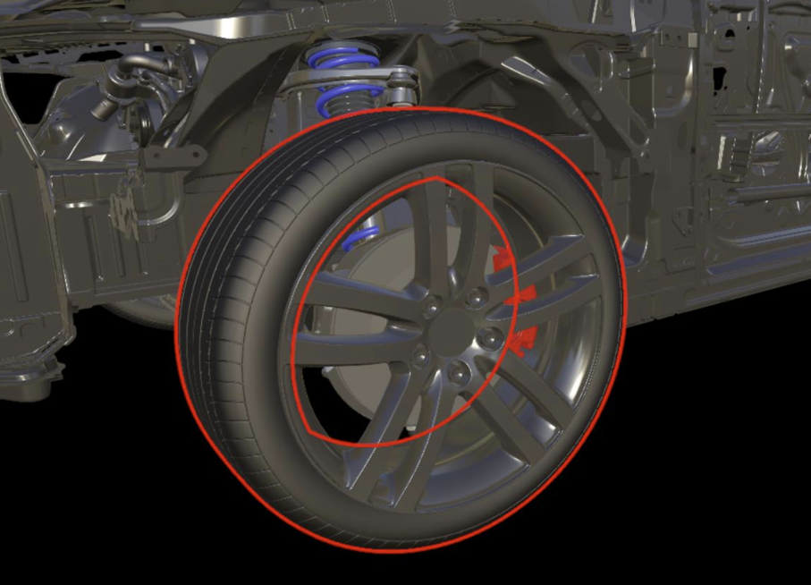

# Hierarchical state override

In many cases, it is necessary to dynamically change the appearance of parts of a [model](../../concepts/models.md), for example hiding subgraphs or switching parts to transparent rendering. Changing the materials of each part involved is not practical since it requires to iterate over the whole scene graph, and manage material cloning and assignment on each node.

To accomplish this use case with the least possible overhead, use the `HierarchicalStateOverrideComponent`. This component implements hierarchical state updates on arbitrary branches of the scene graph. That means, a state can be defined on any level in the scene graph and it trickles down the hierarchy until it is either overridden by a new state, or applied to a leaf object.

As an example, consider the model of a car and you want to switch the whole car to be transparent, except for the inner engine part. This use case involves only two instances of the component:

* The first component is assigned to the model's root node and turns on transparent rendering for the whole car.
* The second component is assigned to the root node of the engine and overrides the state again by explicitly turning off see-through mode.

## Features

The fixed set of states that can be overridden are:

* **`Hidden`**: Respective meshes in the scene graph are hidden or shown.
* **`Tint color`**: A rendered object can be color-tinted with its individual tint color and tint weight. The image below shows color tinting the rim of a wheel.
  
  

* **`See-through`**: The geometry is rendered semi-transparently, for example to reveal the inner parts of an object. The following image shows the entire car being rendered in see-through mode, except for the red brake caliper:

  

  > [!IMPORTANT]
  > The see-through effect only works when the *TileBasedComposition* [rendering mode](../../concepts/rendering-modes.md) is used.

* **`Selected`**: The geometry is rendered with a [selection outline](outlines.md).

  

* **`DisableCollision`**: The geometry is exempt from [spatial queries](spatial-queries.md). The **`Hidden`** flag doesn't affect the collision state flag, so these two flags are often set together.

## Hierarchical overrides

The `HierarchicalStateOverrideComponent` can be attached on multiple levels of an object hierarchy. Since there can only be one component of each type on an entity, each `HierarchicalStateOverrideComponent` manages the states for hidden, see-through, selected, color tint and collision.

Therefore each state can be set to one of:

* `ForceOn` - the state is enabled for all mesh on and below this node
* `ForceOff` - the state is disabled for all meshes on and below this node
* `InheritFromParent` - the state is unaffected by this override component

You can change states directly or through the `SetState` function:

```cs
HierarchicalStateOverrideComponent component = ...;

// set one state directly
component.HiddenState = HierarchicalEnableState.ForceOn;

// set a state with the SetState function
component.SetState(HierarchicalStates.SeeThrough, HierarchicalEnableState.InheritFromParent);

// set multiple states at once with the SetState function
component.SetState(HierarchicalStates.Hidden | HierarchicalStates.DisableCollision, HierarchicalEnableState.ForceOff);
```

```cpp
ApiHandle<HierarchicalStateOverrideComponent> component = ...;

// set one state directly
component->HiddenState(HierarchicalEnableState::ForceOn);

// set a state with the SetState function
component->SetState(HierarchicalStates::SeeThrough, HierarchicalEnableState::InheritFromParent);

// set multiple states at once with the SetState function
component->SetState(
    (HierarchicalStates)((int32_t)HierarchicalStates::Hidden | (int32_t)HierarchicalStates::DisableCollision), HierarchicalEnableState::ForceOff);

```

### Tint color

The `tint color` override is slightly special in that there's both an on/off/inherit state and a tint color property. The alpha portion of the tint color defines the weight of the tinting effect: If set to 0.0, no tint color is visible and if set to 1.0 the object will be rendered with pure tint color. For in-between values, the final color will be mixed with the tint color. The tint color can be changed on a per-frame basis to achieve a color animation.

## Performance considerations

An instance of `HierarchicalStateOverrideComponent` itself doesn't add much runtime overhead. However, it's always good practice to keep the number of active components low. For instance, when implementing a selection system that highlights the picked object, it is recommended to delete the component when the highlight is removed. Keeping the components around with neutral features can quickly add up.

Transparent rendering puts more workload on the server's GPUs than standard rendering. If large parts of the scene graph are switched to *see-through*, with many layers of geometry being visible, it may become a performance bottleneck. The same is valid for objects with [selection outlines](../../overview/features/outlines.md#performance).

## Next steps

* [Outlines](../../overview/features/outlines.md)
* [Rendering modes](../../concepts/rendering-modes.md)
* [Spatial Queries](../../overview/features/spatial-queries.md)
