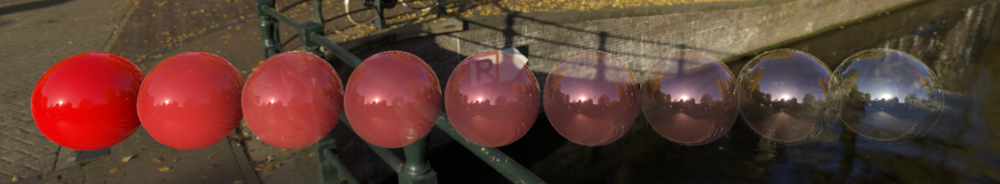
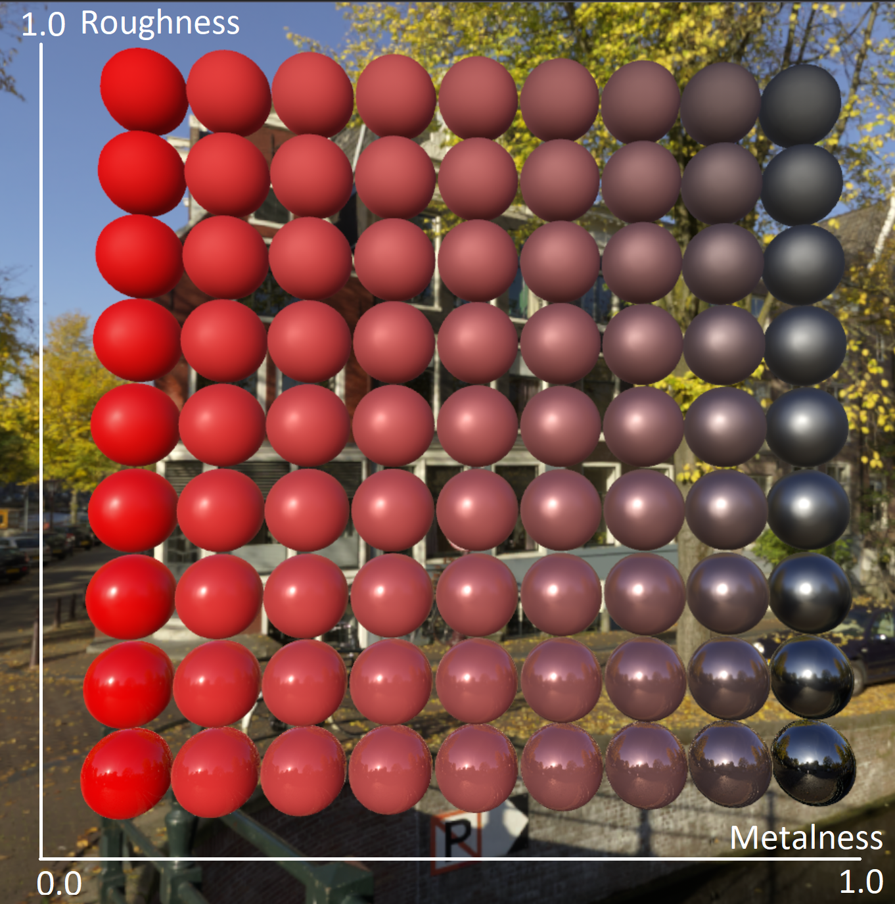

# PBR materials

*PBR materials* are one of the supported [material types](../../concepts/materials.md) in Azure Remote Rendering. They're used for triangular [meshes](../../concepts/meshes.md) that should receive realistic lighting. Point clouds on the other hand aren't affected by dynamic lighting.

PBR stands for **P**hysically **B**ased **R**endering and means that the material describes the visual properties of a surface in a physically plausible way, such that realistic results are possible under all lighting conditions. Most modern game engines and content creation tools support PBR materials because they're considered the best approximation of real world scenarios for real-time rendering.

The core idea of physically based rendering is to use *BaseColor*, *Metalness*, and *Roughness* properties to emulate a wide range of real-world materials. A detailed description of PBR is beyond the scope of this article. For more information about PBR, see [other sources](http://www.pbr-book.org).

PBR materials aren't a universal solution, though. There are materials that reflect color differently depending on the viewing angle. For example, some fabrics or car paints. These kinds of materials aren't handled by the standard PBR model, and are currently not supported by Azure Remote Rendering. This limitation includes PBR extensions, such as *Thin-Film* (multi-layered surfaces) and *Clear-Coat* (for car paints).

## PBR material properties

The following material properties are exposed in the runtime API, for instance on the [C# PbrMaterial class](/dotnet/api/microsoft.azure.remoterendering.pbrmaterial) or the [C++ PbrMaterial class](/cpp/api/remote-rendering/pbrmaterial), respectively.

* `PbrFlags`: Misc feature flags can be combined in this bit mask to enable the following features:
  * `TransparentMaterial`:  For PBR materials, there's only one transparency setting: it's enabled or not. The opacity is defined by the albedo color's alpha channel. When enabled, a more complex rendering method is invoked to draw semi-transparent surfaces. Azure Remote Rendering implements true [order independent transparency](https://en.wikipedia.org/wiki/Order-independent_transparency) (OIT).
  Transparent geometry is expensive to render. If you only need holes in a surface, for example for the leaves of a tree, it's better to use alpha clipping instead.

  
  Notice in the image above, how the right-most sphere is fully transparent, but the reflection is still visible.

  > [!IMPORTANT]
  > If any material is supposed to be switched from opaque to transparent at runtime, the renderer must use the *TileBasedComposition* [rendering mode](../../concepts/rendering-modes.md). This limitation does not apply to materials that are converted as transparent materials to begin with.
  
  * `UseVertexColor`: If the mesh contains :::no-loc text="vertex"::: colors and this option is enabled, the meshes' :::no-loc text="vertex"::: color is multiplied into the `AlbedoColor` and `AlbedoMap`. By default `UseVertexColor` is disabled.
  * `DoubleSided`: If double-sidedness is set to true, triangles with this material are rendered even if the camera is looking at their back faces. For PBR materials lighting is also computed properly for back faces. By default this option is disabled. See also [:::no-loc text="Single-sided"::: rendering](single-sided-rendering.md).
  * `SpecularHighlights`: Enables specular highlights for this material. By default, the `SpecularHighlights` flag is enabled.
  * `AlphaClipped`: Enables hard cut-outs on a per-pixel basis, based on the alpha value being below the value of `AlphaClipThreshold` (see below). This works for opaque materials as well.
  * `FresnelEffect`: This material flag enables the additive [fresnel effect](../../overview/features/fresnel-effect.md) on the respective material. The appearance of the effect is governed by the other fresnel parameters `FresnelEffectColor` and `FresnelEffectExponent` explained below.
  * `TransparencyWritesDepth`: If the `TransparencyWritesDepth` flag is set on the material and the material is transparent, objects using this material will also contribute to the final depth buffer. See the PBR material flag *transparent* in the next section. Enabling this feature is recommended if your use case needs a more plausible [late stage reprojection](late-stage-reprojection.md) of fully transparent scenes. For mixed opaque/transparent scenes, this setting may introduce implausible reprojection behavior or reprojection artifacts. For this reason, the default and recommended setting for the general use case is to disable this flag. The written depth values are taken from the per-pixel depth layer of the object that is closest to the camera.

* `AlbedoColor`: This color is multiplied with other colors, such as the `AlbedoMap` or *:::no-loc text="vertex"::: colors*. If *transparency* is enabled on a material, the alpha channel is used to adjust the opacity, with `1` meaning fully opaque and `0` meaning fully transparent. The default albedo color is opaque white.

  > [!NOTE]
  > When a PBR material is fully transparent, like a perfectly clean glass surface, it still reflects the environment. Bright spots like the sun are still visible in the reflection. This is different for [color materials](color-materials.md).

* `AlbedoMap`: A [2D texture](../../concepts/textures.md) for per-pixel albedo values.

* `AlphaClipThreshold`: If the `AlphaClipped` flag is set on the `PbrFlags` property, all pixels where the albedo alpha value is lower than `AlphaClipThreshold` won't be drawn. Alpha clipping can be used even without enabling transparency and is much faster to render. Alpha clipped materials are still slower to render than fully opaque materials, though. By default alpha clipping is disabled.

* `TexCoordScale` and `TexCoordOffset`: The scale is multiplied into the UV texture coordinates, the offset is added to it. Can be used to stretch and shift the textures. The default scale is (1, 1) and offset is (0, 0).

* `FresnelEffectColor`: The fresnel color used for this material. Only important when the fresnel effect flag has been set on this material (see above). This property controls the base color of the fresnel shine (see [fresnel effect](../../overview/features/fresnel-effect.md) for a full explanation). Currently only the RGB-channel values are important and the alpha value will be ignored.

* `FresnelEffectExponent`: The fresnel exponent used for this material. Only important when the fresnel effect flag has been set on this material (see above). This property controls the spread of the fresnel shine. The minimum value 0.01 causes a spread across the whole object. The maximum value 10.0 constricts the shine to only the most grazing edges visible.

* `PbrVertexAlphaMode`: Determines how the alpha channel of vertex colors is used. The following modes are provided:
  * `Occlusion`: The alpha value represents an ambient occlusion value and therefore only affects the indirect lighting from the sky box.
  * `LightMask`: The alpha value serves as a scale factor for the overall amount of lighting applied, meaning the alpha can be used to darken areas. This affects both indirect and direct lighting.
  * `Opacity`: The alpha represents how opaque (1.0) or transparent (0.0) the material is.

* `NormalMap`: To simulate fine grained detail, a [normal map](https://en.wikipedia.org/wiki/Normal_mapping) can be provided.
* `NormalMapScale`: A scalar value that scales the normal map strength. A value of 1.0 takes the normal map's normal as-is, a value of 0 makes the surface appear flat. Values larger than 1.0 exaggerate the normal map perturbation.

* `Roughness` and `RoughnessMap`: Roughness defines how rough or smooth the surface is. Rough surfaces scatter the light in more directions than smooth surfaces, which make reflections blurry rather than sharp. The value range is from `0.0` to `1.0`. When `Roughness` equals `0.0`, reflections will be sharp. When `Roughness` equals `0.5`, reflections will become blurry. If both a roughness value and a roughness map are supplied, the final value will be the product of the two.

* `Metalness` and `MetalnessMap`: In physics, this property corresponds to whether a surface is conductive or dielectric. Conductive materials have different reflective properties, and they tend to be reflective with no albedo color. In PBR materials, this property affects how much a surface reflects the surrounding environment. Values range from `0.0` to `1.0`. When metalness is `0.0`, the albedo color is fully visible, and the material looks like plastic or ceramics. When metalness is `0.5`, it looks like painted metal. When metalness is `1.0`, the surface almost completely loses its albedo color, and only reflects the surroundings. For instance, if `metalness` is `1.0` and `roughness` is `0.0` then a surface looks like real-world mirror. If both a metalness value and a metalness map are supplied, the final value will be the product of the two.

  

  In the picture above, the sphere in the bottom-right corner looks like a real metal material, the bottom-left looks like ceramic or plastic. The albedo color is also changing according to physical properties. With increasing roughness, the material loses reflection sharpness.

* `AOMap` and `AOScale`: [Ambient occlusion](https://en.wikipedia.org/wiki/Ambient_occlusion) makes objects with crevices look more realistic by adding shadows to occluded areas. Occlusion value range from `0.0` to `1.0`, where `0.0` means darkness (occluded) and `1.0` means no occlusions. If a 2D texture is provided as an occlusion map, the effect is enabled and `AOScale` acts as a multiplier.

  

## Color material overrides during conversion

A subset of color material properties can be overridden during model conversion through the [material override file](../../how-tos/conversion/override-materials.md).
The following table shows the mapping between runtime properties documented above and the corresponding property name in the override file:

| Material property name      | Property name in override file|
|:----------------------------|:---------------------|
| `PbrFlags.TransparentMaterial` | `transparent` |
| `PbrFlags.AlphaClipped`   | `alphaClipEnabled` |
| `PbrFlags.UseVertexColor` | `useVertexColor` |
| `PbrFlags.DoubleSided`    | `isDoubleSided` |
| `PbrFlags.TransparencyWritesDepth` | `transparencyWritesDepth` |
| `AlbedoColor`               | `albedoColor` |
| `TexCoordScale`             | `textureCoordinateScale` |
| `TexCoordOffset`            | `textureCoordinateOffset` |
| `NormalmapScale`            | `normalMapScale` |
| `Metalness`                 | `metalness` |
| `Roughness`                 | `roughness` |
| `AlphaClipThreshold`        | `alphaClipThreshold` |

## Technical details

Azure Remote Rendering uses the Cook-Torrance micro-facet BRDF with GGX NDF, Schlick Fresnel, and a GGX Smith correlated visibility term with a Lambert diffuse term. This model is the de facto industry standard at the moment. For more in-depth details, refer to this article: [Physically based Rendering - Cook Torrance](http://www.codinglabs.net/article_physically_based_rendering_cook_torrance.aspx)

 An alternative to the *Metalness-Roughness* PBR model used in Azure Remote Rendering is the *Specular-Glossiness* PBR model. This model can represent a broader range of materials. However, it's more expensive, and usually doesn't work well for real-time cases.
 It isn't always possible to convert from *Specular-Glossiness* to *Metalness-Roughness* as there are *(Diffuse, Specular)* value pairs that can't be converted to *(BaseColor, Metalness)*. The conversion in the other direction is simpler and more precise, since all *(BaseColor, Metalness)* pairs correspond to well-defined *(Diffuse, Specular)* pairs.

## API documentation

* [C# PbrMaterial class](/dotnet/api/microsoft.azure.remoterendering.pbrmaterial)
* [C# RenderingConnection.CreateMaterial()](/dotnet/api/microsoft.azure.remoterendering.renderingconnection.creatematerial)
* [C++ PbrMaterial class](/cpp/api/remote-rendering/pbrmaterial)
* [C++ RenderingConnection::CreateMaterial()](/cpp/api/remote-rendering/renderingconnection#creatematerial)

## Next steps

* [Color materials](color-materials.md)
* [Textures](../../concepts/textures.md)
* [Meshes](../../concepts/meshes.md)
* [Material override files](../../how-tos/conversion/override-materials.md).