# Sky reflections

In Azure Remote Rendering, a sky texture is used to light objects realistically. For augmented reality applications, this texture should resemble your real-world surroundings, to make objects appear convincing. This article describes how to change the sky texture.
The sky only affects the rendering of [PBR materials](../../overview/features/pbr-materials.md). [Color materials](../../overview/features/color-materials.md) and [point clouds](../../overview/features/point-cloud-rendering.md) aren't affected.

> [!NOTE]
> The sky texture is also referred to as an *environment map*. These terms are used interchangeably.

## Object lighting

Azure Remote Rendering employs *physically based rendering* (PBR) for realistic lighting computations. Although you can add [light sources](lights.md) to your scene, using a good sky texture has the greatest impact.

The images below show results of lighting different surfaces only with a sky texture:

| Roughness  | 0                                        | 0.25                                          | 0.5                                          | 0.75                                          | 1                                          |
|:----------:|:----------------------------------------:|:---------------------------------------------:|:--------------------------------------------:|:---------------------------------------------:|:------------------------------------------:|
| Non-Metal  | 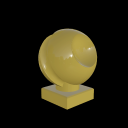   |   |   |   |   |
| Metal      | 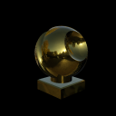  | 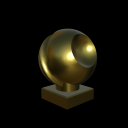    | 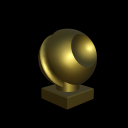    |     |     |

For more information on the lighting model, see the [materials](../../concepts/materials.md) chapter.

> [!IMPORTANT]
> Azure Remote Rendering uses the sky texture only for lighting models. It does not render the sky as a background, since Augmented Reality applications already have a proper background - the real world.

## Changing the sky texture

To change the environment map, all you need to do is [load a texture](../../concepts/textures.md) and change the session's `SkyReflectionSettings`:

```cs
async void ChangeEnvironmentMap(RenderingSession session)
{
    try
    {
        Texture skyTex = await session.Connection.LoadTextureFromSasAsync(new LoadTextureFromSasOptions("builtin://VeniceSunset", TextureType.CubeMap));
        session.Connection.SkyReflectionSettings.SkyReflectionTexture = skyTex;
    }
    catch (RRException exception)
    {
        System.Console.WriteLine($"Setting sky reflection failed: {exception.Message}");
    }
}
```

```cpp
void ChangeEnvironmentMap(ApiHandle<RenderingSession> session)
{
    LoadTextureFromSasOptions params;
    params.TextureType = TextureType::CubeMap;
    params.TextureUri = "builtin://VeniceSunset";
    session->Connection()->LoadTextureFromSasAsync(params, [&](Status status, ApiHandle<Texture> res) {
        if (status == Status::OK)
        {
            ApiHandle<SkyReflectionSettings> settings = session->Connection()->GetSkyReflectionSettings();
            settings->SetSkyReflectionTexture(res);
        }
        else
        {
            printf("Texture loading failed!\n");
        }
    });
}
```

The `LoadTextureFromSasAsync` variant is used above because a built-in texture is loaded. When loading from [linked blob storages](../../how-tos/create-an-account.md#link-storage-accounts) instead, use the `LoadTextureAsync` variant.

## Sky texture types

You can use both *[cubemaps](https://en.wikipedia.org/wiki/Cube_mapping)* and *2D textures* as environment maps.

All textures have to be in a [supported texture format](../../concepts/textures.md#supported-texture-formats). You don't need to provide mipmaps for sky textures.

### Cube environment maps

For reference, here's an unwrapped cubemap:


Use `RenderingSession.Connection.LoadTextureAsync`/ `LoadTextureFromSasAsync` with `TextureType.CubeMap` to load cubemap textures.

### Sphere environment maps

When using a 2D texture as an environment map, the image has to be in [spherical coordinate space](https://en.wikipedia.org/wiki/Spherical_coordinate_system).

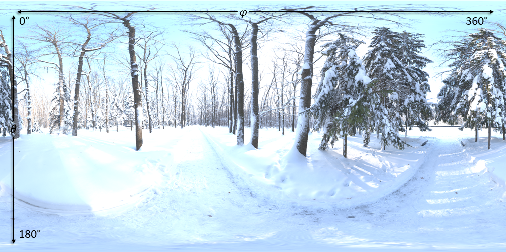

Use `RenderingSession.Connection.LoadTextureAsync` with `TextureType.Texture2D` to load spherical environment maps.

## Built-in environment maps

Azure Remote Rendering provides a few built-in environment maps that are always available. All built-in environment maps are cubemaps.

|Identifier                         | Description                                              | Illustration                                                      |
|-----------------------------------|:---------------------------------------------------------|:-----------------------------------------------------------------:|
|builtin://Autoshop                 | Variety of stripe lights, bright indoor base lighting    | 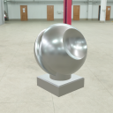
|builtin://BoilerRoom               | Bright indoor light setting, multiple window lights      | 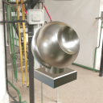
|builtin://ColorfulStudio           | Varyingly colored lights in medium light indoor setting  | 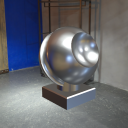
|builtin://Hangar                   | Moderately bright ambient hall light                     | 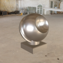
|builtin://IndustrialPipeAndValve   | Dim indoor setting with light-dark contrast              | 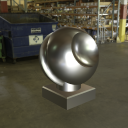
|builtin://Lebombo                  | Daytime ambient room light, bright window area light     | 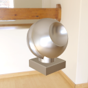
|builtin://SataraNight              | Dark night sky and ground with many surrounding lights   | 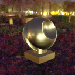
|builtin://SunnyVondelpark          | Bright sunlight and shadow contrast                      | 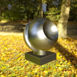
|builtin://Syferfontein             | Clear sky light with moderate ground lighting            | 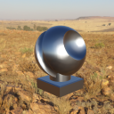
|builtin://TearsOfSteelBridge       | Moderately varying sun and shade                         | 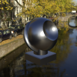
|builtin://VeniceSunset             | Evening sunset light approaching dusk                    | 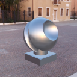
|builtin://WhippleCreekRegionalPark | Bright, lush-green, and white light tones, dimmed ground | 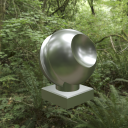
|builtin://WinterRiver              | Daytime with bright ambient ground light                 | 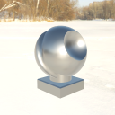
|builtin://DefaultSky               | Same as TearsOfSteelBridge                               | 

## API documentation

* [C# RenderingConnection.SkyReflectionSettings property](/dotnet/api/microsoft.azure.remoterendering.renderingconnection.skyreflectionsettings)
* [C++ RenderingConnection::SkyReflectionSettings()](/cpp/api/remote-rendering/renderingconnection#skyreflectionsettings)

## Next steps

* [Lights](../../overview/features/lights.md)
* [Materials](../../concepts/materials.md)
* [Textures](../../concepts/textures.md)
