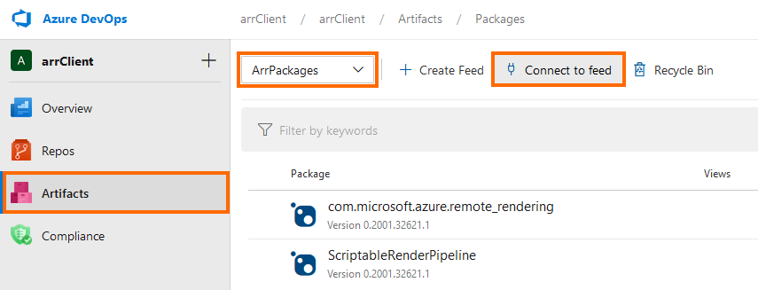

# System requirements

This chapter lists the minimum system requirements to work with *Azure Remote Rendering* (ARR).

## Development PC

* Windows 10 version 1903 or higher.
* Up-to-date graphics drivers.
* Optional: H265 hardware video decoder, if you want to use local preview of remotely rendered content (for example in Unity or Unreal).

> [!IMPORTANT]
> Windows update doesn't always deliver the very latest GPU drivers, check your GPU manufacturer's website for latest drivers:
>
> * [AMD drivers](https://www.amd.com/en/support)
> * [Intel drivers](https://www.intel.com/content/www/us/en/support/detect.html)
> * [NVIDIA drivers](https://www.nvidia.com/Download/index.aspx)

The table below lists which GPUs support H265 hardware video decoding.

| GPU manufacturer | Supported models |
|-----------|:-----------|
| NVIDIA | Check the **NVDEC Support Matrix** [at the bottom of this page](https://developer.nvidia.com/video-encode-decode-gpu-support-matrix). Your GPU needs a YES in the **H.265 4:2:0 8-bit** column. |
| AMD | GPUs with at least version 6 of AMD's [Unified Video Decoder](https://en.wikipedia.org/wiki/Unified_Video_Decoder#UVD_6). |
| Intel | Skylake and newer CPUs |

## Devices

Azure Remote Rendering currently only supports **HoloLens 2** as a target device.

It's important to use the latest HEVC codec, as newer versions have significant improvements in latency. To check which version is installed on your device:

1. Start the **Microsoft Store**.
1. Click the **"..."** button in the top right.
1. Select **Downloads and Updates**.
1. Search the list for **HEVC Video Extensions from Device Manufacturer**.
1. Make sure the listed codec has at least version **1.0.21821.0**.
1. Click the **Get Updates** button and wait for it to install.

## Network

A stable, low-latency network connection is critical for a good user experience. 

See dedicated chapter for [network requirements](../reference/network-requirements.md).

For troubleshooting network issues, refer to the [Troubleshooting Guide](../resources/troubleshoot.md#unstable-holograms).

## Software

The following software must be installed:

* The latest version of **Visual Studio 2019** [(download)](https://visualstudio.microsoft.com/vs/older-downloads/)
* **Windows SDK 10.0.18362.0** [(download)](https://developer.microsoft.com/windows/downloads/windows-10-sdk)
* **GIT** [(download)](https://git-scm.com/downloads)
* The **NuGet** command line tool and Credential Provider (see details below)
* Optional: To view the video stream from the server on a desktop PC, you need the **HEVC Video Extensions** [(Microsoft Store link)](https://www.microsoft.com/p/hevc-video-extensions/9nmzlz57r3t7).

### How to install NuGet

1. Go to [https://dev.azure.com/arrClient/arrClient](https://dev.azure.com/arrClient/arrClient).
1. Click on **Artifacts**, change the dropdown to **ArrPackages**, and click on **Connect to feed**.
  
1. Click on **Nuget.exe**, then **Get the tools**
  
1. From the link under *Step 1* download the latest NuGet.exe (under *Windows x86 Commandline*)
1. Copy NuGet.exe to some folder and add the location to your `PATH` environment variable.
1. The page linked under *Step 2* describes how to install the NuGet Credential Provider. The [manual installation](https://github.com/microsoft/artifacts-credprovider#manual-installation-on-windows) is straight forward.
1. Open a **new** command prompt (if you had to change your `PATH` environment variable you cannot reuse an existing one).
1. Add the "arrPackages" feed with the following NuGet command:
  
    ```cmd
    NuGet.exe sources Add -Name "ArrPackages" -Source "https://pkgs.dev.azure.com/arrClient/_packaging/ArrPackages/nuget/v3/index.json"
    ```

## Unity

For development with Unity, install

* Unity 2019.3 [(download)](https://unity3d.com/get-unity/download)
* Install these components in Unity:
  * **UWP** - Universal Windows Platform Build Support
  * **IL2CPP** - Windows Build Support (IL2CPP)

## Next steps

* [Quickstart: Render a model with Unity](../quickstarts/render-model.md)
