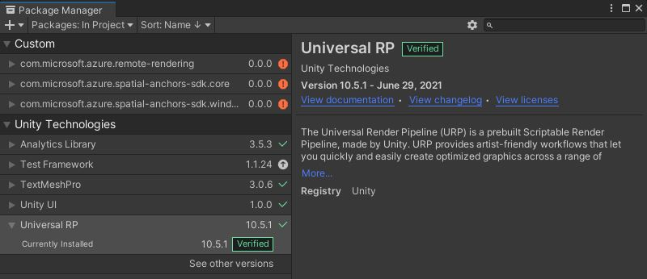

# System requirements

This chapter lists the minimum system requirements to work with *Azure Remote Rendering* (ARR).

## Development PC

* Windows 10 version 1903 or higher or Windows 11.
* Up-to-date graphics drivers.
* Optional: [H265 hardware video decoder](https://www.microsoft.com/p/hevc-video-extensions/9nmzlz57r3t7), if you want to use local preview of remotely rendered content (for example in Unity).

> [!IMPORTANT]
> Windows update doesn't always deliver the very latest GPU drivers, check your GPU manufacturer's website for latest drivers:
>
> * [AMD drivers](https://www.amd.com/en/support)
> * [Intel drivers](https://www.intel.com/content/www/us/en/support/detect.html)
> * [NVIDIA drivers](https://www.nvidia.com/Download/index.aspx)

The table below lists which GPUs support H265 hardware video decoding.

| GPU manufacturer | Supported models |
|-----------|:-----------|
| NVIDIA | Check the **NVDEC Support Matrix** [at the bottom of this page](https://developer.nvidia.com/video-encode-decode-gpu-support-matrix). Your GPU needs a YES in the **H.265 4:2:0 8-bit** column. |
| AMD | GPUs with at least version 6 of AMD's [Unified Video Decoder](https://en.wikipedia.org/wiki/Unified_Video_Decoder#UVD_6). |
| Intel | Skylake and newer CPUs |

Even though the correct H265 codec might be installed, security properties on the codec DLLs may cause codec initialization failures. The [troubleshooting guide](../resources/troubleshoot.md#h265-codec-not-available) describes steps how to solve this problem. The DLL issue can only occur when using the service in a desktop application, for instance in Unity.

## Supported Platforms and Devices

* 64-Bit Windows 10
* 64-Bit Windows 11
* HoloLens 2
* Meta Quest 2 (**Public Preview**)
* Meta Quest Pro (**Public Preview**)

### Desktop Windows

Requirements and limitations:

* 32-Bit Windows versions are not supported.
* You need to install the latest [Microsoft Visual C++ Redistributable package](https://aka.ms/vs/17/release/vc_redist.x64.exe) to be able to run any Azure Remote Rendering application.
* No VR support. Only the [simulation](../concepts/graphics-bindings.md#simulation) graphics binding is supported.
* Only the DX11 rendering API is supported.

It's important to use the latest HEVC codec, as newer versions have significant improvements in latency. To check which version is installed on your device:

1. Start the **Microsoft Store**.
1. Select the **"Library"** button in the bottom left.
1. Find **HEVC Video Extensions from Device Manufacturer** in the list. If it isn't listed under updates, the most recent version is already installed. Otherwise select the **Get Updates** button and wait for it to install.
1. Make sure the listed codec has at least version **1.0.21821.0**.
    1. Select the **HEVC Video Extensions from Device Manufacturer** entry from the list.
    1. Scroll down to the **Additional Information** section.
    1. Check the **Installed version** entry.

### HoloLens 2

Requirements and limitations:

* Both Unity's [OpenXR](https://docs.unity3d.com/Manual/com.unity.xr.openxr.html) (Unity 2020 or newer) and [Windows XR Plugin](https://docs.unity3d.com/2020.3/Documentation/Manual/com.unity.xr.windowsmr.html) (up to Unity 2020 only) are supported.
* The [render from PV camera](/windows/mixed-reality/mixed-reality-capture-for-developers#render-from-the-pv-camera-opt-in) feature isn't supported.
* Only the DX11 rendering API is supported.

### Quest 2 and Quest Pro

> [!IMPORTANT]
> **Support for Quest 2 and Quest Pro is currently in Public Preview**.
>
> This functionality is provided without a service level agreement, and is not recommended for production workloads. Certain features might not be supported or might have limited capabilities. 
>
> For more information, see [Supplemental Terms of Use for Microsoft Azure Previews](https://azure.microsoft.com/support/legal/preview-supplemental-terms/).

Requirements and limitations:

* The minimum supported Unity version is 2020.3.
* Only Unity's [OpenXR](https://docs.unity3d.com/Manual/com.unity.xr.openxr.html) plugin is supported.
* It is recommended to use Unity's Universal Render Pipeline (URP).
* Only the Vulkan rendering API is supported. OpenGL support is not available.
* The [Microsoft Authentication Library (MSAL)](https://github.com/AzureAD/microsoft-authentication-library-for-android) doesn't work for Quest devices.
* When a Quest device goes to sleep and is woken up again, the remote content may not resume at all, or take a long time to recover.
* The [ArrInspector](../resources/tools/arr-inspector.md) tool is not supported.
 
See the [Unity setup](../how-tos/unity/unity-setup.md) page for more details.

## Network

A stable, low-latency network connection is critical for a good user experience.

See dedicated chapter for [network requirements](../reference/network-requirements.md).

For troubleshooting network issues, refer to the [Troubleshooting Guide](../resources/troubleshoot.md#unstable-holograms).

### Network firewall

Remote Rendering virtual machines use shared IP addresses from the following IP ranges:

| Name             | Region         | IP prefix         |
|------------------|:---------------|:------------------|
| Australia East   | australiaeast  | 20.53.44.240/28   |
| East US          | eastus         | 20.62.129.224/28  |
| East US 2        | eastus2        | 20.49.103.240/28  |
| Japan East       | japaneast      | 20.191.165.112/28 |
| North Europe     | northeurope    | 52.146.133.64/28  |
| South Central US | southcentralus | 20.65.132.80/28   |
| Southeast Asia   | southeastasia  | 20.195.64.224/28  |
| UK South         | uksouth        | 51.143.209.144/28 |
| West Europe      | westeurope     | 20.61.99.112/28   |
| West US 2        | westus2        | 20.51.9.64/28     |

Make sure that your firewalls (on device, inside routers, etc.) don't block these IP ranges and the following port ranges:

| Port              | Protocol  | Allow    |
|-------------------|---------- |----------|
| 49152-65534       | TCP / UDP | Outgoing |

## Software

The following software must be installed:

* The latest version of **Visual Studio 2019** [(download)](https://visualstudio.microsoft.com/vs/older-downloads/)
* [Visual Studio tools for Mixed Reality](/windows/mixed-reality/install-the-tools). Specifically, the following *Workload* installations are mandatory:
  * **Desktop development with C++**
  * **Universal Windows Platform (UWP) development** 
* **Windows SDK 10.0.18362.0** [(download)](https://developer.microsoft.com/windows/downloads/windows-10-sdk)
* To work with the samples repository:
  * **Git** [(download)](https://git-scm.com/downloads)
  * **Git LFS plugin** [(download)](https://git-lfs.github.com/)
* Optional: To view the video stream from the server on a desktop PC, you need the **HEVC Video Extensions** [(Microsoft Store link)](https://www.microsoft.com/p/hevc-video-extensions/9nmzlz57r3t7). Ensure that the latest version is installed by checking for updates in the store.

## Unity

For development with Unity, install a supported version of Unity [(download)](https://unity3d.com/get-unity/download). We recommend using Unity Hub for managing installations.

> [!IMPORTANT]
> In addition to the supported versions mentioned below, make sure to check out the [Unity known issues page](/windows/mixed-reality/develop/unity/known-issues).

Make sure to include the following modules in your Unity installation:
* **UWP** - Universal Windows Platform Build Support
* **IL2CPP** - Windows Build Support (IL2CPP)

### Unity 2019

For Unity 2019, version 2019.3 or 2019.4 LTS is supported. However to work with the OpenXR version of the plugin, a 2020-based version is required.

ARR for Unity 2019 supports both the legacy **built-in XR** integration for Windows Mixed Reality and the new **XR SDK** plug-in framework.

### Unity 2020

For Unity 2020, use latest version of Unity 2020.3.

> [!IMPORTANT]
> When working with the OpenXR version of the plugin and the *Universal Render Pipeline* (URP), it has to be verified that the *Universal Render Pipeline* has version 10.5.1 or higher. To check that, open the *Package Manager* from the Unity *Windows* menu and refer to the *Universal RP* section:
> 

### Unity 2021

For Unity 2021, use latest version of Unity 2021.3.

### WMR vs. OpenXR

In Unity 2019 and Unity 2020, you can still choose between the WMR (Windows Mixed Reality) and OpenXR plugin. WMR has been deprecated for Unity 2021 and onwards. A known limitation of the WMR version is that it doesn't work in linear color space.

## Next steps

* [Quickstart: Render a model with Unity](../quickstarts/render-model.md)
