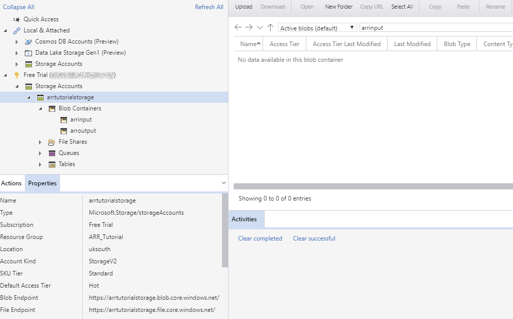
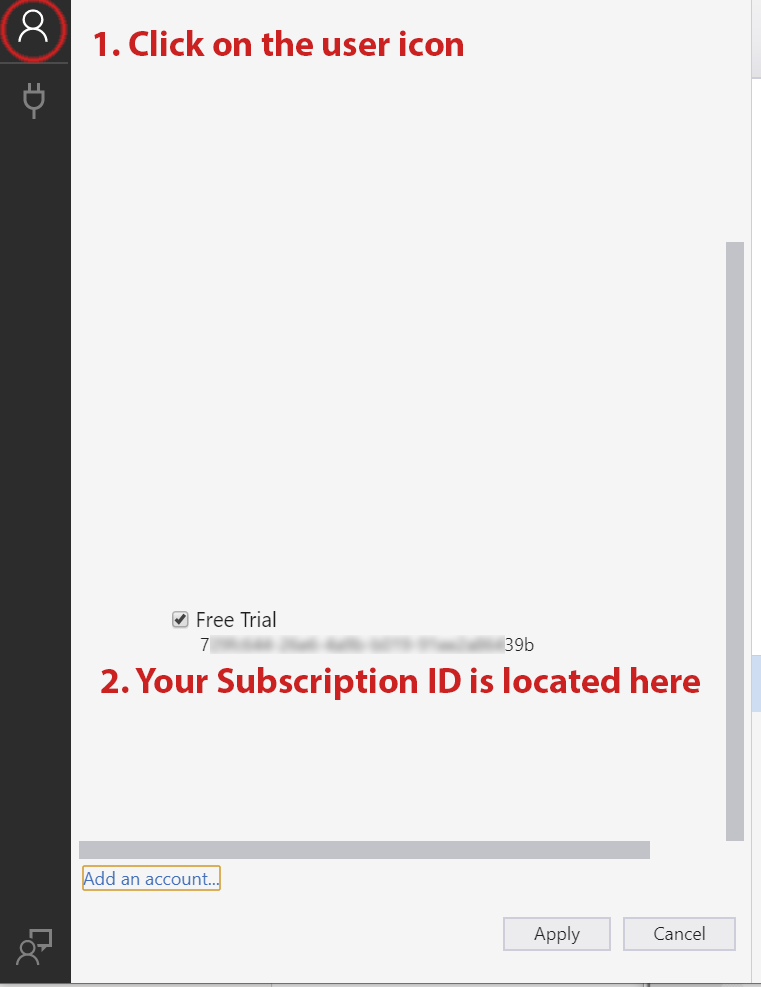
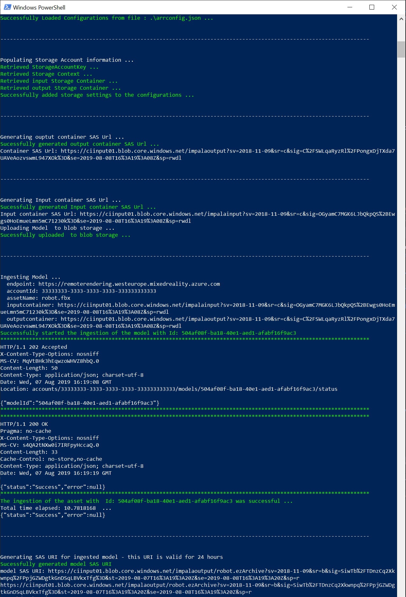
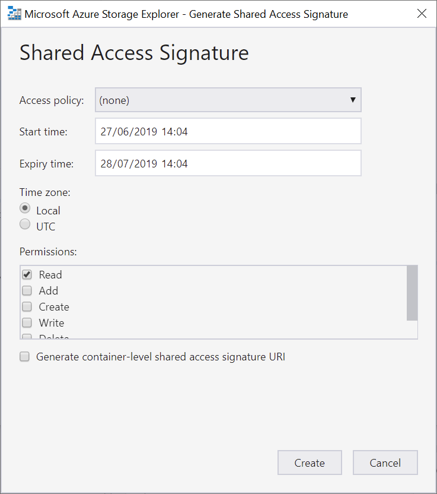

# Quickstart: Convert a model for rendering

In the [previous quickstart](render-model.md), you learned how to use the Unity sample project to render a built-in model. This guide shows how to convert your own models.

You'll learn how to:

> [!div class="checklist"]
>
> * Set up Azure blob storage for input and output
> * Configure the conversion script with your credentials and storage information
> * Run the conversion and get back the URI of the converted model

## Prerequisites

In addition to completing the [previous quickstart](render-model.md), the following software must be installed:

* Azure Storage Explorer ([download](https://azure.microsoft.com/features/storage-explorer/ "Storage Explorer"))
* Azure PowerShell [(documentation)](https://docs.microsoft.com/powershell/azure/)
  * Open a PowerShell with admin rights
  * Run: `Install-Module -Name Az -AllowClobber`

## Overview

The renderer on the server can't work directly with source model formats such as FBX or GLTF. Instead, it requires the model to be in a proprietary binary format.
The conversion service consumes models from Azure blob storage and writes converted models back to a provided Azure blob storage container.

You need:

* An Azure subscription
* A 'StorageV2' account in your subscription
* A blob storage container for your input model
* A blob storage container for your output data
* A model to convert, see [sample models](../samples/sample-model.md)
  * See the list of [supported source formats](../how-tos/conversion/model-conversion.md#supported-source-formats)

## Azure setup

If you do not have an account yet, go to [https://azure.microsoft.com/get-started/](https://azure.microsoft.com/get-started/), click on the free account option, and follow the instructions.

Once you have an Azure account, go to [https://ms.portal.azure.com/#home](https://ms.portal.azure.com/#home).

### Storage account creation

To create blob storage, you first need a storage account.
To create one, click on the "Create a resource" button:


From the new screen, choose **Storage** on the left side and then **Storage account - blob, file, table, queue** from the next column:


This will bring up the following new screen with storage properties to fill out:


Fill out the form in the following manner:

* Create a new Resource Group from the link below the drop-down box and name this **ARR_Tutorial**
* For the **Storage account name**, enter a unique name here. **This name must be globally unique**, otherwise there will be a prompt that informs you that the name is ready given. In the scope of this quickstart, we name it **arrtutorialstorage**. Accordingly, you need to replace it with your name for any occurrence in this quickstart.
* Select a **location** close to you. Ideally use the same location as used for setting up the rendering in the other quickstart.
* **Performance** set to ‘Standard’
* **Account kind** set to ‘StorageV2 (general purpose v2)’
* **Replication** set to ‘Read-access geo-redundant storage (RA-GRS)’
* **Access tier** set to ‘Hot’

None of the properties in other tabs have to be changed, so you can proceed with **"Review + create"** and then follow the steps to complete the setup.

The website now informs you about the progress of your deployment and reports "Your deployment is complete" eventually. Click on the **"Go to resource"** button for the next steps:


### Blob storage creation

Next we need two blob containers, one for input and one for output.

From the **"Go to resource"** button above, you get into a screen with a panel on the left. Close to the bottom, in the **"Blob service"** category, click on the **"Containers"** button:


Press the **"+ Container"** button to create the **input** blob storage container.
Use the following settings when creating it:
  
* Name = arrinput
* Public access level = Private

After the container has been created, click **+ Container** again and repeat with these settings for the **output** container:

* Name = arroutput
* Public access level = Private

You should now have two blob storage containers:


At this point, switch to the **Azure Storage Explorer** tool (which you installed earlier) – it provides information in one central location and makes it easier to configure Azure Remote Rendering.

After signing into the explorer, you will be presented with a tree structure. Navigate to your blob containers like in the image below:

(You may need to expand a few items in the tree to see everything.)



As you can see, the tool displays all the information needed via the properties menu.

## Conversion settings

To make it easier to run the model conversion service, we provide a utility script. It is located in the *Scripts* folder and is called **Ingestion.ps1**. The script reads its configuration from the file *Scripts\arrconfig.json*. Open that JSON file in a text editor.

```json
{
    "accountSettings": {
        "arrAccountId": "8*******-****-****-****-*********d7e",
        "arrAccountKey": "R***************************************l04=",
        "region": "westus2"
    },
    "renderingSessionSettings": {
        "vmSize": "small",
        "maxLeaseTime": "1:00:00"
    },
    "azureStorageSettings": {
        "azureSubscriptionId": "7*******-****-****-****-*********39b",
        "resourceGroup": "ARR_Tutorial",
        "storageAccountName": "arrtutorialstorage",
        "blobInputContainerName": "arrinput",
        "blobOutputContainerName": "arroutput"
    },
    "modelSettings": {
        "modelLocation": "D:\\tmp\\robot.fbx"
    }
}
```

Make sure to change **resourceGroup**, **storageAccountName**, **blobInputContainerName**, and **blobOutputContainerName** as seen above.
Note that the value **arrtutorialstorage** needs to be replaced with the unique name you picked during storage account creation.

To fill out **azureSubscriptionId**, open Azure Storage Explorer and click on the user icon on the left-hand side. Scroll down the list of subscriptions until you find the account used for this tutorial. **The SubscriptionID is located under the account name:**



Unfortunately the ID cannot be copied to clipboard from here, but the ID can also be gathered from the web portal.

Change **modelLocation** to point to the file on your disk that you intend to convert. Be careful to properly escape backslashes ("\\") in the path using double backslashes ("\\\\").

> [!NOTE]
> The example PowerShell script only allows handling one self contained file with the `modelLocation` property. However, if files are uploaded for example through Storage Explorer, [the model conversion REST API](../how-tos/conversion/conversion-rest-api.md) supports handling external files as well.

## Running the conversion script

The script is now ready to upload your model, call the conversion API, and retrieve a link to the converted model.

Open a PowerShell, make sure you installed the *Azure PowerShell* as mentioned in the prerequisites. Then log into your subscription:

```powershell
PS> Connect-AzAccount -Subscription "<your Azure subscription id>"
```

Change to the `arrClient\Scripts` directory and run the conversion script:

```powershell
PS> .\Ingestion.ps1
```

You should see something like this:


The conversion script generates a *Shared Access Signature (SAS)* URI for the converted model. You can now copy this URI as the **Model Name** into the Unity sample app (see the [previous quickstart](render-model.md)) to have it render your custom model!


## Re-creating a SAS URI

The SAS URI created by the conversion script will only be valid for 24 hours. However, after it expired you do not need to convert your model again. Instead, open Azure Storage Explorer and navigate to the *arroutput* blob storage container.
You will find the converted model file in there (either an *ezArchive* or and *arrAsset* file).

Right-click on the entry and select **Get Shared Access Signature**:



Set the expiry date to a date you would like and press **Create**. Copy the URI that is shown in the next dialog, it replaces the temporary URI that the script created.

## Next steps

Now that you know the basics, have a look at our tutorials to gain more in-depth knowledge.

If you want to learn the details of model conversion, check out [the model conversion REST API](../how-tos/conversion/conversion-rest-api.md).

> [!div class="nextstepaction"]
> [Setting up a Unity project](../tutorials/unity/project-setup.md)
