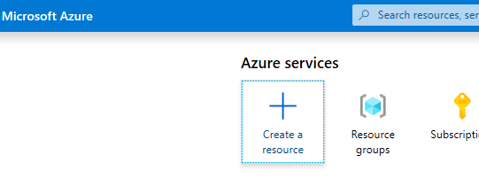
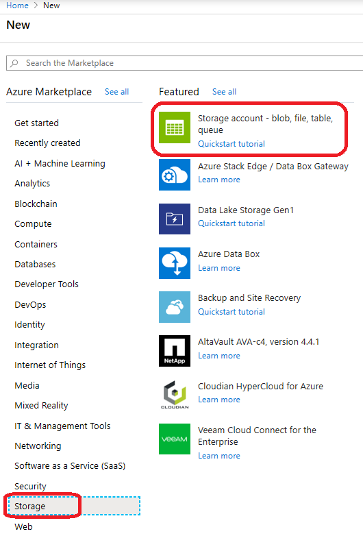
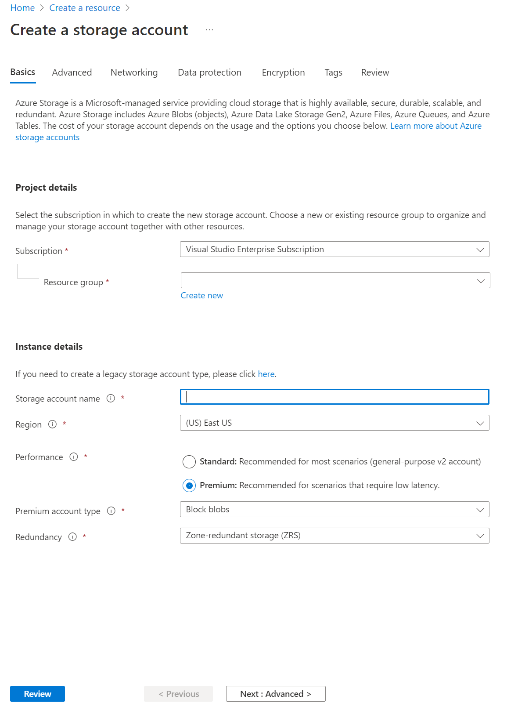
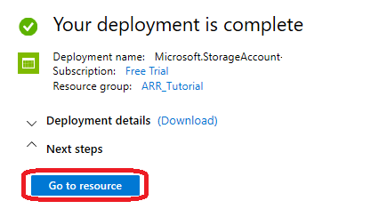
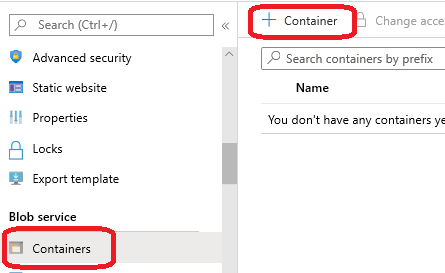
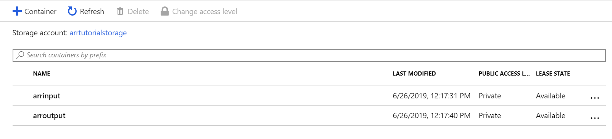
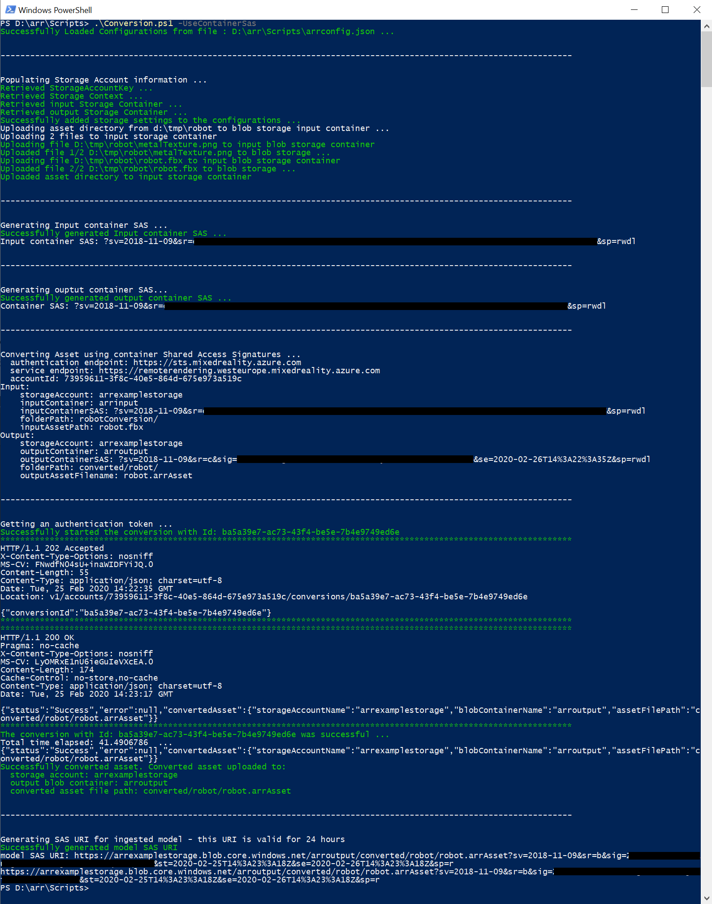
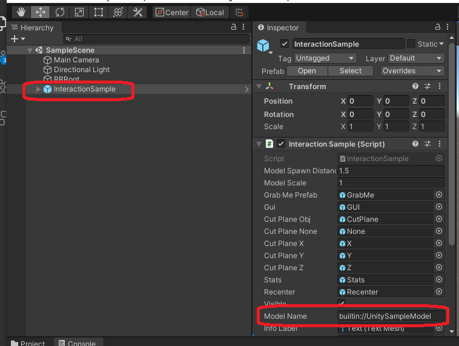
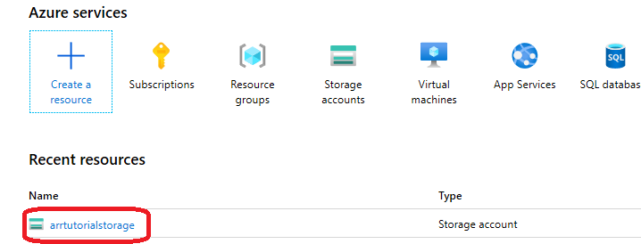
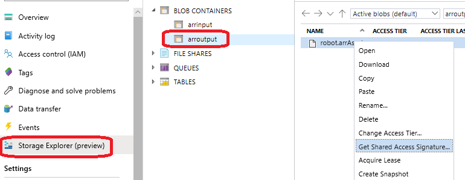

# Quickstart: Convert a model for rendering

In [Quickstart: Render a model with Unity](render-model.md), you learned how to use the Unity sample project to render a built-in model.

This guide shows how to convert your own models, entailing these steps:

> [!div class="checklist"]
>
> * Set up an Azure blob storage account for input and output
> * Upload and convert a 3D model for use with Azure Remote Rendering
> * Include the converted 3D model in an application for rendering

## Prerequisites

* Complete [Quickstart: Render a model with Unity](render-model.md)
* For the conversion using the PowerShell script: Install Azure PowerShell [(documentation)](/powershell/azure/)
  * Open a PowerShell with admin rights
  * Run: `Install-Module -Name Az -AllowClobber`

## Overview

The renderer on the server can't work directly with source model formats such as FBX or GLTF. Instead, it requires the model to be in a proprietary binary format.
The conversion service consumes models from Azure blob storage and writes converted models back to a provided Azure blob storage container.

You need:

* An Azure subscription
* A 'StorageV2' account in your subscription
* A blob storage container for your input model
* A blob storage container for your output data
* A model to convert, see [sample models](../samples/sample-model.md)
  * See the list of [supported source formats](../how-tos/conversion/model-conversion.md#supported-source-formats)
  * To use the sample conversion script, make sure you prepare an input folder that contains the model and all external dependencies (like external textures or geometry)

## Azure setup

If you don't have an account yet, go to [Get started with Azure](https://azure.microsoft.com/get-started/), select the free account option, and follow the instructions.

Once you have an Azure account, sign in to the [Azure portal](https://portal.azure.com).

### Storage account creation

To create blob storage, you first need a storage account.

1. To create one, select "Create a resource":



2. From the new screen, choose **Storage** on the left side and then **Storage account - blob, file, table, queue** from the next column:



3. Clicking this button brings up the following screen with storage properties to fill out:



4. Fill out the form in the following manner:

* Create a new Resource Group from the link below the drop-down box and name this **ARR_Tutorial**
* For the **Storage account name**, enter a unique name here. **This name must be globally unique**. An error message is shown if the name is already taken. In the scope of this quickstart, we name it **arrtutorialstorage**. Accordingly, you need to replace it with your name for any occurrence in this quickstart.
* Select a **Region** close to you. Ideally use the same [region](../reference/regions.md) as used for setting up the rendering in the other quickstart.
* **Performance** set to 'Premium'. 'Standard' works as well, but has lower loading time characteristics when loading a model.
* **Premium account type** set to 'Block blobs'
* **Redundancy** set to 'Zone-redundant storage (ZRS)'

1. None of the properties in other tabs have to be changed, so you can proceed with **"Review + create"** and then follow the steps to complete the setup.

2. The website now informs you about the progress of your deployment and reports "Your deployment is complete" eventually. Select **"Go to resource"** for the next steps:



### Blob storage creation

Next we need two blob containers, one for input and one for output.

1. From the **"Go to resource"** button, you get to a page with a panel on the left that contains a list menu. In that list under the **"Blob service"** category, select **"Containers"**:



2. Press the **"+ Container"** button to create the **input** blob storage container.
Use the following settings when creating it:
  
* Name = arrinput
* Public access level = Private

3. After the container has been created, select **+ Container** again and repeat with these settings for the **output** container:

* Name = arroutput
* Public access level = Private

You should now have two blob storage containers:



## Run the conversion

There are three distinct ways to trigger a model conversion:

### 1. Conversion via the ARRT tool

There's a [UI-based tool called ARRT](./../samples/azure-remote-rendering-asset-tool.md) to start conversions and interact with the rendered result.


### 2. Conversion via a PowerShell script

To make it easier to call the asset conversion service, we provide a utility script. It's located in the *Scripts* folder and is called **Conversion.ps1**.

In particular, this script

* uploads all files in a given directory from local disk to the input storage container,
* calls the [asset conversion REST API](../how-tos/conversion/conversion-rest-api.md)
  * this api retrieves the data from the input storage container, starts a conversion and returns a conversion ID,
* polls the conversion status API with the retrieved conversion ID until the conversion process terminates with success or failure,
* retrieves a link to the converted asset in the output storage.

The script reads its configuration from the file *Scripts\arrconfig.json*. Open that JSON file in a text editor.

```json
{
    "accountSettings": {
        "arrAccountId": "8*******-****-****-****-*********d7e",
        "arrAccountKey": "R***************************************l04=",
        "arrAccountDomain": "<select from available regions: australiaeast, eastus, eastus2, japaneast, northeurope, southcentralus, southeastasia, uksouth, westeurope, westus2 or specify the full url>"
    },
    "renderingSessionSettings": {
        "remoteRenderingDomain": "<select from available regions: australiaeast, eastus, eastus2, japaneast, northeurope, southcentralus, southeastasia, uksouth, westeurope, westus2 or specify the full url>"
    },
    "assetConversionSettings": {
        "localAssetDirectoryPath": "D:\\tmp\\robot",
        "resourceGroup": "ARR_Tutorial",
        "storageAccountName": "arrexamplestorage",
        "blobInputContainerName": "arrinput",
        "inputFolderPath": "robotConversion",
        "inputAssetPath": "robot.fbx",
        "blobOutputContainerName": "arroutput",
        "outputFolderPath":"converted/robot",
        "outputAssetFileName": "robot.arrAsset"
    }
}
```

The configuration within the **accountSettings** group (account ID, key and domain) should be filled out analogous to the credentials in the [Render a model with Unity quickstart](render-model.md).

A full configuration of the **renderingSessionSettings** group (domain, vmSize and maxLeaseTime) can be seen in [PowerShell Example scripts](../samples/powershell-example-scripts.md). The vmSize and maxLeaseTime aren't important for conversion and can be omitted, as they don't affect the conversion.

Inside the **assetConversionSettings** group, make sure to change **resourceGroup**, **blobInputContainerName**, and **blobOutputContainerName**.
The value for **arrtutorialstorage** needs to be replaced with the unique name you picked during storage account creation.

Change **localAssetDirectoryPath** to point to the directory on your disk, which contains the model you intend to convert. Be careful to properly escape backslashes ("\\") in the path using double backslashes ("\\\\").

The service uploads all data from the path given in **localAssetDirectoryPath** to the **blobInputContainerName** blob container under a subpath given by **inputFolderPath**. With the example configuration, the service uploads the content of the "D:\\tmp\\robot" directory to the blob container "arrinput" of the storage account "arrtutorialstorage" under the path "robotConversion". Already existing files are overwritten.

Change **inputAssetPath** to the path of the model to be converted - the path is relative to localAssetDirectoryPath. Use "/" instead of "\\" as the path separator. So for a "robot.fbx" file, which is located directly in "D:\\tmp\\robot", use "robot.fbx".

Once the model was converted, it's written back to the storage container given by **blobOutputContainerName**. A subpath can be specified by providing the optional **outputFolderPath**. In the example, the service copies the resulting "robot.arrAsset" to the output blob container under "converted/robot".

The config setting **outputAssetFileName** determines the name of the converted asset - the parameter is optional and if not specified the service uses the input file name to generate an output name.

Open a PowerShell, make sure you installed the *Azure PowerShell* as mentioned in the [prerequisites](#prerequisites). Then log into your subscription with the following command and follow the on-screen directions:

```PowerShell
Connect-AzAccount
```

> [!NOTE]
> In case your organization has more than one subscription you might need to specify the SubscriptionId and Tenant arguments. Find details in the [Connect-AzAccount documentation](/powershell/module/az.accounts/connect-azaccount).

Change to the `azure-remote-rendering\Scripts` directory and run the conversion script:

```PowerShell
.\Conversion.ps1 -UseContainerSas
```

You should see something like this:


### 3. Conversion via API calls

Both the C# and the C++ API provide an entry point to interact with the service:
* [C# RemoteRenderingClient.StartAssetConversionAsync()](/dotnet/api/microsoft.azure.remoterendering.remoterenderingclient.startassetconversionasync)
* [C++ RemoteRenderingClient::StartAssetConversionAsync()](/cpp/api/remote-rendering/remoterenderingclient#startassetconversionasync)


## Insert new model into Quickstart Sample App

The conversion script generates a *Shared Access Signature (SAS)* URI for the converted model. You can now copy this URI as the **Model Name** into the quickstart sample app (see [Quickstart: Render a model with Unity](render-model.md)).



 The sample should now load and render your custom model!

## Optional: Re-creating a SAS URI

The SAS URI created by the conversion script expires after 24 hours. However, after it expired you don't need to convert your model again. Instead, you can create a new SAS in the portal as described in the next steps:

1. Sign in to the [Azure portal](https://portal.azure.com).
2. Select your **Storage account** resource:



3. In the following screen, Select **Storage explorer** in the left panel and find your output model (*.arrAsset* file) in the *arroutput* blob storage container. Right-click on the file and select **Get Shared Access Signature** from the context menu:

   

4. A new screen opens where you can select an expiry date. Press **Create**, and copy the URI that is shown in the next dialog. This new URI replaces the temporary URI that the script created.

## Next steps

Now that you know the basics, have a look at our tutorials to gain more in-depth knowledge.

If you want to learn the details of model conversion, check out [the model conversion REST API](../how-tos/conversion/conversion-rest-api.md).

> [!div class="nextstepaction"]
> [Tutorial: Viewing remotely rendered models](../tutorials/unity/view-remote-models/view-remote-models.md)
