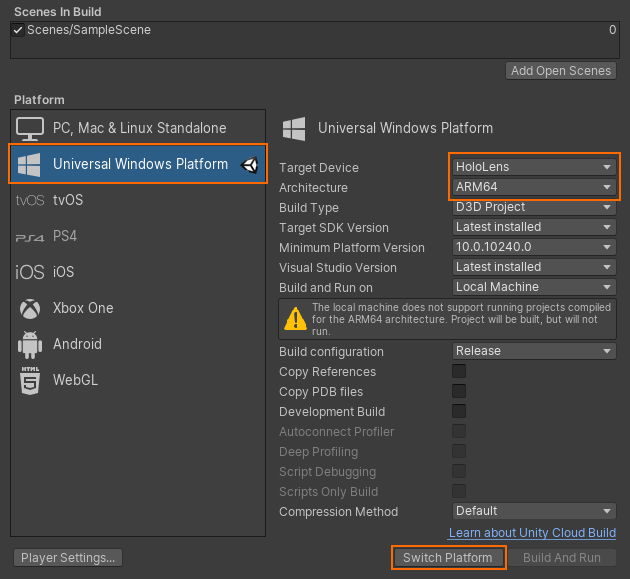
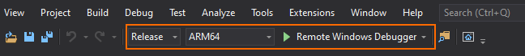

# Quickstart: Deploy Unity sample to HoloLens

This quickstart covers how to deploy and run the quickstart sample app for Unity to a HoloLens 2.

In this quickstart you will learn how to:

> [!div class="checklist"]
>
>* Build the quickstart sample app for HoloLens
>* Deploy the sample to the device
>* Run the sample on the device

## Prerequisites

In this quickstart we will deploy the sample project from [Quickstart: Render a model with Unity](render-model.md).

Make sure your credentials are saved properly with the scene and you can connect to a session from within the Unity editor.

## Build the sample project

1. Open *File > Build Settings*.
1. Change *Platform* to **Universal Windows Platform**
1. Set *Target Device* to **HoloLens**
1. Set *Architecture* to **ARM64**
1. Set *Build Type* to **D3D Project**
    
1. Select **Switch to Platform**
1. When pressing **Build** (or 'Build And Run'), you will be asked to select some folder where the solution should be stored
1. Open the generated **Quickstart.sln** with Visual Studio
1. Change the configuration to **Release** and **ARM64**
1. Switch the debugger mode to **Remote Machine**
    
1. Build the solution (F7)
1. For the project 'Quickstart', go to *Properties > Debugging*
    1. Make sure the configuration *Release* is active
    1. Set *Debugger to Launch* to **Remote Machine**
    1. Change *Machine Name* to the **IP of your HoleLens**

## Launch the sample project

1. Connect the HoloLens with a USB cable to your PC.
1. Start the Debugger in Visual Studio (F5). It will automatically deploy the app to the device.

The sample app should launch and then start a new session. After a while, the session is ready and the remotely rendered model will appear in front of you.
If you want to launch the sample a second time later, you can also find it from the HoloLens start menu now.

## Next steps

In the next quickstart, we will take a look at converting a custom model.

> [!div class="nextstepaction"]
> [Quickstart: Convert a model for rendering](convert-model.md)
