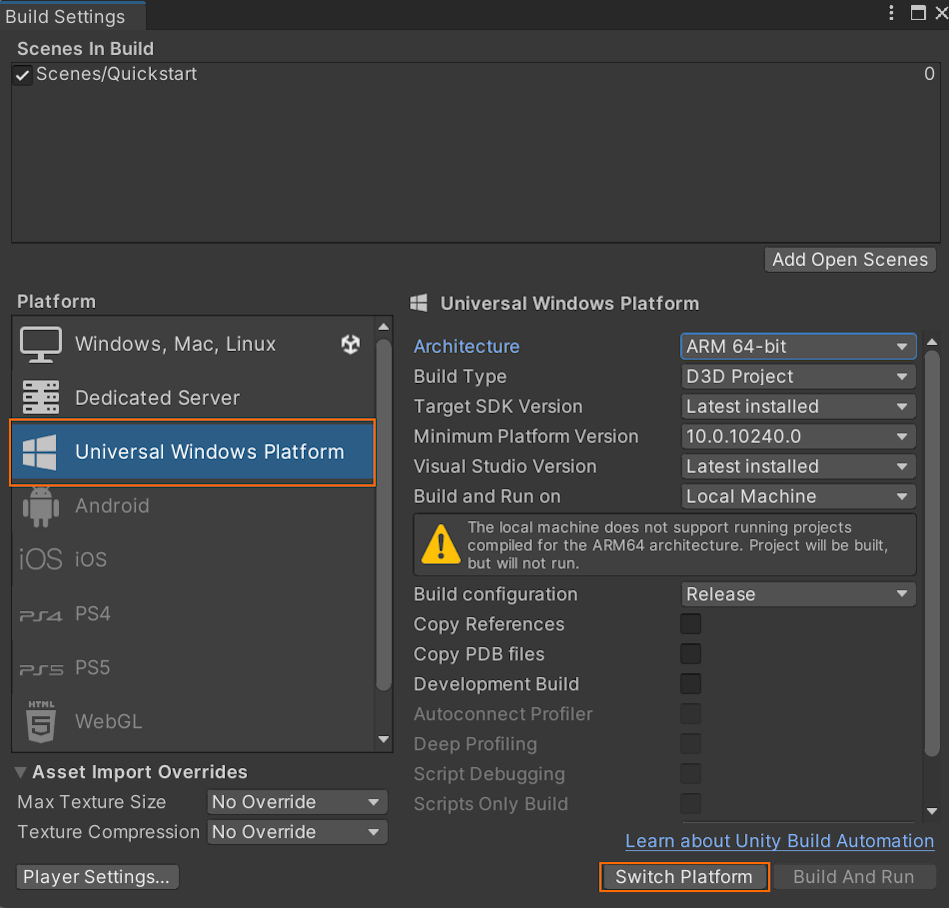
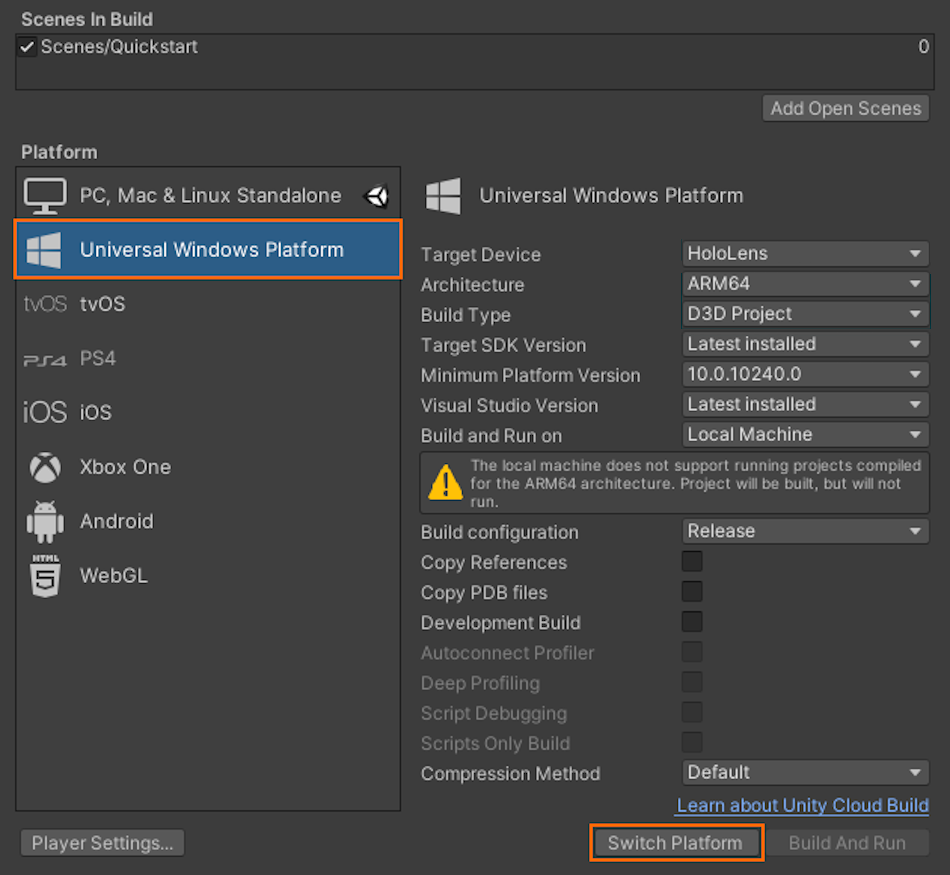

# Quickstart: Deploy Unity sample to HoloLens

This quickstart covers how to deploy and run the quickstart sample app for Unity to a HoloLens 2.

In this quickstart, you learn how to:

> [!div class="checklist"]
>
>* Build the quickstart sample app for HoloLens
>* Deploy the sample to the device
>* Run the sample on the device

## Prerequisites

In this quickstart, we deploy the sample project from [Quickstart: Render a model with Unity](render-model.md).
Make sure your credentials are saved properly with the scene and you can connect to a session from within the Unity editor.

The HoloLens 2 must be in developer mode and paired with the desktop machine. Refer to [using the device portal](/windows/mixed-reality/develop/advanced-concepts/using-the-windows-device-portal#setting-up-hololens-to-use-windows-device-portal) for further instructions.

## Build the sample project

# [Unity 2021+](#tab/Unity2021PlusBuild)

1. Open *File > Build Settings*.
1. Change *Platform* to **Universal Windows Platform**.\
    
1. Select **Switch Platform**.
1. When pressing **Build** (or 'Build And Run'), you're asked to select some folder where the solution should be stored.

# [Unity 2020](#tab/Unity2020Build)

1. Open *File > Build Settings*.
1. Change *Platform* to **Universal Windows Platform**.\
    
1. Select **Switch Platform**.
1. When pressing **Build** (or 'Build And Run'), you're asked to select some folder where the solution should be stored.

---

## Build the Visual Studio solution

1. Open the generated **Quickstart.sln** with Visual Studio
1. Change the configuration to **Release** and **ARM64**
1. Switch the debugger mode to **Remote Machine**\
    
1. Build the solution
1. In the Solution Explorer, select the 'Quickstart' project
    1. Go to *Properties*
    1. Make sure the configuration *Release* and platform *ARM64* are active
    1. Go to Debugging
    1. Set *Debugger to Launch* to **Remote Machine**
    1. Change *Machine Name* to the **IP of your HoloLens**

## Launch the sample project

1. Connect the HoloLens with a USB cable to your PC.
1. Start the Debugger in Visual Studio (F5). It automatically deploys the app to the device.

The sample app should launch and then start a new session. After a while, the session is ready and the remotely rendered model will appear in front of you.
If you want to launch the sample a second time later, you can also find it from the HoloLens start menu now.

## Next steps

In the next quickstart, we'll take a look at converting a custom model.

> [!div class="nextstepaction"]
> [Quickstart: Convert a model for rendering](convert-model.md)
