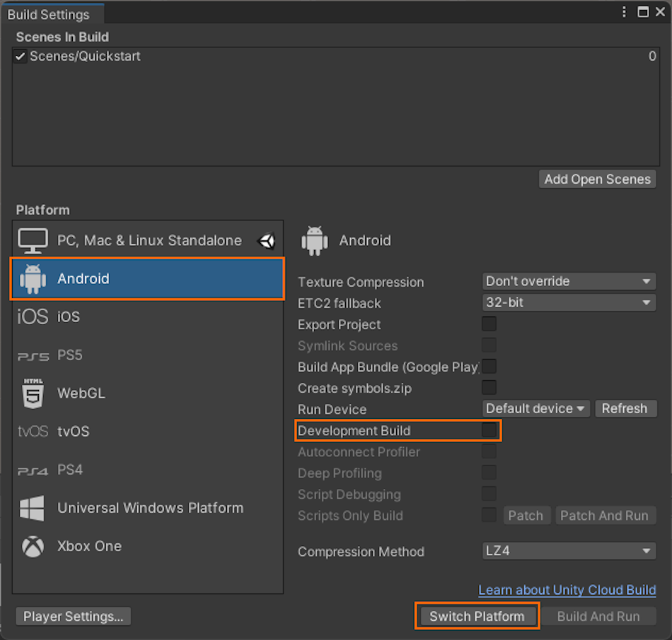

# Quickstart: Deploy Unity sample to Quest 2 or Quest Pro

This quickstart covers how to deploy and run the quickstart sample app for Unity to a Meta Quest 2 or Quest Pro device.

> [!IMPORTANT]
> **Support for Quest 2 and Quest Pro is currently in Public Preview**.
>
> This functionality is provided without a service level agreement, and is not recommended for production workloads. Certain features might not be supported or might have limited capabilities. 
>
> For more information, see [Supplemental Terms of Use for Microsoft Azure Previews](https://azure.microsoft.com/support/legal/preview-supplemental-terms/).

In this quickstart you'll learn how to:

> [!div class="checklist"]
>
>* Build the quickstart sample app for Android
>* Deploy the sample to the device
>* Run the sample on the device

## Prerequisites

In this quickstart, we'll deploy the sample project from [Quickstart: Render a model with Unity](render-model.md).
Make sure your credentials are saved properly with the scene and you can connect to a session from within the Unity editor.

In Unity you need to have **Android Build Support** installed.

Your Quest 2 / Quest Pro device must be set up for [Developer Mode](https://developer.oculus.com/documentation/native/android/mobile-device-setup/).

You need to have the [Android SDK](https://developer.android.com/studio) installed, so that tools like the [Android Debug Bridge (ADB)](https://developer.android.com/tools/adb) are available. You should also make sure these are in your `PATH` environment variable.

Make sure your Quest device is connected to the PC and side-loading APKs via `adb` works.

## Build the sample project

1. Open *File > Build Settings*.
1. Change *Platform* to **Android**
1. If you want to be able to debug the APK, enable *Development Build*.
1. Select **Switch to Platform**
    
1. When pressing **Build** (or 'Build And Run'), you'll be asked to select a folder where the APK should be stored.
1. Once the APK file is finished, it needs to be deployed to your device using `adb`.
1. Open a command prompt, navigate to the APK file and run `adb install <YourFileName.apk>`

## Launch the sample project

Once your APK is installed on the device, you should be able to find and launch it from the Quest's app menu. To find side-loaded apps quickly, set the menu's filter to *Unknown Sources*.

## Next steps

In the next quickstart, we'll take a look at converting a custom model.

> [!div class="nextstepaction"]
> [Quickstart: Convert a model for rendering](convert-model.md)
