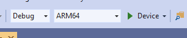

# Quickstart: Deploy native C++ OpenXR sample to HoloLens

This quickstart covers how to deploy and run the OpenXR-based native C++ tutorial application on a HoloLens 2.

In this quickstart you will learn how to:

> [!div class="checklist"]
>
>* Build the tutorial application for HoloLens.
>* Change the ARR credentials in the source code.
>* Deploy and run the sample on the device.

## Prerequisites

To get access to the Azure Remote Rendering service, you first need to [create an account](../../../how-tos/create-an-account.md).

The following software must be installed:

* Windows SDK 10.0.18362.0 [(download)](https://developer.microsoft.com/windows/downloads/windows-10-sdk)
* The latest version of Visual Studio 2022 [(download)](https://visualstudio.microsoft.com/vs/)
* [Visual Studio tools for Mixed Reality](/windows/mixed-reality/install-the-tools). Specifically, the following *Workload* installations are mandatory:
  * **Desktop development with C++**
  * **Universal Windows Platform (UWP) development**
* Git [(download)](https://git-scm.com/downloads)
* Git LFS plugin [(download)](https://git-lfs.github.com/)

## Clone the ARR samples repository

As a first step, we clone the Git repository, which houses the global Azure Remote Rendering samples. Open a command prompt (type `cmd` in the Windows start menu) and change to a directory where you want to store the ARR sample project.

Run the following commands:

```cmd
mkdir ARR
cd ARR
git clone https://github.com/Azure/azure-remote-rendering
```

The last command creates a subdirectory in the ARR directory containing the various sample projects for Azure Remote Rendering.

The C++ HoloLens tutorial can be found in the subdirectory *NativeCpp/HoloLens-OpenXr*.

## Build the project

Open the solution file *BasicXrApp.sln* located in the *NativeCpp/HoloLens-OpenXr* subdirectory with Visual Studio.

Switch the build configuration to *Debug* (or *Release*) and *ARM64*. Also make sure the debugger mode is set to *Device* as opposed to *Remote Machine*:



Since the account credentials are hardcoded in the tutorial's source code, change them to valid credentials. For that, open the file `OpenXrProgram.cpp` inside Visual Studio and change the part where the client is created inside the `InitARR()` function:

```cpp
// 2. Create Client
{
    // Users need to fill out the following with their account data and model
    RR::SessionConfiguration init;
    init.AccountId = "00000000-0000-0000-0000-000000000000";
    init.AccountKey = "<account key>";
    init.RemoteRenderingDomain = "westus2.mixedreality.azure.com"; // <change to the region that the rendering session should be created in>
    init.AccountDomain = "westus2.mixedreality.azure.com"; // <change to the region the account was created in>
    m_modelURI = "builtin://Engine";
    m_sessionOverride = ""; // If there is a valid session ID to re-use, put it here. Otherwise a new one is created
    m_client = RR::ApiHandle(RR::RemoteRenderingClient(init));
}
```

Specifically, change the following values:
* `init.AccountId`, `init.AccountKey`, and `init.AccountDomain` to use your account data. See the paragraph about how to [retrieve account information](../../../how-tos/create-an-account.md#retrieve-the-account-information).
* Specify where to create the remote rendering session by modifying the region part of the `init.RemoteRenderingDomain` string for other [regions](../../../reference/regions.md) than `westus2`, for instance `"westeurope.mixedreality.azure.com"`.
* In addition, `m_sessionOverride` can be changed to an existing session ID. Sessions can be created outside this sample, for instance by using [the PowerShell script](../../../samples/powershell-example-scripts.md#script-renderingsessionps1) or using the [session REST API](../../../how-tos/session-rest-api.md) directly.
Creating a session outside the sample is recommended when the sample should run multiple times. If no session is passed in, the sample will create a new session upon each startup, which may take several minutes.

Now the application can be compiled.

## Launch the application

1. Connect the HoloLens with a USB cable to your PC.
1. Turn on the HoloLens and wait until the start menu shows up.
1. Start the Debugger in Visual Studio (F5). It will automatically deploy the app to the device.

The sample app should launch and a text panel should appear that informs you about the current application state. The status at startup time is either starting a new session or connecting to an existing session. After model loading has completed, the built-in engine model appears right at your head position. Occlusion-wise, the engine model interacts properly with the spinning cubes that are rendered locally.

If you want to launch the sample a second time later, you can also find it from the HoloLens start menu, but note it may have an expired session ID compiled into it.

## Next steps

Now that you have successfully compiled and deployed a native OpenXR sample with ARR capabilities, you can start enhancing the sample by adding interaction code for remote objects:

> [!div class="nextstepaction"]
> [Concepts: Entities](../../../concepts/entities.md)

Also, you can inject your own converted model:

> [!div class="nextstepaction"]
> [Quickstart: Convert a model](../../../quickstarts/convert-model.md)
