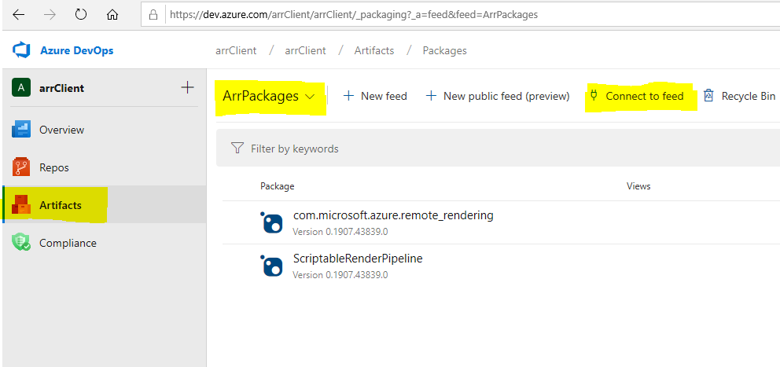
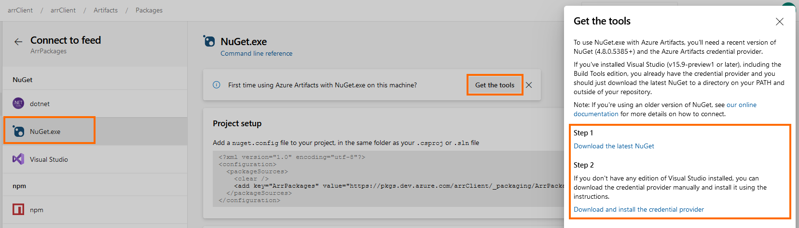
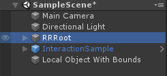
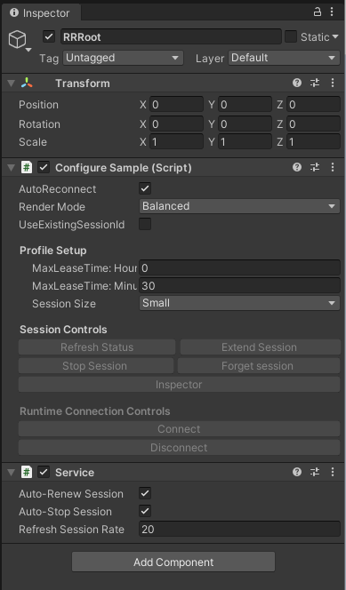
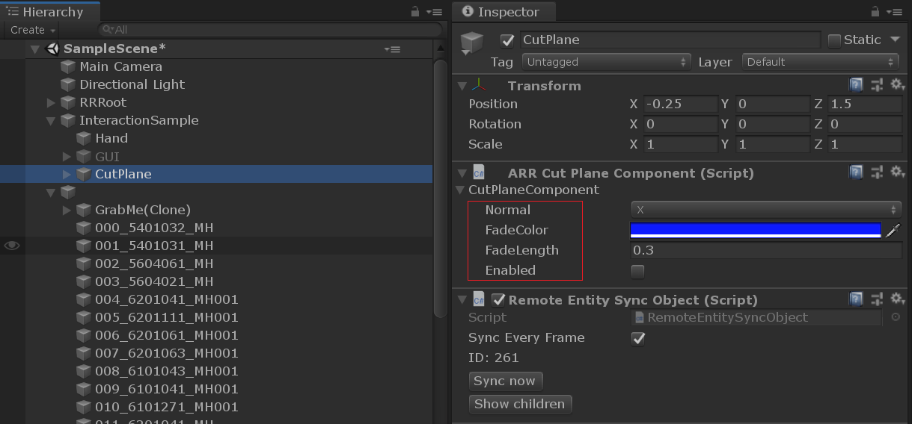

# Quickstart: Render a model with Unity

This quickstart covers how to run a Unity sample that renders a built-in model remotely, using the Azure Remote Rendering (ARR) service.

We won't go into detail about the ARR API itself or how to set up a Unity project from scratch. To learn how to set up a Unity project and adding relevant ARR API calls to the scripts, refer to [this tutorial](../tutorials/tutorial-1-unity-project-setup.md).

In this quickstart you will learn how to:
> [!div class="checklist"]
>
>- Set up your local development environment
>- Get and build the Unity sample app
>- Render a model in the Unity sample app

## Prerequisites

The following software must be installed:

- Windows SDK 10.0.18362.0 [(download)](https://developer.microsoft.com/windows/downloads/windows-10-sdk "Windows SDK")
- The latest version of Visual Studio 2017 [(download)](https://visualstudio.microsoft.com/vs/older-downloads/ "Visual Studio 2017")
- GIT [(download)](https://git-scm.com/downloads "GIT")
- Unity 2019.3 [(download)](https://unity3d.com/get-unity/download "Unity")
- The NuGet command line tool and Credential Provider (see below)

### Installing NuGet

1. Go to [https://dev.azure.com/arrClient/arrClient](https://dev.azure.com/arrClient/arrClient).
1. Click on **Artifacts**, change the dropdown to **ArrPackages**, and click on **Connect to feed**.
  
1. Click on **Nuget.exe**, then **Get the tools**
  
1. From the link under *Step 1* download the latest NuGet.exe (under *Windows x86 Commandline*)
1. Copy NuGet.exe to some folder and add the location to your `PATH` environment variable.
1. The page linked under *Step 2* describes how to install the NuGet Credential Provider. The [manual installation](https://github.com/microsoft/artifacts-credprovider#manual-installation-on-windows) is straight forward.
1. Open a **new** command prompt (if you had to change your `PATH` environment variable you cannot reuse an existing one).
1. Add the "arrPackages" feed with the following NuGet command:
  
    ```plaintext
    NuGet.exe sources Add -Name "ArrPackages" -Source "https://pkgs.dev.azure.com/arrClient/_packaging/ArrPackages/nuget/v3/index.json"
    ```

## Clone the sample app

Open a command prompt (type `cmd` in the Windows start menu) and change to a directory where you want to store your ARR project.

Run the following commands:

```plaintext
mkdir ARR
cd ARR
git clone https://dev.azure.com/arrClient/arrClient/_git/arrClient
```

The last command creates a directory called arrClient in your ARR directory containing the sample app and a copy of the documentation.

The sample Unity app is found in the subdirectory Unity/AzureRemoteRenderingSample but **do not open it yet**:
It expects Unity packages to be present in directory beside it, which you need to first obtain using NuGet.

## Getting the Unity NuGet packages

You need to use NuGet commands to pull the packages from the ARR depot – from the same command prompt window within the ARR directory, run the following:

```plaintext
cd arrClient\Unity
nuget install com.microsoft.azure.remote_rendering -ExcludeVersion
nuget install ScriptableRenderPipeline -ExcludeVersion
```

If the NuGet command results in authentication prompts, make sure you have NuGet and the NuGet Credential Provider installed as described in prerequisites above.

The two commands above will download NuGet packages, carrying Unity packages. This adds three directories to your ‘ARR/ArrClient/Unity’ folder:

- *AzureRemoteRenderingSample* - The sample project
- *com.microsoft.azure.remote_rendering* - The Unity package, which provides the client functionality of Azure Remote Rendering
- *ScriptableRenderPipeline* - A customized version of the Unity's ScriptableRenderPipeline.

## Rendering a model with the Unity sample project

Open the Unity Hub and add the sample project, which is the *ARR\arrClient\Unity\AzureRemoteRenderingSample* folder.
Open the project, if necessary, allow Unity to upgrade the project to your installed version.

The default model we render will be a built-in model provided by ARR. We will show how to convert a custom model using the ARR conversion service in the next quickstart.

### Enter your account info

Select *RemoteRendering > AccountInfo*  from the main menu. Enter your [account credentials](../azure/create-an-account.md).


You only need to set the **AccountDomain**, **AccountId**, and **AccountKey**. Leave the other fields empty.

> [!IMPORTANT]
> Azure Portal displays your account's domain only as *mixedreality.azure.com*. This is not sufficient for successfully connecting to ARR
> Set **AccountDomain** to `<region>.mixedreality.azure.com`, where `<region>` is **westus2** or **westeurope**.

These credentials will be saved to Unity's editor preferences.

### Create a session and view the default model

From Unity's asset browser, open the **SampleScene**. Then select the **RRRoot** node:



Selecting the **RRRoot** node shows the following properties in the Inspector panel:



Now press Unity's **Play** button to start the session. The session will undergo a series of state transitions. In the **Starting** state the remote VM is spun up, which may take several minutes. Upon success, it transitions to the **Ready** state. Now the session enters the **Connecting** state, where it tries to reach the rendering runtime on that VM.

> [!CAUTION]
> The sample app may not display all the states that it transitions through, and just display 'Disconnected' in the viewport. The actual state is written to Unity's console. Do not press stop unless an actual error is printed, it is normal for the VMs to take 2 to 3 minutes to spin up.

When successful, the sample finally transitions to the **Connected** state. Shortly after, a remotely rendered model will appear in the viewport.


Congratulations! You are now viewing a remotely rendered model!

Be aware that the rendered image will only appear in the 'Game' panel, not in the camera preview.

## Inspecting the scene

Once the remote rendering connection is running, the Inspector panel updates with additional status information:


You can now explore the scene graph by selecting the new node and clicking **Show children** in the Inspector.


There is a [cut plane](../sdk/features-cut-planes.md) object in the scene. Try enabling it in its properties and moving it around:


To synchronize transforms, either click **Sync now** or check the **Sync every frame** option. For component properties, just changing them is enough.



## Next steps

Advance to the next article to learn how to...

> [!div class="nextstepaction"]
> [Convert a model for rendering](quickstart-convert-model.md)
