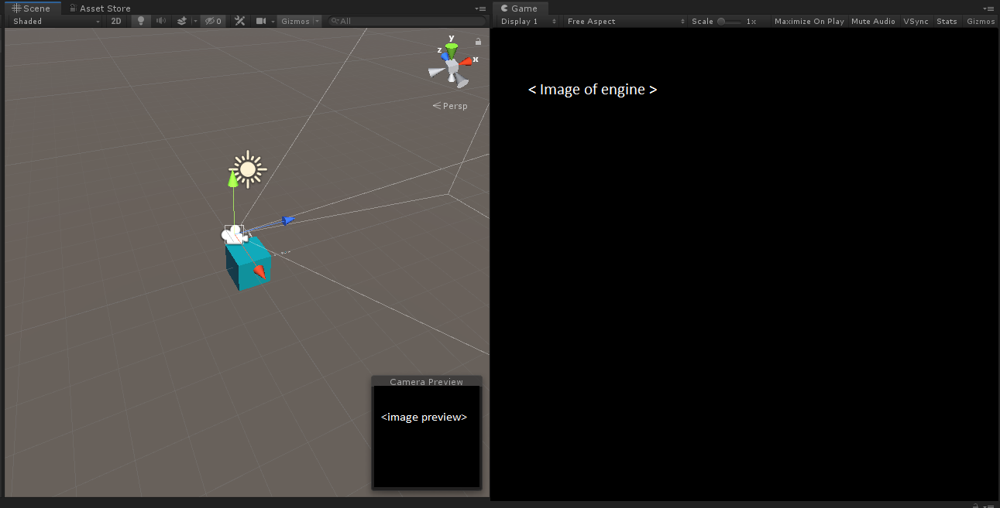
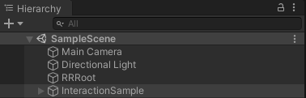
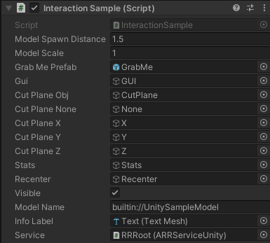
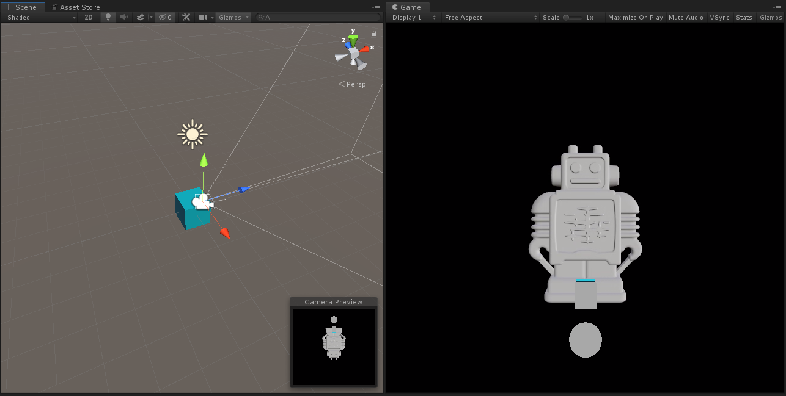

# Rendering your first model with Azure remote rendering

This is a tutorial describing the steps to set-up a workstation to work with Azure Remote Rendering (ARR) and render your first model using the ARR service.

You will learn how to:
- set up your local development environment
- get and build the Unity example app
- start a remote rendering session using the ARR rendering session REST API and render a model in the Unity example app
- convert your own models into the format used by ARR by using the Ingestion REST API

## Prerequisites
The following must be installed to complete this tutorial:
- GIT [(download)](https://git-scm.com/downloads "GIT")
- Windows SDK 10.0.18362.0 [(download)](https://developer.microsoft.com/en-us/windows/downloads/windows-10-sdk "Windows SDK")
- Unity 2019.1 [(download)](https://unity3d.com/get-unity/download "Unity")
- The nuget command-line and a companion credential manager:
  - These should be downloaded from the [https://dev.azure.com/arrClient/arrClient](https://dev.azure.com/arrClient/arrClient) site.
	- Click on Artifacts and change the dropdown from ArrClient to ArrPackages and click on ‘Connect to feed’.

	

	- Download the NuGet command line tool and the Credential Provider package from the link displayed.
	- Extract this to a directory of your choosing and add the location to your Path by editing the system environment variables.
    - Add the "arrPackages" feed with the following nuget command:
        `nuget.exe sources Add -Name "ArrPackages" -Source "https://pkgs.dev.azure.com/arrClient/_packaging/ArrPackages/nuget/v3/index.json"`
- Latest version of Visual Studio 2017 [(download)](https://visualstudio.microsoft.com/vs/older-downloads/ "Visual Studio 2017")
- Azure Storage Explorer [(download)](https://azure.microsoft.com/en-us/features/storage-explorer/ "Microsoft Azure Explorer")

## Clone the sample app

Open a command window (Windows Key then type CMD) and change to a directory somewhere of your choice.
For this guide, you can simply use a data drive.
Run the following commands:
  *	`mkdir ARR`
  *	`cd ARR`
  * `git clone https://dev.azure.com/arrClient/arrClient/_git/arrClient`

The last command creates a directory called arrClient in your ARR directory containing the sample app and a copy of the documentation.

The sample Unity app is found in the subdirectory Unity/AzureRemoteRenderingSample but **do not open it yet**:
It expects Unity packages to be present in directory beside it, which you need to first obtain using nuget.

## Getting the Unity nuget packages

You need to use NuGet commands to pull the packages from the ARR depot – from the same command prompt window within the ARR directory, run the following:
  * `cd arrClient\Unity`
  *	`nuget install com.microsoft.azure.remote_rendering -ExcludeVersion`
  *	`nuget install ScriptableRenderPipeline -ExcludeVersion`

If the nuget command results in authentication prompts make sure you are using the nuget + credential provider installation from the prerequisites steps above.

The two commands above will download nuget packages carrying Unity packages.
You will now have an ‘ARR/ArrClient/Unity’ directory contains three folders:
  * AzureRemoteRenderingSample - The sample project
  * com.microsoft.azure.remote_rendering - The Unity package, which provides the client functionality of Azure Remote Rendering
  * ScriptableRenderPipeline - A customized version of the Unity's ScriptableRenderPipeline.

## Rendering a first model with the Unity example project

The first model we render will be a builtin model provided by ARR - we will show how to convert a model using the ARR Ingestion service in the next section.

Open the Unity Hub and add the sample project, which is the ARR\arrClient\Unity\AzureRemoteRenderingSample folder.
Open the project, if necessary allowing Unity to upgrade the project to your installed version.

### Enter your account info as a one time step

Select the RemoteRendering dropdown menu and open the AccountInfo window. Enter your account credentials.


These credentials will be saved to Unity's editor preferences. If the sample should be run against a new account
then the information must be reentered.

### Create a session and view the default model

When the project opens, open the SampleScene scene, and select the **RRRoot** node:


Select 'Use Session' as the runtime mode. By default, this will create a session for you using the account the information provided in the Account window. An existing session (such as those created with the RESTful API) can also be opened by selecting the 'UseExistingSessionId' toggle.


If the account has been correctly set up, then pushing play should update the ARR Service Unity script with the current state of the session.


The session will undergo a series of state transitions. The session will first start as Starting. This will take a number of minutes before transitioning to Ready. Once Ready, the runtime can connect to the Ready session. It will enter the Connecting state and, once successfully connected you should see a remotely rendered Engine as shown below - congratulations, you are viewing a remotely rendered model!



## Rendering your own model
So far you have seen a remotely rendered engine model provided by us.
In order to render your own model, you will need to convert it into the model format the ARR rendering session can use.
This is done by calling the ARR ingestion REST API. We call this conversion process **Ingestion**.

ARR supports the ingestion of FBX, GLTF and GLB files.
The ingestion API can consume models from Azure blob storage and will write the ingested model back to a provided Azure blob storage container.
You will need to have:
- An Azure Subscription
- A Storage v2 account in your subscription
- A blob storage container for your input model
- A blob storage container for your output data

## Azure setup
For this guide, we will describe how to use Azure Remote Rendering with a free Azure account.
The same setup will apply if you are an existing user.

Go to  [https://azure.microsoft.com/en-us/get-started/](https://azure.microsoft.com/en-us/get-started/) or if you already have an account go to [https://ms.portal.azure.com/#home](https://ms.portal.azure.com/#home).
If you do not have an Azure account, then click on the free account option on the home page and follow those instructions.
Once complete, you will be forwarded to the portal page in the second link.

First, a Storage Account must be created so this will be the first task to complete.
From the Portal Home Page, there is a Storage accounts link on the left-hand side of the page.
Click this.
This next screen will look slightly different. If you are already an active Azure client, however for this guide we will stick with the free account.
You will see a list of all Storage accounts under your subscription or none in this case.

Press the + Add button and you will be presented with the following screen to set up a new storage account.


  *	Create a new Resource Group from the link below the drop-down box and name this **ARR_Tutorial**
  *	For the Storage account name, enter **arrtutorialstorage**
  *	Select a location close to you
  *	Performance can be set to ‘Standard’
  *	Account kind can be set to ‘StorageV2 (general purpose v2)’
  *	Replication set to ‘Read-access geo-redundant storage (RA-GRS)’
  *	Access tier set to ‘Hot’

You must now add quick access blob containers – you will need one for input and one for output, so creating those is the next step.

## Blob storage creation
Make sure you are within the arrtutorialstorage account that you created in the last step and note there is an option for Blob Services on the dashboard page.
Click this, and you will be taken to the page that will allow us to set up our blob storage accounts.

Press the + Container button to create your first blob storage container.
Use the following settings when creating it:
  * Name = arrinput
  * Public access level = Private

Once the container has been created, repeat the process by clicking the + Container button, but this time use the following settings:
  * Name = arroutput
  * Public access level = Private

You should now have two blob storage containers:


At this point, switch to using the Microsoft Azure Storage Explorer tool – this provides information in one central location and makes it easier to configure Azure Remote Rendering.
Once you sign in using your Microsoft Azure account created in the previous steps, you will be presented with the following.
(You may need to expand a few items in the tree to see everything.)


As you can see from the image above, the tool displays all the information needed in setting up and linking our Azure Storage accounts to the Azure Remote Rendering tools, via the properties menu.
It also will allow you to generate sharable links, which will be needed later in the process.
For now, the next step is to configure a .json file so that the script can upload and ingest your model.

## Ingestion.ps1 settings in arrconfig.json

Similar to the process of starting a rendering session, we provide a script to launch an ingestion.
It is located in `Scripts` and is called `Ingestion.ps1`.

`Ingestion.ps1` uses `Scripts\arrconfig.json` to configure itself. First open `Scripts\arrconfig.json` in a text editor of your choice.
In addition to the values for spinning up the rendering session you also need to provide values for the following properties:

The `azureStorageSettings` section contains values used by the Ingestion.ps1 script. You need to fill it out if you want to upload a model to Azure Blob Storage and convert it by using our model ingestion service.

* `azureStorageSettings.azureSubscriptionId` :  Open Azure Storage Explorer and click on the user icon on the left-hand side. Scroll down the list of subscriptions until you find the account used for this tutorial (in this case, the free trial account). **The SubscriptionID is located under the account name**

* `azureStorageSettings.resourceGroup` :  **ARR_Tutorial** (The resource group created at the start).
* `azureStorageSettings.storageAccountName` : **arrtutorialstorage** (The Storage account created above).
* `azureStorageSettings.blobInputContainerName` : **arrinput** (The blob input container created above).
* `azureStorageSettings.blobOutputContainerName`: **arroutput** (The blob output container created above).
* `modelSettings.modelLocation` : the local file path of the model you want to convert with the ingestion service. In this example, there is a robot.fbx file at the path `D:\\tmp\\robot.fbx`.
Make sure to properly escape "\\" in the path using "\\\\".

Here is an example `arrconfig.json` file for a `robot.fbx` at the path mentioned above. Change it to point to a local file you want to convert using the ARR ingestion service.
```json
{
    "accountSettings": {
        "arrAccountId": "8*******-****-****-****-*********d7e",
        "arrAccountKey": "R***************************************l04=",
        "region": "westus2"
    },
    "renderingSessionSettings": {
        "vmSize": "small",
        "maxLeaseTime": "1:00:00"
    },
    "azureStorageSettings": {
        "azureSubscriptionId": "7*******-****-****-****-*********39b",
        "resourceGroup": "ARR_TUTORIAL",
        "storageAccountName": "arrtutorialstorage",
        "blobInputContainerName": "arrinput",
        "blobOutputContainerName": "arroutput"
    },
    "modelSettings": {
        "modelLocation": "D:\\tmp\\robot.fbx"
    }
}
```

## Running the asset conversion script
You are now ready to have the script upload your model, call the ingestion REST API and retrieve a link to the ingested model in your output container.

Open a powershell window. Make sure you have the [Azure Powershell](https://docs.microsoft.com/en-us/powershell/azure/) package installed. To install the package, run the following in powershell with admin rights:
```powershell
PS> $ Install-Module -Name Az -AllowClobber
```

## Make sure you are logged into your subscription
If you want to use the asset ingestion service and upload files to Azure Blob Storage you will need to log into your subscription.
In a powershell window (does not need admin rights):
```powershell
PS> $ Connect-AzAccount -Subscription "<your Azure subscription id>"
```

## Run Ingestion.ps1
Make sure you are within the `\ARR\arrClient\Scripts` directory, and run the script with `.\Ingestion.ps1`.

You should see something like this:


The ingestion script generates a Shared Access Signature (SAS) URI for the ingested model for you to use.
Copy the SAS URI now. Note that this URI will be only valid for 24 h - after that you can create a SAS URI yourself by following these steps without reingesting the model.

Open Azure Storage Explorer and navigate to the arroutput blob storage container.
You will find the ingested model ezArchive file in there.
Right click on this and select Get Shared Access Signature:


Set the expiry date to a date you would like and press Create.
Copy the URL link that is generated.

## See your model rendered in the sample application

Return to the SampleScene in Unity and select the **InteractionSample** node:



You need to point the "Model Name" property at your ingested model:



Paste the link you obtained from running Ingestion.ps1 or from the Azure Storage Explorer into the Model Name property and click play again.
You might need to start a new session if your previous session has timed out.


