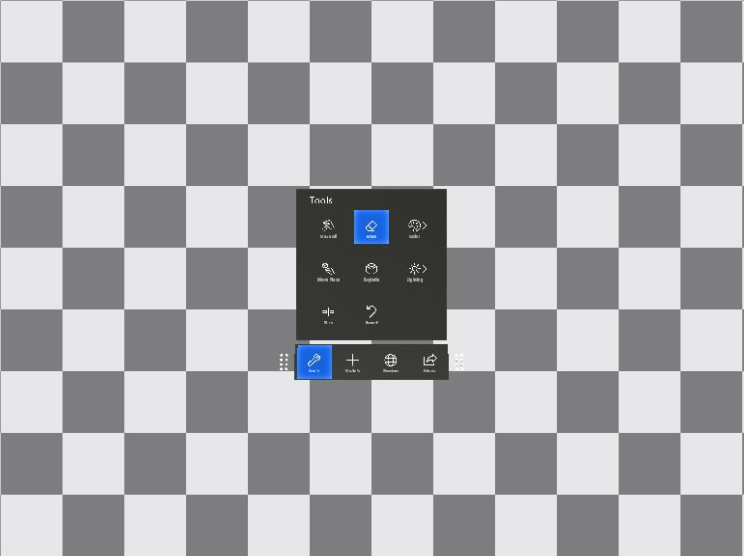

# Server sizes

Azure Remote Rendering is available in two server configurations: `Standard` and `Premium`.

## Primitive limits

A primitive is either a single triangle (in triangular meshes) or a single point (in point cloud meshes). Triangular meshes can be instantiated together with point clouds, in which case the sum of all points and triangles in the session are counted against the limit.

### Standard size

Remote Rendering with `Standard` size server has a maximum scene size of 20 million primitives. When the renderer on a 'Standard' server size hits this limitation, it switches rendering to a checkerboard background:



### Premium size

Remote Rendering with `Premium` size doesn't enforce a hard maximum, but performance may be degraded if your content exceeds the rendering capabilities of the service. Furthermore, for triangular meshes and unlike point clouds, the available amount of graphics memory is a hard limit. It's not possible to map the amount of graphics memory to a specific number of triangles, because there are many contributing factors that depend on the source mesh:

* number and resolution of textures,
* amount of unique geometry versus sub-mesh instantiation inside the mesh (see also [instancing objects](../how-tos/conversion/configure-model-conversion.md#instancing)),
* [vertex streams](../how-tos/conversion/configure-model-conversion.md#vertex-format) being used.

For [point clouds](../overview/features/point-cloud-rendering.md) there is no real limit since point cloud assets use the [data streaming approach](../overview/features/point-cloud-rendering.md#point-cloud-data-streaming). With data streaming, the renderer automatically manages the memory budget on the graphics card, based on the actual visible geometry.

## Specify the server size

The desired type of server configuration has to be specified at rendering session initialization time. It can't be changed within a running session. The following code examples show the place where the server size must be specified:

```cs
async void CreateRenderingSession(RemoteRenderingClient client)
{
    RenderingSessionCreationOptions sessionCreationOptions = default;
    sessionCreationOptions.Size = RenderingSessionVmSize.Standard; // or  RenderingSessionVmSize.Premium

    CreateRenderingSessionResult result = await client.CreateNewRenderingSessionAsync(sessionCreationOptions);
    if (result.ErrorCode == Result.Success)
    {
        RenderingSession session = result.Session;
        // do something with the session
    }
}
```

```cpp
void CreateRenderingSession(ApiHandle<RemoteRenderingClient> client)
{
    RenderingSessionCreationOptions sessionCreationOptions;
    sessionCreationOptions.Size = RenderingSessionVmSize::Standard; // or  RenderingSessionVmSize::Premium

    client->CreateNewRenderingSessionAsync(sessionCreationOptions, [](Status status, ApiHandle<CreateRenderingSessionResult> result) {
        if (status == Status::OK && result->GetErrorCode() == Result::Success)
        {
            ApiHandle<RenderingSession> session = result->GetSession();
            // do something with the session
        }
    });
}

```

For the [example PowerShell scripts](../samples/powershell-example-scripts.md), the desired server size has to be specified inside the `arrconfig.json` file:

```json
{
  "accountSettings": {
    ...
  },
  "renderingSessionSettings": {
    "vmSize": "<standard or premium>",
    ...
  },
```

### How the renderer evaluates the number of primitives

The number of primitives that are considered for the limitation test are the number of primitives (triangles and points) that are actually passed to the renderer. This geometry is typically the sum of all instantiated meshes, but there are also exceptions. The following geometry is **not included**:
* Loaded model instances that are fully outside the view frustum.
* Models or model parts that are switched to invisible, using the [hierarchical state override component](../overview/features/override-hierarchical-state.md).

Accordingly, it's possible to write an application that targets the `standard` size that loads multiple models with a primitive count close to the limit for every single model. When the application only shows a single model at a time, the checkerboard isn't triggered.

### How to determine the number of primitives

There are two ways to determine the number of primitives of a model or scene that contribute to the budget limit of the `standard` configuration size:
* On the model conversion side, retrieve the [conversion output json file](../how-tos/conversion/get-information.md), and check the `numFaces` entry in the [*inputStatistics* section](../how-tos/conversion/get-information.md#the-inputstatistics-section). This number denotes the triangle count in triangular meshes and number of points in point clouds respectively.
* If your application is dealing with dynamic content, the number of rendered primitives can be queried dynamically during runtime. Use a [performance assessment query](../overview/features/performance-queries.md#performance-assessment-queries) and check for the sum of the values in the two members `PolygonsRendered` and `PointsRendered` in the `PerformanceAssessment` struct. The `PolygonsRendered` / `PointsRendered` field will be set to `bad` when the renderer hits the primitive limitation. The checkerboard background is always faded in with some delay to ensure user action can be taken after this asynchronous query. User action can, for instance,  be hiding or deleting model instances.

## Pricing

For a detailed breakdown of the pricing for each type of configuration, refer to the [Remote Rendering pricing](https://azure.microsoft.com/pricing/details/remote-rendering) page.

## Next steps
* [Example PowerShell scripts](../samples/powershell-example-scripts.md)
* [Model conversion](../how-tos/conversion/model-conversion.md)

