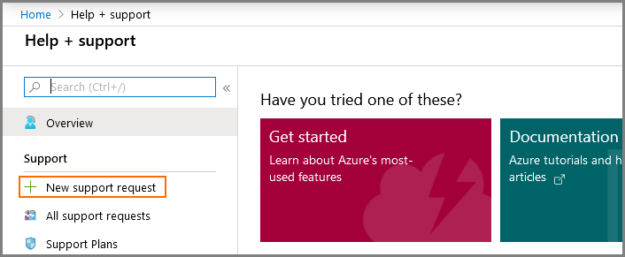
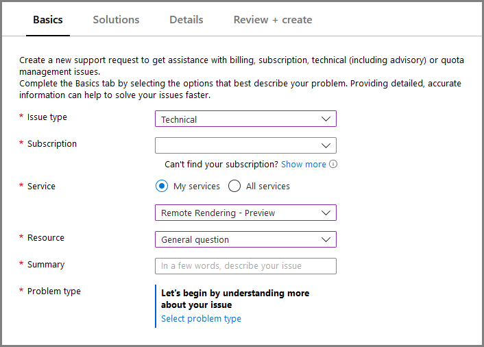

# Azure Remote Rendering support options

## Open a tech support ticket

To open a technical support ticket within the Azure portal for Azure Remote Rendering:

1. Open [Azure portal](https://portal.azure.com)

1. Select the question mark icon from the menu bar, then click **Help + support**.

    

1. Select **New support request**.

    

1. Fill out the fields:

    * **Issue type**: `Technical`
    * **Service**: `Remote Rendering`

    

1. Click **Next: Solutions** at the bottom of the page.

1. Fill out the following form as precise and detailed as possible.

1. Review and submit the support request.

## Community support

For support from the user community, see [Azure Remote Rendering on Stack Overflow](https://stackoverflow.com/questions/tagged/azure-remote-rendering).

## Provide documentation feedback

On the bottom of each documentation article, you can open a GitHub issue to provide feedback for that page.

## Provide product feedback

To provide feedback, share an idea or suggestion for Azure Remote Rendering, or vote on the ideas that others have submitted, visit the [Azure Remote Rendering Feedback Forum](https://feedback.azure.com/d365community/forum/46aa4cc0-fd24-ec11-b6e6-000d3a4f07b8).

## Microsoft Q&A

For quick and reliable answers on your technical product questions from Microsoft Engineers, Azure Most Valuable Professionals (MVPs), or our expert community, engage with us on [Microsoft Q&A](/answers/topics/azure-remote-rendering.html), Azure’s preferred destination for community support.

## Next steps

* [Troubleshoot](troubleshoot.md)
