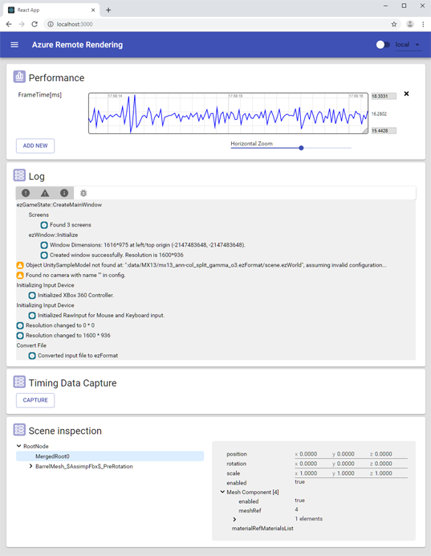
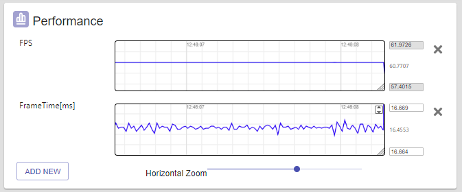
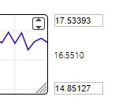
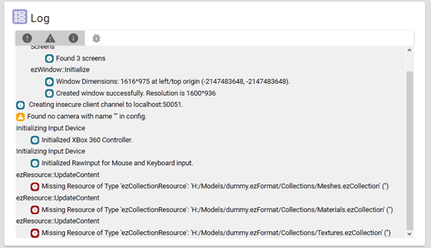
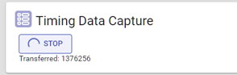
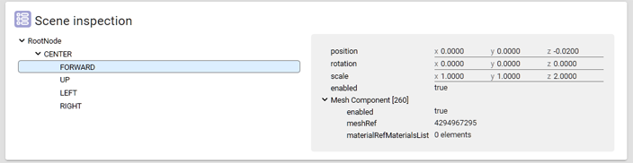
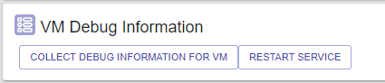
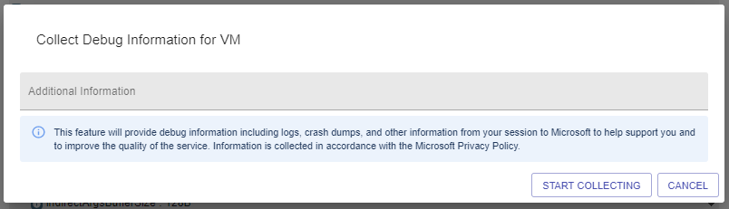
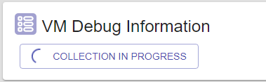
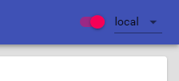

# The ArrInspector inspection tool

The ArrInspector is a web-based tool used to inspect a running Azure Remote Rendering session. It's meant to be used for debugging purposes, to inspect the structure of the scene being rendered, show the log messages, and monitor the live performance on the server.

## Connecting to the ArrInspector

Once you obtain the hostname (ending in `mixedreality.azure.com`) of your Remote Rendering server, connect using `ConnectToArrInspectorAsync`. See [Connect to ARR inspector](../../how-tos/frontend-apis.md#connect-to-arr-inspector). This function creates a *StartArrInspector.html* page on the device on which the application runs. To launch ArrInspector, open that file with a browser on a PC. The file is only valid for 24 hours.

If the app that calls `ConnectToArrInspectorAsync` is already running on a PC:

* If you're using the Unity integration, it may get launched automatically for you.
* Otherwise, you'll find the file in *User Folders\\LocalAppData\\[your_app]\\AC\\Temp*.

If the app is running on a HoloLens:

1. Access the HoloLens using the [Windows Device Portal](/windows/mixed-reality/using-the-windows-device-portal).
1. Go to *System > File Explorer*.
1. Navigate to *User Folders\\LocalAppData\\[your_app]\\AC\\Temp*.
1. Save *StartArrInspector.html* to your PC.
1. Open *StartArrInspector.html* to load the session's ArrInspector.

## The Performance panel

This panel shows graphs of all per-frame performance values exposed by the server. The values currently include the frame time, FPS, CPU and memory usage, memory stats like overall RAM usage, object counts, etc.

To visualize one of these parameters, select the **Add New** button and select one of the available values shown in the dialog box. This action adds a new scrolling chart to the panel, tracing the values in real time. On its right you can see the *minimum*, *maximum* and *current* value.

You can pan the graph, by dragging its content with the mouse, however, panning horizontally is only possible when ArrInspector is in the paused state.

Holding **Ctrl** while dragging, allows you to zoom. Horizontal zoom can also be controlled with the slider at the bottom.

The vertical range is by default computed based on the values currently displayed, and min and max values are shown in the text-boxes on the right. When the values are set manually, either by typing them directly into the textbox, or by panning/zooming, the graph uses those values. To restore the automatic vertical framing, select  the icon in the top-right corner.

## The Log panel

The Log panel shows a list of log messages generated on the server side. On connection it shows up to 200 previous log messages, and prints new ones as they happen.

You can filter the list based on the log type `[Error/Warning/Info/Debug]` using the buttons at the top.
:::image type="icon" source="./media/log-filter.png" alt-text="Log Filter Buttons":::

## The Timing Data Capture panel

This panel is used to capture timing information from the server and download it. The file uses the [Chrome Tracing JSON format](https://docs.google.com/document/d/1CvAClvFfyA5R-PhYUmn5OOQtYMH4h6I0nSsKchNAySU/edit). To inspect the data, open Chrome on the URL `Chrome://tracing` and drag-and-drop the downloaded file into the page. The timing data is continuously collected in a fixed-size ring-buffer. When written out, the capture only includes information about the immediate past, meaning a couple of seconds to few minutes.

## The Scene Inspection panel

The Scene Inspection panel shows the structure of the rendered scene. The object hierarchy is on the left, the content of the selected object is on the right. The panel is read-only and is updated in real time.

## The VM Debug Information panel

The VM Debug Information panel offers some debug functionality.

### Restart service

The **Restart Service** button restarts the runtime on the virtual machine that ArrInspector is connected to. Any attached client gets disconnected and the ArrInspector page must be reloaded to connect to the restarted service.

### Collect debug information

The **Collect Debug Information for VM** button allows you to trigger the Remote Rendering instance to collect debug information on the virtual machine:

Debug information helps the Azure Remote Rendering team to analyze any issues that occur in a running Remote Rendering instance. The dialog box has a text field to provide other details, for example steps to reproduce an issue.

After you select **Start Collecting**, the dialog box closes and the collection process begins. Collecting the information on the virtual machine can take a few minutes.

Once the collection is finished, you'll receive a notification in the ArrInspector window. This notification contains an ID for this particular collection. Be sure to save this ID to pass it on to the Azure Remote Rendering team.

> [!IMPORTANT]
> You can't download or otherwise access virtual machine debug information. Only the Azure Remote Rendering team has access to the collected data. You need to contact us and send the collection ID for us to investigate the issue.

## Pause mode

In the top-right corner, a switch allows you to pause live update of the panels. This mode can be useful to carefully inspect a specific state.

When re-enabling live updates, all panels are reset.
