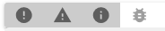
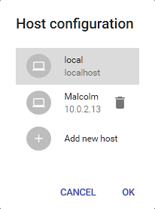
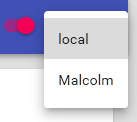

# The ArrInspector inspection tool

The ArrInspector is a web-based tool used to inspect a running Azure Remote Rendering session. It is meant to be used for debugging purposes, to inspect the structure of the scene being rendered, show the log messages, and monitor the live performance on the server.

## Connecting to the ArrInspector

Once you obtain the hostname (ending in `mixedreality.azure.com`) of your ARR server, connect using [ConnectToArrInspectorAsync](../../how-tos/frontend-apis.md#connect-to-arr-inspector). This function creates a `StartArrInspector.html` on the device on which the application is running. To launch ArrInspector, open that file with a browser (Edge, Firefox, or Chrome) on a PC. The file is only valid for 24 hours.

If the app that calls `ConnectToArrInspectorAsync` is already running on a PC:

* If you are using the Unity integration, it may get launched automatically for you.
* Otherwise, you will find the file in *User Folders\\LocalAppData\\[your_app]\\AC\\Temp*.

If the app is running on a HoloLens:

1. Access the HoloLens using the [Windows Device Portal](https://docs.microsoft.com/windows/mixed-reality/using-the-windows-device-portal).
1. Go to *System > File Explorer*.
1. Navigate to *User Folders\\LocalAppData\\[your_app]\\AC\\Temp*.
1. Save *StartArrInspector.html* to your PC.
1. Open *StartArrInspector.html* to load the session's ArrInspector.

## The Performance panel

This panel shows graphs of all per-frame performance values exposed by the server. The values currently include the frame time, FPS, CPU and memory usage, memory stats like overall RAM usage, object counts, etc.

To visualize one of these parameters, click the **Add New** button and select one of the available values shown in the dialog. This action adds a new scrolling chart to the panel, tracing the values in real time. On its right you can see the *minimum*, *maximum* and *current* value.

You can pan the graph, by dragging its content with the mouse, however, panning horizontally is only possible when ArrInspector is in the paused state.

Holding CTRL while dragging, allows you to zoom. Horizontal zoom can also be controlled with the slider at the bottom.

The vertical range is by default computed based on the values currently displayed, and min and max values are shown in the text-boxes on the right. When the values are set manually, either by typing them directly into the textbox, or by panning/zooming, the graph will use those values. To restore the automatic vertical framing, click  the icon in the top-right corner.

## The Log panel

The log panel shows a list of log messages generated on the server side. On connection it will show up to 200 previous log messages, and will print new ones as they happen.

You can filter the list based on the log type `[Error/Warning/Info/Debug]` using the buttons at the top.

## The Timing Data Capture panel

This panel is used to capture timing information from the server and download it. The file uses the [Chrome Tracing JSON format](https://docs.google.com/document/d/1CvAClvFfyA5R-PhYUmn5OOQtYMH4h6I0nSsKchNAySU/edit). To inspect the data, open Chrome on the URL `Chrome://tracing` and drag-and-drop the downloaded file into the page. The timing data is continuously collected in a fixed-size ring-buffer. When written out, the capture only includes information about the immediate past, meaning a couple of seconds to few minutes.

## The Scene Inspection panel

This panel shows the structure of the rendered scene. The object hierarchy is on the left, the content of the selected object is on the right. The panel is read-only and is updated in real time.

## The VM Debug Information panel

This panel offers some debug functionality.

### Restart service

The **Restart Service** button restarts the runtime on the virtual machine that arrInspector is connected to. Any attached client will get disconnected and the arrInspector page must be reloaded to connect to the restarted service.

### Collect debug information

The **Collect Debug Information for VM** button opens a dialog that allows you to trigger the ARR instance to collect debug information on the VM:

Debug information helps the Azure Remote Rendering team to analyze any issues that occur in a running ARR instance. The dialog has a text field to provide additional details, for example steps to reproduce an issue.

After clicking the **Start Collecting** button, the dialog will close and the collection process begins. Collecting the information on the VM can take a few minutes.

Once the collection is finished, you will receive a notification in the ArrInspector window. This notification contains an ID that identifies this particular collection. Be sure to save this ID to pass it on to the Azure Remote Rendering team.

> [!IMPORTANT]
> You can't download or otherwise access VM debug information. Only the Azure Remote Rendering team has access to the collected data. You need to contact us and send the collection ID along, for us to investigate the issue you are seeing.

## Pause mode

In the top-right corner, a switch allows you to pause live update of the panels. This mode can be useful to carefully inspect a specific state.

When re-enabling live update, all panels are reset.

## Host configuration

By default the tool connects to the ARR server that is running on the same host serving the ArrInspector. However, you can configure it to inspect another server, assuming it's running an ARR instance with the tooling port open.

To do so, access the main menu on the left of the header bar and select *Host configuration*. Click **Add new host**, and enter the name and hostname. For *hostname* only use the hostname ending in `.mixedreality.azure.com`, don't include `http://` or a port.

To quickly switch from one host to another, use the drop-down at the top right.

The host list is stored in the browser local storage, so it will be preserved when reopening the same browser.
