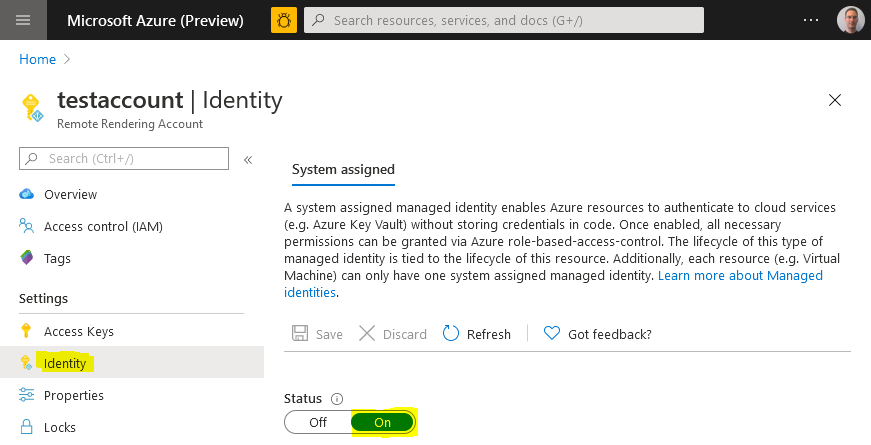
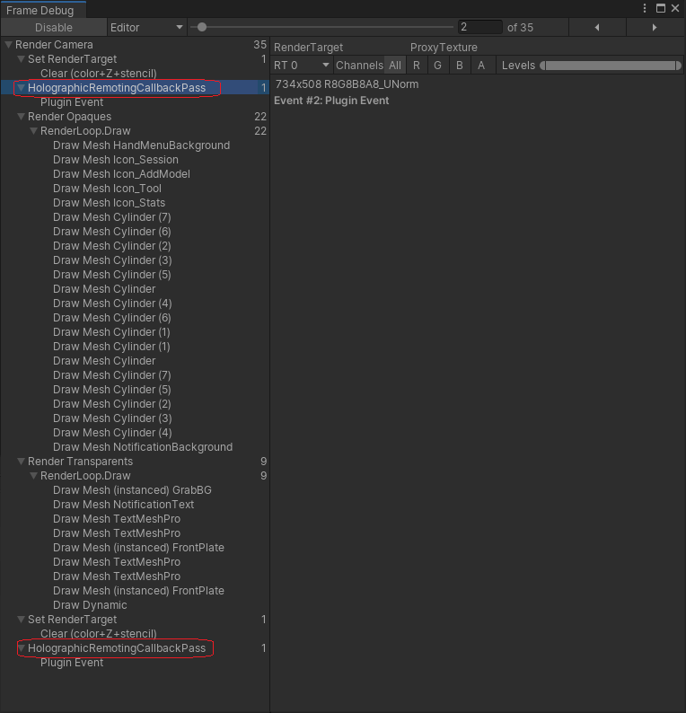

# Troubleshoot

This page lists common issues interfering with Azure Remote Rendering, and ways to resolve them.

## Client can't connect to server

Make sure that your firewalls (on device, inside routers, etc.) don't block the ports mentioned in the [System requirements](../overview/system-requirements.md#network-firewall).

## Failed to load model

When loading a model (for example, via a Unity sample) fails although the blob configuration is correct, it's likely that the blob storage isn't properly linked. Proper linking is explained in the [linking of a storage account](../how-tos/create-an-account.md#link-storage-accounts) chapter. After correct linking it can take up to 30 minutes until the changes take effect.

## Can't link storage account to ARR account

Sometimes during [linking of a storage account](../how-tos/create-an-account.md#link-storage-accounts) the Remote Rendering account isn't listed. To fix this issue, go to the ARR account in the Azure portal and select **Identity** under the **Settings** group on the left. Make sure **Status** is set to **On**.


## Error '`Disconnected: VideoFormatNotAvailable`'

Check that your GPU supports hardware video decoding. See [Development PC](../overview/system-requirements.md#development-pc).

If you're working on a laptop with two GPUs, it's possible that the GPU you're running on by default, doesn't provide hardware video decoding functionality. If so, try to force your app to use the other GPU. Changing the used GPU is often possible in the GPU driver settings.

## Retrieve session/conversion status fails

Sending REST API commands too frequently cause the server to throttle and return failure eventually. The HTTP status code in the throttling case is 429 ("too many requests"). As a rule of thumb, there should be a delay of **5-10 seconds between subsequent calls**.

Note this limit not only affects the REST API calls when called directly but also their C#/C++ counterparts, such as `Session.GetPropertiesAsync`, `Session.RenewAsync`, or `Frontend.GetAssetConversionStatusAsync`. Some functions also return information when it's save to retry. For example, `RenderingSessionPropertiesResult.MinimumRetryDelay` specifies how many seconds to wait before attempting another check. When available, using such a returned value is best, as it allows you to do checks as often as possible, without getting throttled.

If you experience server-side throttling, change the code to do the calls less frequently. The server will reset the throttling state every minute, so it's safe to rerun the code after a minute.

## H265 codec not available

There are two reasons why the server might refuse to connect with a `codec not available` error.

**The H265 codec isn't installed:**

First make sure to install the **HEVC Video Extensions** as mentioned in the [Software](../overview/system-requirements.md#software) section of the system requirements.

If you still encounter problems, make sure that your graphics card supports H265, and you have the latest graphics driver installed. See the [Development PC](../overview/system-requirements.md#development-pc) section of the system requirements for vendor-specific information.

**The codec is installed, but can't be used:**

The reason for this issue is an incorrect security setting on the DLLs. This problem doesn't manifest when trying to watch videos encoded with H265. Reinstalling the codec doesn't fix the problem either. Instead, perform the following steps:

1. Open a **PowerShell with admin rights** and run

    ```PowerShell
    Get-AppxPackage -Name Microsoft.HEVCVideoExtension*
    ```
    (Note the '*' is because for some package installation versions the name is `HEVCVideoExtensions` as opposed to `HEVCVideoExtension`).
    That command should output the `InstallLocation` of the codec, something like:
  
    ```cmd
    InstallLocation   : C:\Program Files\WindowsApps\Microsoft.HEVCVideoExtension_1.0.23254.0_x64__5wasdgertewe
    ```

1. Open that folder in Windows Explorer
1. There should be an **x86** and an **x64** subfolder. Right-click on one of the folders and choose **Properties**
    1. Select the **Security** tab and select the **Advanced** settings button
    1. Select **Change** for the **Owner**
    1. Type **Administrators** into the text field
    1. Select **Check Names** and **OK**
1. Repeat the steps above for the other folder
1. Also repeat the steps above on each DLL file inside both folders. There should be four DLLs altogether.

To verify that the settings are now correct, do the following steps for each of the four DLLs:

1. Select **Properties > Security > Edit**
1. Go through the list of all **Groups / Users** and make sure each one has the **Read & Execute** right set (the checkmark in the **allow** column must be ticked)

## Low video quality

The video quality can be compromised either by network quality or the missing H265 video codec.

* See the steps to [identify network problems](#unstable-holograms).
* See the [system requirements](../overview/system-requirements.md#development-pc) for installing the latest graphics driver.

## Video recorded with MRC doesn't reflect the quality of the live experience

A video can be recorded on HoloLens through [Mixed Reality Capture (MRC)](/windows/mixed-reality/mixed-reality-capture-for-developers). However the resulting video has worse quality than the live experience for two reasons:
* The video framerate is capped at 30 Hz as opposed to 60 Hz.
* The video images don't go through the [late stage reprojection](../overview/features/late-stage-reprojection.md) processing step, so the video appears to be choppier.

Both are inherent limitations of the recording technique.

## Black screen after successful model loading

If you're connected to the rendering runtime and loaded a model successfully, but only see a black screen afterwards, then this can have a few distinct causes.

We recommend testing the following things before doing a more in-depth analysis:

* Is the H265 codec installed? Although there should be a fallback to the H264 codec, we have seen cases where this fallback didn't work properly. See the [system requirements](../overview/system-requirements.md#development-pc) for installing the latest graphics driver.
* When using a Unity project, close Unity, delete the temporary *library* and *obj* folders in the project directory and load/build the project again. In some cases cached data caused the sample to not function properly for no obvious reason.

If these two steps didn't help, it's required to find out whether video frames are received by the client or not. This can be queried programmatically as explained in the [server-side performance queries](../overview/features/performance-queries.md) chapter. The `FrameStatistics struct` has a member that indicates how many video frames have been received. If this number is larger than 0 and increasing over time, the client receives actual video frames from the server. So, it must be a problem on the client side.

## Scaling value in the conversion settings isn't applied to the model

If a model shows up in Showcase or Quickstart with unchanged scaling albeit a scaling is applied as part of the [conversion settings' geometry parameters](../how-tos/conversion/configure-model-conversion.md#geometry-parameters), then this is probably because of the sample's built-in auto-scaling feature. That is, the sample scales the model for best fit into the view frustum, regardless of its input scaling.

In case of Showcase, auto-scaling can be disabled by specifying a `MaxSize` of zero in the model's `Transform` section inside the models.xml file. This data-driven approach requires that the model is loaded through the XML in the first place, because in all other cases the `MaxSize` defaults to 1 meter. There is also a `MinSize` property which defaults to 0.5 meter, causing all smaller models to be scaled up.
For more information about ways to load models in Showcase, see the [Adding 3D Model Assets to ARR Showcase](https://github.com/Azure/azure-remote-rendering/tree/master/Unity/Showcase/.documents/adding-3d-model-assets-to-application.md) chapter of the Showcase documentation.

### Common client-side issues

**The model exceeds the limits of the selected VM, specifically the maximum number of primitives:**

See specific [server size limits](../reference/limits.md#overall-number-of-primitives).

**The model is not inside the camera frustum:**

In many cases, the model is displayed correctly but located outside the camera frustum. A common reason is that the model has been exported with a far off-center pivot so it's clipped by the camera's far clipping plane. It helps to query the model's bounding box programmatically and visualize the box with Unity as a line box or print its values to the debug log.

Furthermore the conversion process generates an [output json file](../how-tos/conversion/get-information.md) alongside with the converted model. To debug model positioning issues, it's worth looking at the `boundingBox` entry in the [outputStatistics section](../how-tos/conversion/get-information.md#the-outputstatistics-section):

```JSON
{
    ...
    "outputStatistics": {
        ...
        "boundingBox": {
            "min": [
                -43.52,
                -61.775,
                -79.6416
            ],
            "max": [
                43.52,
                61.775,
                79.6416
            ]
        }
    }
}
```

The bounding box is described as a `min` and `max` position in 3D space, in meters. So a coordinate of 1000.0 means it's 1 kilometer away from the origin.

There can be two problems with this bounding box that lead to invisible geometry:
* **The box can be far off-center**, so the object is clipped altogether due to far plane clipping. The `boundingBox` values in this case would look like this: `min = [-2000, -5,-5], max = [-1990, 5,5]`, using a large offset on the x-axis as an example here. To resolve this type of issue, enable the `recenterToOrigin` option in the [model conversion configuration](../how-tos/conversion/configure-model-conversion.md).
* **The box can be centered but be orders of magnitude too large**. That means that albeit the camera starts in the center of the model, its geometry is clipped in all directions. Typical `boundingBox` values in this case would look like this: `min = [-1000,-1000,-1000], max = [1000,1000,1000]`. The reason for this type of issue is usually a unit scale mismatch. To compensate, specify a [scaling value during conversion](../how-tos/conversion/configure-model-conversion.md#geometry-parameters) or mark up the source model with the correct units. Scaling can also be applied to the root node when loading the model at runtime.

**The Unity render pipeline doesn't include the render hooks:**

Azure Remote Rendering hooks into the Unity render pipeline to do the frame composition with the video, and to do the reprojection. To verify that these hooks exist, open the menu *:::no-loc text="Window > Analysis > Frame debugger":::*. Enable it and make sure there are two entries for the `HolographicRemotingCallbackPass` in the pipeline:



To fix, make sure the provided _HybridRenderingPipeline_ asset is used:


..as described in more detail in the [Unity Render Pipelines](./../how-tos/unity/unity-render-pipelines.md#setup-universal-render-pipeline).

## Checkerboard pattern is rendered after model loading

If the rendered image looks like this:
 

then the renderer hits the [polygon limits for the standard configuration size](../reference/vm-sizes.md). To mitigate, either switch to **premium** configuration size or reduce the number of visible polygons.

## The rendered image in Unity is upside-down

Make sure to follow the [Unity Tutorial: View remote models](../tutorials/unity/view-remote-models/view-remote-models.md) exactly. An upside down image indicates that Unity is required to create an off-screen render target. This behavior is currently not supported and creates a huge performance impact on HoloLens 2.

Reasons for this issue could be MSAA, HDR, or enabling post processing. Make sure that the low-quality profile is selected and set as default in the Unity. To do so go to *Edit > Project Settings... > Quality*.

When using the OpenXR plugin in Unity 2020, there are versions of the URP (Universal Render Pipeline) that create this extra off-screen render target regardless of post processing being enabled. It's thus important to upgrade the URP version manually to at least 10.5.1 (or higher). This upgrade process is described in the [system requirements](../overview/system-requirements.md#unity-2020).

## Unity code using the Remote Rendering API doesn't compile

### Use Debug when compiling for Unity Editor

Switch the *build type* of the Unity solution to **Debug**. When testing ARR in the Unity editor the define `UNITY_EDITOR` is only available in 'Debug' builds. This setting is unrelated to the build type used for [deployed applications](../quickstarts/deploy-to-hololens.md), where you should prefer 'Release' builds.

### Compile failures when compiling Unity samples for HoloLens 2

We have seen spurious failures when trying to compile Unity samples (quickstart, ShowCaseApp, ... ) for HoloLens 2. Visual Studio complains about not being able to copy some files albeit they're there. If you hit this problem:
* Remove all temporary Unity files from the project and try again. That is, close Unity, delete the temporary *library* and *obj* folders in the project directory and load/build the project again.
* Make sure the projects are located in a directory on disk with reasonably short path, since the copy step sometimes seems to run into problems with long filenames.
* If that doesn't help, it could be that MS Sense interferes with the copy step. To set up an exception, run this registry command from command line (requires admin rights):
    ```cmd
    reg.exe ADD "HKLM\SOFTWARE\Policies\Microsoft\Windows Advanced Threat Protection" /v groupIds /t REG_SZ /d "Unity"
    ```
    
### Arm64 builds for Unity projects fail because AudioPluginMsHRTF.dll is missing

The `AudioPluginMsHRTF.dll` for Arm64 was added to the *Windows Mixed Reality* package *(com.unity.xr.windowsmr.metro)* in version 3.0.1. Ensure that you have version 3.0.1 or later installed via the Unity Package Manager. From the Unity menu bar, navigate to *Window > Package Manager* and look for the *Windows Mixed Reality* package.

## The Unity `Cinemachine` plugin doesn't work in Remote pose mode

In [Remote pose mode](../overview/features/late-stage-reprojection.md#reprojection-pose-modes), the ARR Unity binding code implicitly creates a proxy camera that performs the actual rendering. In this case, the main camera's culling mask is set to 0 ("nothing") to effectively turn off the rendering for it. However, some third party plugins (like `Cinemachine`) that drive the camera, may rely on at least some layer bits being set.

For this purpose, The binding code allows you to programmatically change the layer bitmask for the main camera. Specifically, the following steps are required:

1. Create a new layer in Unity that isn't used for rendering any local scene geometry. In this example, assume the layer is named "Cam".
1. Pass this bitmask to ARR so ARR sets it on the main camera:
   ```cs
   RemoteManagerUnity.CameraCullingMask = LayerMask.GetMask("Cam");
   ```
1. Configure the `Cinemachine` properties to use this new layer:


The local pose mode isn't affected by this problem, since in this case the ARR binding doesn't redirect rendering to an internal proxy camera.

## Native C++ based application doesn't compile

### 'Library not found' error for UWP application or DLL

Inside the C++ NuGet package, there's file `microsoft.azure.remoterendering.Cpp.targets` file that defines which of the binary flavor to use. To identify `UWP`, the conditions in the file check for `ApplicationType == 'Windows Store'`. So it needs to be ensured that this type is set in the project. That should be the case when creating a UWP application or DLL through Visual Studio's project wizard.

## Unstable Holograms

In case rendered objects seem to be moving along with head movements, you might be encountering issues with *Late Stage Reprojection* (LSR). Refer to the section on [Late Stage Reprojection](../overview/features/late-stage-reprojection.md) for guidance on how to approach such a situation.

Another reason for unstable holograms (wobbling, warping, jittering, or jumping holograms) can be poor network connectivity, in particular insufficient network bandwidth, or too high latency. A good indicator for the quality of your network connection is the [performance statistics](../overview/features/performance-queries.md) value `ServiceStatistics.VideoFramesReused`. Reused frames indicate situations where an old video frame needed to be reused on the client side because no new video frame was available – for example because of packet loss or because of variations in network latency. If `ServiceStatistics.VideoFramesReused` is frequently larger than zero, it indicates a network problem.

Another value to look at is `ServiceStatistics.LatencyPoseToReceiveAvg`. It should consistently be below 100 ms. Seeing higher values could indicate that you're connected to a data center that is too far away.

For a list of potential mitigations, see the [guidelines for network connectivity](../reference/network-requirements.md#guidelines-for-network-connectivity).

## Local content (UIs, ...) on HoloLens 2 renders with significantly more distortion artifacts than without ARR

This artifact is due to a default setting that trades local content projection quality for runtime performance. Refer to the chapter about the [reprojection pose modes](../overview/features/late-stage-reprojection.md#reprojection-pose-modes) to see how the projection mode can be changed so that local content is rendered at the same reprojection quality level as without ARR.

## Z-fighting

While ARR offers [z-fighting mitigation functionality](../overview/features/z-fighting-mitigation.md), z-fighting can still show up in the scene. This guide aims at troubleshooting these remaining problems.

### Recommended steps

Use the following workflow to mitigate z-fighting:

1. Test the scene with the default settings of ARR (z-fighting mitigation on)

1. Disable the z-fighting mitigation via its [API](../overview/features/z-fighting-mitigation.md) 

1. Change the camera near and far plane to a closer range

1. Troubleshoot the scene via the next section

### Investigating remaining z-fighting

If the above steps have been exhausted and the remaining z-fighting is unacceptable, the underlying cause of the z-fighting needs to be investigated. As stated in the [z-fighting mitigation feature page](../overview/features/z-fighting-mitigation.md), there are two main reasons for z-fighting: depth precision loss at the far end of the depth range, and surfaces that intersect while being coplanar. Depth precision loss is a mathematical eventuality and can only be mitigated by following step 3 above. Coplanar surfaces indicate a source asset flaw and are better fixed in the source data.

ARR has a feature for determining if surfaces could z-fight: [Checkerboard highlighting](../overview/features/z-fighting-mitigation.md). You can also determine visually what causes the z-fighting. The following first animation shows an example of depth-precision loss in the distance, and the second one shows an example of nearly coplanar surfaces:

  

Compare these examples with your z-fighting to determine the root cause or optionally follow this step-by-step workflow:

1. Position the camera above the z-fighting surfaces to look directly at the surface.
1. Slowly move the camera backwards, away from the surfaces.
1. If the z-fighting is visible all of the time, the surfaces are perfectly coplanar. 
1. If the z-fighting is visible most of the time, the surfaces are nearly coplanar.
1. If the z-fighting is only visible from far away, the cause is lack of depth precision.

Coplanar surfaces can have many different causes:

* An object was duplicated by the exporting application because of an error or different workflow approaches.

    Check these problems with the respective application and application support.

* Surfaces are duplicated and flipped to appear double-sided in renderers that use front-face or back-face culling.

    Import via the [model conversion](../how-tos/conversion/model-conversion.md) determines the principal sided-ness of the model. Double-sided-ness is assumed as the default. The surface is rendered as a thin wall with physically correct lighting from both sides. Single-sided-ness can be implied by flags in the source asset, or explicitly forced during the [model conversion](../how-tos/conversion/model-conversion.md). Additionally but optionally, the [single sided mode](../overview/features/single-sided-rendering.md) can be set to "normal".

* Objects intersect in the source assets.

     Objects transformed in a way that some of their surfaces overlap also creates z-fighting. Transforming parts of the scene tree in the imported scene in ARR can also create this problem.

* Surfaces are purposefully authored to touch, like decals or text on walls.

## Graphics artifacts using multi-pass stereo rendering in native C++ apps

In some cases, custom native C++ apps that use a multi-pass stereo rendering mode for local content (rendering to the left and right eye in separate passes) after calling [**BlitRemoteFrame**](../concepts/graphics-bindings.md#render-remote-image-openxr) can trigger a driver bug. The bug results in non-deterministic rasterization glitches, causing individual triangles or parts of triangles of the local content to randomly disappear. For performance reasons, it's recommended anyway to render local content with a more modern single-pass stereo rendering technique, for example using **SV_RenderTargetArrayIndex**.

## Conversion File Download Errors

The Conversion service may encounter errors downloading files from blob storage because of file system limitations. Specific failure cases are listed below. Comprehensive information on Windows file system limitations can be found in the [Naming Files, Paths, and Namespaces](/windows/win32/fileio/naming-a-file) documentation.

### Colliding path and file name
In blob storage, it's possible to create a file and a folder of the exact same name as sibling entries. The Windows file system doesn't allow this. Accordingly, the service emits a download error in that case.

### Path length
There are path length limits imposed by Windows and the service. File paths and file names in your blob storage must not exceed 178 characters. For example given a `blobPrefix` of `models/Assets`, which is 13 characters:

`models/Assets/<any file or folder path greater than 164 characters will fail the conversion>`

The Conversion service downloads all files specified under the `blobPrefix`, not just the files used in the conversion. The files/folder causing issues may be less obvious in these cases so it's important to check everything contained in the storage account under `blobPrefix`. See the example inputs below for what gets downloaded.
``` json
{
  "settings": {
    "inputLocation": {
      "storageContainerUri": "https://contosostorage01.blob.core.windows.net/arrInput",
      "blobPrefix": "models/Assets",
      "relativeInputAssetPath": "myAsset.fbx"
    ...
  }
}
```

```
models
├───Assets
│   │   myAsset.fbx                 <- Asset
│   │
│   └───Textures
│   |       myTexture.png           <- Used in conversion
│   |
|   └───MyFiles
|          myOtherFile.txt          <- File also downloaded under blobPrefix      
|           
└───OtherFiles
        myReallyLongFileName.txt    <- Ignores files not under blobPrefix             
```

## HoloLens2 'Take a Picture' (MRC) doesn't show any local or remote content

This problem usually occurs if a project is updated from WMR to OpenXR and the project accessed the [HolographicViewConfiguration Class (Windows.Graphics.Holographic)](/uwp/api/windows.graphics.holographic.holographicviewconfiguration?view=winrt-22621&preserve-view=true) settings. This API isn't supported in OpenXR and must not be accessed.

## Next steps

* [System requirements](../overview/system-requirements.md)
* [Network requirements](../reference/network-requirements.md)