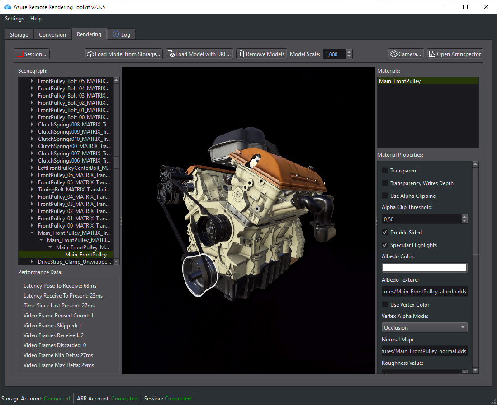

# Azure Remote Rendering Asset Tool (ARRT)

Azure Remote Rendering Asset Tool (ARRT) is an open-source desktop application developed in C++/Qt.

## Features

The application can be used to:

* Upload a 3D model
* Control the model conversion
* Create and manage a remote rendering session
* Load a 3D model
* Preview the 3D model
* Modify its materials

You can also use it as an open-source sample to learn how to implement a front end for the Azure Remote Rendering C++ SDK, using the Azure Storage Client Library for managing the 3D model conversion.

## Source repository

You can find the source code and the documentation on the [GitHub ARRT repository](https://github.com/Azure/azure-remote-rendering-asset-tool).
