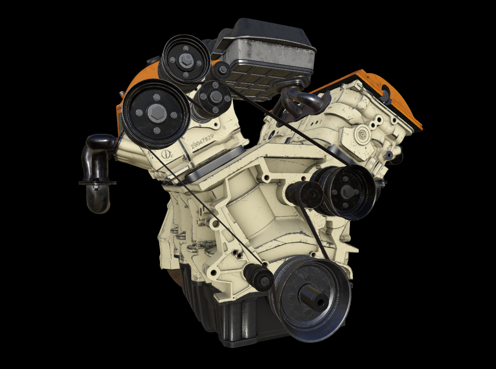

# Sample models

This article lists some resources for sample data that can be used for testing the Azure Remote Rendering service.

## Built-in sample model

We provide a built-in sample model that can always be loaded using the URL **builtin://Engine**

Model statistics:

| Name | Value |
|-----------|:-----------|
| [Required server size](../reference/vm-sizes.md) | standard |
| Number of triangles | 18.7 Million |
| Number of vertices | 35.0 Million |
| Number of movable parts | 2073 |
| Number of materials | 94 |
| Number of textures | 393, using more than 1.6 GB of GPU memory |

## Third-party data

### Triangular meshes

The Khronos Group maintains a set of glTF sample models for testing. ARR supports the glTF format both in text (`.gltf`) and in binary (`.glb`) form. We suggest using the PBR models for best visual results:

* [glTF Sample Models](https://github.com/KhronosGroup/glTF-Sample-Models)

### Point clouds

The libE57 website provides many sample point clouds for testing in the supported E57 file format:

* [libE57 sample models](http://www.libe57.org/data.html)

## Next steps

* [Quickstart: Render a model with Unity](../quickstarts/render-model.md)
* [Quickstart: Convert a model for rendering](../quickstarts/convert-model.md)
