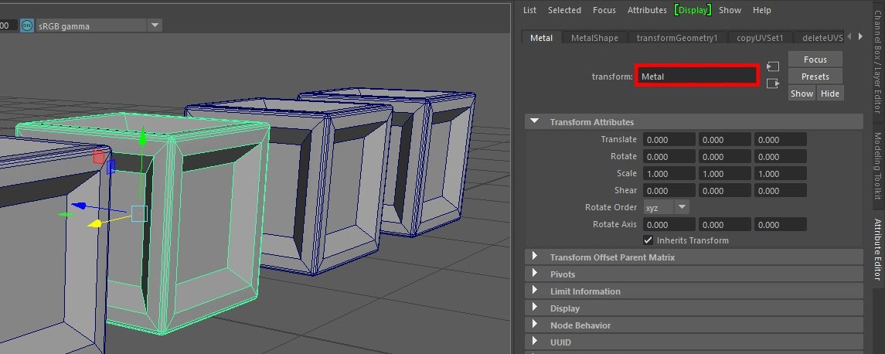
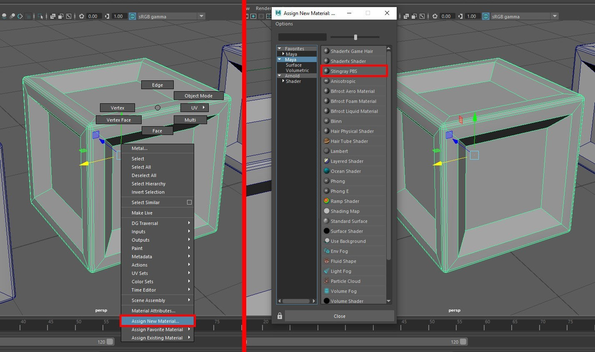
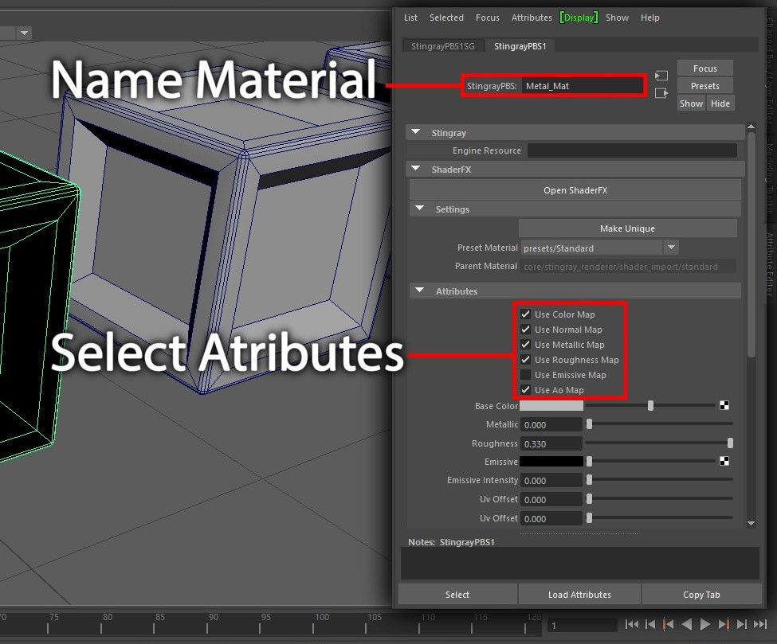
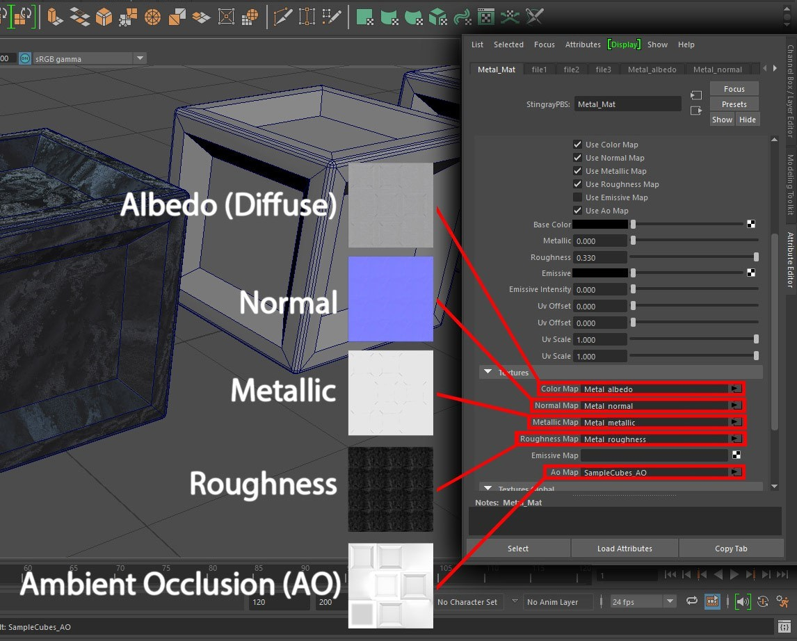
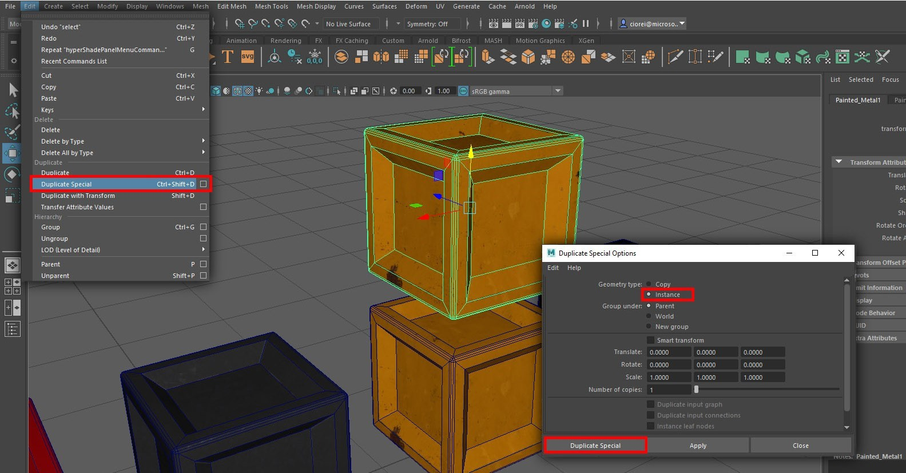
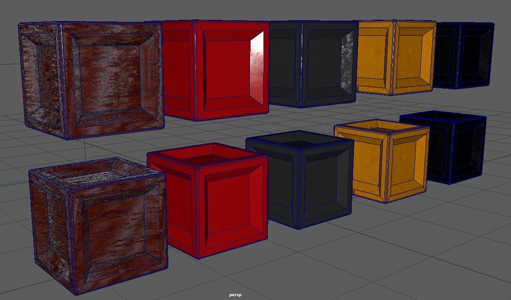
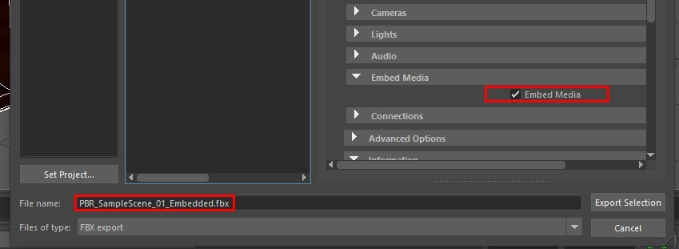

# Tutorial: Set up physically based rendering materials in Maya

## Overview
In this tutorial, you'll learn how to:

> [!div class="checklist"]
>
> * Assign materials with advanced lighting to objects in the scene.
> * Handle instancing of objects and materials.
> * Export a scene to FBX format, and select important options.

Creating [physically based rendering (PBR) materials](../../overview/features/pbr-materials.md) in Maya is a relatively straightforward task. It's similar in many ways to PBR setup in other content-creation apps like 3DS Max. This tutorial is a guide to basic PBR shader setup and FBX export for Azure Remote Rendering projects. 

The sample scene in this tutorial contains a number of polygon box objects. They're assigned different materials, such as wood, metal, painted metal, plastic, and rubber. Broadly speaking, each material contains all or most of the following textures:

* **Albedo**, which is the materials color map and is also called **Diffuse** or **BaseColor**.
* **Metalness**, which determines if a material is metallic and which parts are metallic. 
* **Roughness**, which determines how rough or smooth a surface is and affects the sharpness or blurriness of the reflections and highlights on a surface.
* **Normal**, which adds detail to a surface without having to add more polygons. Examples of detail might be pitting and dents on a metal surface or grain in wood.
* **Ambient Occlusion**, which is used to add soft shading and contact shadows to a model. It's a grayscale map that indicates which areas of a model receive full lighting (white) or full shade (black). 

## Prerequisites
* Autodesk Maya 2017 or newer

## Set up materials in the scene
Here's how to set up a PBR material in Maya.

As you'll see in the sample scene, we've created a number of box objects. Each object represents a different type of material. As shown in the image, each of these objects was given its own appropriate name.

Azure Remote Rendering uses meters for measurement and the up direction is the Y-axis. Before you start to create assets, we recommend that you set your scene units in Maya to meters. For exporting, set units to meters in the FBX export settings.

> [!TIP]
> Give your model assets appropriate names based on the relevant part or material type. Meaningful names make it easier to navigate object-heavy scenes.

After you create or acquire some textures, you can also create unique textures. You can use texturing apps such as Quixel Suite, PhotoShop, or Substance Suite or get generic tiling textures from other sources.

To apply textures to your model:

1. In your scene viewport, select your model or geometry and right-click it. In the menu that appears, select **Assign New Material**.
1. In the **Assign New Material** dialog box, go to **Maya** > **Stingray PBS**. This action assigns a PBR material to your model. 

In Maya 2020, a number of different PBR shaders are available. They include **Maya Standard Surface**, **Arnold Standard Surface**, and **Stingray PBR**. The **Maya Standard Surface Shader** isn't yet exportable via the FBX 2020 plug-in. The **Arnold Standard Surface Shader** can be exported with FBX files. In most other respects, it's identical to the **Maya Standard Surface Shader**. It's analogous to **Physical Material** in 3D Studio Max.

The **Stingray PBR Shader** is compatible with many other applications and most closely matches the requirements of Azure Remote Rendering. It's supported since Maya 2017. When this type of material is visualized in the viewport, it's similar to what's visualized later in Azure Remote Rendering.

With your material assigned to your asset and named appropriately, you can now assign your various textures. The following images show where each texture type fits in to the PBR material. The Stingray PBR material allows you to select which attributes you can activate. Before you plug in your texture maps, you need to activate the relevant attributes.

Name your materials appropriately by taking into account their use or type. A material that's used on a unique part might be named for that part. A material that's used on a wider range of areas can be named for its properties or type.

Assign your textures as shown in the image.

With your PBR materials created and set up, consider [instancing objects](../../how-tos/conversion/configure-model-conversion.md#instancing) in your scene. Instancing similar objects in your scene, such as nuts, bolts, screws, and washers yields significant savings in file size. Instances of a master object can have their own scale, rotation, and transforms so they can be placed as required in your scene. 

In Maya, the process of instancing is simple.

1. On the **Edit** menu, go to **Duplicate Special** to open options.
1. In the **Duplicate Special Options** dialog box, for **Geometry type** select the **Instance** option. 
1. Select **Duplicate Special**.

   

This action creates an instance of your object. You can move, rotate, or scale it independently of its parent and of other instances of that parent. 

Any changes you make to an instance while it's in component modes are transmitted to all instances of your object. For example, you might work with an instanced object's components, such as vertices and polygon faces. Make sure you want any changes you made to affect all of these instances. 

In the sample scene, each individual box object was instanced. This action will have relevance when we export the scene to FBX format.

> [!TIP]
> Create instances in your scene as you go along. Replacing copies with instanced objects later is extremely difficult. 

## FBX export process

Let's move on to the FBX export of your scene or scene assets. When you export assets, it makes sense to select only the objects or assets from your scene that you want to export. For example, you might have 100 objects in a scene. If you want to use only 30 of them, there's no point in exporting the whole scene. 

To make your selection:

1. Go to **File** > **Export Selection** to open the **Export Selection** dialog box.
1. In the **Files of type** box, select **FBX export** to display the FBX export settings. The primary settings for FBX export are highlighted in red in the image.

   

Depending on your requirements, for example, you might want to send an asset to a client. Maybe you don't want to send a large number of texture files with the asset. You can choose to embed the textures within the exported FBX file. This option means that you have only one file to package, but the size of that FBX asset increases significantly. You can enable the option to embed textures by selecting the **Embed Media** option as shown.

> [!TIP]
> In this sample, the file was named to reflect this condition. This naming style is a good way to keep track of your assets. 

After you've set your configuration for export, select **Export Selection** in the lower right.

## Conclusion

In general, this type of material looks more realistic because it's based on the real-world physics of light. It creates an additional immersive effect so that the scene appears to exist in the real world.

## Next steps

You now know how to set up materials with advanced lighting for objects in a scene. You also know how to export the objects to FBX format that's supported by Azure Remote Rendering. The next step is to convert the FBX file and visualize it in Azure Remote Rendering.

> [!div class="nextstepaction"]
> [Quickstart: Convert a model for rendering](../../quickstarts\convert-model.md)