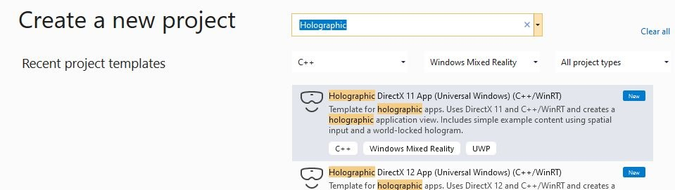
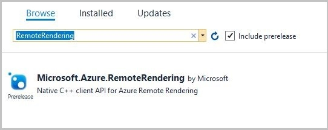
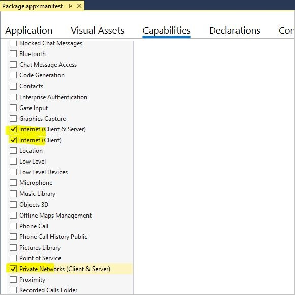

# Tutorial: Integrate Remote Rendering into a HoloLens Holographic App

In this tutorial you will learn:

> [!div class="checklist"]
>
> * Using Visual Studio to create a Holographic App that can be deployed to HoloLens
> * Add the necessary code snippets and project settings to combine local rendering with remotely rendered content

This tutorial focuses on adding the necessary bits to a native `Holographic App` sample to combine local rendering with Azure Remote Rendering. The only type of status feedback in this app is through the debug output panel inside Visual Studio, so it is recommended to start the sample from inside Visual Studio. Adding proper in-app feedback is beyond the scope of this sample, because building a dynamic text panel from scratch involves a lot of coding. A good starting point is class `StatusDisplay`, which is part of the
[Remoting Player sample project on GitHub](https://github.com/microsoft/MixedReality-HolographicRemoting-Samples/tree/master/player/common/Content). In fact, the pre-canned version of this tutorial uses a local copy of that class.

> [!TIP]
> The [ARR samples repository](https://github.com/Azure/azure-remote-rendering) contains the outcome of this tutorial as a Visual Studio project that is ready to use. It is also enriched with proper error- and status reporting through UI class `StatusDisplay`. Inside the tutorial, all ARR specific additions are scoped by `#ifdef USE_REMOTE_RENDERING` / `#endif`, so it is easy to identify the Remote Rendering additions.

## Prerequisites

For this tutorial you need:

* Your account information (account ID, account key, account domain, subscription ID). If you don't have an account, [create an account](../../../how-tos/create-an-account.md).
* Windows SDK 10.0.18362.0 [(download)](https://developer.microsoft.com/windows/downloads/windows-10-sdk).
* The latest version of Visual Studio 2022 [(download)](https://visualstudio.microsoft.com/vs/).
* [Visual Studio tools for Mixed Reality](/windows/mixed-reality/install-the-tools). Specifically, the following *Workload* installations are mandatory:
  * **Desktop development with C++**
  * **Universal Windows Platform (UWP) development**
* The Windows Mixed Reality App Templates for Visual Studio [(download)](https://marketplace.visualstudio.com/items?itemName=WindowsMixedRealityteam.WindowsMixedRealityAppTemplatesVSIX).

## Create a new Holographic App sample

As a first step, we create a stock sample that is the basis for the Remote Rendering integration. Open Visual Studio and select "Create a new project" and search for "Holographic DirectX 11 App (Universal Windows) (C++/WinRT)"



Type in a project name of your choice, choose a path and select the "Create" button.
In the new project, switch the configuration to **"Debug / ARM64"**. You should now be able to compile and deploy it to a connected HoloLens 2 device. If you run it on HoloLens, you should see a rotating cube in front of you.

## Add Remote Rendering dependencies through NuGet

First step into adding Remote Rendering capabilities is to add the client-side dependencies. Relevant dependencies are available as a NuGet package.
In the Solution Explorer, right-click on the project and select **"Manage NuGet Packages..."** from the context menu.

In the prompted dialog, browse for the NuGet package named **"Microsoft.Azure.RemoteRendering.Cpp"**:



and add it to the project by selecting the package and then pressing the "Install" button.

The NuGet package adds the Remote Rendering dependencies to the project. Specifically:
* Link against the client library (RemoteRenderingClient.lib).
* Set up the .dll dependencies.
* Set the correct path to the include directory.

## Project preparation

We need make small changes to the existing project. These changes are subtle, but without them Remote Rendering would not work.

### Enable multithread protection on DirectX device
The `DirectX11` device must have multithread protection enabled. To change that, open file DeviceResources.cpp in folder "Common", and insert the following code at the end of function `DeviceResources::CreateDeviceResources()`:

```cpp
// Enable multi thread protection as now multiple threads use the immediate context.
Microsoft::WRL::ComPtr<ID3D11Multithread> contextMultithread;
if (context.As(&contextMultithread) == S_OK)
{
    contextMultithread->SetMultithreadProtected(true);
}
```

### Enable network capabilities in the app manifest
Network capabilities must be explicitly enabled for the deployed app. Without this being configured, connection queries will result in timeouts eventually. To enable, double-click on the `package.appxmanifest` item in the solution explorer. In the next UI, go to the **Capabilities** tab and select:
* Internet (Client & Server)
* Internet (Client)




## Integrate Remote Rendering

Now that the project is prepared, we can start with the code. A good entry point into the application is the class `HolographicAppMain`(file HolographicAppMain.h/cpp) because it has all the necessary hooks for initialization, de-initialization, and rendering.

### Includes

We start by adding the necessary includes. Add the following include to file HolographicAppMain.h:

```cpp
#include <AzureRemoteRendering.h>
```

...and these additional `include` directives to file HolographicAppMain.cpp:

```cpp
#include <AzureRemoteRendering.inl>
#include <RemoteRenderingExtensions.h>
#include <windows.perception.spatial.h>
```

For simplicity of code, we define the following namespace shortcut at the top of file HolographicAppMain.h, after the `include` directives:

```cpp
namespace RR = Microsoft::Azure::RemoteRendering;
```

This shortcut is useful so we don't have to write out the full namespace everywhere but still can recognize ARR-specific data structures. Of course, we could also use the `using namespace...` directive.

### Remote Rendering initialization
 
We need to hold a few objects for the session etc. during the lifetime of the application. The lifetime coincides with the lifetime of the application's `HolographicAppMain` object, so we add our objects as members to class `HolographicAppMain`. The next step is adding the following class members in file HolographicAppMain.h:

```cpp
class HolographicAppMain
{
    ...
    // members:
    std::string m_sessionOverride;                // if we have a valid session ID, we specify it here. Otherwise a new one is created
    RR::ApiHandle<RR::RemoteRenderingClient> m_client;  // the client instance
    RR::ApiHandle<RR::RenderingSession> m_session;    // the current remote rendering session
    RR::ApiHandle<RR::RenderingConnection> m_api;       // the API instance, that is used to perform all the actions. This is just a shortcut to m_session->Connection()
    RR::ApiHandle<RR::GraphicsBindingWmrD3d11> m_graphicsBinding; // the graphics binding instance
}
```

A good place to do the actual implementation is the constructor of class `HolographicAppMain`. We have to do three types of initialization there:
1. The one-time initialization of the Remote Rendering system
1. Client creation (authentication)
1. Session creation

We do all of that sequentially in the constructor. However, in real use cases it might be appropriate to do these steps separately.

Add the following code to the beginning of the constructor body in file HolographicAppMain.cpp:

```cpp
HolographicAppMain::HolographicAppMain(std::shared_ptr<DX::DeviceResources> const& deviceResources) :
    m_deviceResources(deviceResources)
{
    // 1. One time initialization
    {
        RR::RemoteRenderingInitialization clientInit;
        clientInit.ConnectionType = RR::ConnectionType::General;
        clientInit.GraphicsApi = RR::GraphicsApiType::WmrD3D11;
        clientInit.ToolId = "<sample name goes here>"; // <put your sample name here>
        clientInit.UnitsPerMeter = 1.0f;
        clientInit.Forward = RR::Axis::NegativeZ;
        clientInit.Right = RR::Axis::X;
        clientInit.Up = RR::Axis::Y;
        if (RR::StartupRemoteRendering(clientInit) != RR::Result::Success)
        {
            // something fundamental went wrong with the initialization
            throw std::exception("Failed to start remote rendering. Invalid client init data.");
        }
    }


    // 2. Create Client
    {
        // Users need to fill out the following with their account data and model
        RR::SessionConfiguration init;
        init.AccountId = "00000000-0000-0000-0000-000000000000";
        init.AccountKey = "<account key>";
        init.RemoteRenderingDomain = "westus2.mixedreality.azure.com"; // <change to the region that the rendering session should be created in>
        init.AccountDomain = "westus2.mixedreality.azure.com"; // <change to the region the account was created in>
        m_modelURI = "builtin://Engine";
        m_sessionOverride = ""; // If there is a valid session ID to re-use, put it here. Otherwise a new one is created
        m_client = RR::ApiHandle(RR::RemoteRenderingClient(init));
    }

    // 3. Open/create rendering session
    {
        auto SessionHandler = [&](RR::Status status, RR::ApiHandle<RR::CreateRenderingSessionResult> result)
        {
            if (status == RR::Status::OK)
            {
                auto ctx = result->GetContext();
                if (ctx.Result == RR::Result::Success)
                {
                    SetNewSession(result->GetSession());
                }
                else
                {
                    SetNewState(AppConnectionStatus::ConnectionFailed, ctx.ErrorMessage.c_str());
                }
            }
            else
            {
                SetNewState(AppConnectionStatus::ConnectionFailed, "failed");
            }
        };

        // If we had an old (valid) session that we can recycle, we call async function m_client->OpenRenderingSessionAsync
        if (!m_sessionOverride.empty())
        {
            m_client->OpenRenderingSessionAsync(m_sessionOverride, SessionHandler);
            SetNewState(AppConnectionStatus::CreatingSession, nullptr);
        }
        else
        {
            // create a new session
            RR::RenderingSessionCreationOptions init;
            init.MaxLeaseInMinutes = 10; // session is leased for 10 minutes
            init.Size = RR::RenderingSessionVmSize::Standard;
            m_client->CreateNewRenderingSessionAsync(init, SessionHandler);
            SetNewState(AppConnectionStatus::CreatingSession, nullptr);
        }
    }

    // Rest of constructor code:
    ...
}
```

The code calls member functions `SetNewSession` and `SetNewState`, which we will implement in the next paragraph along with the rest of the state machine code.

Note that credentials are hard-coded in the sample and needs to be filled out in place ([account ID, account key, account domain](../../../how-tos/create-an-account.md#retrieve-the-account-information), and [remote rendering domain](../../../reference/regions.md)).

We do the de-initialization symmetrically and in reverse order at the end of the destructor body:

```cpp
HolographicAppMain::~HolographicAppMain()
{
    // Existing destructor code:
    ...
    
    // Destroy session:
    if (m_session != nullptr)
    {
        m_session->Disconnect();
        m_session = nullptr;
    }

    // Destroy front end:
    m_client = nullptr;

    // One-time de-initialization:
    RR::ShutdownRemoteRendering();
}
```

## State machine

In Remote Rendering, key functions to create a session and to load a model are asynchronous functions. To account for this, we need a simple state machine that essentially transitions through the following states automatically:

*Initialization -> Session creation -> Session starting -> Model loading (with progress)*

Accordingly, as a next step, we add a bit of state machine handling to the class. We declare our own enum `AppConnectionStatus` for the various states that our application can be in. It is similar to `RR::ConnectionStatus`, but has an additional state for failed connection.

Add the following members and functions to the class declaration:

```cpp
namespace HolographicApp
{
    // Our application's possible states:
    enum class AppConnectionStatus
    {
        Disconnected,

        CreatingSession,
        StartingSession,
        Connecting,
        Connected,

        // error state:
        ConnectionFailed,
    };

    class HolographicAppMain
    {
        ...
        // Member functions for state transition handling
        void OnConnectionStatusChanged(RR::ConnectionStatus status, RR::Result error);
        void SetNewState(AppConnectionStatus state, const char* statusMsg);
        void SetNewSession(RR::ApiHandle<RR::RenderingSession> newSession);
        void StartModelLoading();

        // Members for state handling:

        // Model loading:
        std::string m_modelURI;
        RR::ApiHandle<RR::LoadModelAsync> m_loadModelAsync;

        // Connection state machine:
        AppConnectionStatus m_currentStatus = AppConnectionStatus::Disconnected;
        std::string m_statusMsg;
        RR::Result m_connectionResult = RR::Result::Success;
        RR::Result m_modelLoadResult = RR::Result::Success;
        bool m_isConnected = false;
        bool m_sessionStarted = false;
        RR::ApiHandle<RR::SessionPropertiesAsync> m_sessionPropertiesAsync;
        bool m_modelLoadTriggered = false;
        float m_modelLoadingProgress = 0.f;
        bool m_modelLoadFinished = false;
        double m_timeAtLastRESTCall = 0;
        bool m_needsCoordinateSystemUpdate = true;
    }
```

On the implementation side in the .cpp file, add these function bodies:

```cpp
void HolographicAppMain::StartModelLoading()
{
    m_modelLoadingProgress = 0.f;

    RR::LoadModelFromSasOptions options;
    options.ModelUri = m_modelURI.c_str();
    options.Parent = nullptr;

    // start the async model loading
    m_api->LoadModelFromSasAsync(options,
        // completed callback
        [this](RR::Status status, RR::ApiHandle<RR::LoadModelResult> result)
        {
            m_modelLoadResult = RR::StatusToResult(status);
            m_modelLoadFinished = true;

            if (m_modelLoadResult == RR::Result::Success)
            {
                RR::Double3 pos = { 0.0, 0.0, -2.0 };
                result->GetRoot()->SetPosition(pos);
            }
        },
        // progress update callback
            [this](float progress)
        {
            // progress callback
            m_modelLoadingProgress = progress;
            m_needsStatusUpdate = true;
        });
}


void HolographicAppMain::SetNewState(AppConnectionStatus state, const char* statusMsg)
{
    m_currentStatus = state;
    m_statusMsg = statusMsg ? statusMsg : "";

    // Some log for the VS output panel:
    const char* appStatus = nullptr;

    switch (state)
    {
        case AppConnectionStatus::Disconnected: appStatus = "Disconnected"; break;
        case AppConnectionStatus::CreatingSession: appStatus = "CreatingSession"; break;
        case AppConnectionStatus::StartingSession: appStatus = "StartingSession"; break;
        case AppConnectionStatus::Connecting: appStatus = "Connecting"; break;
        case AppConnectionStatus::Connected: appStatus = "Connected"; break;
        case AppConnectionStatus::ConnectionFailed: appStatus = "ConnectionFailed"; break;
    }

    char buffer[1024];
    sprintf_s(buffer, "Remote Rendering: New status: %s, result: %s\n", appStatus, m_statusMsg.c_str());
    OutputDebugStringA(buffer);
}

void HolographicAppMain::SetNewSession(RR::ApiHandle<RR::RenderingSession> newSession)
{
    SetNewState(AppConnectionStatus::StartingSession, nullptr);

    m_sessionStartingTime = m_timeAtLastRESTCall = m_timer.GetTotalSeconds();
    m_session = newSession;
    m_api = m_session->Connection();
    m_graphicsBinding = m_session->GetGraphicsBinding().as<RR::GraphicsBindingWmrD3d11>();
    m_session->ConnectionStatusChanged([this](auto status, auto error)
        {
            OnConnectionStatusChanged(status, error);
        });

};

void HolographicAppMain::OnConnectionStatusChanged(RR::ConnectionStatus status, RR::Result error)
{
    const char* asString = RR::ResultToString(error);
    m_connectionResult = error;

    switch (status)
    {
    case RR::ConnectionStatus::Connecting:
        SetNewState(AppConnectionStatus::Connecting, asString);
        break;
    case RR::ConnectionStatus::Connected:
        if (error == RR::Result::Success)
        {
            SetNewState(AppConnectionStatus::Connected, asString);
        }
        else
        {
            SetNewState(AppConnectionStatus::ConnectionFailed, asString);
        }
        m_modelLoadTriggered = m_modelLoadFinished = false;
        m_isConnected = error == RR::Result::Success;
        break;
    case RR::ConnectionStatus::Disconnected:
        if (error == RR::Result::Success)
        {
            SetNewState(AppConnectionStatus::Disconnected, asString);
        }
        else
        {
            SetNewState(AppConnectionStatus::ConnectionFailed, asString);
        }
        m_modelLoadTriggered = m_modelLoadFinished = false;
        m_isConnected = false;
        break;
    default:
        break;
    }
    
}
```

### Per frame update

We have to update the client once per simulation tick and do some additional state updates. Function `HolographicAppMain::Update` provides a good hook for per-frame updates.

#### State machine update

We need to poll the session's status and see if it has transitioned to `Ready` state. If we have successfully connected, we finally kick off the model loading via `StartModelLoading`.

Add the following code to the body of function `HolographicAppMain::Update`:

```cpp
// Updates the application state once per frame.
HolographicFrame HolographicAppMain::Update()
{
    if (m_session != nullptr)
    {
        // Tick the client to receive messages
        m_api->Update();

        if (!m_sessionStarted)
        {
            // Important: To avoid server-side throttling of the requests, we should call GetPropertiesAsync very infrequently:
            const double delayBetweenRESTCalls = 10.0;

            // query session status periodically until we reach 'session started'
            if (m_sessionPropertiesAsync == nullptr && m_timer.GetTotalSeconds() - m_timeAtLastRESTCall > delayBetweenRESTCalls)
            {
                m_timeAtLastRESTCall = m_timer.GetTotalSeconds();
                m_session->GetPropertiesAsync([this](RR::Status status, RR::ApiHandle<RR::RenderingSessionPropertiesResult> propertiesResult)
                    {
                        if (status == RR::Status::OK)
                        {
                            auto ctx = propertiesResult->GetContext();
                            if (ctx.Result == RR::Result::Success)
                            {
                                auto res = propertiesResult->GetSessionProperties();
                                switch (res.Status)
                                {
                                case RR::RenderingSessionStatus::Ready:
                                {
                                    // The following ConnectAsync is async, but we'll get notifications via OnConnectionStatusChanged
                                    m_sessionStarted = true;
                                    SetNewState(AppConnectionStatus::Connecting, nullptr);
                                    RR::RendererInitOptions init;
                                    init.IgnoreCertificateValidation = false;
                                    init.RenderMode = RR::ServiceRenderMode::Default;
                                    m_session->ConnectAsync(init, [](RR::Status, RR::ConnectionStatus) {});
                                }
                                break;
                                case RR::RenderingSessionStatus::Error:
                                    SetNewState(AppConnectionStatus::ConnectionFailed, "Session error");
                                    break;
                                case RR::RenderingSessionStatus::Stopped:
                                    SetNewState(AppConnectionStatus::ConnectionFailed, "Session stopped");
                                    break;
                                case RR::RenderingSessionStatus::Expired:
                                    SetNewState(AppConnectionStatus::ConnectionFailed, "Session expired");
                                    break;
                                }
                            }
                            else
                            {
                                SetNewState(AppConnectionStatus::ConnectionFailed, ctx.ErrorMessage.c_str());
                            }
                        }
                        else
                        {
                            SetNewState(AppConnectionStatus::ConnectionFailed, "Failed to retrieve session status");
                        }
                        m_sessionPropertiesQueryInProgress = false; // next try
                    });                }
            }
        }
        if (m_isConnected && !m_modelLoadTriggered)
        {
            m_modelLoadTriggered = true;
            StartModelLoading();
        }
    }

    if (m_needsCoordinateSystemUpdate && m_stationaryReferenceFrame && m_graphicsBinding)
    {
        // Set the coordinate system once. This must be called again whenever the coordinate system changes.
        winrt::com_ptr<ABI::Windows::Perception::Spatial::ISpatialCoordinateSystem> ptr{ m_stationaryReferenceFrame.CoordinateSystem().as<ABI::Windows::Perception::Spatial::ISpatialCoordinateSystem>() };
        m_graphicsBinding->UpdateUserCoordinateSystem(ptr.get());
        m_needsCoordinateSystemUpdate = false;
    }

    // Rest of the body:
    ...
}
```

#### Coordinate system update

We need to agree with the rendering service on a coordinate system to use. To access the coordinate system that we want to use, we need the `m_stationaryReferenceFrame` that is created at the end of function `HolographicAppMain::OnHolographicDisplayIsAvailableChanged`.

This coordinate system usually does not change, so this is a one time initialization. It must be called again if your application changes the coordinate system.

The code above sets the coordinate system once within the `Update` function as soon as we both have a reference coordinate system and a connected session.

#### Camera update

We need to update the camera clip planes so that server camera is kept in sync with the local camera. We can do that at the very end of the `Update` function:

```cpp
    ...
    if (m_isConnected)
    {
        // Any near/far plane values of your choosing.
        constexpr float fNear = 0.1f;
        constexpr float fFar = 10.0f;
        for (HolographicCameraPose const& cameraPose : prediction.CameraPoses())
        {
            // Set near and far to the holographic camera as normal
            cameraPose.HolographicCamera().SetNearPlaneDistance(fNear);
            cameraPose.HolographicCamera().SetFarPlaneDistance(fFar);
        }

        // The API to inform the server always requires near < far. Depth buffer data will be converted locally to match what is set on the HolographicCamera.
        auto settings = m_api->GetCameraSettings();
        settings->SetNearAndFarPlane(std::min(fNear, fFar), std::max(fNear, fFar));
        settings->SetEnableDepth(true);
    }

    // The holographic frame will be used to get up-to-date view and projection matrices and
    // to present the swap chain.
    return holographicFrame;
}

```

### Rendering

The last thing to do is invoking the rendering of the remote content. We have to do this call in the exact right position within the rendering pipeline, after the render target clear and setting the viewport. Insert the following snippet into the `UseHolographicCameraResources` lock inside function `HolographicAppMain::Render`:

```cpp
        ...
        // Existing clear function:
        context->ClearDepthStencilView(depthStencilView, D3D11_CLEAR_DEPTH | D3D11_CLEAR_STENCIL, 1.0f, 0);
        
        // ...

        // Existing check to test for valid camera:
        bool cameraActive = pCameraResources->AttachViewProjectionBuffer(m_deviceResources);


        // Inject remote rendering: as soon as we are connected, start blitting the remote frame.
        // We do the blitting after the Clear, and before cube rendering.
        if (m_isConnected && cameraActive)
        {
            m_graphicsBinding->BlitRemoteFrame();
        }

        ...
```

## Run the sample

The sample should now be in a state where it compiles and runs.

When the sample runs properly, it shows the rotating cube right in front of you, and after some session creation and model loading, it renders the engine model located at current head position. Session creation and model loading may take up to a few minutes. The current status is only written to Visual Studio's output panel. It is thus recommended to start the sample from inside Visual Studio.

> [!CAUTION]
> The client disconnects from the server when the tick function is not called for a few seconds. So triggering breakpoints can very easily cause the application to disconnect.

For proper status display with a text panel, refer to the pre-canned version of this tutorial on GitHub.

## Next steps

In this tutorial, you learned all the steps necessary to add Remote Rendering to a stock **Holographic App** C++/DirectX11 sample.
To convert your own model, refer to the following quickstart:

> [!div class="nextstepaction"]
> [Quickstart: Convert a model for rendering](../../../quickstarts/convert-model.md)