# Tutorial 1 - Getting started

## Setup up an Azure remote rendering account

To begin the tutorial, you will need to have your Azure Remote Rendering account [setup](../azure/create-an-account.md) and have an account name and a key.

## Nuget package

1. Add the package source to Nuget:\
nuget.exe sources Add -Name "ArrPackages" -Source <https://pkgs.dev.azure.com/arrClient/_packaging/ArrPackages/nuget/v3/index.json>

2. Create a folder that will hold the Nuget packages and Unity Project folder. Ideally this will be a root folder that can be shared between multiple projects, if required. (eg: C:\RemoteRendering\)

3. Install the latest packages

    ```powershell
    nuget.exe install com.microsoft.azure.remote_rendering -ExcludeVersion

    nuget.exe install ScriptableRenderPipeline -ExcludeVersion
    ```

## Create a new Unity project

1. From the Hub, create a new project in the created folder above (eg. C:\RemoteRendering\)

    

2. Modify the manifest.json file in the Packages folder in the created "Getting Started" folder:

    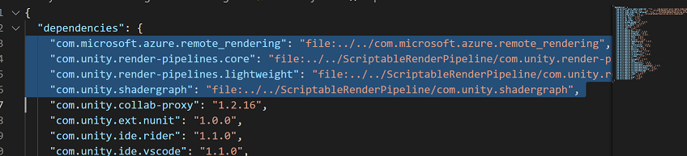

    ```json
    "com.microsoft.azure.remote_rendering": "file:../../com.microsoft.azure.remote_rendering",
    "com.unity.render-pipelines.core": "file:../../ScriptableRenderPipeline/com.unity.render-pipelines.core",
    "com.unity.render-pipelines.lightweight": "file:../../ScriptableRenderPipeline/com.unity.render-pipelines.lightweight",
    "com.unity.shadergraph": "file:../../ScriptableRenderPipeline/com.unity.shadergraph",
    "com.unity.render-pipelines.universal": "file:../../ScriptableRenderPipeline/com.unity.render-pipelines.universal"
    ```

    - Once added, Unity will refresh. Confirm the packages have been loaded in the Project Window:

        

3. Modify camera transform and properties
    - reset the transform

        

    - Clear flags: Solid Color
    - Background: R: 0 G: 0 B: 0
    - Set near and far plane distances, use a value that is reasonable for your object just don't leave as the default

        

4. Bring up the Project Settings dialog(Edit > Project Settings...) and select Quality:
        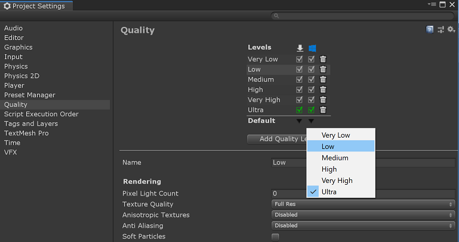

5. From the same dialog, select Graphics and change the Scriptable Rendering Pipeline Setting to Hybrid Render Pipeline:
        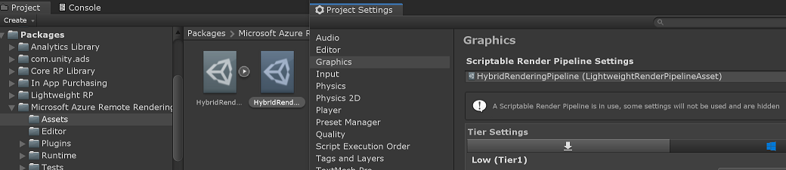

6. Select Player and change the XR Settings to support Windows Mixed Reality:
    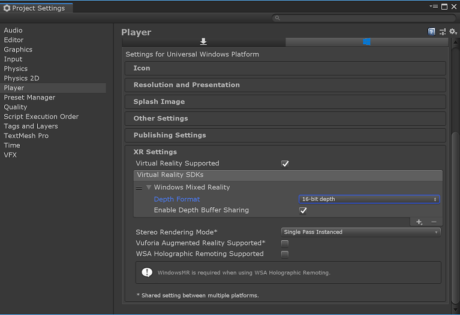

7. Ensure to set the capabilities for any generated application that is created.

    Capabilities:
    - InternetClient
    - InternetClientServer
    - SpatialPerception

    Supported Device Families:
    - Holographic (Desktop optional)

    _see [Mixed Reality Documentation](https://docs.microsoft.com/windows/mixed-reality/unity-development-overview) for more information on recommended settings and capabilities._

## Initialize the RemoteManger

Create a [new script](https://docs.unity3d.com/Manual/CreatingAndUsingScripts.html) and call this "RemoteRendering.cs"

This script will instance the Remote Rendering runtime that will coordinate the rendering required for all local and remote content. For this to work, it will need to know which camera is used to render the scene.

```csharp
    using Microsoft.Azure.RemoteRendering;
    using Microsoft.Azure.RemoteRendering.Unity;
```

```csharp
    private void Awake()
    {
        RemoteUnityClientInit clientInit = new RemoteUnityClientInit(Camera.main);
        RemoteManagerUnity.InitializeManager(clientInit);
    }
```

```csharp
    private void OnDestroy()
    {
        RemoteManagerStatic.ShutdownRemoteRendering();
    }
```

## Configure the AzureFrontend/AzureSession

The following image shows where to find the respective information in the web interface:

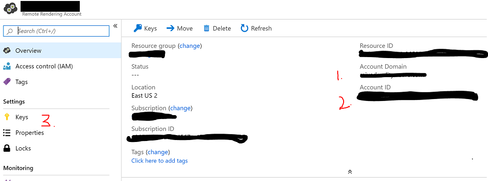

```csharp
    [RequireComponent(typeof(ARRServiceUnity))]
    public class RemoteRendering : MonoBehaviour
    {
        ...
    }
```

```csharp
    private ARRServiceUnity arrService = null;

    public string AccountDomain = "<the domain to connect to>";
    public string AccountId = "<your account id here>";
    public string AccountKey = "<your account key here>";
```

The AccountDomain will be \<region>\.mixedreality.azure.com. For example, westus2.mixedreality.azure.com (the default), westeurope.mixedreality.azure.com, etc

Initialize the `AzureFrontendAccountInfo` information for the service. This will be used by the `ARRService` component. Also, subscribe to the specific events exposed by these components:

```csharp
    private void Awake()
    {
        ...

        arrService = GetComponent<ARRServiceUnity>();
        arrService.OnSessionStarted += ARRService_OnSessionStarted;
        arrService.OnSessionStatusChanged += ARRService_OnSessionStatusChanged;
        arrService.OnSessionEnded += ARRService_OnSessionEnded;

        InitializeAccountInfo();
    }

    private void OnDestroy()
    {
        arrService.OnSessionStarted -= ARRService_OnSessionStarted;
        arrService.OnSessionStatusChanged -= ARRService_OnSessionStatusChanged;
        arrService.OnSessionEnded -= ARRService_OnSessionEnded;

        RemoteManagerStatic.ShutdownRemoteRendering();
    }

    private void InitializeAccountInfo()
    {
        if (arrService.Frontend != null)
        {
            return;
        }

        AzureFrontendAccountInfo accountInfo = new AzureFrontendAccountInfo();
        accountInfo.AccountKey = AccountKey;
        accountInfo.AccountId = AccountId;
        accountInfo.AccountDomain = AccountDomain;

        arrService.Initialize(accountInfo);
    }

    private void ARRService_OnSessionEnded(AzureSession session)
    {
        if (session != null)
        {
            Debug.Log($"ARRService_OnSessionEnded - session status: {arrService.LastProperties.Status}.");
        }
    }

    private void ARRService_OnSessionStarted(AzureSession session)
    {
        Debug.Log($"ARRService_OnSessionStarted - session status: {arrService.LastProperties.Status}.");
    }

    private void ARRService_OnSessionStatusChanged(AzureSession session)
    {
        Debug.Log($"ARRService_OnSessionStatusChanged - session status: {arrService.LastProperties.Status}.");
    }
```

## Create a rendering session instance

Create an instance of the Azure Session

```csharp
    public void CreateSession()
    {
        // make sure the account is initialized
        InitializeAccountInfo();

        var sessionParams = new CreateRenderingSessionParams(VmSize, MaxLeaseTimeHours, MaxLeaseTimeMinutes);

        // Start session will call the ARRService_OnSessionStarted when the session is available
        arrService.StartSession(sessionParams).AsTask();
    }

    private void ARRService_OnSessionStarted(AzureSession session)
    {
        ...

        LogSessionStatus(session);
    }

    private async void LogSessionStatus(AzureSession session)
    {
        var properties = await session.GetPropertiesAsync().AsTask();
        LogSessionStatus(properties);
    }

    private void LogSessionStatus(RenderingSessionProperties sessionProperties)
    {
        Debug.Log( "Session " +
            $"Id: {sessionProperties.Id}, " +
            $"Size: {sessionProperties.Size}, " +
            (!string.IsNullOrEmpty(sessionProperties.Hostname) ? $"Hostname: {sessionProperties.Hostname}, " : "") +
            (!string.IsNullOrEmpty(sessionProperties.Message) ? $"Message: {sessionProperties.Message}, " : "") +
            $"Status: {sessionProperties.Status}");
    }
```

To prevent additional charges for a session that is no longer in use, be sure to stop the session.

_Note: The effect will take immediate effect and any connected user will be disconnected and session will be stopped. You cannot undo this operation and will have to create a new session._

```csharp
    public void StopSession()
    {
        SessionId = null;
        arrService.StopSession();
    }
```

To test the functionality in the Unity Editor, add a GUI to be able to activate this functionality.

```csharp
    #if UNITY_EDITOR
            private void OnGUI()
            {
                int y = 10;

                if (arrService.CurrentActiveSession == null)
                {
                    if (GUI.Button(new Rect(10, y, 175, 30), "Create New Session"))
                    {
                        CreateSession();
                    }
                }
                else
                {
                    if (GUI.Button(new Rect(10, y, 175, 30), "Stop Session"))
                    {
                        StopSession();
                    }
                }
            }
    #endif
```

To test this component, create a new GameObject in the scene and add the RemoteRendering component to it. Fill in the appropriate domain, id, and key for the Azure Remote Rendering account:\
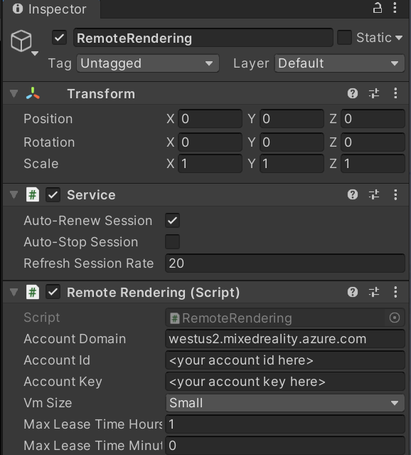

Start the application in the editor(press Play or ctrl-p). You should see the GUI at the top of the window, go ahead and press the GUI button.\
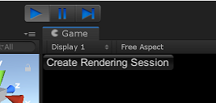

A message will appear in the Output Window. At this point, the server is provisioning the server but is not ready to connect to. This can take some time to complete.\
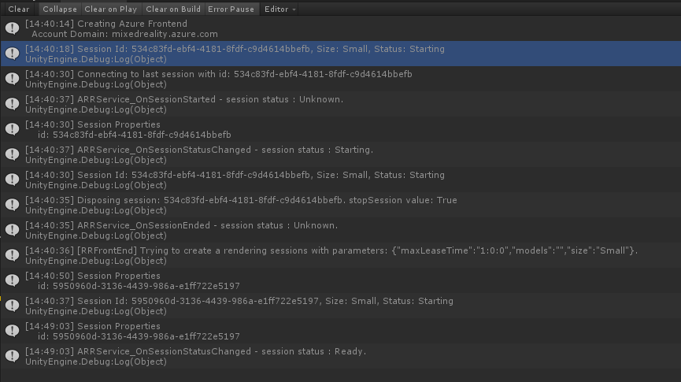

If you stop playback at this time, the session will be stopped automatically due to a property of the ARRServiceUnity component. To prevent the editor from stopping your session automatically, turn this off before starting playback:\
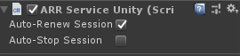

## List sessions

Typically, creating a session would be triggered outside of the player application because of the time required to spin up the server. Depending on the scenario, you may already have a session ID or you want to query the account to know what sessions are available to use.

>[!NOTE]
> You can only have one user connected at a time. If a user is already connected to the session, the connection will fail with a Handshake error

To get a list of sessions for the AccountId, use AzureFrontend to get all sessions. This function will output the list to Unity's Console window:

```csharp
    public async void GetAccountSessions()
    {
        // make sure the account is initialized
        InitializeAccountInfo();

        if (arrService.Frontend == null)
        {
            return;
        }

        var sessions = await arrService.Frontend.GetCurrentRenderingSessionsAsync().AsTask();

        foreach (var session in sessions)
        {
            LogSessionStatus(session);
        }
    }
```

Update the GUI to include a button for getting the list:

```csharp
private void OnGUI()
{
    if (arrService.CurrentActiveSession == null)
    {
        ...

        y += 40;

        if (String.IsNullOrEmpty(SessionId))
        {
            if (GUI.Button(new Rect(10, y, 175, 30), "Get Account Sessions"))
            {
                GetAccountSessions();
            }
        }
    }
    ...
}
```

## Use existing SessionId

Add a SessionId property that will be pre-populated in the editor, or by using the CreateSession button. Again, for the new function, update the GUI:

```csharp
    public string SessionId = null;
```

Update ARRService_OnSessionStatusChanged and GetAccountSessions to set the SessionId:

```csharp
    private void ARRService_OnSessionStarted(AzureSession session)
    {
        ...

        SessionId = session.SessionUUID;
    }

    public async void GetAccountSessions()
    {
        ...

        foreach (var session in sessions)
        {
            if (string.IsNullOrEmpty(SessionId))
            {
                SessionId = session.Id;
            }

            LogSessionStatus(session);
        }
    }
```

Create the new function to use the _SessionId_ property:

```csharp
    public async void UseSessionId(string sessionId)
    {
        if (string.IsNullOrEmpty(sessionId))
        {
            Debug.LogError("Not a valid session id.");

            return;
        }

        InitializeAccountInfo();

        if (arrService.CurrentActiveSession != null)
        {
            if (string.Compare(arrService.CurrentActiveSession.SessionUUID, sessionId) != 0)
            {
                Debug.LogError("Already have an active session.");
            }
            return;
        }

        // Start session will call the ARRService_OnSessionStarted when the session is available
        arrService.OpenSession(sessionId);
    }
```

```csharp
    private void OnGUI()
    {
        ...
        if (arrService.CurrentActiveSession == null)
        {
            ...
            if (String.IsNullOrEmpty(SessionId))
            {
                ...
            }
            else
            {
                if (GUI.Button(new Rect(10, y, 175, 30), "Use Session Id"))
                {
                    UseSessionId(SessionId);
                }
            }
        }
        ...
    }
```

Test and take note of the status of the session.\
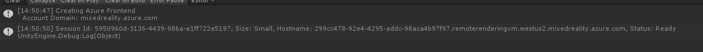
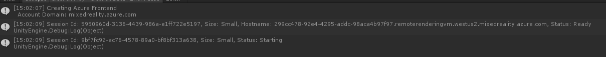
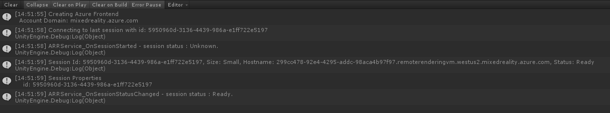

## Connect to an active session

Once a session is in a Ready state, the AzureSession can then be connected to the runtime to start rendering the content. Add the following Connect, Disconnect, and event handler code:

```csharp
    private bool isConnected = false;

    private void ARRService_OnSessionStarted(AzureSession session)
    {
        ...
        session.OnConnectionStatusChanged += AzureSession_OnConnectionStatusChanged;
    }

    private void ARRService_OnSessionEnded(AzureSession session)
    {
        if (session != null)
        {
            Debug.Log($"ARRService_OnSessionEnded - session status: {arrService.LastProperties.Status}.");
            session.OnConnectionStatusChanged -= AzureSession_OnConnectionStatusChanged;
        }
    }

    private void AzureSession_OnConnectionStatusChanged(ARRConnectionStatus status, ARRResult error)
    {
        Debug.Log($"AzureSession_OnConnectionStatusChanged - connection status: {status} error:{error}.");
        isConnected = status == ConnectionStatus.Connected;
    }

    public void ConnectSession()
    {
        arrService.CurrentActiveSession?.ConnectToRuntime(new ConnectToRuntimeParams());
    }

    public void DisconnectSession()
    {
        if (!isConnected)
        {
            return;
        }

        if (arrService.CurrentActiveSession != null)
        {
            var error = arrService.CurrentActiveSession.DisconnectFromRuntime();
            if (error != Result.Success)
            {
                Debug.LogError($"Failed to disconnect: {error}");
            }
        }
    }

```

The AzureSession must have its runtime pump updated. The updates will push messages to the server, receive messages, and update the framebuffer with the remotely rendered content.

```csharp
    private void LateUpdate()
    {
        arrService.CurrentActiveSession?.Actions.Update();
    }
```

```csharp
    private void OnDisable()
    {
        DisconnectSession();
    }
```

```csharp
    private void OnGUI()
    {
        ...

        y += 40;

        if (!isConnected)
        {
            if (arrService.CurrentActiveSession != null && arrService.LastProperties.Status == RenderingSessionStatus.Ready)
            {
                if (GUI.Button(new Rect(10, y, 175, 30), "Connect"))
                {
                    ConnectSession();
                }
            }
        }
        else
        {
            if (GUI.Button(new Rect(10, y, 175, 30), "Disconnect"))
            {
                DisconnectSession();
            }
        }
    }
```

Again, test the functionality to ensure you have successfully connected to the remote session. Note the client and server versions:\
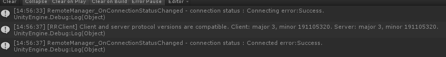

## Loading a model

Create a load function that will use the built-in model. The _[WorldAnchor](https://docs.unity3d.com/ScriptReference/XR.WSA.WorldAnchor.html)_ is an important component used for [hologram stability](https://docs.microsoft.com/windows/mixed-reality/hologram-stability). This will only have effect when deployed on a Mixed Reality device.

```csharp
#if UNITY_WSA
    using UnityEngine.XR.WSA;
#endif
```

```csharp
    public string ModelName = "builtin://UnitySampleModel";

    private Entity modelEntity = null;
    private GameObject modelEntityGO = null;

#if UNITY_WSA
    private WorldAnchor modelWorldAnchor = null;
#endif
```

```csharp
    public async void LoadModel()
    {
        if (!isConnected)
        {
            return;
        }

        if (modelEntity != null)
        {
            DestroyModel();
        }

        // create a root object to parent a loaded model to
        modelEntity = RemoteManager.CreateEntity();

        // get the gameobject represetntation of this entity
        modelEntityGO = modelEntity.GetOrCreateGameObject(UnityCreationMode.DoNotCreateUnityComponents);

        // ensure the entity will sync translations with the server
        var sync = modelEntityGO.GetComponent<RemoteEntitySyncObject>();
        if (sync != null)
        {
            sync.SyncEveryFrame = true;
        }

        // set postion to an arbitrary distance from the parent
        modelEntityGO.transform.position = Camera.main.transform.position + Camera.main.transform.forward * 2;
        modelEntityGO.transform.localScale = Vector3.one;

#if UNITY_WSA
        // anchor the model in the world
        modelWorldAnchor = modelEntityGO.AddComponent<WorldAnchor>();
#endif

        // load a model that will be parented to the entity
        var loadModelParams = new LoadModelParams(ModelName, modelEntity.Id);

        // load a model that will be parented to the entity
        var loadModelParams = new LoadModelParams(ModelName, modelEntity);
        var async = arrService.CurrentActiveSession.Actions.LoadModelAsync(loadModelParams);
        async.OnProgress += (float progress) =>
        {
            Debug.Log($"Loading: {progress * 100.0f}%");
        };

        await async.AsTask();
    }
```

To unload the model, call Destroy() on the entity object, but also its GameObject:

```csharp
    public void DestroyModel()
    {
        if (modelEntity == null)
        {
                return;
        }

#if UNITY_WSA
        DestroyImmediate(modelWorldAnchor);
#endif

        modelEntity.Destroy();
        modelEntity = null;

        DestroyImmediate(modelEntityGO);
    }
```

Update the UI:

```csharp
    private void OnGUI()
    {
        ...

        y += 40;

        if (isConnected)
        {
            if (modelEntity == null)
            {
                if (GUI.Button(new Rect(10, y, 175, 30), "Load Model"))
                {
                    LoadModelAsync();
                }
            }
            else
            {
                if (GUI.Button(new Rect(10, y, 175, 30), "Destroy Model"))
                {
                    DestroyModel();
                }
            }
        }
    }
```

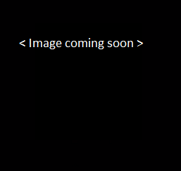

Update the Disconnect function to destroy any models that had been loaded

```csharp
    public void DisconnectSession()
    {
        if (!isConnected)
        {
            return;
        }

        DestroyModel();
        ...
    }
```

## Show frame statistics data

In this part of the tutorial, use the provided script that will be used to show the rendering statistics for the connected session. In the tutorial folder, copy the RemoteFrameStats.cs file to your project

Create a GameObject and rename it FrameStats and set its z position 0.325 units away from the camera and add the RemoteFrameStats component to the GameObject.

Add a Canvas as a child of the FrameStats GameObject and set the properties as shown:


Add a UI Text object as a child of the Canvas and set its properties as shown:


With the FrameStats GameObject selected in the Hierarchy, populate the FrameStats field with the Text object. In the Unity Editor, you should see something like this:


Now, when connected to the remote session, the text should show the streaming statistics:


