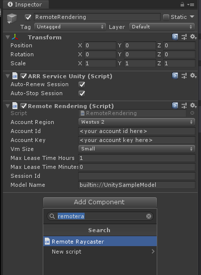

# Azure remote rendering tutorial #2 - working with remote entities

## Ray casting

Create a new script called RemoteRaycaster.cs and add the following member variables:

```csharp
    public double MaxDistance = 30.0;

    public HitCollectionPolicy HitCollectionPolicy = HitCollectionPolicy.ClosestHit;
```

Create a function that will ray cast from a specific origin and direction:

```csharp
    private async Task<Entity> RemoteRayCast(Vector3 origin, Vector3 dir)
    {
        Entity entity = null;

        var raycast = new RayCast(origin.toRemotePos(), dir.toRemoteDir(), MaxDistance, HitCollectionPolicy);

        var hits = await RemoteManager.RayCastQueryAsync(raycast).AsTask();
        if (hits != null)
        {
            foreach (var hit in hits)
            {
                var hitEntity = RemoteManager.GetEntity(hit.ObjectId);
                if (hitEntity == null)
                {
                    continue;
                }

                entity = hitEntity;
                break;
            }
        }

        return entity;
    }
```

Call this function from Update(). To keep things simple, ray cast locations will be from the mouse position:

```csharp
    private void Update()
    {
        if (!RemoteManager.IsConnected)
        {
            return;
        }

        var ray = Camera.main.ScreenPointToRay(Input.mousePosition);

        Raycast(ray.origin, ray.direction);
    }
```

```csharp
    public async void Raycast(Vector3 origin, Vector3 direction)
    {
        var entity = await RemoteRayCast(origin, direction);
        if (entity != null)
        {
            Debug.Log("Object Hit: " + hitObject.Name);
        }
    }
```

From the Unity Editor Hierarchy, select the "RemoteRendering" object. From the Inspector, click the Add Component button and add RemoteRaycaster to this GameObject.\


## Highlight remote objects (ARRHierarchicalStateOverrideComponent)

As with local objects in the scene, being able to change the rendering of the object that the mouse is over provides a method to notify the user of what they might be selecting. Extending on the ray cast above, add another script that represents the remote object. Create a RemoteModelEntity.cs script and add the following:

```csharp
    public Color HighlightColor = new Color(1.0f, 0.0f, 0.0f, 0.1f);

    public Entity Entity => syncObject != null ? syncObject?.Entity : null;

    private RemoteEntitySyncObject syncObject = null;
    private ARRHierarchicalStateOverrideComponent stateOverride = null;
```

```csharp
    public void OnEnable()
    {
        syncObject = GetComponent<RemoteEntitySyncObject>();

        stateOverride = GetComponent<ARRHierarchicalStateOverrideComponent>();
        if (stateOverride == null)
        {
            stateOverride = gameObject.AddComponent<ARRHierarchicalStateOverrideComponent>();
            if (syncObject.Entity.FindComponentOfType<HierarchicalStateOverrideComponent>() == null)
            {
                stateOverride.Create();
            }
            else
            {
                stateOverride.Bind(syncObject.Entity.FindComponentOfType<HierarchicalStateOverrideComponent>());
            }
        }
        stateOverride.enabled = true;
        stateOverride.RemoteComponent.Enabled = true;
        stateOverride.RemoteComponent.TintColor = HighlightColor.toRemote();
    }

    public void OnDisable()
    {
        if (syncObject != null)
        {
            syncObject.SyncEveryFrame = false;
        }

        if (stateOverride != null)
        {
            ResetStateOverride();

            stateOverride.RemoteComponent.Enabled = false;
            stateOverride.enabled = false;
        }
    }

    public bool SetFocus()
    {
        if (syncObject == null)
        {
            return false;
        }

        syncObject.SyncEveryFrame = true;

        SetStateOverride();

        return true;
    }

    public void ResetFocus()
    {
        ResetStateOverride();

        syncObject.SyncEveryFrame = false;
    }


    private void SetStateOverride()
    {
        if (!stateOverride.RemoteComponent.IsValid)
        {
            return;
        }

        stateOverride.RemoteComponent.UseTintColorState = HierarchicalEnableState.ForceOn;
        stateOverride.RemoteComponent.SelectedState = HierarchicalEnableState.ForceOn;
    }

    private void ResetStateOverride()
    {
        if (!stateOverride.RemoteComponent.IsValid)
        {
            return;
        }

        stateOverride.RemoteComponent.UseTintColorState = HierarchicalEnableState.InheritFromParent;
        stateOverride.RemoteComponent.SelectedState = HierarchicalEnableState.InheritFromParent;
    }
```

Change the previous RemoteRaycaster implementation with the following to use the new component:

```csharp
    private RemoteModelEntity focusedModel = null;
```

```csharp
    public async void Raycast(Vector3 origin, Vector3 direction)
    {
        var entity = await RemoteRayCast(origin, direction);

        if (focusedModel != null && focusedModel.Entity == entity)
        {
            return;
        }

        ClearFocus();

        if (entity == null)
        {
            return;
        }

        // gets the instance of a Unity GameObject for the entity
        var entityGO = entity.GetOrCreateGameObject(UnityCreationMode.DoNotCreateUnityComponents);

        // ensure the game object has the RemoteModelEntity component
        var model = entityGO.GetComponent<RemoteModelEntity>();
        if (model == null)
        {
            model = entityGO.AddComponent<RemoteModelEntity>();
        }

        if (model.SetFocus())
        {
            focusedModel = model;
        }
    }

    private void ClearFocus()
    {
        if (focusedModel == null)
        {
            return;
        }

        focusedModel.ResetFocus();

        focusedModel = null;
    }
```

## Isolate selected entity (HierarchicalStateFlags)

Another use of the [HierarchicalStateOverrideComponent](../sdk/features-override-hierarchical-state.md) is the ability to override visibility. The will allow you to isolate a selected entity from the entire model. Open the RemoteModelEntity.cs file and add the following:

```csharp
    private bool isolated = false;
```

```csharp
    private void ToggleIsolate()
    {
        if (stateOverride == null && !stateOverride.RemoteComponent.IsValid)
        {
            return;
        }

        isolated = !isolated;

        // get the model's remote parent node
        if (parentOverride == null)
        {
            var modelRoot = transform.parent;
            var rootSyncEntity = modelRoot.GetComponent<RemoteEntitySyncObject>();
            while (modelRoot.parent != null && rootSyncEntity != null)
            {
                modelRoot = modelRoot.parent;
                rootSyncEntity = modelRoot.GetComponent<RemoteEntitySyncObject>();
            }

            if (rootSyncEntity == null)
            {
                rootSyncEntity = syncObject;
            }

            parentOverride = rootSyncEntity.Entity.FindComponentOfType<HierarchicalStateOverrideComponent>();
        }

        if (isolated)
        {
            // hide entire model, then show the focused object
            parentOverride.HiddenState = HierarchicalEnableState.ForceOn;
            stateOverride.RemoteComponent.HiddenState = HierarchicalEnableState.ForceOff;
        }
        else
        {
            parentOverride.HiddenState = HierarchicalEnableState.ForceOff;
            stateOverride.RemoteComponent.HiddenState = HierarchicalEnableState.InheritFromParent;
        }
    }
```

This code requires an instance of the component to run to ensure the isolation will be active. In the Update function, the following will call ToggleIsolate() when the right button is held down:

```csharp
    private void Update()
    {
        ...

        if (Input.GetMouseButtonDown(1))
        {
            ToggleIsolate();
        }
    }
```

Update the ResetFocus function so when an object that has activated isolation, will reset it back to default:

```csharp
    public void ResetFocus()
    {
        ...

        if (isolated)
        {
            ToggleIsolate();
        }
    }
```

Open the RemoteRendering.cs file and update the LoadModel() function to add a HierarchicalStateOverrideComponent to the root model entity:

```csharp
    public async void LoadModel()
    {
        ...

        // create a root object to parent a loaded model to
        modelEntity = RemoteManager.CreateEntity();
        RemoteManager.CreateComponent(ObjectType.HierarchicalStateOverrideComponent, modelEntity);

        ...
    }
```

## Remove created GameObject Instances

By now, you may noticed under the Hierarchy panel, the remote model that represents the remote model, is growing with every object that gets focus. The more objects in the scene will negatively affect performance.

Below is a quick way to remove child nodes that are no longer required:

```csharp
    private void ClearFocus()
    {
        ...
        focusedModel.ResetFocus();

        CleanHierarchy(focusedModel.gameObject);

        focusedModel = null;
        ...
    }
```

```csharp
    private void CleanHierarchy(GameObject focusedGO)
    {
        if (focusedGO == null)
        {
            return;
        }

        Transform focusedTransform = focusedGO.transform;
        while (focusedTransform != null && focusedTransform.childCount == 0)
        {
            // store current parent for the object
            var parent = focusedTransform.transform.parent;
            if (parent != null)
            {
                // remove the child from parent
                focusedTransform.SetParent(null);

                // destroy the gameobject
                GameObject.Destroy(focusedTransform.gameObject);
            }

            // keep traversing up the tree
            focusedTransform = parent;
        }
    }
```

## Moving focused RemoteObjects

In the previous tutorial, the Unity GameObject transform was used to set an offset location for the model's root node. This was achieved using the RemoteEntitySyncObject SyncEveryFrame property.

This can also be done dynamically by using focus to determine which object is selected and using the mouse to move the object around:

```csharp
    private bool hasFocus = false;
```

```csharp
    public bool SetFocus()
    {
        ...

        hasFocus = true;

        ...
    }

    public void ResetFocus()
    {
        ...

        hasFocus = false;

        ...
    }
```

Knowing the object has focus, in the Update method, track the mouse button state and determine how much to move the object:

```csharp
    private Vector3 lastPosition = Vector3.zero;
```

```csharp
    private void Update()
    {
        if (!hasFocus)
        {
            return;
        }

        if (Input.GetMouseButton(0))
        {
            var curPosition = Input.mousePosition;
            if (lastPosition == Vector3.zero)
            {
                lastPosition = curPosition;
            }

            var delta = curPosition - lastPosition;

            lastPosition = curPosition;

            // update position
            transform.position = Vector3.Lerp(transform.position, transform.position + delta, Time.deltaTime * 0.75f);
        }
        else
        {
            lastPosition = Vector3.zero;
        }

        ...
    }
```

For a focused object, when you hold the mouse button down, you can move the object in the scene. The Ray caster Update method will need to be modified to prevent losing the focus when the mouse is down. Remove the call to Ray cast and replace with the following in the RemoteRaycaster.cs file:

```csharp
    private void Update()
    {
        ...

        if (Input.GetMouseButtonDown(0))
        {
            Raycast(ray.origin, ray.direction);
        }
        else if (!Input.GetMouseButton(0)) // held down this frame?
        {
            Raycast(ray.origin, ray.direction);
        }
    }
```

## Bounds of an entity

Modify the RemoveModelEntity.cs file. Having a Unity bounding box helps with localized physics collision detection. Using this method will only generate bounds for a single entity, not including its children. If a node has children, you would have to take that into account and expand this further.

```csharp
    private ARRMeshComponent meshComponent = null;
    private BoxCollider boxCollider = null;
```

```csharp
    private void OnEnable()
    {
        ...

        meshComponent = GetComponent<ARRMeshComponent>();
        if (meshComponent == null)
        {
            var mesh = syncObject.Entity.FindComponentOfType<MeshComponent>();
            if (mesh != null)
            {
                gameObject.BindArrComponent<ARRMeshComponent>(mesh);
                meshComponent = gameObject.GetComponent<ARRMeshComponent>();
            }
        }
        meshComponent.enabled = true;

        boxCollider = GetComponent<BoxCollider>();
        if (boxCollider == null)
        {
            boxCollider = gameObject.AddComponent<BoxCollider>();
        }
        boxCollider.enabled = true;
        boxCollider.center = meshComponent.RemoteComponent.Mesh.Bounds.toUnity().center;
        boxCollider.size = meshComponent.RemoteComponent.Mesh.Bounds.toUnity().size;
    }

    private void OnDisable()
    {
        ...

        if (meshComponent)
        {
            meshComponent.enabled = false;
        }

        if (boxCollider)
        {
            boxCollider.enabled = false;
        }
    }
```

## Cut plane

Create a new GameObject in the scene hierarchy and name it "RemoteCutPlane". Change its position to a point near the model root is. Create a new script and call it RemoteCutPlane.cs and add the component to the new GameObject.

Add these variables to track state and components that represent the clip plane on the server:

```csharp
    private bool cutEnabled = false;

    private ARRCutPlaneComponent cutPlaneComponent = null;

    private RemoteEntitySyncObject remoteEntitySync = null;
```

Add a function to create the cut plane object and its sync component:

```csharp
    private void ToggleCutPlane()
    {
        cutEnabled = !cutEnabled;

        if (cutPlaneComponent == null)
        {
            cutPlaneComponent = gameObject.CreateArrComponent<ARRCutPlaneComponent>();
            cutPlaneComponent.RemoteComponent.Normal = Axis.X;
            cutPlaneComponent.RemoteComponent.FadeLength = 0.025f;
            cutPlaneComponent.RemoteComponent.FadeColor = new ColorUb(255, 128, 0, 255);
        }

        if (remoteEntitySync == null)
        {
            remoteEntitySync = gameObject.GetComponent<RemoteEntitySyncObject>();
        }

        remoteEntitySync.SyncEveryFrame = cutEnabled;

        if (cutPlaneComponent != null && cutPlaneComponent.RemoteComponent.IsValid)
        {
            cutPlaneComponent.RemoteComponent.Enabled = cutEnabled;
        }
    }
```

To activate the clip plane, create a GUI button:

```csharp
#if UNITY_EDITOR
    private void OnGUI()
    {
        if (RemoteManager.IsConnected)
        {
            int y = Screen.height - 50;

            if (GUI.Button(new Rect(50, y, 175, 30), "Toggle Cut Plane"))
            {
                ToggleCutPlane();
            }
        }
    }
#endif
```

At this point, the cut plane is using an arbitrary plane direction along the x-axis, but may be difficult to see. Add an Update() function that will use the arrow keys to move and rotate the cut plane:

```csharp
    private void Update()
    {
        if (!RemoteManager.IsConnected || !cutEnabled)
        {
            return;
        }

        Vector3 movement = Vector3.zero;
        if (Input.GetKey(KeyCode.LeftArrow))
        {
            movement += Vector3.left;
        }

        if (Input.GetKey(KeyCode.RightArrow))
        {
            movement += Vector3.right;
        }

        UnityEngine.Quaternion rotation = UnityEngine.Quaternion.identity;
        if (Input.GetKey(KeyCode.UpArrow))
        {
            rotation *= UnityEngine.Quaternion.FromToRotation(transform.forward, transform.forward + Vector3.left);
        }

        if (Input.GetKey(KeyCode.DownArrow))
        {
            rotation *= UnityEngine.Quaternion.FromToRotation(transform.forward, transform.forward + Vector3.right);
        }

        // align the movement value to the objects rotation
        movement = transform.rotation * movement;

        transform.position = Vector3.Lerp(transform.position, transform.position + movement, Time.deltaTime * 0.5f);
        transform.rotation = UnityEngine.Quaternion.Slerp(transform.rotation, transform.rotation * rotation, Time.deltaTime * 0.5f);
    }
```
