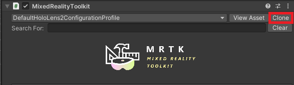

# Tutorial: Interfaces and loading custom models

In this tutorial, you learn how to:

> [!div class="checklist"]
>
> * Add Mixed Reality Toolkit to the project
> * Manage model state
> * Configure Azure Blob Storage for model ingestion.
> * Upload and process models for rendering.

## Prerequisites

* This tutorial builds on top of [Tutorial: Viewing a remotely rendered model](../view-remote-models/view-remote-models.md).

## Getting started with the Mixed Reality Toolkit (MRTK)

The Mixed Reality Toolkit (MRTK) is a cross-platform toolkit for building Mixed Reality experiences. We'll use MRTK for its interaction and visualization features.

To add MRTK, follow the [Required steps](https://microsoft.github.io/MixedRealityToolkit-Unity/Documentation/GettingStartedWithTheMRTK.html#required) defined in [Getting started with MRTK](https://microsoft.github.io/MixedRealityToolkit-Unity/Documentation/GettingStartedWithTheMRTK.html).

Once MRTK is included in the project, we'll copy the default HoloLens 2 profile and make a few modifications.

1. Select the **MixedRealityToolkit** GameObject in the scene hierarchy.
1. In the Inspector, under the **MixedRealityToolkit** component, switch the configuration profile to *DefaultHoloLens2ConfigurationProfile* and press the **Clone** button.
 \
1. In the clone dialog window, the default settings are suitable, so press **Clone**.
 \
1. With your new configuration profile selected, select **Diagnostics** and press the **Clone** button to clone the diagnostics profile. Confirm the default settings in the clone dialog window by pressing **Clone**.
1. With your new diagnostic profile selected, un-check **Show Profiler**. The profiler is a very useful tool and can be toggled at run-time using the voice command "Toggle Profiler" or the '9' key on the keyboard's number row.

## Import assets used by this tutorial

Starting in this chapter, the tutorial implements a simple [model-view-controller pattern](https://en.wikipedia.org/wiki/Model%E2%80%93view%E2%80%93controller) for much of the material covered. The *model* part of the pattern is all the Azure Remote Rendering specific code and the state management related to Azure Remote Rendering. The *view* and *controller* parts of the pattern are implemented using MRTK assets and some custom scripts. It is possible to be able to use the *model* in this tutorial without the *view-controller* implemented here. This separation allows you to easily integrate the code found in this tutorial into your own application, where your application will take over the *view-controller* part of the design pattern.

With the introduction of MRTK, there are a number of scripts, prefabs, and assets that can now be added to the project to support interactions and visual feedback. These assets, referred to as the **Tutorial Assets**, are bundled into a [Unity Asset Package](https://docs.unity3d.com/Manual/AssetPackages.html), which can be downloaded \[here](todo\path\to\asset-package).

1. Download the package \[here](todo\path\to\asset-package)
1. In your Unity project, choose **Assets** > **Import Package** > **Custom Package**.
1. In the file explorer, select the asset package you downloaded in step 1.
1. Select the **Import** button to import the contents of the package into your project.\
\
*If using the Universal Render Pipeline:*

1. In the Unity Editor, select **Mixed Reality Toolkit** > **Utilities** > **Upgrade MRTK Standard Shader for Lightweight Render Pipeline** from the top menu bar, and follow the prompts to upgrade the shader.

Most of view controllers in this tutorial operate against abstract base classes instead of against concrete classes. This pattern provides better flexibility and allows the tutorial to provide the view controllers for you, while still allowing you to implement and learn the Azure Remote Rendering specific code yourself. For the simplicity of the tutorial, the **RemoteRenderingCoordinator** class does not have an abstract class provided and its view controller operates directly against the concrete class.

You can now add the prefab **RemoteRenderingViewController** to the scene, for visual feedback of the current session state.

## Manage model state

Because there can be multiple models, and we'd like to interact, load/unload, etc. with each separately, we'll specify the details of the remote model in a separate script.

Similar to the starting code for **RemoteRenderingCoordinator**, much of the code in **RemoteRenderedModel** is for tracking state, responding to events, firing events and configuration. Essentially, **RemoteRenderedModel** stores the remote path for the model data in `modelPath`. It will listen for state changes in the **RemoteRenderingCoordinator** to see if it should automatically load or unload the model it defines. The GameObject that has the **RemoteRenderedModel** attached to it will be local parent for the remote content.

Notice that the **RemoteRenderedModel** script implements **BaseRemoteRenderedModel**, included from the **Tutorial Assets**. This will allow the remote model view controller, also included in the **Tutorial Assets**, to bind with the script you create. We'll integrate the view controller in the [Manipulating models](../manipulate-models/manipulate-models.md) tutorial.

1. Create a new script named **RemoteRenderedModel** in the same folder as **RemoteRenderingCoordinator**. Replace the entire contents with the following code:

```csharp
// Copyright (c) Microsoft Corporation. All rights reserved.
// Licensed under the MIT License. See LICENSE in the project root for license information.

using Microsoft.Azure.RemoteRendering;
using Microsoft.Azure.RemoteRendering.Unity;
using System;
using UnityEngine;
using UnityEngine.Events;
using static RemoteRenderingCoordinator;

public class RemoteRenderedModel : BaseRemoteRenderedModel
{
    [SerializeField]
    [Tooltip("The friendly name for this model")]
    private string modelDisplayName;
    [SerializeField]
    [Tooltip("The URI for this model")]
    private string modelPath;

    public bool AutomaticallyLoad = true;

    private ModelState currentModelState = ModelState.NotReady;

    public override string ModelDisplayName { get => modelDisplayName; set => modelDisplayName = value; }
    public override string ModelPath { get => modelPath; set => modelPath = value; }

    public override ModelState CurrentModelState
    {
        get => currentModelState;
        protected set
        {
            if (currentModelState != value)
            {
                currentModelState = value;
                ModelStateChange?.Invoke(value);
            }
        }
    }

    public override event Action<ModelState> ModelStateChange;
    public override event Action<float> LoadProgress;
    public override Entity ModelEntity { get; protected set; }

    public UnityEvent OnModelNotReady = new UnityEvent();
    public UnityEvent OnModelReady = new UnityEvent();
    public UnityEvent OnStartLoading = new UnityEvent();
    public UnityEvent OnModelLoaded = new UnityEvent();
    public UnityEvent OnModelUnloading = new UnityEvent();

    [Serializable] public class UnityFloatEvent : UnityEvent<float> { }

    public UnityFloatEvent OnLoadProgress = new UnityFloatEvent();

    public void Awake()
    {
        // Hook up the event to the Unity event
        LoadProgress += (progress) => OnLoadProgress?.Invoke(progress);

        ModelStateChange += HandleUnityStateEvents;
    }

    private void HandleUnityStateEvents(ModelState modelState)
    {
        switch (modelState)
        {
            case ModelState.NotReady:  OnModelNotReady?.Invoke();  break;
            case ModelState.Ready:     OnModelReady?.Invoke();     break;
            case ModelState.Loading:   OnStartLoading?.Invoke();   break;
            case ModelState.Loaded:    OnModelLoaded?.Invoke();    break;
            case ModelState.Unloading: OnModelUnloading?.Invoke(); break;
        }
    }

    private void Start()
    {
        //Attach to and initialize current state (in case we're attaching late)
        RemoteRenderingCoordinator.CoordinatorStateChange += Instance_CoordinatorStateChange;
        Instance_CoordinatorStateChange(RemoteRenderingCoordinator.instance.CurrentCoordinatorState);
    }

    /// <summary>
    /// Listen for state changes on the coordinator, clean up this model's remote objects if we're no longer connected.
    /// Automatically load if required
    /// </summary>
    private void Instance_CoordinatorStateChange(RemoteRenderingState state)
    {
        switch (state)
        {
            case RemoteRenderingState.RuntimeConnected:
                CurrentModelState = ModelState.Ready;
                if (AutomaticallyLoad)
                    LoadModel();
                break;
            default:
                UnloadModel();
                break;
        }
    }

    private void OnDestroy()
    {
        RemoteRenderingCoordinator.CoordinatorStateChange -= Instance_CoordinatorStateChange;
        UnloadModel();
    }

    /// <summary>
    /// Asks the coordinator to create a model entity and listens for coordinator state changes
    /// </summary>
    [ContextMenu("Load Model")]
    public override async void LoadModel()
    {
        if (CurrentModelState != ModelState.Ready)
            return; //We're already loaded, currently loading, or not ready to load

        CurrentModelState = ModelState.Loading;

        ModelEntity = await RemoteRenderingCoordinator.instance?.LoadModel(ModelPath, this.transform, SetLoadingProgress);

        if (ModelEntity != null)
            CurrentModelState = ModelState.Loaded;
        else
            CurrentModelState = ModelState.Error;
    }

    /// <summary>
    /// Clean up the local model instances
    /// </summary>
    [ContextMenu("Unload Model")]
    public override void UnloadModel()
    {
        CurrentModelState = ModelState.Unloading;

        if (ModelEntity != null)
        {
            var modelGameObject = ModelEntity.GetOrCreateGameObject(UnityCreationMode.DoNotCreateUnityComponents);
            Destroy(modelGameObject);
            ModelEntity.Destroy();
            ModelEntity = null;
        }

        if (RemoteRenderingCoordinator.instance.CurrentCoordinatorState == RemoteRenderingState.RuntimeConnected)
            CurrentModelState = ModelState.Ready;
        else
            CurrentModelState = ModelState.NotReady;
    }

    /// <summary>
    /// Update the Unity progress event
    /// </summary>
    /// <param name="progressValue"></param>
    public override void SetLoadingProgress(float progressValue)
    {
        LoadProgress?.Invoke(progressValue);
    }
}
```

## Loading the Test Model

Let's test the new script by once again loading the test model. We'll create a GameObject to contain the script and be a parent to the test model.

1. Create a new GameObject in the scene and name it **TestModel**.
1. Add the *RemoteRenderedModel* script to **TestModel**.\

1. Fill in the `Model Display Name` and the `Model Path` with "*TestModel*" and "*builtin://Engine*" respectively.

1. Position the **TestModel** object in front of the camera, at position **x = 0, y = 1, z = 3**.\

1. Ensure **AutomaticallyLoad** is turned on.
1. Press **Play** in the Unity Editor to test the application.

Watch the Console panel as the application progresses through its states. Keep in mind, some states may take some time to complete without a progress update. Eventually, you'll see the logs from the model loading and then the test model will be rendered in the scene. Try moving and rotating the **TestModel** GameObject you created to see the model rendered from different perspectives.


## Provision Blob Storage in Azure and custom model ingestion

Follow the steps specified in the [Quickstart: Convert a model for rendering](../../../quickstarts/convert-model.md). Ignore the **Insert new model into Quickstart Sample App** section for the purpose of this tutorial. Once you have your ingested model's *Shared Access Signature (SAS)* URI, continue to the next step below.

## Loading and rendering a custom model

1. Create a new GameObject in the scene and name it appropriately.
1. Add the *RemoteRenderedModel* script to the newly created GameObject.\
 
1. Fill in the `Model Display Name` with an appropriate name for your model.
1. Fill in the `Model Path` with the model's *Shared Access Signature (SAS)* URI you created in the ingestion steps above.
1. Position the GameObject in front of the camera
1. Ensure **AutomaticallyLoad** is turned on.
1. Press **Play** in the Unity Editor to test the application.

You will see the Console panel begin to populate with the current state and eventually model loading progress messages. Your custom model will then load into the scene.

## Next steps

You can now load your own models into Azure Remote Rendering and view them in your application. Next the tutorials will guide you through manipulating your models

> [!div class="nextstepaction"]
> [Next: Manipulating models](../manipulate-models/manipulate-models.md)
