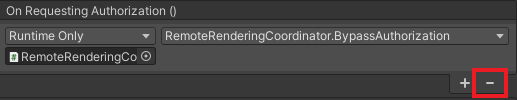
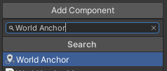
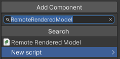
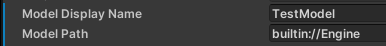
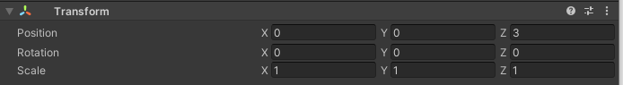
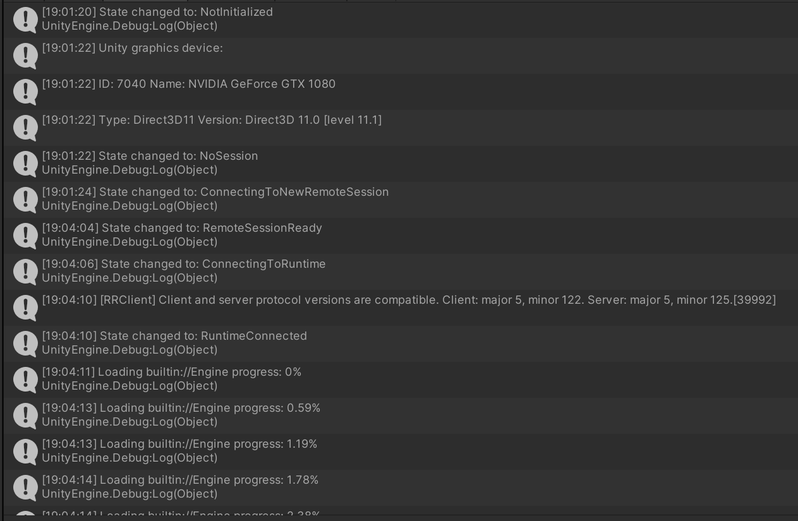

# Tutorial: Interfaces and custom models

In this tutorial, you learn how to:

> [!div class="checklist"]
>
> * Add Mixed Reality Toolkit to the project
> * Manage model state
> * Configure Azure Blob Storage for model ingestion
> * Upload and process models for rendering

## Prerequisites

* This tutorial builds on [Tutorial: Viewing a remotely rendered model](../view-remote-models/view-remote-models.md).

## Get started with the Mixed Reality Toolkit (MRTK)

The Mixed Reality Toolkit (MRTK) is a cross-platform toolkit for building mixed reality experiences. We use MRTK 2.8.3 for its interaction and visualization features.

The [official guide](/training/modules/learn-mrtk-tutorials/1-5-exercise-configure-resources?tabs=openxr) to import MRTK contains some steps we don't need to do. Only these three steps are necessary:
 - Importing the 'Mixed Reality Toolkit/Mixed Reality Toolkit Foundation' version 2.8.3 to your project through the Mixed Reality Feature Tool ([Import MRTK](/training/modules/learn-mrtk-tutorials/1-5-exercise-configure-resources?tabs=openxr#import-the-mrtk-unity-foundation-package)).
 - Run the configuration wizard of MRTK ([Configure MRTK](/training/modules/learn-mrtk-tutorials/1-5-exercise-configure-resources?tabs=openxr#configure-the-unity-project)).
 - Add MRTK to the current scene ([Add to scene](/training/modules/learn-mrtk-tutorials/1-5-exercise-configure-resources?tabs=openxr#create-the-scene-and-configure-mrtk)). Use the *ARRMixedRealityToolkitConfigurationProfile* here instead of the suggested profile in the tutorial.

## Import assets used by this tutorial

Starting in this chapter, we'll implement a basic [model-view-controller pattern](https://en.wikipedia.org/wiki/Model%E2%80%93view%E2%80%93controller) for much of the material covered. The *model* part of the pattern is the Azure Remote Rendering specific code and the state management related to Azure Remote Rendering. The *view* and *controller* parts of the pattern are implemented using MRTK assets and some custom scripts. It's possible to use the *model* in this tutorial without the *view-controller* implemented here. This separation allows you to easily integrate the code found in this tutorial into your own application where it takes over the *view-controller* part of the design pattern.

With the introduction of MRTK, there are multiple scripts, prefabs, and assets that can now be added to the project to support interactions and visual feedback. These assets referred to as the **Tutorial Assets**, are bundled into a [Unity Asset Package](https://docs.unity3d.com/Manual/AssetPackages.html), which is included in the [Azure Remote Rendering GitHub](https://github.com/Azure/azure-remote-rendering) in '\Unity\TutorialAssets\TutorialAssets.unitypackage'.

1. Clone or download the git repository [Azure Remote Rendering](https://github.com/Azure/azure-remote-rendering), if downloading extract the zip to a known location.
1. In your Unity project, choose *Assets -> Import Package -> Custom Package*.
1. In the file explorer, navigate to the directory where you cloned or unzipped the Azure Remote Rendering repository, then select the `.unitypackage` found in **Unity -> TutorialAssets -> TutorialAssets.unitypackage**
1. Select the **Import** button to import the contents of the package into your project.
1. In the Unity Editor, select *Mixed Reality Toolkit -> Utilities -> Upgrade MRTK Standard Shader for Lightweight Render Pipeline* from the top menu bar and follow the prompts to upgrade the shader.

Once MRTK and the Tutorial Assets are setup double check, that the correct profile is selected.

1. Select the **MixedRealityToolkit** GameObject in the scene hierarchy.
1. In the Inspector, under the **MixedRealityToolkit** component, switch the configuration profile to *ARRMixedRealityToolkitConfigurationProfile*.
1. Press *Ctrl+S* to save your changes.

This step configures MRTK, primarily, with the default HoloLens 2 profiles. The provided profiles are preconfigured in the following ways:
 - Turn off the profiler (Press 9 to toggle it on/off, or say "Show/Hide Profiler" on device).
 - Turn off the eye gaze cursor.
 - Enable Unity mouse clicks, so you can click MRTK UI elements with the mouse instead of the simulated hand.

## Add the App Menu

Most of the view controllers in this tutorial operate against abstract base classes instead of against concrete classes. This pattern provides more flexibility and allows us to provide the view controllers for you, while still helping you learn the Azure Remote Rendering code. For simplicity, the **RemoteRenderingCoordinator** class doesn't have an abstract class provided and its view controller operates directly against the concrete class.

You can now add the prefab **AppMenu** to the scene, for visual feedback of the current session state. The **AppMenu** also present the modal panel that the user uses to authorize the application to connect to ARR.

1. Locate the **AppMenu** prefab in *Assets/RemoteRenderingTutorial/Prefabs/AppMenu*
1. Drag the **AppMenu** prefab into the scene.
1. If you see a dialog for **TMP Importer**, follow the prompts to **Import TMP Essentials**. Then close the importer dialog, as the examples and extras aren't needed.
1. The **AppMenu** is configured to automatically hook up and provide the modal for consenting to connecting to a Session, so we can remove the bypass placed earlier. On the **RemoteRenderingCoordinator** GameObject, remove the bypass for authorization we implemented previously, by pressing the '-' button on the **On Requesting Authorization** event.

    .

1. Test the view controller by pressing **Play** in the Unity Editor.
1. In the Editor, now that MRTK is configured, you can use the WASD keys to change the position your view and holding the right mouse button + moving the mouse to change your view direction. Try "driving" around the scene a bit to get a feel for the controls.
1. On device, you can raise your palm up to summon the **AppMenu**, in the Unity Editor, use the hotkey 'M'.
1. If you've lost sight of the menu, press the 'M' key to summon the menu. The menu is placed near the camera for easy interaction.
1. The **AppMenu** presents a UI element for authorization to the right of the **AppMenu**. From now on, you should use this UI element to authorize the app to manage remote rendering sessions.

    

1. Stop Unity from playing to continue with the tutorial.

## Manage model state

We need a new script called **RemoteRenderedModel** that is for tracking state, responding to events, firing events, and configuration. Essentially, **RemoteRenderedModel** stores the remote path for the model data in `modelPath`. It listens for state changes in the **RemoteRenderingCoordinator** to see if it should automatically load or unload the model it defines. The GameObject that has the **RemoteRenderedModel** attached to it's the local parent for the remote content.

Notice that the **RemoteRenderedModel** script implements **BaseRemoteRenderedModel**, included from **Tutorial Assets**. This connection allows the remote model view controller to bind with your script.

1. Create a new script named **RemoteRenderedModel** in the same folder as **RemoteRenderingCoordinator**. Replace the entire contents with the following code:

    ```cs
    // Copyright (c) Microsoft Corporation. All rights reserved.
    // Licensed under the MIT License. See LICENSE in the project root for license information.

    using Microsoft.Azure.RemoteRendering;
    using Microsoft.Azure.RemoteRendering.Unity;
    using System;
    using UnityEngine;
    using UnityEngine.Events;

    public class RemoteRenderedModel : BaseRemoteRenderedModel
    {
        public bool AutomaticallyLoad = true;

        private ModelState currentModelState = ModelState.NotReady;

        [SerializeField]
        [Tooltip("The friendly name for this model")]
        private string modelDisplayName;
        public override string ModelDisplayName { get => modelDisplayName; set => modelDisplayName = value; }

        [SerializeField]
        [Tooltip("The URI for this model")]
        private string modelPath;
        public override string ModelPath
        {
            get => modelPath.Trim();
            set => modelPath = value;
        }

        public override ModelState CurrentModelState
        {
            get => currentModelState;
            protected set
            {
                if (currentModelState != value)
                {
                    currentModelState = value;
                    ModelStateChange?.Invoke(value);
                }
            }
        }

        public override event Action<ModelState> ModelStateChange;
        public override event Action<float> LoadProgress;
        public override Entity ModelEntity { get; protected set; }

        public UnityEvent OnModelNotReady = new UnityEvent();
        public UnityEvent OnModelReady = new UnityEvent();
        public UnityEvent OnStartLoading = new UnityEvent();
        public UnityEvent OnModelLoaded = new UnityEvent();
        public UnityEvent OnModelUnloading = new UnityEvent();

        public UnityFloatEvent OnLoadProgress = new UnityFloatEvent();

        public void Awake()
        {
            // Hook up the event to the Unity event
            LoadProgress += (progress) => OnLoadProgress?.Invoke(progress);

            ModelStateChange += HandleUnityStateEvents;
        }

        private void HandleUnityStateEvents(ModelState modelState)
        {
            switch (modelState)
            {
                case ModelState.NotReady:  OnModelNotReady?.Invoke();  break;
                case ModelState.Ready:     OnModelReady?.Invoke();     break;
                case ModelState.Loading:   OnStartLoading?.Invoke();   break;
                case ModelState.Loaded:    OnModelLoaded?.Invoke();    break;
                case ModelState.Unloading: OnModelUnloading?.Invoke(); break;
            }
        }

        private void Start()
        {
            //Attach to and initialize current state (in case we're attaching late)
            RemoteRenderingCoordinator.CoordinatorStateChange += Instance_CoordinatorStateChange;
            Instance_CoordinatorStateChange(RemoteRenderingCoordinator.instance.CurrentCoordinatorState);
        }

        /// <summary>
        /// Listen for state changes on the coordinator, clean up this model's remote objects if we're no longer connected.
        /// Automatically load if required
        /// </summary>
        private void Instance_CoordinatorStateChange(RemoteRenderingCoordinator.RemoteRenderingState state)
        {
            switch (state)
            {
                case RemoteRenderingCoordinator.RemoteRenderingState.RuntimeConnected:
                    CurrentModelState = ModelState.Ready;
                    if (AutomaticallyLoad)
                        LoadModel();
                    break;
                default:
                    UnloadModel();
                    break;
            }
        }

        private void OnDestroy()
        {
            RemoteRenderingCoordinator.CoordinatorStateChange -= Instance_CoordinatorStateChange;
            UnloadModel();
        }

        /// <summary>
        /// Asks the coordinator to create a model entity and listens for coordinator state changes
        /// </summary>
        [ContextMenu("Load Model")]
        public override async void LoadModel()
        {
            if (CurrentModelState != ModelState.Ready)
                return; //We're already loaded, currently loading, or not ready to load

            CurrentModelState = ModelState.Loading;

            ModelEntity = await RemoteRenderingCoordinator.instance?.LoadModel(ModelPath, this.transform, SetLoadingProgress);

            if (ModelEntity != null)
                CurrentModelState = ModelState.Loaded;
            else
                CurrentModelState = ModelState.Error;
        }

        /// <summary>
        /// Clean up the local model instances
        /// </summary>
        [ContextMenu("Unload Model")]
        public override void UnloadModel()
        {
            CurrentModelState = ModelState.Unloading;

            if (ModelEntity != null)
            {
                var modelGameObject = ModelEntity.GetOrCreateGameObject(UnityCreationMode.DoNotCreateUnityComponents);
                Destroy(modelGameObject);
                ModelEntity.Destroy();
                ModelEntity = null;
            }

            if (RemoteRenderingCoordinator.instance.CurrentCoordinatorState == RemoteRenderingCoordinator.RemoteRenderingState.RuntimeConnected)
                CurrentModelState = ModelState.Ready;
            else
                CurrentModelState = ModelState.NotReady;
        }

        /// <summary>
        /// Update the Unity progress event
        /// </summary>
        /// <param name="progressValue"></param>
        public override void SetLoadingProgress(float progressValue)
        {
            LoadProgress?.Invoke(progressValue);
        }
    }
    ```

In the most basic terms, **RemoteRenderedModel** holds the data needed to load a model (in this case the SAS or *builtin://* URI) and tracks the remote model state. When it's time to load the model, the `LoadModel` method is called on **RemoteRenderingCoordinator**, and the Entity containing the model is returned for reference and unloading.

## Load the Test Model

Let's test the new script by loading the test model again. For this test, we need a Game Object to contain the script and be a parent to the test model, and we also need a virtual stage that contains the model. The stage stays fixed relative to the real world using a [WorldAnchor](/windows/mixed-reality/develop/unity/spatial-anchors-in-unity?tabs=worldanchor). We use a fixed stage so that the model itself can still be moved around later on.

1. Create a new empty Game Object in the scene and name it **ModelStage**.
1. Add a World Anchor component to **ModelStage**

    

1. Create a new empty Game Object as a child of **ModelStage** and name it **TestModel**.
1. Add the *RemoteRenderedModel* script to **TestModel**.

    

1. Fill in the `Model Display Name` and the `Model Path` with "*TestModel*" and "*builtin://Engine*" respectively.

    

1. Position the **TestModel** object in front of the camera, at position **x = 0, y = 0, z = 3**.

    

1. Ensure **AutomaticallyLoad** is turned on.
1. Press **Play** in the Unity Editor to test the application.
1. Grant authorization by clicking the *Connect* button to allow the app to create a session, connect to it, and automatically load the model.

Watch the Console as the application progresses through its states. Keep in mind, some states may take some time to complete, and there might be no progress updates for a while. Eventually, you see logs from the model loading and then shortly after the rendered test model in the scene.

Try moving and rotating the **TestModel** GameObject via the Transform in the Inspector, or in the Scene view and observe the transformations in the Game view.



## Provision Blob Storage in Azure and custom model ingestion

Now we can try loading your own model. To do that, you need to configure Blob Storage on Azure, upload and convert a model, and then load the model using the **RemoteRenderedModel** script. The custom model loading steps can be safely skipped if you don't have your own model to load at this time.

Follow the steps specified in the [Quickstart: Convert a model for rendering](../../../quickstarts/convert-model.md). Skip the **Insert new model into Quickstart Sample App** section for this tutorial. Once you have your ingested model's *Shared Access Signature (SAS)* URI, continue.

## Load and rendering a custom model

1. Create a new empty GameObject in the scene and name it similar to your custom model.
1. Add the *RemoteRenderedModel* script to the newly created GameObject.

    

1. Fill in the `Model Display Name` with an appropriate name for your model.
1. Fill in the `Model Path` with the model's *Shared Access Signature (SAS)* URI you created in the [Provision Blob Storage in Azure and custom model ingestion](#provision-blob-storage-in-azure-and-custom-model-ingestion) step.
1. Position the GameObject in front of the camera, at position **x = 0, y = 0, z = 3.**
1. Ensure **AutomaticallyLoad** is turned on.
1. Press **Play** in the Unity Editor to test the application.

    The console shows the current session state and also the model loading progress messages, once the session is connected.

1. Remove your custom model object from the scene. The best experience for this tutorial is with the test model. While multiple models are supported in ARR, this tutorial was written to best support a single remote model at a time.

## Next steps

You can now load your own models into Azure Remote Rendering and view them in your application! Next, we guide you through manipulating your models.

> [!div class="nextstepaction"]
> [Next: Manipulating models](../manipulate-models/manipulate-models.md)