# Tutorial: Manipulating models

In this tutorial, you learn how to:

> [!div class="checklist"]
>
> * Add visual and manipulation bounds around remotely rendered models
> * Move, rotate, and scale
> * Raycast with spatial queries
> * Add simple animations for remotely rendered objects

## Prerequisites

* This tutorial builds on [Tutorial: Interfaces and custom models](../custom-models/custom-models.md).

## Query remote object bounds and apply to local bounds

To interact with remote objects, we need a local representation to interact with first. The [objects bounds](../../../concepts/object-bounds.md) are useful for quick manipulation of a remote object. The remote bounds can be queried from ARR, using the local Entity as a reference. The bounds are queried after the model has been loaded into the remote session.

The bounds of a model are defined by the box that contains the entire model - just like Unity's [**BoxCollider**](https://docs.unity3d.com/Manual/class-BoxCollider.html), which has a center and size defined for the x, y, z axes. In fact, we'll use Unity's **BoxCollider** to represent the bounds of the remote model.

1. Create a new script in the same directory as **RemoteRenderedModel** and name it **RemoteBounds**.
1. Replace the contents of the script with the following code:

    ```cs
    // Copyright (c) Microsoft Corporation. All rights reserved.
    // Licensed under the MIT License. See LICENSE in the project root for license information.

    using Microsoft.Azure.RemoteRendering;
    using Microsoft.Azure.RemoteRendering.Unity;
    using System;
    using UnityEngine;

    [RequireComponent(typeof(BaseRemoteRenderedModel))]
    public class RemoteBounds : BaseRemoteBounds
    {
        //Remote bounds works with a specific remotely rendered model
        private BaseRemoteRenderedModel targetModel = null;

        private RemoteBoundsState currentBoundsState = RemoteBoundsState.NotReady;

        public override RemoteBoundsState CurrentBoundsState
        {
            get => currentBoundsState;
            protected set
            {
                if (currentBoundsState != value)
                {
                    currentBoundsState = value;
                    BoundsStateChange?.Invoke(value);
                }
            }
        }

        public override event Action<RemoteBoundsState> BoundsStateChange;

        public void Awake()
        {
            BoundsStateChange += HandleUnityEvents;
            targetModel = GetComponent<BaseRemoteRenderedModel>();

            targetModel.ModelStateChange += TargetModel_OnModelStateChange;
            TargetModel_OnModelStateChange(targetModel.CurrentModelState);
        }

        private void TargetModel_OnModelStateChange(ModelState state)
        {
            switch (state)
            {
                case ModelState.Loaded:
                    QueryBounds();
                    break;
                default:
                    BoundsBoxCollider.enabled = false;
                    CurrentBoundsState = RemoteBoundsState.NotReady;
                    break;
            }
        }

        // Create an async query using the model entity
        async private void QueryBounds()
        {
            //Implement me
        }
    }
    ```

    > [!NOTE]
    > If you see an error in Visual Studio claiming *Feature 'X' is not available in C# 6. Please use language version 7.0 or greater*, these error can be safely ignored. This is related to Unity's Solution and Project generation.

    This script should be added to the same GameObject as the script that implements  **BaseRemoteRenderedModel**. In this case, that means **RemoteRenderedModel**. Similar to previous scripts, this initial code handles all the state changes, events, and data related to remote bounds.

    There is only one method left to implement: **QueryBounds**. **QueryBounds** fetches the bounds asynchronously, takes the result of the query and applies it to the local **BoxCollider**.

    The **QueryBounds** method is straightforward: send a query to the remote rendering session and await the result.

1. Replace the **QueryBounds** method with the following completed method:

    ```cs
    // Create a query using the model entity
    async private void QueryBounds()
    {
        var remoteBounds = targetModel.ModelEntity.QueryLocalBoundsAsync();
        CurrentBoundsState = RemoteBoundsState.Updating;
        await remoteBounds;

        if (remoteBounds.IsCompleted)
        {
            var newBounds = remoteBounds.Result.toUnity();
            BoundsBoxCollider.center = newBounds.center;
            BoundsBoxCollider.size = newBounds.size;
            BoundsBoxCollider.enabled = true;
            CurrentBoundsState = RemoteBoundsState.Ready;
        }
        else
        {
            CurrentBoundsState = RemoteBoundsState.Error;
        }
    }
    ```

    We check the query result to see if it was successful. If yes, convert and apply the returned bounds in a format that the **BoxCollider** can accept.

Now, when the **RemoteBounds** script is added to the same game object as the **RemoteRenderedModel**, a **BoxCollider** is added if needed and when the model reaches its `Loaded` state, the bounds will automatically be queried and applied to the **BoxCollider**.

1. Using the **TestModel** GameObject created previously, add the **RemoteBounds** component.
1. Confirm the script is added.

     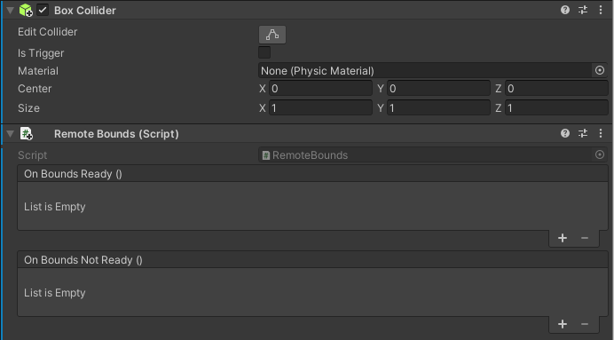

1. Run the application again. Shortly after the model loads, you'll see the bounds for the remote object. You'll see something like the below values:

     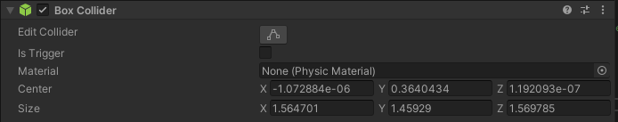

Now we have a local **BoxCollider** configured with accurate bounds on the Unity object. The bounds allow for visualization and interaction using the same strategies we'd use for a locally rendered object. For example, scripts that alter the Transform, physics, and more.

## Move, rotate, and scale  

Moving, rotating, and scaling remotely rendered objects works the same as any other Unity object. The **RemoteRenderingCoordinator**, in its `LateUpdate` method, is calling `Update` on the currently active session. Part of what `Update` does is sync local model entity transforms with their remote counterparts. To move, rotate, or scale a remotely rendered model, you only need to move, rotate, or scale the transform of the GameObject representing remote model. Here, we're going to modify the transform of the parent GameObject that has the **RemoteRenderedModel** script attached to it.

This tutorial is using MRTK for object interaction. Most of the MRTK specific implementation for moving, rotating and scaling an object is outside the scope of this tutorial. There is a model view controller that comes pre-configured inside the **AppMenu**, in the **Model Tools** menu.

1. Ensure the **TestModel** GameObject created previously is in the scene.
1. Ensure the **AppMenu** prefab is in the scene.
1. Press Unity's Play button to play the scene and open the **Model Tools** menu inside the **AppMenu**.
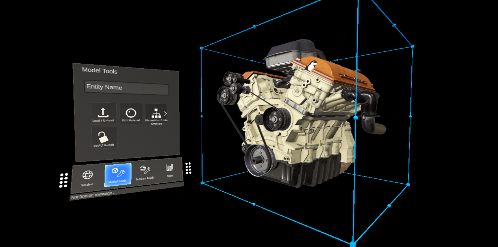

The **AppMenu** has a sub menu **Model Tools** that implements a view controller for binding with the model. When the GameObject contains a **RemoteBounds** component, the view controller will add a [**BoundingBox**](https://microsoft.github.io/MixedRealityToolkit-Unity/Documentation/README_BoundingBox.html) component, which is an MRTK component that renders a bounding box around an object with a **BoxCollider**. A [**ObjectManipulator**](/windows/mixed-reality/mrtk-unity/mrtk2/features/ux-building-blocks/object-manipulator), which is responsible for hand interactions. These scripts combined will allow us to move, rotate, and scale the remotely rendered model.

1. Move your mouse to the Game panel and click inside it to give it focus.
1. Using [MRTK's hand simulation](https://microsoft.github.io/MixedRealityToolkit-Unity/Documentation/InputSimulation/InputSimulationService.html#hand-simulation), press and hold the left Shift key.
1. Steer the simulated hand so the hand ray is pointing to the test model.

    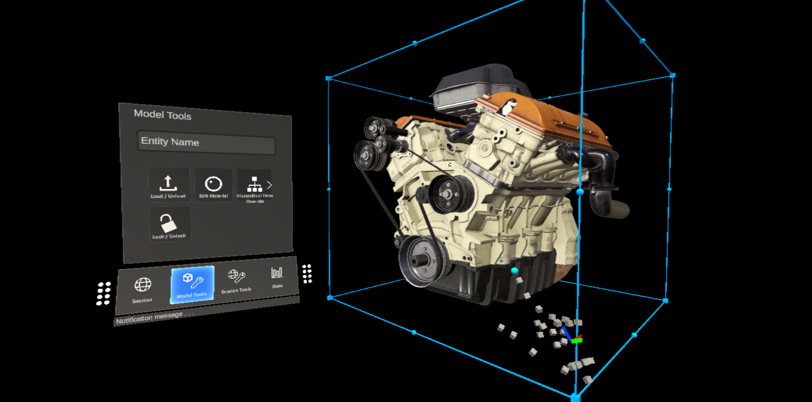

1. Hold left click and drag the model to move it.

You should see the remotely rendered content move along with the bounding box. You might notice some delay or lag between the bounding box and the remote content. This delay will depend on your internet latency and bandwidth.

## Ray cast and spatial queries of remote models

A box collider around models is suitable for interacting with the entire model, but not detailed enough to interact with individual parts of a model. To solve this, we can use [remote ray casting](../../../overview/features/spatial-queries.md#ray-casts). Remote ray casting is an API provided by Azure Remote Rendering to cast rays into the remote scene and return hit results locally. This technique can be used for selecting child entities of a large model or getting hit result information like position, surface normal, and distance.

The test model has a number of sub-entities that can be queried and selected. For now, the selection will output the name of the selected Entity to the Unity Console. Check the [Materials, lighting and effects](../materials-lighting-effects/materials-lighting-effects.md#highlighting-and-outlining) chapter for highlighting the selected Entity.

First, let's create a static wrapper around the remote ray cast queries. This script will accept a position and direction in Unity space, convert it to the data types accepted by the remote ray cast, and return the results. The script will make use of the `RayCastQueryAsync` API.

1. Create a new script called **RemoteRayCaster** and replace its contents with the following code:

    ```cs
    // Copyright (c) Microsoft Corporation. All rights reserved.
    // Licensed under the MIT License. See LICENSE in the project root for license information.

    using Microsoft.Azure.RemoteRendering;
    using Microsoft.Azure.RemoteRendering.Unity;
    using System.Linq;
    using System.Threading.Tasks;
    using UnityEngine;

    /// <summary>
    /// Wraps the Azure Remote Rendering RayCast queries to easily send requests using Unity data types
    /// </summary>
    public class RemoteRayCaster
    {
        public static double maxDistance = 30.0;

        public static async Task<RayCastHit[]> RemoteRayCast(Vector3 origin, Vector3 dir, HitCollectionPolicy hitPolicy = HitCollectionPolicy.ClosestHit)
        {
            if(RemoteRenderingCoordinator.instance.CurrentCoordinatorState == RemoteRenderingCoordinator.RemoteRenderingState.RuntimeConnected)
            {
                var rayCast = new RayCast(origin.toRemotePos(), dir.toRemoteDir(), maxDistance, hitPolicy);
                var result = await RemoteRenderingCoordinator.CurrentSession.Connection.RayCastQueryAsync(rayCast);
                return result.Hits;
            }
            else
            {
                return new RayCastHit[0];
            }
        }

        public static async Task<Entity[]> RemoteRayCastEntities(Vector3 origin, Vector3 dir, HitCollectionPolicy hitPolicy = HitCollectionPolicy.ClosestHit)
        {
            var hits = await RemoteRayCast(origin, dir, hitPolicy);
            return hits.Select(hit => hit.HitEntity).Where(entity => entity != null).ToArray();
        }
    }
    ```

    > [!NOTE]
    > Unity has a class named [**RaycastHit**](https://docs.unity3d.com/ScriptReference/RaycastHit.html), and Azure Remote Rendering has a class named [**RayCastHit**](/dotnet/api/microsoft.azure.remoterendering.raycasthit). The uppercase **C** is an important difference to avoid compile errors.

    **RemoteRayCaster** provides a common access point for casting remote rays into the current session. To be more specific, we'll implement an MRTK pointer handler next. The script will implement the `IMixedRealityPointerHandler` interface, which will tell MRTK that we want this script to listen for [Mixed Reality Pointer](https://microsoft.github.io/MixedRealityToolkit-Unity/Documentation/Input/Pointers.html) events.

1. Create a new script called **RemoteRayCastPointerHandler** and replace the code with the following code:

    ```cs
    // Copyright (c) Microsoft Corporation. All rights reserved.
    // Licensed under the MIT License. See LICENSE in the project root for license information.

    using Microsoft.Azure.RemoteRendering;
    using Microsoft.MixedReality.Toolkit.Input;
    using System;
    using System.Linq;
    using System.Threading.Tasks;
    using UnityEngine;

    public class RemoteRayCastPointerHandler : BaseRemoteRayCastPointerHandler, IMixedRealityPointerHandler
    {
        public UnityRemoteEntityEvent OnRemoteEntityClicked = new UnityRemoteEntityEvent();

        public override event Action<Entity> RemoteEntityClicked;

        public void Awake()
        {
            // Forward events to Unity events
            RemoteEntityClicked += (entity) => OnRemoteEntityClicked?.Invoke(entity);
        }

        public async void OnPointerClicked(MixedRealityPointerEventData eventData)
        {
            if (RemoteEntityClicked != null) //Ensure someone is listening before we do the work
            {
                var firstHit = await PointerDataToRemoteRayCast(eventData.Pointer);
                if (firstHit.success)
                    RemoteEntityClicked.Invoke(firstHit.hit.HitEntity);
            }
        }

        public void OnPointerDown(MixedRealityPointerEventData eventData) { }

        public void OnPointerDragged(MixedRealityPointerEventData eventData) { }

        public void OnPointerUp(MixedRealityPointerEventData eventData) { }

        private async Task<(bool success, RayCastHit hit)> PointerDataToRemoteRayCast(IMixedRealityPointer pointer, HitCollectionPolicy hitPolicy = HitCollectionPolicy.ClosestHit)
        {
            RayCastHit hit;
            var result = pointer.Result;
            if (result != null)
            {
                var endPoint = result.Details.Point;
                var direction = pointer.Rays[pointer.Result.RayStepIndex].Direction;
                Debug.DrawRay(endPoint, direction, Color.green, 0);
                hit = (await RemoteRayCaster.RemoteRayCast(endPoint, direction, hitPolicy)).FirstOrDefault();
            }
            else
            {
                hit = new RayCastHit();
            }
            return (hit.HitEntity != null, hit);
        }
    }
    ```

**RemoteRayCastPointerHandler**'s `OnPointerClicked` method is called by MRTK when a Pointer 'clicks' on a collider, like our box collider. After that, `PointerDataToRemoteRayCast` is called to convert the pointer's result into a point and direction. That point and direction are then used to cast a remote ray in the remote session.

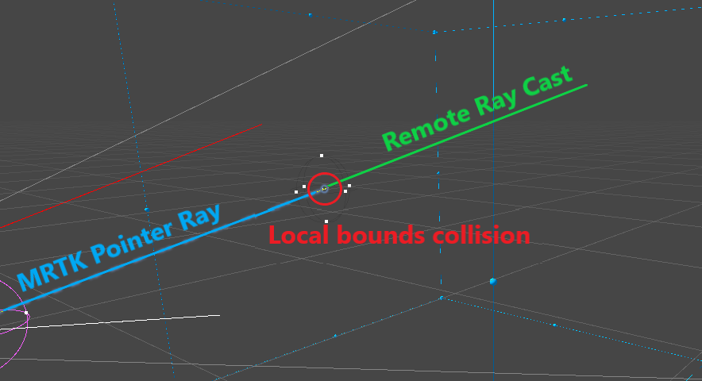

Sending requests for ray casting on click is an efficient strategy for querying remote objects. However, it's not an ideal user experience because the cursor collides with the box collider, not the model itself.

You could also create a new MRTK pointer that casts its rays in the remote session more frequently. Although this is a more complex approach, the user experience would be better. This strategy is outside the scope of this tutorial, but an example of this approach can be seen in the Showcase App, found in the [ARR samples repository](https://github.com/Azure/azure-remote-rendering/tree/master/Unity/Showcase).

When a ray cast is completed successfully in the **RemoteRayCastPointerHandler**, the hit `Entity` is emitted from the `OnRemoteEntityClicked` Unity event. To respond to that event, we'll create a helper script that accepts the `Entity` and performs an action on it. Let's start by getting the script to print the name of the `Entity` to the debug log.

1. Create a new script named **RemoteEntityHelper** and replace its contents with the below:

    ```cs
    // Copyright (c) Microsoft Corporation. All rights reserved.
    // Licensed under the MIT License. See LICENSE in the project root for license information.
    
    using Microsoft.Azure.RemoteRendering;
    using Microsoft.Azure.RemoteRendering.Unity;
    using UnityEngine;
    
    public class RemoteEntityHelper : MonoBehaviour
    {
        public void EntityToDebugLog(Entity entity)
        {
            Debug.Log(entity.Name);
        }
    }
    ```

1. On the **TestModel** GameObject created previously, add both the **RemoteRayCastPointerHandler** component and the **RemoteEntityHelper** component.
1. Assign the `EntityToDebugLog` method to the `OnRemoteEntityClicked` event. When the event's output type and method's input type match, we can use Unity's dynamic event hookup, that will automatically pass the event value into the method.
    1. Create a new callback field
    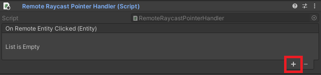
    1. Drag **Remote Entity Helper** component into the Object field, to reference the parent GameObject
    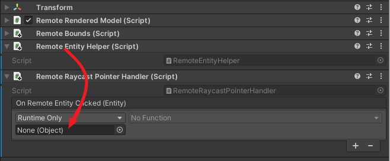
    1. Assign the `EntityToDebugLog` as the callback
    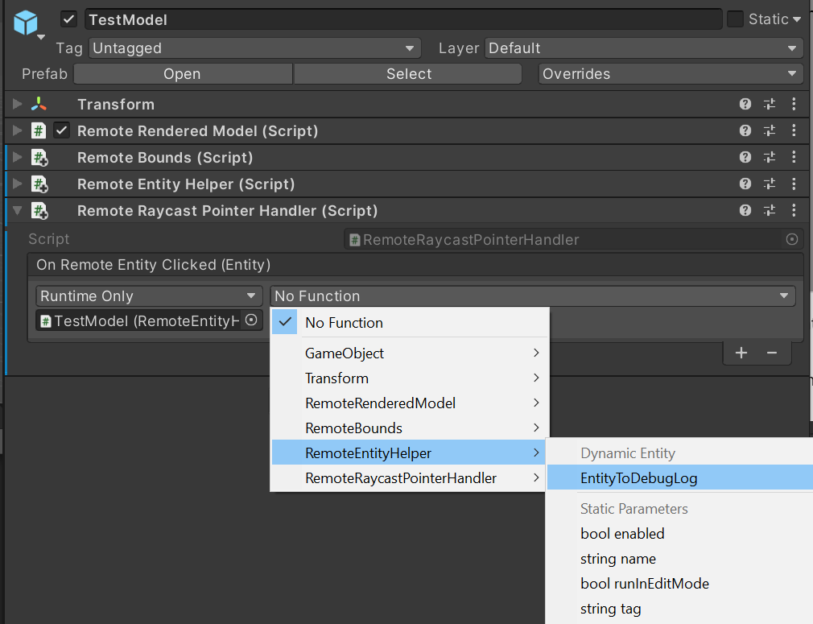
1. Press play in the Unity Editor to start the scene, connect to a remote session and load the test model.
1. Using MRTK's hand simulation press and hold the left Shift key.
1. Steer the simulated hand so the hand ray is pointing to the test model.
1. Long click to simulate an air-tap, executing the `OnPointerClicked` event.
1. Observe the Unity Console for a log message with the name of the child entity selected. For example:
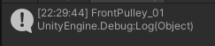

## Synchronizing the remote object graph into the Unity hierarchy

Up to this point, we've only seen a single local GameObject representing the entire model. This works well for rendering and manipulation of the entire model. However, if we want to apply effects or manipulate specific sub-entities, we'll need to create local GameObjects to represent those entities. First, we can explore manually in the test model.

1. Start the scene and load the test model.
1. Expand the children of the **TestModel** GameObject in Unity's hierarchy and select the **TestModel_Entity** GameObject.
1. In the Inspector, click the *Show Children* button.
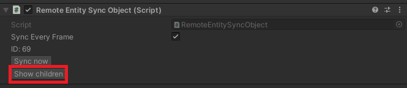
1. Continue to expand children in the hierarchy and clicking *Show Children* until a large list of children is shown.
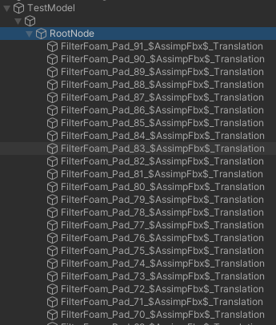

A list of dozens of entities will now populate the hierarchy. Selecting one of them will show the `Transform` and `RemoteEntitySyncObject` components in the Inspector. By default, each entity isn't automatically synced every frame, so local changes to the `Transform` aren't synced to the server. You can check *Sync Every Frame* and then move, scale, or rotate the transform in the Scene view, you will not see the rendered model in the scene view, watch the Game view to see the model's position and rotation visually update.

The same process can be done programmatically and is the first step in modifying specific remote entities.

1. Modify the **RemoteEntityHelper** script to also contain the following method:

    ```cs
    public void MakeSyncedGameObject(Entity entity)
    {
        var entityGameObject = entity.GetOrCreateGameObject(UnityCreationMode.DoNotCreateUnityComponents);
        var sync = entityGameObject.GetComponent<RemoteEntitySyncObject>();
        sync.SyncEveryFrame = true;
    }
    ```

1. Add an additional callback to the **RemoteRayCastPointerHandler** event `OnRemoteEntityClicked`, setting it to `MakeSyncedGameObject`.
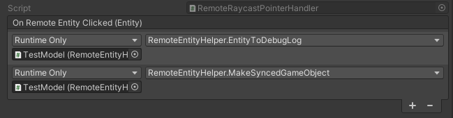
1. Using MRTK's hand simulation press and hold the left Shift key.
1. Steer the simulated hand so the hand ray is pointing to the test model.
1. Long click to simulate an air-tap, executing the `OnPointerClicked` event.
1. Check and expand the Hierarchy to see a new child object, representing the clicked entity.
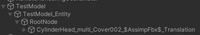
1. After testing, remove the callback for `MakeSyncedGameObject`, since we'll incorporate this as part of other effects later.

> [!NOTE]
> Syncing every frame is only required when you need to sync the transform data. There is some overhead to syncing transforms, so it should be used sparingly.

Creating a local instance and making it automatically sync is the first step in manipulating sub-entities. The same techniques we've used to manipulate the model as a whole can be used on the sub-entities as well. For example, after creating a synced local instance of an entity, you could query its bounds and add manipulation handlers to allow it to be moved around by the user's hand rays.

## Next steps

You can now manipulate and interact with your remotely rendered models! In the next tutorial, we'll cover modifying materials, altering the lighting, and applying effects to remotely rendered models.

> [!div class="nextstepaction"]
> [Next: Refining materials, lighting, and effects](../materials-lighting-effects/materials-lighting-effects.md)