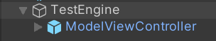

# Tutorial: Manipulating models

In this tutorial, you learn how to:

> [!div class="checklist"]
>
> * Add Mixed Reality Toolkit (MRTK) to the project.
> * Add visual and manipulation bounds around remotely rendered models.
> * Move, Rotate and Scale.
> * Raycast with spatial queries.
> * Simple animations for remotely rendered objects

## Prerequisites

* This tutorial builds on top of [Tutorial: Viewing a remotely rendered model](..\view-remote-models\view-remote-models.md).

## Getting Started with Mixed Reality Toolkit (MRTK)

The Mixed Reality Toolkit (MRTK) is a cross-platform toolkit for building Mixed Reality experiences. We'll use MRTK for its input and interaction features.

To add MRTK, follow the [Required steps](https://microsoft.github.io/MixedRealityToolkit-Unity/Documentation/GettingStartedWithTheMRTK.html#required) defined in [Getting started with MRTK](https://microsoft.github.io/MixedRealityToolkit-Unity/Documentation/GettingStartedWithTheMRTK.html).

Once MRTK is included in the project, we'll copy the default HoloLens 2 profile and make a few modifications.

1. Select the **MixedRealityToolkit** GameObject in the scene hierarchy.
1. In the Inspector, under the **MixedRealityToolkit** component, switch the configuration profile to *DefaultHoloLens2ConfigurationProfile* and press the **Clone** button.
 \
1. In the clone dialog window, the default settings are suitable, so press **Clone**
 \
1. With your new configuration profile selected, select **Diagnostics** and press the **Clone** button to clone the diagnostics profile. Confirm the default settings in the clone dialog window by pressing **Clone**.
1. With your new diagnostic profile selected, un-check **Show Profiler**. The profiler is a very useful tool and can be toggled at run-time using the voice command "Toggle Profiler" or the '9' key on the keyboard's number row.

## Import assets used by this tutorial

Starting in this chapter, this tutorial implements a simple [model-view-controller pattern](https://en.wikipedia.org/wiki/Model%E2%80%93view%E2%80%93controller) for much of the material covered. The *model* part of the pattern is all the Azure Remote Rendering specific code and the state management related to Azure Remote Rendering. The *view* and *controller* parts of the pattern are implemented using MRTK assets and some custom scripts. It is possible to be able to use the *model* in this tutorial without the *view-controller* implemented here. This separation allows you to easily integrate the code found in this tutorial into your own application, where your application will take over the *view-controller* part of the design pattern.

With the introduction of MRTK, there are a number of scripts, prefabs, and assets that can now be added to the project to support interactions and visual feedback. These assets are bundled into a [Unity Asset Package](https://docs.unity3d.com/Manual/AssetPackages.html), which can be downloaded \[here](todo\path\to\asset-package).

1. Download the package \[here](todo\path\to\asset-package)
1. In your Unity project, choose **Assets** > **Import Package** > **Custom Package**.
1. In the file explorer, select the asset package you downloaded in step 1.
1. Select the **Import** button to import the contents of the package into your project.\
\
*If using the Universal Render Pipeline:*

1. In the Unity Editor, select **Mixed Reality Toolkit** > **Utilities** > **Upgrade MRTK Standard Shader for Lightweight Render Pipeline** from the top menu bar, and follow the prompts to upgrade the shader.

Most of view controllers in this tutorial operate against abstract base classes instead of against concrete classes. This pattern provides better flexibility and allows the tutorial to provide the view controllers for you, while still allowing you to implement and learn the Azure Remote Rendering specific code yourself. For the simplicity of the tutorial, the **RemoteRenderingCoordinator** class does not have an abstract class provided and its view controller operates directly against the concrete class.

An abstract class has been provided for the **RemoteRenderedModel** script we created in a previous tutorial. To enable the view controller for models, modify the **RemoteRenderedModel** script to implement the abstract class by replacing `MonoBehaviour` with `BaseRemoteRenderedModel` in the class signature. It should look as follows when complete:

```csharp
public class RemoteRenderedModel : BaseRemoteRenderedModel
```

Then you'll need to add the `override` modifier to the properties and methods defined in `BaseRemoteRenderedModel`. These properties and methods are already defined in our code, but need the `override` modifier to make the compiler happy. Insert the `override` modifier just after the scope (for example: `public`) on each of the properties and methods listed indie the `BaseRemoteRenderedModel` class. Those signatures for those properties and methods should look like the following when complete:


- `public override string ModelDisplayName`
- `public override string ModelPath`
- `public override ModelState CurrentModelState`
- `public override Entity ModelEntity`
- `public override event Action<float> LoadProgress`
- `public override event Action<ModelState> ModelStateChange`
- `public override void SetLoadingProgress(float progressValue)`
- `public override void LoadModel()`
- `public override void UnloadModel()`

This modification allows the view controller to view and control the **RemoteRenderedModel** component.

You can now add the prefab **RemoteRenderingViewController** to the scene, for visual feedback of the current session state.

## Query remote object bounds and apply to local bounds

To interact with remote objects, we need a local representation to interact with first. The [objects bounds](../../../concepts/object-bounds.md) are useful for quick manipulation of a remote object. We can query the bounds of a remotely rendered model from the current session, using the entity object created when loading a remotely rendered model. The bounds are queried after the model has been loaded into the remote session. The bounds of a model are defined by the box or cuboid that contains the entire model. Exactly like Unity's [**BoxCollider**](https://docs.unity3d.com/Manual/class-BoxCollider.html), which has a center and size defined for the x,y,z axes. In fact, we'll use Unity's **BoxCollider** to represent the bounds of the remote model.

1. Create a new script in the same directory as **RemoteRenderedModel** and name it **RemoteBounds**.
2. Replace the contents of the script with the following code:

```csharp
// Copyright (c) Microsoft Corporation. All rights reserved.
// Licensed under the MIT License. See LICENSE in the project root for license information.

using Microsoft.Azure.RemoteRendering;
using Microsoft.Azure.RemoteRendering.Unity;
using System;
using UnityEngine;

[RequireComponent(typeof(BaseRemoteRenderedModel))]
public class RemoteBounds : BaseRemoteBounds
{
    //Remote bounds works with a specific remotely rendered model
    private BaseRemoteRenderedModel targetModel = null;

    private BoundsQueryAsync remoteBoundsQuery = null;

    private RemoteBoundsState currentBoundsState = RemoteBoundsState.NotReady;

    public override RemoteBoundsState CurrentBoundsState
    {
        get => currentBoundsState;
        protected set
        {
            if (currentBoundsState != value)
            {
                currentBoundsState = value;
                BoundsStateChange?.Invoke(value);
            }
        }
    }

    public override event Action<RemoteBoundsState> BoundsStateChange;

    public void Awake()
    {
        BoundsStateChange += HandleUnityEvents;
        targetModel = GetComponent<BaseRemoteRenderedModel>();

        targetModel.ModelStateChange += TargetModel_OnModelStateChange;
        TargetModel_OnModelStateChange(targetModel.CurrentModelState);
    }

    private void TargetModel_OnModelStateChange(ModelState state)
    {
        switch (state)
        {
            case ModelState.Loaded:
                QueryBounds();
                break;
            default:
                BoundsBoxCollider.enabled = false;
                CurrentBoundsState = RemoteBoundsState.NotReady;
                break;
        }
    }

    // Create a query using the model entity
    private void QueryBounds()
    {
        //Implement me
    }

    // Check the result and apply it to the local Unity bounding box if it was successful
    private void ProcessQueryResult(BoundsQueryAsync remoteBounds)
    {
        //Implement me
    }
}
```

This script is intended to be added to the same GameObject as a script that implements the **BaseRemoteRenderedModel** script, in this case, that means the **RemoteRenderedModel**. Similar to previous scripts, this initial code will handle all the state changes, events, and data related to remote bounds. There are two methods left to implement, the `QueryBounds` method that fetches the bounds and `ProcessQueryResult`, which takes the result of the query and applies it to the local **BoxCollider**.

The `QueryBounds` method is straight forward: send a query to the remote rendering session and listen for the `Completed` event.

3. Replace the `QueryBounds` method with the following completed method:

```csharp
// Create a query using the model entity
private void QueryBounds()
{
    remoteBoundsQuery = targetModel.ModelEntity.QueryLocalBoundsAsync();
    CurrentBoundsState = RemoteBoundsState.Updating;
    remoteBoundsQuery.Completed += ProcessQueryResult;
}
```

`ProcessQueryResult` is similarly straight forward, we'll check the result to see if it was successful and if so, convert and apply the returned bounds in a format that the **BoxCollider** can accept.

4. Replace the `ProcessQueryResult` method with the following completed method:

```csharp
// Check the result and apply it to the local Unity bounding box if it was successful
private void ProcessQueryResult(BoundsQueryAsync remoteBounds)
{
    if (remoteBounds.IsRanToCompletion)
    {
        var newBounds = remoteBounds.Result.toUnity();
        BoundsBoxCollider.center = newBounds.center;
        BoundsBoxCollider.size = newBounds.size;
        BoundsBoxCollider.enabled = true;
        CurrentBoundsState = RemoteBoundsState.Ready;
    }
    else
    {
        CurrentBoundsState = RemoteBoundsState.Error;
    }
}
```

Now, adding the **RemoteBounds** script to the same game object as the **RemoteRenderedModel** will result in a **BoxCollider** also being added and when the model reaches its `Loaded` state, the bounds will automatically be queried and applied to the **BoxCollider**.

1. Using the **TestModel** GameObject created previously. Add the **RemoteBounds** component.
1. Confirm the script is added and also added a **BoxCollider** component.\
 \
1. Run the application again. Shortly after the model loads, you will be able to see the bounds for the remote object. Something like the below values:\
 \

Now we have a local **BoxCollider** configured with accurate bounds on the local Unity object. The bounds allow for visualization and interaction using any of the strategies we'd use to interact with a locally rendered object, that is, scripts that alter the Transform, physics, etc.

## Move, rotate, and scale  

Moving, rotating, and scaling remotely rendered objects is exactly like doing the same with any other Unity object. The **RemoteRenderingCoordinator**, in its `LateUpdate` method is calling `Update` on the currently active session. Part of what `Update` does is sync local model entity transforms with their remote counterparts. To move/rotate/scale a remotely rendered model, you only need move/rotate/scale the transform of the GameObject representing remote model. Here, we're going to modify the transform of the parent GameObject that has the **RemoteRenderedModel** script attached to it.

This tutorial is using MRTK for object interaction. In the included tutorial assets there is a view controller prefab and script for remotely rendered models called **RemoteModelViewController**. This view controller comes pre-configured inside of a prefab **ModelViewController**.

1. Locate the **ModelViewController** prefab in *Assets/RemoteRenderingTutorial/Prefabs/ModelViewController*
1. Ensure the **TestModel** GameObject created previously is in the scene.
1. Drag the **ModelViewController** prefab into the scene, dropping it on top of the **TestModel** GameObject, making the new prefab a child of the **TestModel** GameObject.\
\
1. Press Unity's Play button to play the scene and see the view controller.
\

This view controller script will show a UI with the model's name and controls specific to the model. The controls available will depend on the scripts attached to the target GameObject. When the GameObject contains a **RemoteBounds** component, the view controller will add a [**BoundingBox**](https://microsoft.github.io/MixedRealityToolkit-Unity/Documentation/README_BoundingBox.html) component, which is an MRTK component that renders a bounding box around an object that has a **BoxCollider**. Further, the **RemoteModelViewController** also adds [**ManipulationHandler**](https://microsoft.github.io/MixedRealityToolkit-Unity/Documentation/README_ManipulationHandler.html), which is responsible for hand interactions like dragging and two handed interactions like rotating and scaling. These scripts combined will allow us to move, rotate and scale the remotely rendered model.

## Ray cast and spatial queries of remote models

A box collider around models is suitable for interacting with the entire model, but not detailed enough to interact with individual parts of a model. To solve this, we can use [remote ray casting](../../../overview/features/spatial-queries.md#ray-casts). Remote ray casting is an API provided by Azure Remote Rendering to cast rays into the remote scene, and return hit results locally. This technique can be used for selecting child entities of a large model and/or getting specific information about hit results like: position, surface normal, and distance.

The test model has a number of sub-entities that can be queried and selected. For now, the selection will output the name of the selected Entity to the Unity Console. Check the [Materials, lighting and effects](../materials-lighting-effects/materials-lighting-effects.md#highlighting-and-outlining) chapter for highlighting the selected Entity.

First let's create a static wrapper around the remote ray cast queries. This script will accept a position and direction in Unity space, convert it to the data types accepted by the remote ray cast, and finally return the results. The script will make use of the `RayCastQueryAsync` API.

1. Create a new script called **RemoteRayCaster** and replace its contents with the following code:

```csharp
// Copyright (c) Microsoft Corporation. All rights reserved.
// Licensed under the MIT License. See LICENSE in the project root for license information.

using Microsoft.Azure.RemoteRendering;
using Microsoft.Azure.RemoteRendering.Unity;
using System.Linq;
using System.Threading.Tasks;
using UnityEngine;

/// <summary>
/// Wraps the Azure Remote Rendering RayCast queries to easily send requests using Unity data types
/// </summary>
public class RemoteRayCaster
{
    public static double maxDistance = 30.0;

    public static async Task<RayCastHit[]> RemoteRayCast(Vector3 origin, Vector3 dir, HitCollectionPolicy hitPolicy = HitCollectionPolicy.ClosestHit)
    {
        if(RemoteRenderingCoordinator.instance.CurrentCoordinatorState == RemoteRenderingState.RuntimeConnected)
        {
            var rayCast = new RayCast(origin.toRemotePos(), dir.toRemoteDir(), maxDistance, hitPolicy);
            return await RemoteRenderingCoordinator.CurrentSession.Actions.RayCastQueryAsync(rayCast).AsTask();
        }
        else
        {
            return new RayCastHit[0];
        }
    }

    public static async Task<Entity[]> RemoteRayCastEntities(Vector3 origin, Vector3 dir, HitCollectionPolicy hitPolicy = HitCollectionPolicy.ClosestHit)
    {
        var hits = await RemoteRayCast(origin, dir, hitPolicy);
        return hits.Select(hit => hit.HitEntity).Where(entity => entity != null).ToArray();
    }
}
```

> [!NOTE]
> Unity has a class named [**RaycastHit**](https://docs.unity3d.com/ScriptReference/RaycastHit.html), and Azure Remote Rendering has a class named [**RayCastHit**](https://docs.microsoft.com/dotnet/api/microsoft.azure.remoterendering.raycasthit). The uppercase **C** is an important difference to avoid compile errors.

2. **RemoteRayCaster** provides a common access point for casting remote rays into the current session. To be more specific, next we'll implement an MRTK pointer handler. The script will implement the `IMixedRealityPointerHandler` interface, which will tell MRTK we want this script to listen for [Mixed Reality Pointer](https://microsoft.github.io/MixedRealityToolkit-Unity/Documentation/Input/Pointers.html) events. Create a new script called **RemoteRaycastPointerHandler** and replace the code with the following code:

```csharp
// Copyright (c) Microsoft Corporation. All rights reserved.
// Licensed under the MIT License. See LICENSE in the project root for license information.

using Microsoft.Azure.RemoteRendering;
using Microsoft.MixedReality.Toolkit.Input;
using System;
using System.Linq;
using System.Threading.Tasks;
using UnityEngine;

public class RemoteRayCastPointerHandler : BaseRemoteRayCastPointerHandler, IMixedRealityPointerHandler
{
    public UnityRemoteEntityEvent OnRemoteEntityClicked = new UnityRemoteEntityEvent();

    public override event Action<Entity> RemoteEntityClicked;

    public override void ClearClickedEvents()
    {
        RemoteEntityClicked = null;
    }

    public void Awake()
    {
        // Forward events to Unity events
        RemoteEntityClicked += (entity) => RemoteEntityClicked?.Invoke(entity);
    }

    public async void OnPointerClicked(MixedRealityPointerEventData eventData)
    {
        if (RemoteEntityClicked != null) //Ensure someone is listening before we do the work
        {
            var firstHit = await PointerDataToRemoteRayCast(eventData.Pointer);
            if (firstHit.success)
                RemoteEntityClicked.Invoke(firstHit.hit.HitEntity);
        }
    }

    public void OnPointerDown(MixedRealityPointerEventData eventData) { }

    public void OnPointerDragged(MixedRealityPointerEventData eventData) { }

    public void OnPointerUp(MixedRealityPointerEventData eventData) { }

    private async Task<(bool success, RayCastHit hit)> PointerDataToRemoteRayCast(IMixedRealityPointer pointer, HitCollectionPolicy hitPolicy = HitCollectionPolicy.ClosestHit)
    {
        RayCastHit hit;
        var result = pointer.Result;
        if (result != null)
        {
            var endPoint = result.Details.Point;
            var direction = pointer.Rays[pointer.Result.RayStepIndex].Direction;
            hit = (await RemoteRayCaster.RemoteRayCast(endPoint, direction, hitPolicy)).FirstOrDefault();
        }
        else
        {
            hit = new RayCastHit();
        }
        return (hit.HitEntity != null, hit);
    }
}
```

**RemoteRayCastPointerHandler**'s `OnPointerClicked` method is called by MRTK when a Pointer 'clicks' on a collider, like our box collider. After that, `PointerDataToRemoteRayCast` is called to convert the pointer's result into a point and direction. That point and direction are then used to cast a remote ray in the remote session.


Sending requests for ray casting on click is an efficient strategy for querying remote objects. However, it's not an ideal user experience, since the cursor is rendered colliding with the box collider and not the model itself. A more complex approach, but better user experience would be to create a new MRTK pointer that casts its rays in the remote session much more frequently. This more complex strategy is outside the scope of this tutorial, but an example of this approach can be seen in the Showcase App, found in the [ARR samples repository](https://github.com/Azure/azure-remote-rendering/tree/master/Unity/AzureRemoteRenderingShowcase).

When a successful ray cast is completed in the **RemoteRayCastPointerHandler**, the hit `Entity` is emitted from the `OnRemoteEntityClicked` Unity event. To respond to that event, we'll create a helper script that accepts the `Entity` and performs an action on it. Starting simple, the script will print the name of the `Entity` to the debug log.

1. Create a new script named **RemoteEntityHelper** and replace its contents with the below:

```csharp
// Copyright (c) Microsoft Corporation. All rights reserved.
// Licensed under the MIT License. See LICENSE in the project root for license information.

using Microsoft.Azure.RemoteRendering;
using UnityEngine;

public class RemoteEntityHelper : MonoBehaviour
{
    public void EntityToDebugLog(Entity entity)
    {
        Debug.Log(entity.Name);
    }
}
```

2. On the **TestModel** GameObject created previously, add both the **RemoteRayCastPointerHandler** component and the **RemoteEntityHelper** component.
1. Assign the `EntityToDebugLog` method to the `OnRemoteEntityClicked` event. When the event's output type and method's input type match, we can use Unity's dynamic event hookup, that will automatically pass the event value into the method.\
    1. Create a new callback field\
    
    1. Drag the parent GameObject into the Object field\
    
    1. Assign the `EntityToDebugLog` as the callback\
    
1. Press play in the Unity Editor to start the scene, connect to a remote session and load the test model.
1. Using [MRTK's hand simulation](https://microsoft.github.io/MixedRealityToolkit-Unity/Documentation/InputSimulation/InputSimulationService.html#hand-simulation), press and hold the left Shift key.
1. Steer the simulated hand so the hand ray is pointing to the test model.\

1. Long click to perform a simulated air-tap, executing the `OnPointerClicked` event.
1. Observe the Unity Console for a log message with the name of the child entity selected. For example:\


## Synchronizing the remote object graph into the Unity hierarchy

Up to this point, we've only seen a single local GameObject representing the entire model. This works well for rendering the entire model and manipulation for the entire model. However, if we want to apply effects or manipulate specific sub-entities of a remote model, we'll need to create additional local GameObjects to represent those entities. First, we can explore manually in the test model.

1. Start the scene and load the test model.
1. Expand the children of the **TestModel** GameObject in Unity's hierarchy and select the **TestModel_Entity** GameObject.
1. In the Inspector, click the *Show Children* button.\

1. Continue to expand children in the hierarchy and clicking *Show Children* until a large list of children is shown.\


A list of dozens of entities will now populate the hierarchy. Selecting one of them will show the `Transform` and `RemoteEntitySyncObject` components in the Inspector. By default, each entity is not automatically synced every frame, so local changes to the `Transform` are not synced to the server. You can check *Sync Every Frame* and then move, scale, or rotate the child object in the Scene view to see it visually updated in the Game view.

The same process, but more selective, can be done programmatically.

1. Modify the **RemoteEntityHelper** script to also contain the following method:

```csharp
public void MakeSyncedGameObject(Entity entity)
{
    var entityGameObject = entity.GetOrCreateGameObject(UnityCreationMode.DoNotCreateUnityComponents);
    var sync = entityGameObject.GetComponent<RemoteEntitySyncObject>();
    sync.SyncEveryFrame = true;
}
```

2. Add an additional callback to the **RemoteRayCastPointerHandler** event `OnRemoteEntityClicked`, setting it to `MakeSyncedGameObject`.\

1. Follow the same steps using hand simulation to execute the `OnPointerClicked` event.
1. Check and expand the Hierarchy to see a new child object, representing the clicked entity.


> [!NOTE]
> Syncing every frame is only required when you need to sync the transform data. There is a small overhead to syncing transforms, so it should be used sparingly.

Creating a local instance and making it automatically sync is the first step in manipulating sub-entities. The same techniques we've used to manipulate the model as a whole can be performed on the sub-entities as well. For example, after creating a synced local instance of an entity, you could query it's bounds and add manipulation handlers to allow it to be moved around by the user's hand rays.

## Next steps

You can now manipulate and interact with your remotely rendered models! In the next tutorial we'll cover modifying materials, altering the lighting and applying certain effects to remotely rendered models.

> [!div class="nextstepaction"]
> [Next: Refining materials, lighting, and effects](../materials-lighting-effects/materials-lighting-effects.md)
