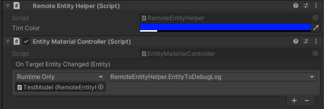
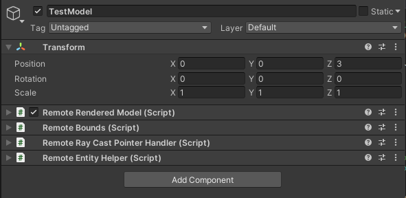
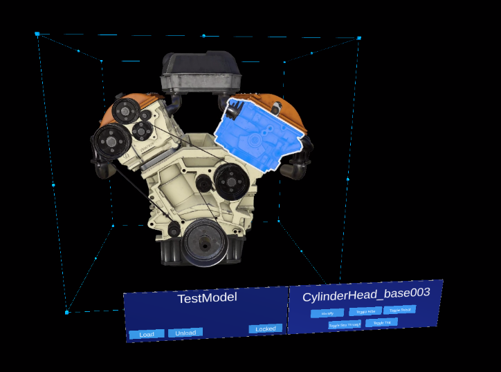
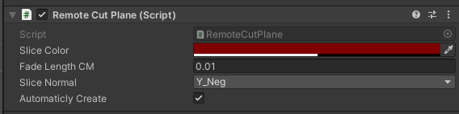
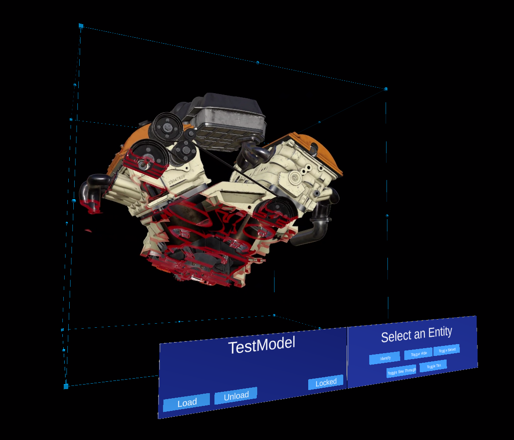
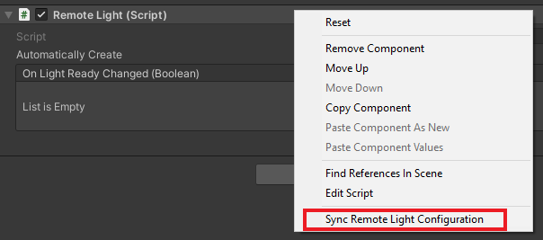
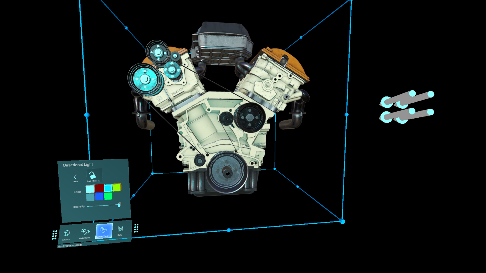
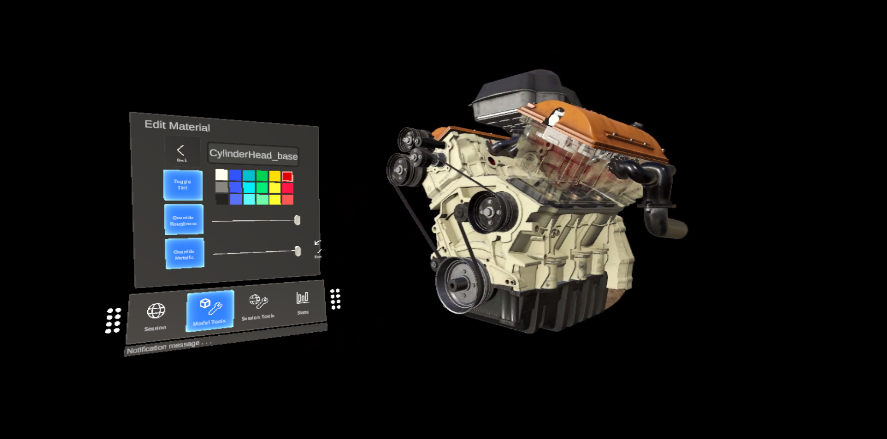

# Tutorial: Refining materials, lighting, and effects

In this tutorial, you learn how to:

> [!div class="checklist"]
>
> * Highlight and outline models and model components
> * Apply different materials to models
> * Slice through models with cut planes
> * Add simple animations for remotely rendered objects

## Prerequisites

* This tutorial builds on [Tutorial: Manipulating models](..\manipulate-models\manipulate-models.md).

## Highlighting and outlining

Providing visual feedback to the user is an important part of the user experience in any application. Azure Remote Rendering provides visual feedback mechanisms through [Hierarchical state overrides](../../../overview/features/override-hierarchical-state.md). The hierarchical state overrides are implemented with components attached to local instances of models. We learned how to create these local instances in [Synchronizing the remote object graph into the Unity hierarchy](../manipulate-models/manipulate-models.md#synchronizing-the-remote-object-graph-into-the-unity-hierarchy).

First, we'll create a wrapper around the [**HierarchicalStateOverrideComponent**](https://docs.microsoft.com/dotnet/api/microsoft.azure.remoterendering.hierarchicalstateoverridecomponent) component. The **HierarchicalStateOverrideComponent** is the local script that controls the overrides on the remote entity. The [**Tutorial Assets**](../custom-models/custom-models.md#import-assets-used-by-this-tutorial) include an abstract base class called **BaseEntityOverrideController**, which we'll extend to create the wrapper.

1. Create a new script named **EntityOverrideController** and replace its contents with the following code:

    ```csharp
    // Copyright (c) Microsoft Corporation. All rights reserved.
    // Licensed under the MIT License. See LICENSE in the project root for license information.

    using Microsoft.Azure.RemoteRendering;
    using Microsoft.Azure.RemoteRendering.Unity;
    using System;
    using UnityEngine;

    public class EntityOverrideController : BaseEntityOverrideController
    {
        public override event Action<HierarchicalStates> FeatureOverrideChange;

        private ARRHierarchicalStateOverrideComponent localOverride;
        public override ARRHierarchicalStateOverrideComponent LocalOverride
        {
            get
            {
                if (localOverride == null)
                {
                    localOverride = gameObject.GetComponent<ARRHierarchicalStateOverrideComponent>();
                    if (localOverride == null)
                    {
                        localOverride = gameObject.AddComponent<ARRHierarchicalStateOverrideComponent>();
                    }

                    var remoteStateOverride = TargetEntity.Entity.FindComponentOfType<HierarchicalStateOverrideComponent>();

                    if (remoteStateOverride == null)
                    {
                        // if there is no HierarchicalStateOverrideComponent on the remote side yet, create one
                        localOverride.Create(RemoteManagerUnity.CurrentSession);
                    }
                    else
                    {
                        // otherwise, bind our local stateOverride component to the remote component
                        localOverride.Bind(remoteStateOverride);

                    }
                }
                return localOverride;
            }
        }

        private RemoteEntitySyncObject targetEntity;
        public override RemoteEntitySyncObject TargetEntity
        {
            get
            {
                if (targetEntity == null)
                    targetEntity = gameObject.GetComponent<RemoteEntitySyncObject>();
                return targetEntity;
            }
        }

        private HierarchicalEnableState ToggleState(HierarchicalStates feature)
        {
            HierarchicalEnableState setToState = HierarchicalEnableState.InheritFromParent;
            switch (LocalOverride.RemoteComponent.GetState(feature))
            {
                case HierarchicalEnableState.ForceOff:
                case HierarchicalEnableState.InheritFromParent:
                    setToState = HierarchicalEnableState.ForceOn;
                    break;
                case HierarchicalEnableState.ForceOn:
                    setToState = HierarchicalEnableState.InheritFromParent;
                    break;
            }

            return SetState(feature, setToState);
        }

        private HierarchicalEnableState SetState(HierarchicalStates feature, HierarchicalEnableState enableState)
        {
            if (GetState(feature) != enableState) //if this is actually different from the current state, act on it
            {
                LocalOverride.RemoteComponent.SetState(feature, enableState);
                FeatureOverrideChange?.Invoke(feature);
            }

            return enableState;
        }

        public override HierarchicalEnableState GetState(HierarchicalStates feature) => LocalOverride.RemoteComponent.GetState(feature);

        public override void ToggleHidden() => ToggleState(HierarchicalStates.Hidden);

        public override void ToggleSelect() => ToggleState(HierarchicalStates.Selected);

        public override void ToggleSeeThrough() => ToggleState(HierarchicalStates.SeeThrough);

        public override void ToggleTint(Color tintColor = default)
        {
            if (tintColor != default) LocalOverride.RemoteComponent.TintColor = tintColor.toRemote();
            ToggleState(HierarchicalStates.UseTintColor);
        }

        public override void ToggleDisabledCollision() => ToggleState(HierarchicalStates.DisableCollision);

        public override void RemoveOverride()
        {
            var remoteStateOverride = TargetEntity.Entity.FindComponentOfType<HierarchicalStateOverrideComponent>();
            if (remoteStateOverride != null)
            {
                remoteStateOverride.Destroy();
            }

            if (localOverride == null)
                localOverride = gameObject.GetComponent<ARRHierarchicalStateOverrideComponent>();

            if (localOverride != null)
            {
                Destroy(localOverride);
            }
        }
    }
    ```

**LocalOverride**'s main job is to create a link between itself and its `RemoteComponent`. The **LocalOverride** then allows us to set state flags on the local component, which are bound to the remote entity. The overrides and their states are described in the [Hierarchical state overrides](../../../overview/features/override-hierarchical-state.md) page. 

This implementation just toggles one state at a time. However, it's entirely possible to combine multiple overrides on single entities and to create combinations at different levels in the hierarchy. For example, combining `Selected` and `SeeThrough` on a single component would give it an outline while also making it transparent. Or, setting the root entity `Hidden` override to `ForceOn` while making a child entity's `Hidden` override to `ForceOff` would hide everything except for the child with the override.

To apply states to entities, we can modify the **RemoteEntityHelper** created previously.

1. Modify the **RemoteEntityHelper** class to implement the **BaseRemoteEntityHelper** abstract class. This modification will allow the use of a view controller provided in the **Tutorial Assets**. It should look like this when modified:

    ```csharp
    public class RemoteEntityHelper : BaseRemoteEntityHelper
    ```

2. Override the abstract methods using the following code:

    ```csharp
    public override BaseEntityOverrideController EnsureOverrideComponent(Entity entity)
    {
        var entityGameObject = entity.GetOrCreateGameObject(UnityCreationMode.DoNotCreateUnityComponents);
        var overrideComponent = entityGameObject.GetComponent<EntityOverrideController>();
        if (overrideComponent == null)
            overrideComponent = entityGameObject.AddComponent<EntityOverrideController>();
        return overrideComponent;
    }

    public override HierarchicalEnableState GetState(Entity entity, HierarchicalStates feature)
    {
        var overrideComponent = EnsureOverrideComponent(entity);
        return overrideComponent.GetState(feature);
    }

    public override void ToggleHidden(Entity entity)
    {
        var overrideComponent = EnsureOverrideComponent(entity);
        overrideComponent.ToggleHidden();
    }

    public override void ToggleSelect(Entity entity)
    {
        var overrideComponent = EnsureOverrideComponent(entity);
        overrideComponent.ToggleSelect();
    }

    public override void ToggleSeeThrough(Entity entity)
    {
        var overrideComponent = EnsureOverrideComponent(entity);
        overrideComponent.ToggleSeeThrough();
    }

    public Color TintColor = new Color(0.0f, 1.0f, 0.0f, 0.1f);
    public override void ToggleTint(Entity entity)
    {
        var overrideComponent = EnsureOverrideComponent(entity);
        overrideComponent.ToggleTint(TintColor);
    }

    public override void ToggleDisableCollision(Entity entity)
    {
        var overrideComponent = EnsureOverrideComponent(entity);
        overrideComponent.ToggleHidden();
    }

    public override void RemoveOverrides(Entity entity)
    {
        var entityGameObject = entity.GetOrCreateGameObject(UnityCreationMode.DoNotCreateUnityComponents);
        var overrideComponent = entityGameObject.GetComponent<EntityOverrideController>();
        if (overrideComponent != null)
        {
            overrideComponent.RemoveOverride();
            Destroy(overrideComponent);
        }
    }
    ```

This code ensures an **EntityOverrideController** component is added to the target Entity, then it calls one of the toggle methods. If desired, on the **TestModel** GameObject, calling these helper methods can be done by adding the **RemoteEntityHelper** as a callback to the `OnRemoteEntityClicked` event on the **RemoteRayCastPointerHandler** component.



Now that these scripts have been added to the model, once connected to the runtime, the **AppMenu** view controller should have additional interfaces enabled to interact with the **EntityOverrideController** script. Check out the **Model Tools** menu to see the unlocked view controllers.

At this point, your **TestModel** GameObject's components should look something like this:



Here is an example of stacking overrides on a single entity. We used `Select` and `Tint` to provide both an outline and coloring:



## Cut planes

[Cut planes](../../../overview/features/cut-planes.md) are a feature that can be added to any remote entity. Most commonly, you create a new remote entity that's not associated with any mesh data to hold the cut plane component. The position and orientation of the cut plane are determined by the position and orientation of the remote entity it's attached to.

We'll create a script that automatically creates a remote entity, adds a cut plane component, and syncs the transform of a local object with the cut plane entity. Then, we can use the **CutPlaneViewController** to wrap the cut plane in an interface that will allow us to manipulate it.

1. Create a new script named **RemoteCutPlane** and replace its code with the code below:

    ```csharp
    // Copyright (c) Microsoft Corporation. All rights reserved.
    // Licensed under the MIT License. See LICENSE in the project root for license information.

    using Microsoft.Azure.RemoteRendering;
    using Microsoft.Azure.RemoteRendering.Unity;
    using System;
    using UnityEngine;

    public class RemoteCutPlane : BaseRemoteCutPlane
    {
        public Color SliceColor = new Color(0.5f, 0f, 0f, .5f);
        public float FadeLength = 0.01f;
        public Axis SliceNormal = Axis.Y_Neg;

        public bool AutomaticallyCreate = true;

        private CutPlaneComponent remoteCutPlaneComponent;
        private bool cutPlaneReady = false;

        public override bool CutPlaneReady 
        { 
            get => cutPlaneReady;
            set 
            { 
                cutPlaneReady = value;
                CutPlaneReadyChanged?.Invoke(cutPlaneReady);
            }
        }

        public override event Action<bool> CutPlaneReadyChanged;

        public UnityBoolEvent OnCutPlaneReadyChanged = new UnityBoolEvent();

        public void Start()
        {
            // Hook up the event to the Unity event
            CutPlaneReadyChanged += (ready) => OnCutPlaneReadyChanged?.Invoke(ready);

            RemoteRenderingCoordinator.CoordinatorStateChange += RemoteRenderingCoordinator_CoordinatorStateChange;
            RemoteRenderingCoordinator_CoordinatorStateChange(RemoteRenderingCoordinator.instance.CurrentCoordinatorState);
        }

        private void RemoteRenderingCoordinator_CoordinatorStateChange(RemoteRenderingCoordinator.RemoteRenderingState state)
        {
            switch (state)
            {
                case RemoteRenderingCoordinator.RemoteRenderingState.RuntimeConnected:
                    if (AutomaticallyCreate)
                        CreateCutPlane();
                    break;
                default:
                    DestroyCutPlane();
                    break;
            }
        }

        public override void CreateCutPlane()
        {
            //Implement me
        }

        public override void DestroyCutPlane()
        {
            //Implement me
        }
    }
    ```

    This code extends the **BaseRemoteCutPlane** class included in the **Tutorial Assets**. Similarly to the remotely rendered model, this script attaches and listens for `RemoteRenderingState` changes from the remote coordinator. When the coordinator reaches the `RuntimeConnected` state, it will try to automatically connect if it's supposed to. There's also a `CutPlaneComponent` variable we'll be tracking. This is the Azure Remote Rendering component that syncs with the cut plane in the remote session. Let's take a look at what we need to do to create the cut plane.

2. Replace the `CreateCutPlane()` method with the completed version below:

    ```csharp
    public override void CreateCutPlane()
    {
        if (remoteCutPlaneComponent != null)
            return; //Nothing to do!

        //Create a root object for the cut plane
        var cutEntity = RemoteRenderingCoordinator.CurrentSession.Actions.CreateEntity();

        //Bind the remote entity to this game object
        cutEntity.BindToUnityGameObject(this.gameObject);

        //Sync the transform of this object so we can move the cut plane
        var syncComponent = this.gameObject.GetComponent<RemoteEntitySyncObject>();
        syncComponent.SyncEveryFrame = true;

        //Add a cut plane to the entity
        remoteCutPlaneComponent = RemoteRenderingCoordinator.CurrentSession.Actions.CreateComponent(ObjectType.CutPlaneComponent, cutEntity) as CutPlaneComponent;

        //Configure the cut plane
        remoteCutPlaneComponent.Normal = SliceNormal;
        remoteCutPlaneComponent.FadeColor = SliceColor.toRemote();
        remoteCutPlaneComponent.FadeLength = FadeLength;
        CutPlaneReady = true;
    }
    ```

    Here we're creating a remote entity and binding it to a local GameObject. We ensure that the remote entity will have its transform synced to the local transform by setting `SyncEveryFrame` to `true`. Then, we use the `CreateComponent` call to add a `CutPlaneComponent` to the remote object. Finally, we configure the cut plane with the settings defined at the top of the MonoBehaviour. Let's see what it takes to clean up a cut plane by implementing the `DestroyCutPlane()` method.

3. Replace the `DestroyCutPlane()` method with the completed version below:

    ```csharp
    public override void DestroyCutPlane()
    {
        if (remoteCutPlaneComponent == null)
            return; //Nothing to do!

        remoteCutPlaneComponent.Owner.Destroy();
        remoteCutPlaneComponent = null;
        CutPlaneReady = false;
    }
    ```

Since the remote object is fairly simple and we're only cleaning up the remote end (and keeping our local object), it's straightforward to just call `Destroy` on the remote object and clear our reference to it.

The **AppMenu** includes a view controller that will automatically attach to your cut plane and allow you to interact with it. It's not required that you use **AppMenu** or any of the view controllers, but they make for a better experience. Now test the cut plane and its view controller.

1. Create a new, empty GameObject in the scene and name it **CutPlane**.
1. Add the **RemoteCutPlane** component to the **CutPlane** GameObject.

   

1. Press Play in the Unity Editor to load and connect to a remote session.
1. Using MRTK's hand simulation, grab and rotate (hold Ctrl to rotate) the CutPlane to move it around the scene. Watch it slice into the **TestModel** to reveal internal components.



## Configuring the remote lighting

The remote rendering session supports a full spectrum of [lighting options](../../../overview/features/lights.md). We'll create scripts for the [Sky Texture](../../../overview/features/sky.md) and a simple map for two Unity light types to use with remote rendering.

### Sky Texture

There are a number of built-in Cubemaps to choose from when changing the sky texture. These are loaded into the session and applied to the sky texture. It's also possible to [load in your own textures](../../../concepts/textures.md) to use as a sky light.

We'll create a **RemoteSky** script that has a list of the built-in available Cubemaps in the form of load parameters. Then, we'll allow the user to select and load one of the options.

1. Create a new script named **RemoteSky** and replace its entire contents with the code below:

    ```csharp
    // Copyright (c) Microsoft Corporation. All rights reserved.
    // Licensed under the MIT License. See LICENSE in the project root for license information.

    using Microsoft.Azure.RemoteRendering;
    using System;
    using System.Collections.Generic;
    using UnityEngine;

    public class RemoteSky : BaseRemoteSky
    {
        public override Dictionary<string, LoadTextureFromSASParams> AvailableCubemaps => builtInTextures;

        private bool canSetSky;
        public override bool CanSetSky
        {
            get => canSetSky;
            set
            {
                canSetSky = value;
                CanSetSkyChanged?.Invoke(canSetSky);
            }
        }

        private string currentSky = "DefaultSky";
        public override string CurrentSky
        {
            get => currentSky;
            protected set
            {
                currentSky = value;
                SkyChanged?.Invoke(value);
            }
        }

        private Dictionary<string, LoadTextureFromSASParams> builtInTextures = new Dictionary<string, LoadTextureFromSASParams>()
        {
            {"Autoshop",new LoadTextureFromSASParams("builtin://Autoshop", TextureType.CubeMap)},
            {"BoilerRoom",new LoadTextureFromSASParams("builtin://BoilerRoom", TextureType.CubeMap)},
            {"ColorfulStudio",new LoadTextureFromSASParams("builtin://ColorfulStudio", TextureType.CubeMap)},
            {"Hangar",new LoadTextureFromSASParams("builtin://Hangar", TextureType.CubeMap)},
            {"IndustrialPipeAndValve",new LoadTextureFromSASParams("builtin://IndustrialPipeAndValve", TextureType.CubeMap)},
            {"Lebombo",new LoadTextureFromSASParams("builtin://Lebombo", TextureType.CubeMap)},
            {"SataraNight",new LoadTextureFromSASParams("builtin://SataraNight", TextureType.CubeMap)},
            {"SunnyVondelpark",new LoadTextureFromSASParams("builtin://SunnyVondelpark", TextureType.CubeMap)},
            {"Syferfontein",new LoadTextureFromSASParams("builtin://Syferfontein", TextureType.CubeMap)},
            {"TearsOfSteelBridge",new LoadTextureFromSASParams("builtin://TearsOfSteelBridge", TextureType.CubeMap)},
            {"VeniceSunset",new LoadTextureFromSASParams("builtin://VeniceSunset", TextureType.CubeMap)},
            {"WhippleCreekRegionalPark",new LoadTextureFromSASParams("builtin://WhippleCreekRegionalPark", TextureType.CubeMap)},
            {"WinterRiver",new LoadTextureFromSASParams("builtin://WinterRiver", TextureType.CubeMap)},
            {"DefaultSky",new LoadTextureFromSASParams("builtin://DefaultSky", TextureType.CubeMap)}
        };

        public UnityBoolEvent OnCanSetSkyChanged;
        public override event Action<bool> CanSetSkyChanged;

        public UnityStringEvent OnSkyChanged;
        public override event Action<string> SkyChanged;

        public void Start()
        {
            // Hook up the event to the Unity event
            CanSetSkyChanged += (canSet) => OnCanSetSkyChanged?.Invoke(canSet);
            SkyChanged += (key) => OnSkyChanged?.Invoke(key);

            RemoteRenderingCoordinator.CoordinatorStateChange += ApplyStateToView;
            ApplyStateToView(RemoteRenderingCoordinator.instance.CurrentCoordinatorState);
        }

        private void ApplyStateToView(RemoteRenderingCoordinator.RemoteRenderingState state)
        {
            switch (state)
            {
                case RemoteRenderingCoordinator.RemoteRenderingState.RuntimeConnected:
                    CanSetSky = true;
                    break;
                default:
                    CanSetSky = false;
                    break;
            }
        }

        public override async void SetSky(string skyKey)
        {
            if (!CanSetSky)
            {
                Debug.Log("Unable to set sky right now");
                return;
            }

            if (AvailableCubemaps.ContainsKey(skyKey))
            {
                Debug.Log("Setting sky to " + skyKey);
                //Load the texture into the session
                var texture = await RemoteRenderingCoordinator.CurrentSession.Actions.LoadTextureFromSASAsync(AvailableCubemaps[skyKey]).AsTask();

                //Apply the texture to the SkyReflectionSettings
                RemoteRenderingCoordinator.CurrentSession.Actions.SkyReflectionSettings.SkyReflectionTexture = texture;
                SkyChanged?.Invoke(skyKey);
            }
            else
            {
                Debug.Log("Invalid sky key");
            }
        }
    }
    ```

    The most important part of this code is just a few lines:

    ```csharp
    //Load the texture into the session
    var texture = await RemoteRenderingCoordinator.CurrentSession.Actions.LoadTextureFromSASAsync(AvailableCubemaps[skyKey]).AsTask();

    //Apply the texture to the SkyReflectionSettings
    RemoteRenderingCoordinator.CurrentSession.Actions.SkyReflectionSettings.SkyReflectionTexture = texture;
    ```

    Here, we get a reference to the texture to use by loading it into the session from the built-in blob storage. Then, we only need to assign that texture to the session's `SkyReflectionTexture` to apply it.

1. Create an empty GameObject in your scene and name it **SkyLight**.

1. Add the **RemoteSky** script to your **SkyLight** GameObject.

    Switching between sky lights can be done by calling `SetSky` with one of the string keys defined in `AvailableCubemaps`. The view controller built into  **AppMenu** automatically creates buttons and hooks up their events to call `SetSky` with their respective key.
1. Press Play in the Unity Editor and authorize a connection.
1. After connecting the local runtime to a remote session, navigate **AppMenu -> Session Tools -> Remote Sky** to explore the different sky options and see how they affect the **TestModel**.

### Scene Lights

Remote scene lights include: point, spot, and directional. Similar to the Cut Plane we created above, these scene lights are remote entities with components attached to them. An important consideration when lighting your remote scene is attempting to match the lighting in your local scene. This strategy isn't always possible because many Unity applications for the HoloLens 2 do not use physically-based rendering for locally rendered objects. However, to a certain level, we can simulate Unity's simpler default lighting.

1. Create a new script named **RemoteLight** and replace its code with the code below:

    ```csharp
    // Copyright (c) Microsoft Corporation. All rights reserved.
    // Licensed under the MIT License. See LICENSE in the project root for license information.

    using Microsoft.Azure.RemoteRendering;
    using Microsoft.Azure.RemoteRendering.Unity;
    using System;
    using UnityEngine;

    [RequireComponent(typeof(Light))]
    public class RemoteLight : BaseRemoteLight
    {
        public bool AutomaticallyCreate = true;

        private bool lightReady = false;
        public override bool LightReady 
        {
            get => lightReady;
            set
            {
                lightReady = value;
                LightReadyChanged?.Invoke(lightReady);
            }
        }

        private ObjectType remoteLightType = ObjectType.Invalid;
        public override ObjectType RemoteLightType => remoteLightType;

        public UnityBoolEvent OnLightReadyChanged;

        public override event Action<bool> LightReadyChanged;

        private Light localLight; //Unity Light

        private Entity lightEntity;
        private LightComponentBase remoteLightComponent; //Remote Rendering Light

        private void Awake()
        {
            localLight = GetComponent<Light>();
            switch (localLight.type)
            {
                case LightType.Directional:
                    remoteLightType = ObjectType.DirectionalLightComponent;
                    break;
                case LightType.Point:
                    remoteLightType = ObjectType.PointLightComponent;
                    break;
                case LightType.Spot:
                case LightType.Area:
                    //Not supported in tutorial
                case LightType.Disc:
                    // No direct analog in remote rendering
                    remoteLightType = ObjectType.Invalid;
                    break;
            }
        }

        public void Start()
        {
            // Hook up the event to the Unity event
            LightReadyChanged += (ready) => OnLightReadyChanged?.Invoke(ready);

            RemoteRenderingCoordinator.CoordinatorStateChange += RemoteRenderingCoordinator_CoordinatorStateChange;
            RemoteRenderingCoordinator_CoordinatorStateChange(RemoteRenderingCoordinator.instance.CurrentCoordinatorState);
        }

        public void OnDestroy()
        {
            lightEntity?.Destroy();
        }

        private void RemoteRenderingCoordinator_CoordinatorStateChange(RemoteRenderingCoordinator.RemoteRenderingState state)
        {
            switch (state)
            {
                case RemoteRenderingCoordinator.RemoteRenderingState.RuntimeConnected:
                    if (AutomaticallyCreate)
                        CreateLight();
                    break;
                default:
                    DestroyLight();
                    break;
            }
        }

        public override void CreateLight()
        {
            if (remoteLightComponent != null)
                return; //Nothing to do!

            //Create a root object for the light
            if(lightEntity == null)
                lightEntity = RemoteRenderingCoordinator.CurrentSession.Actions.CreateEntity();

            //Bind the remote entity to this game object
            lightEntity.BindToUnityGameObject(this.gameObject);

            //Sync the transform of this object so we can move the light
            var syncComponent = this.gameObject.GetComponent<RemoteEntitySyncObject>();
            syncComponent.SyncEveryFrame = true;

            //Add a light to the entity
            switch (RemoteLightType)
            {
                case ObjectType.DirectionalLightComponent:
                    var remoteDirectional = RemoteRenderingCoordinator.CurrentSession.Actions.CreateComponent(ObjectType.DirectionalLightComponent, lightEntity) as DirectionalLightComponent;
                    //No additional properties
                    remoteLightComponent = remoteDirectional;
                    break;

                case ObjectType.PointLightComponent:
                    var remotePoint = RemoteRenderingCoordinator.CurrentSession.Actions.CreateComponent(ObjectType.PointLightComponent, lightEntity) as PointLightComponent;
                    remotePoint.Radius = 0;
                    remotePoint.Length = localLight.range;
                    //remotePoint.AttenuationCutoff = //No direct analog in Unity legacy lights
                    //remotePoint.ProjectedCubeMap = //No direct analog in Unity legacy lights

                    remoteLightComponent = remotePoint;
                    break;
                default:
                    LightReady = false;
                    return;
            }

            // Set the common values for all light types
            UpdateRemoteLightSettings();

            LightReady = true;
        }

        public override void UpdateRemoteLightSettings()
        {
            remoteLightComponent.Color = localLight.color.toRemote();
            remoteLightComponent.Intensity = localLight.intensity;
        }

        public override void DestroyLight()
        {
            if (remoteLightComponent == null)
                return; //Nothing to do!

            remoteLightComponent.Destroy();
            remoteLightComponent = null;
            LightReady = false;
        }

        [ContextMenu("Sync Remote Light Configuration")]
        public override void RecreateLight()
        {
            DestroyLight();
            CreateLight();
        }

        public override void SetIntensity(float intensity)
        {
            localLight.intensity = Mathf.Clamp(intensity, 0, 1);
            UpdateRemoteLightSettings();
        }

        public override void SetColor(Color color)
        {
            localLight.color = color;
            UpdateRemoteLightSettings();
        }
    }
    ```

    This script creates different types of remote lights depending on the type of local Unity light the script is attached to. The remote light will duplicate the local light in its: position, rotation, color, and intensity. Where possible, the remote light will also set additional configuration. This isn't a perfect match, since Unity lights are not PBR lights.

1. Find the **DirectionalLight** GameObject in your scene. If you've removed the default **DirectionalLight** from your scene: from the top menu bar select *GameObject -> Light -> DirectionalLight* to create a new light in your scene.

1. Select the **DirectionalLight** GameObject and using the **Add Component** button, add the **RemoteLight** script.

1. Because this script implements the base class `BaseRemoteLight`, you can use the provided **AppMenu** view controller to interact with the remote light. Navigate to **AppMenu -> Session Tools -> Directional Light**.

    > [!NOTE]
    > The UI in **AppMenu** has been limited to a single directional light for simplicity. However, it's still possible and encouraged to add point lights and attach the **RemoteLight** script to them. Those additional lights can be modified by editing the properties of the Unity light in the editor. You will need to manually sync the local changes to the remote light using the **RemoteLight** context menu in the inspector:
    >
    > 

1. Press Play in the Unity Editor and authorize a connection.

1. After connecting your runtime to a remote session, position and aim your camera (use WASD and right click + mouse move) to have the directional light view controller in view. 
1. Use the remote light view controller to modify the light's properties. Using MRTK's hand simulation, grab and rotate (hold Ctrl to rotate) the directional light to see the effect on the scene's lighting.

    

## Editing materials

Remotely rendered [materials](../../../concepts/materials.md) can be modified to provide additional visual effects, fine-tune the visuals of rendered models, or provide additional feedback to users. There are many ways and many reasons to modify a material. Here, we will show you how to change a material's albedo color and change a PBR material's roughness and metalness.

> [!NOTE]
> In many cases, if a feature or effect can be implemented using a **HierarchicalStateOverrideComponent**, it's ideal to use that instead of modifying the material.

We'll create a script that accepts a target Entity and configures a few `OverrideMaterialProperty` objects to change the properties of the target Entity's material. We start by getting the target Entity's [**MeshComponent**](../../../concepts/meshes.md#meshcomponent), which contains a list of materials used on the mesh. For simplicity, we'll just use the first material found. This naive strategy can fail very easily depending on how the content was authored, so you'd likely want to take a more complex approach to select the appropriate material.

From the material, we can access common values like albedo. First the materials need to be cast in their appropriate type, `PbrMaterial` or `ColorMaterial`, to retrieve their values, as seen in the **GetMaterialColor** method. Once we have a reference to the desired material, just set the values, and ARR will handle the syncing between the local material properties and the remote material.

1. Create a script named **EntityMaterialController** and replace its contents with the following code:

    ```csharp
    // Copyright (c) Microsoft Corporation. All rights reserved.
    // Licensed under the MIT License. See LICENSE in the project root for license information.

    using Microsoft.Azure.RemoteRendering;
    using Microsoft.Azure.RemoteRendering.Unity;
    using System;
    using System.Linq;
    using UnityEngine;
    // to prevent namespace conflicts
    using ARRMaterial = Microsoft.Azure.RemoteRendering.Material;

    public class EntityMaterialController : BaseEntityMaterialController
    {
        public override bool RevertOnEntityChange { get; set; } = true;

        public override OverrideMaterialProperty<Color> ColorOverride { get; set; }
        public override OverrideMaterialProperty<float> RoughnessOverride { get; set; }
        public override OverrideMaterialProperty<float> MetalnessOverride { get; set; }

        private Entity targetEntity;
        public override Entity TargetEntity
        {
            get => targetEntity;
            set
            {
                if (targetEntity != value)
                {
                    if (targetEntity != null && RevertOnEntityChange)
                    {
                        Revert();
                    }

                    targetEntity = value;
                    ConfigureTargetEntity();
                    TargetEntityChanged?.Invoke(value);
                }
            }
        }

        private ARRMaterial targetMaterial;
        private ARRMeshComponent meshComponent;

        public override event Action<Entity> TargetEntityChanged;
        public UnityRemoteEntityEvent OnTargetEntityChanged;

        public void Start()
        {
            // Forward events to Unity events
            TargetEntityChanged += (entity) => OnTargetEntityChanged?.Invoke(entity);

            // If there happens to be a remote RayCaster on this object, assume we should listen for events from it
            if (GetComponent<BaseRemoteRayCastPointerHandler>() != null)
                GetComponent<BaseRemoteRayCastPointerHandler>().RemoteEntityClicked += (entity) => TargetEntity = entity;
        }

        protected override void ConfigureTargetEntity()
        {
            //Get the Unity object, to get the sync object, to get the mesh component, to get the material.
            var targetEntityGameObject = TargetEntity.GetOrCreateGameObject(UnityCreationMode.DoNotCreateUnityComponents);

            var localSyncObject = targetEntityGameObject.GetComponent<RemoteEntitySyncObject>();
            meshComponent = targetEntityGameObject.GetComponent<ARRMeshComponent>();
            if (meshComponent == null)
            {
                var mesh = localSyncObject.Entity.FindComponentOfType<MeshComponent>();
                if (mesh != null)
                {
                    targetEntityGameObject.BindArrComponent<ARRMeshComponent>(mesh);
                    meshComponent = targetEntityGameObject.GetComponent<ARRMeshComponent>();
                }
            }

            meshComponent.enabled = true;

            targetMaterial = meshComponent.RemoteComponent.Mesh.Materials.FirstOrDefault();
            if (targetMaterial == default)
            {
                return;
            }

            ColorOverride = new OverrideMaterialProperty<Color>(
                GetMaterialColor(targetMaterial), //The original value
                targetMaterial, //The target material
                ApplyMaterialColor); //The action to take to apply the override

            //If the material is a PBR material, we can override some additional values
            if (targetMaterial.MaterialSubType == MaterialType.Pbr)
            {
                var firstPBRMaterial = (PbrMaterial)targetMaterial;

                RoughnessOverride = new OverrideMaterialProperty<float>(
                    firstPBRMaterial.Roughness, //The original value
                    targetMaterial, //The target material
                    ApplyRoughnessValue); //The action to take to apply the override

                MetalnessOverride = new OverrideMaterialProperty<float>(
                    firstPBRMaterial.Metalness, //The original value
                    targetMaterial, //The target material
                    ApplyMetalnessValue); //The action to take to apply the override
            }
            else //otherwise, ensure the overrides are cleared out from any previous entity
            {
                RoughnessOverride = null;
                MetalnessOverride = null;
            }
        }

        public override void Revert()
        {
            if (ColorOverride != null)
                ColorOverride.OverrideActive = false;

            if (RoughnessOverride != null)
                RoughnessOverride.OverrideActive = false;

            if (MetalnessOverride != null)
                MetalnessOverride.OverrideActive = false;
        }

        private Color GetMaterialColor(ARRMaterial material)
        {
            if (material == null)
                return default;

            if (material.MaterialSubType == MaterialType.Color)
                return ((ColorMaterial)material).AlbedoColor.toUnity();
            else
                return ((PbrMaterial)material).AlbedoColor.toUnity();
        }

        private void ApplyMaterialColor(ARRMaterial material, Color color)
        {
            if (material == null)
                return;

            if (material.MaterialSubType == MaterialType.Color)
                ((ColorMaterial)material).AlbedoColor = color.toRemoteColor4();
            else
                ((PbrMaterial)material).AlbedoColor = color.toRemoteColor4();
        }

        private void ApplyRoughnessValue(ARRMaterial material, float value)
        {
            if (material == null)
                return;

            if (material.MaterialSubType == MaterialType.Pbr) //Only PBR has Roughness
                ((PbrMaterial)material).Roughness = value;
        }

        private void ApplyMetalnessValue(ARRMaterial material, float value)
        {
            if (material == null)
                return;

            if (material.MaterialSubType == MaterialType.Pbr) //Only PBR has Metalness
                ((PbrMaterial)material).Metalness = value;
        }
    }
    ```

The `OverrideMaterialProperty` type should be flexible enough to allow for a few other material values to be changed, if desired. The `OverrideMaterialProperty` type tracks the state of an override, maintains the old and new value, and uses a delegate to set the override. As an example, look at the `ColorOverride`:

```csharp
ColorOverride = new OverrideMaterialProperty<Color>(
    GetMaterialColor(targetMaterial), //The original value
    targetMaterial, //The target material
    ApplyMaterialColor); //The action to take to apply the override
```

This is creating a new `OverrideMaterialProperty` where the override will wrap the type `Color`. We provide the current or original color at the time the override is created. We also give it an ARR material to act on. Finally, a delegate is provided that will apply the override. The delegate is a method that accepts an ARR material and the type the override wraps. This method is the most important part of understanding how ARR adjusts material values.

The `ColorOverride` uses the `ApplyMaterialColor` method to do its work:

```csharp
private void ApplyMaterialColor(ARRMaterial material, Color color)
{
    if (material.MaterialSubType == MaterialType.Color)
        ((ColorMaterial)material).AlbedoColor = color.toRemoteColor4();
    else
        ((PbrMaterial)material).AlbedoColor = color.toRemoteColor4();
}
```

This code accepts a material and a color. It checks to see what kind of material it is then does a cast of the material to apply the color.

The `RoughnessOverride` and `MetalnessOverride` work similarly - using the `ApplyRoughnessValue` and `ApplyMetalnessValue` methods to do their work.

Next, let's test the material controller.

1. Add the **EntityMaterialController** script to your **TestModel** GameObject.
1. Press Play in Unity to start the scene and connect to ARR.
1. After connecting your runtime to a remote session and loading the model, navigate to **AppMenu -> Model Tools -> Edit Material**
1. Select an Entity from the model by using the simulated hands to click the **TestModel**.
1. Confirm that the material view controller (**AppMenu->Model Tools->Edit Material**) has updated to the targeted Entity.
1. Use the material view controller to adjust the material on the targeted Entity.

Since we're only modifying the first material of the mesh, you may not see the material changing. Use the hierarchical override **SeeThrough** to see if the material you're changing is inside the mesh.



## Next steps

Congratulations! You've now implemented all the core functionality of Azure Remote Rendering. In the next chapter, we'll learn about securing your Azure Remote Rendering and Blob storage. These will be the first steps to releasing a commercial application that uses Azure Remote Rendering.

> [!div class="nextstepaction"]
> [Next: Securing Azure Remote Rendering and model storage](../security/security.md)