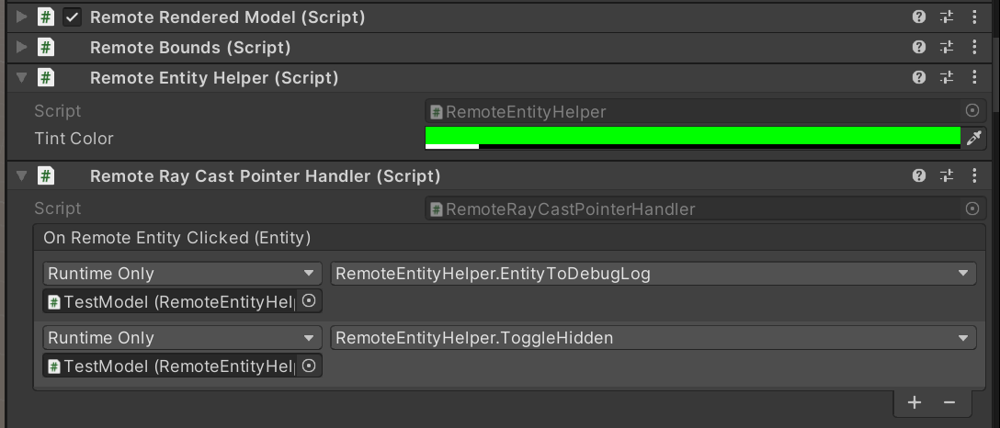

# Tutorial: Refining materials, lighting, and effects

In this tutorial, you learn how to:

> [!div class="checklist"]
>
> * Highlight and outline models and model components
> * Apply different materials to models
> * Slicing through models with cut planes
> * Simple animations for remotely rendered objects

## Prerequisites

* This tutorial builds on top of [Tutorial: Manipulating models](..\manipulate-models\manipulate-models.md).

## Highlighting and outlining

Providing visual feedback to the user is an important part of the user experience in any application. Azure Remote Rendering provides visual feedback mechanisms in the forms of [Hierarchical state overrides](../../../overview/features/override-hierarchical-state.md). The hierarchical state overrides are implemented with components attached to local instances of models, we learned to create these local instances in [Synchronizing the remote object graph into the Unity hierarchy](../manipulate-models/manipulate-models.md#synchronizing-the-remote-object-graph-into-the-unity-hierarchy).

We'll create a wrapper around the [**HierarchicalStateOverrideComponent**](https://docs.microsoft.com/dotnet/api/microsoft.azure.remoterendering.hierarchicalstateoverridecomponent) component. The **HierarchicalStateOverrideComponent** is the local script that controls the overrides on the remote entity. The [**Tutorial Assets**](../custom-models/custom-models.md#import-assets-used-by-this-tutorial) include an abstract base class called **BaseEntityOverrideController** which we'll extend to create the wrapper.

1. Create a new script named **EntityOverrideController** and replace its contents with the following code:

```csharp
// Copyright (c) Microsoft Corporation. All rights reserved.
// Licensed under the MIT License. See LICENSE in the project root for license information.

using Microsoft.Azure.RemoteRendering;
using Microsoft.Azure.RemoteRendering.Unity;
using System;
using UnityEngine;

public class EntityOverrideController : BaseEntityOverrideController
{
    public override event Action<HierarchicalStates> FeatureOverrideChange;

    private ARRHierarchicalStateOverrideComponent localOverride;
    public override ARRHierarchicalStateOverrideComponent LocalOverride
    {
        get
        {
            if (localOverride == null)
            {
                localOverride = gameObject.GetComponent<ARRHierarchicalStateOverrideComponent>();
                if (localOverride == null)
                {
                    localOverride = gameObject.AddComponent<ARRHierarchicalStateOverrideComponent>();
                }

                var remoteStateOverride = TargetEntity.Entity.FindComponentOfType<HierarchicalStateOverrideComponent>();

                if (remoteStateOverride == null)
                {
                    // if there is no HierarchicalStateOverrideComponent on the remote side yet, create one
                    localOverride.Create(RemoteManagerUnity.CurrentSession);
                }
                else
                {
                    // otherwise, bind our local stateOverride component to the remote component
                    localOverride.Bind(remoteStateOverride);

                }
            }
            return localOverride;
        }
    }

    private RemoteEntitySyncObject targetEntity;
    public override RemoteEntitySyncObject TargetEntity
    {
        get
        {
            if (targetEntity == null)
                targetEntity = gameObject.GetComponent<RemoteEntitySyncObject>();
            return targetEntity;
        }
    }

    private HierarchicalEnableState ToggleState(HierarchicalStates feature)
    {
        HierarchicalEnableState setToState = HierarchicalEnableState.InheritFromParent;
        switch (LocalOverride.RemoteComponent.GetState(feature))
        {
            case HierarchicalEnableState.ForceOff:
            case HierarchicalEnableState.InheritFromParent:
                setToState = HierarchicalEnableState.ForceOn;
                break;
            case HierarchicalEnableState.ForceOn:
                setToState = HierarchicalEnableState.InheritFromParent;
                break;
        }

        return SetState(feature, setToState);
    }

    private HierarchicalEnableState SetState(HierarchicalStates feature, HierarchicalEnableState enableState)
    {
        if (GetState(feature) != enableState) //if this is actually different from the current state, act on it
        {
            LocalOverride.RemoteComponent.SetState(feature, enableState);
            FeatureOverrideChange?.Invoke(feature);
        }

        return enableState;
    }

    private HierarchicalEnableState GetState(HierarchicalStates feature) => LocalOverride.RemoteComponent.GetState(feature);

    public override void ToggleHidden() => ToggleState(HierarchicalStates.Hidden);

    public override void ToggleSelect() => ToggleState(HierarchicalStates.Selected);

    public override void ToggleSeeThrough() => ToggleState(HierarchicalStates.SeeThrough);

    public override void ToggleTint(Color tintColor)
    {
        LocalOverride.RemoteComponent.TintColor = tintColor.toRemote();
        ToggleState(HierarchicalStates.UseTintColor);
    }

    public override void ToggleDisabledCollision() => ToggleState(HierarchicalStates.DisableCollision);
}
```

**LocalOverride**'s main job is to create the link between itself and its `RemoteComponent`. The **LocalOverride** then allows us to set state flags on the local component, which are bound to the remote entity. The overrides and their states are described in the [Hierarchical state overrides](../../../overview/features/override-hierarchical-state.md) page. This implementation just toggles one state at a time. However, it's entirely possible to combine multiple overrides on single entities and to create combinations at different levels in the hierarchy. For example, combining `Selected` and `SeeThrough` on a single component would give it an outline while also making it transparent. Or setting the root entity `Hidden` override to `ForceOn` while making a child entity's `Hidden` override to `ForceOff` would hide everything except for the child with the override.

To apply the above states to entities, we can modify the **RemoteEntityHelper** created previously.

1. Modify the **RemoteEntityHelper** class to implement the **BaseRemoteEntityHelper** abstract class. This will allow the use of a view controller provided in the **Tutorial Assets**. It should look like this when modified:

`public class RemoteEntityHelper : BaseRemoteEntityHelper`

2. Override the required abstract methods using the following code:

```csharp
public override EntityOverrideController EnsureOverrideComponent(Entity entity)
{
    var entityGameObject = entity.GetOrCreateGameObject(UnityCreationMode.DoNotCreateUnityComponents);
    var overrideComponent = entityGameObject.GetComponent<EntityOverrideController>();
    if (overrideComponent == null)
        overrideComponent = entityGameObject.AddComponent<EntityOverrideController>();
    return overrideComponent;
}

public override void ToggleHidden(Entity entity)
{
    var overrideComponent = EnsureOverrideComponent(entity);
    overrideComponent.ToggleHidden();
}

public override void ToggleSelect(Entity entity)
{
    var overrideComponent = EnsureOverrideComponent(entity);
    overrideComponent.ToggleSelect();
}

public override void ToggleSeeThrough(Entity entity)
{
    var overrideComponent = EnsureOverrideComponent(entity);
    overrideComponent.ToggleSeeThrough();
}

public Color TintColor = new Color(0.0f, 1.0f, 0.0f, 0.1f);
public override void ToggleTint(Entity entity)
{
    var overrideComponent = EnsureOverrideComponent(entity);
    overrideComponent.ToggleTint(TintColor);
}

public override void ToggleDisableCollision(Entity entity)
{
    var overrideComponent = EnsureOverrideComponent(entity);
    overrideComponent.ToggleHidden();
}
```

This code ensures an **EntityOverrideController** component is added to the target Entity, then calls one of the toggle methods. On the **TestModel** GameObject, calling these helper methods can be done as before, by adding the **RemoteEntityHelper** as a callback to the `OnRemoteEntityClicked` event on the **RemoteRayCastPointerHandler** component.



Additionally, the **ModelViewController** prefab is configured with a control panel for switching between the overrides. The **EntitySelectionViewController** script included in the **Tutorial Assets** swaps the callback for the **RemoteRayCastPointerHandler** for each button pressed. To the **EntitySelectionViewController** script, you will need to ensure an instance of your implementation of **BaseRemoteEntityHelper**, which we've created above to be named **RemoteEntityHelper**, is attached to the same GameObject as the **RemoteRenderedModel**, in this case the **TestModel** GameObject we've been working with.

At this point, your **TestModel** GameObject's components should look something like this:


An example of stacking overrides on a single entity, with `Select` and `Tint`, providing an outline and coloring:


## Cut planes

[Cut planes](../../../overview/features/cut-planes.md) are a feature that can be added to any remote entity. Most commonly, you create a new remote entity, that's not associated with any mesh data, to hold the cut plane component. The position and orientation of the cut plane are determined by the position and orientation of the remote entity it's attached to. We'll create a script that automatically creates a remote entity, adds a cut plane component and syncs the transform of a local object with the cut plane entity. Then, we can use the **CutPlaneViewController** to wrap the cut plane in an interface that'll allow us to manipulate it.

1. Create a new script named **RemoteCutPlane** and replace it's code with the code below:

```csharp
// Copyright (c) Microsoft Corporation. All rights reserved.
// Licensed under the MIT License. See LICENSE in the project root for license information.

using Microsoft.Azure.RemoteRendering;
using Microsoft.Azure.RemoteRendering.Unity;
using System;
using UnityEngine;

public class RemoteCutPlane : BaseRemoteCutPlane
{
    public Color SliceColor = new Color(0.5f, 0f, 0f, .5f);
    public float FadeLengthCM = 0.05f;
    public Axis SliceNormal = Axis.Z;

    public bool AutomaticallyCreate = true;

    private CutPlaneComponent remoteCutPlaneComponent;
    private bool cutPlaneReady = false;

    public override bool CutPlaneReady 
    { 
        get => cutPlaneReady;
        set 
        { 
            cutPlaneReady = value;
            CutPlaneReadyChanged?.Invoke(cutPlaneReady);
        }
    }

    public override event Action<bool> CutPlaneReadyChanged;

    public void Start()
    {
        RemoteRenderingCoordinator.CoordinatorStateChange += RemoteRenderingCoordinator_CoordinatorStateChange;
        RemoteRenderingCoordinator_CoordinatorStateChange(RemoteRenderingCoordinator.instance.CurrentCoordinatorState);
    }

    private void RemoteRenderingCoordinator_CoordinatorStateChange(RemoteRenderingCoordinator.RemoteRenderingState state)
    {
        switch (state)
        {
            case RemoteRenderingCoordinator.RemoteRenderingState.RuntimeConnected:
                if (AutomaticallyCreate)
                    CreateCutPlane();
                break;
            default:
                DestroyCutPlane();
                break;
        }
    }

    public override void CreateCutPlane()
    {
        //Implement me
    }

    public override void DestroyCutPlane()
    {
        //Implement me
    }
}
```

This code extends the **BaseRemoteCutPlane** class included in the **Tutorial Assets**. Similar to the remotely rendered model, this script attaches and listens for `RemoteRenderingState` changes from the remote coordinator. When the coordinator reaches the `RuntimeConnected` state, it will try to automatically connect if it's supposed to. There's also a `CutPlaneComponent` variable we'll be tracking, this is the Azure Remote Rendering component that syncs with the cut plane in the remote session. Let's take a look at what we need to do to create the cut plane.

2. Replace the `CreateCutPlane()` method with the completed version below:

```csharp
public override void CreateCutPlane()
{
    if (remoteCutPlaneComponent != null)
        return; //Nothing to do!

    //Create a root object for the cut plane
    var cutEntity = RemoteRenderingCoordinator.CurrentSession.Actions.CreateEntity();

    //Bind the remote entity to this game object
    cutEntity.BindToUnityGameObject(this.gameObject);

    //Sync the transform of this object so we can move the cut plane
    var syncComponent = this.gameObject.GetComponent<RemoteEntitySyncObject>();
    syncComponent.SyncEveryFrame = true;

    //Add a cut plane to the entity
    remoteCutPlaneComponent = RemoteRenderingCoordinator.CurrentSession.Actions.CreateComponent(ObjectType.CutPlaneComponent, cutEntity) as CutPlaneComponent;

    //Configure the cut plane
    remoteCutPlaneComponent.Normal = SliceNormal;
    remoteCutPlaneComponent.FadeColor = SliceColor.toRemote();
    remoteCutPlaneComponent.FadeLength = FadeLengthCM;
    CutPlaneReady = true;
}
```

Here we're creating a remote entity and binding it to a local GameObject. We ensure that the remote entity will have its transform synced to the local transform by setting `SyncEveryFrame` to `true`. Then we use the `CreateComponent` call to add a `CutPlaneComponent` to the remote object. Finally, we configure the cut plane with the settings defined at the top of the MonoBehaviour. Let's see what it takes to clean up a cut plane by implementing the `DestroyCutPlane()` method.

3. Replace the `DestroyCutPlane()` method with the completed version below:

```csharp
public override void DestroyCutPlane()
{
    if (remoteCutPlaneComponent == null)
        return; //Nothing to do!

    remoteCutPlaneComponent.Destroy();
    remoteCutPlaneComponent = null;
    CutPlaneReady = false;
}
```

Since the remote object is fairly simple, and we're only cleaning up the remote end (and keeping our local object around), it's straight forward to just call `Destroy` on the remote object and clear our reference to it.

The **Tutorial Assets** include a prefab and view controller for classes that implement **BaseRemoteCutPlane**, like the one we've just created. It's not required to add the prefab or view controller, but they make for a better experience because they enable the manipulation of the cut plane. Let's test the cut plane and its view controller.

1. Create a new Empty GameObject in the scene and name it **CutPlane**.
1. Add the **RemoteCutPlane** component to the **CutPlane** GameObject.


3. Drag the **CutPlaneViewController** prefab from the **Tutorial Assets** and drop it on top of the **CutPlane** GameObject, making the view controller a child.


4. Press Play in the Unity Editor to load and connect to a remote session. Ensure your **TestModel** is still configured to load into the remote session.
5. Grab and drag the CutPlane to move it around the scene, watching it slice into the **TestModel** to reveal internal components.


## Lighting / sky box

The remote rendering session supports a full spectrum of [lighting options](../../../overview/features/lights.md). The sky light is a texture with a number of built in options to choose from. The other light types: point, spot, and direction are remote entities with components attached to them, similar the the Cut Plane we created above.

## Editing materials

## Next steps

You've implemented all the core functionality of Azure Remote Rendering, congratulations! In the next chapter we'll learn about securing your Azure Remote Rendering and Blob storage. These will be the first steps to releasing a commercial application that uses Azure Remote Rendering.

> [!div class="nextstepaction"]
> [Next: Securing Azure Remote Rendering and model storage](../security/security.md)