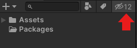
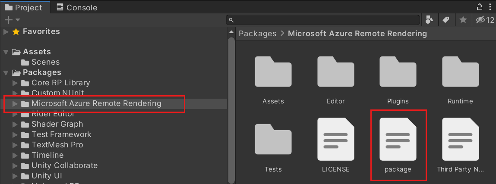
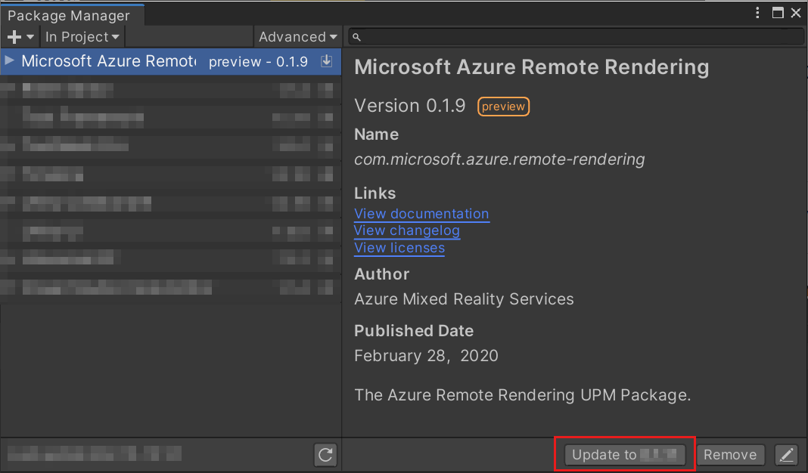
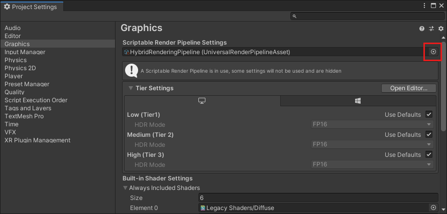
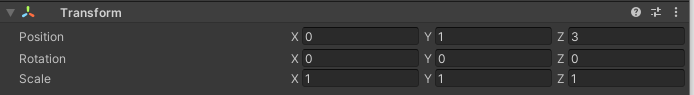

       
# Tutorial: Viewing a remotely rendered model

In this tutorial, you learn how to:

> [!div class="checklist"]
>
> * Provision an Azure Remote Rendering instance.
> * Create and stop a rendering session.
> * Reuse an existing rendering session.
> * Connect and disconnect from sessions.
> * Load models into a rendering session.

## Prerequisites

For this tutorial you need:

* An Azure account.
* Windows SDK 10.0.18362.0 [(download)](https://developer.microsoft.com/windows/downloads/windows-10-sdk)
* The latest version of Visual Studio 2019 [(download)](https://visualstudio.microsoft.com/vs/older-downloads/)
* GIT [(download)](https://git-scm.com/downloads)
* Unity 2019.3.1 [(download)](https://unity3d.com/get-unity/download)
  * Install these modules in Unity:
    * **UWP** - Universal Windows Platform Build Support
    * **IL2CPP** - Windows Build Support (IL2CPP)

## Provision an Azure Remote Rendering instance

To get access to the Azure Remote Rendering service, you first need to [create an account](../../../how-tos/create-an-account.md#create-an-account).

You're required to complete the "Create an account" section for this tutorial, optionally you can complete the "Link storage accounts" section which is required for a future tutorial \[Commercial ready: Model library](../commercial-ready/commercial-ready.md#model-library).

## Create a new Unity project

> [!TIP]
> The [ARR samples repository](https://github.com/Azure/azure-remote-rendering) contains prepared Unity projects for all tutorials. You can use those projects as a reference.

From the Unity Hub, create a new project.
In this example, we'll assume the project is being created in a folder called `RemoteRendering`.

:::image type="content" source="./media/unity-new-project.PNG" alt-text="New Unity Project":::

## Include the Azure Remote Rendering Package

You need to modify the file `Packages/manifest.json` that is located in your Unity project folder. Open the file in a text editor and append the lines listed below:

```json
{
    "scopedRegistries": [
    {
        "name": "Azure Mixed Reality Services",
        "url": "https://api.bintray.com/npm/microsoft/AzureMixedReality-NPM/",
        "scopes": ["com.microsoft.azure"]
    }
    ],
    "dependencies": {
    "com.microsoft.azure.remote-rendering": "0.1.22",
    "com.unity.render-pipelines.universal": "7.2.1",
    ...existing dependencies...
    }
}
```

The Universal render pipeline package is optional but recommended for performance reasons.
After you modified and saved the manifest, Unity will automatically refresh. Confirm the packages have been loaded in the *Project* window:

:::image type="content" source="./media/confirm-packages.png" alt-text="confirm package imports":::

Check your Unity console for any errors if your packages aren't loading. If you don't have any errors and still don't see any packages under the **Packages** folder, check the package visibility toggle button.\


## Ensure you have the latest version of the package

The following steps ensure that your project is using the latest version of the remote-rendering package.

1. Select the package in the Project window and click on the package icon:

1. In the Inspector, click "View in Package Manager":

1. In the package manager page for remote rendering package, see if the update button is available. If it is, then clicking it will update the package to the latest available version:

1. Sometimes updating the package may lead to errors in the console. If this occurs, try closing and reopening the project.

## Configure the camera

Select the **Main Camera** node.

1. Reset its *Transform*:

    

1. Set **Clear flags** to *Solid Color*

1. Set **Background** to *Black*

1. Set the **Clipping Planes** to *Near = 0.3* and *Far = 20*. This means rendering will clip geometry that is closer than 30 cm or farther than 20 meters.

    

## Adjust the project settings

1. Open *Edit > Project Settings...*
1. In the list on the left select Quality.
1. Change the **Default Quality Level** to *Low*

    

1. Select **Graphics** from the left list menu
1. Change the **Scriptable Rendering Pipeline** setting to *HybridRenderingPipeline*. Skip this step if the Universal render pipeline is not used.

    \
    Sometimes the UI does not populate the list of available pipeline types from the packages, in which case the *HybridRenderingPipeline* asset must be dragged onto the field manually:\
    

    * > [!NOTE]
    If you're unable to drag and drop the *HybridRenderingPipeline* asset into the Render Pipeline Asset field, ensure your package configuration contains the `com.unity.render-pipelines.universal` package.

1. Select **Player** from the left list menu.
1. Select the **Universal Windows Platform settings** tab
1. Change the **XR Settings** to support Windows Mixed Reality:

    

1. Select the settings as in the screenshot above:
    1. Enable **Virtual Reality Supported**
    1. Set **Depth Format** to *16-Bit Depth*
    1. Enable **Depth Buffer Sharing**
    1. Set **Stereo Rendering Mode** to *Single Pass Instanced*

1. In the same window, above *XR Settings*, expand **Publishing Settings**
1. Scroll down to **Capabilities** and select:
    * **InternetClient**
    * **InternetClientServer**
    * **SpatialPerception**
    * Optional for development: **PrivateNetworkClientServer**

      This option is needed if you want to connect the Unity remote debugger to your device.

1. In **Supported Device Families**, enable **Holographic** and **Desktop**

1. If you want to use the Mixed Reality Toolkit, see the [MRTK documentation](https://docs.microsoft.com/windows/mixed-reality/unity-development-overview), for more information on recommended settings and capabilities.

## Validate project setup

Perform the following steps to validate that the project settings are correct.

1. Choose the ValidateProject entry from the RemoteRendering menu in the Unity editor toolbar.
1. Use the ValidateProject window to check for and fix project settings where necessary.

    

## Create a script to coordinate Azure Remote Rendering connection and state

There are four basic stages to showing remotely rendered models, shown in the below graph. Each of these stages is required to be performed in order.


To progress through these stages and track the state of the application, this tutorial will use a state machine.First we will create an `enum` that defines the states of our remote rendering connection.

1. Create a new folder called *RemoteRenderingCore*. Then inside *RemoteRenderingCore*, create another folder named *Scripts*.

1. Create a [new C# script](https://docs.unity3d.com/Manual/CreatingAndUsingScripts.html) named **RemoteRenderingState**.
Your project should look like this:\
\
\
1. Open **RemoteRenderingState** in your code editor.
1. Replace the entire contents of the script with the code below:

```csharp
// Copyright (c) Microsoft Corporation. All rights reserved.
// Licensed under the MIT License. See LICENSE in the project root for license information.

public enum RemoteRenderingState
{
    NotSet,
    NotInitialized,
    NoSession,
    ConnectingToExistingRemoteSession,
    ConnectingToNewRemoteSession,
    RemoteSessionReady,
    ConnectingToRuntime,
    RuntimeConnected
}
```

Next we'll create a coordinator script that tracks and manages these states. Much of this code is not *directly* related to Azure Remote Rendering and is used for maintaining state, exposing functionality to other components, triggering events and storing application specific data. Start with the code below, then we'll discuss and implement the Azure Remote Rendering specific code.

1. Create a new script in the same directory as **RemoteRenderingState** and give it the name **RemoteRenderingCoordinator**.
1. Open **RemoteRenderingCoordinator** in your code editor and replace its entire content with the code below:

```csharp
// Copyright (c) Microsoft Corporation. All rights reserved.
// Licensed under the MIT License. See LICENSE in the project root for license information.

using Microsoft.Azure.RemoteRendering;
using Microsoft.Azure.RemoteRendering.Unity;
using System;
using System.Linq;
using System.Threading.Tasks;
using UnityEngine;

#if UNITY_WSA
using UnityEngine.XR.WSA;
#endif

/// <summary>
/// Remote Rendering Coordinator is the controller for all Remote Rendering operations.
/// </summary>

// Require the GameObject with a RemoteRenderingCoordinator to also have the ARRServiceUnity component
[RequireComponent(typeof(ARRServiceUnity))]
public class RemoteRenderingCoordinator : MonoBehaviour
{
    public static RemoteRenderingCoordinator instance;

    [Header("Account Credentials")]
    // AccountDomain must be '<region>.mixedreality.azure.com' - if no '<region>' is specified, connections will fail
    // For most people '<region>' is either 'westus2' or 'westeurope'
    public string AccountDomain = "westus2.mixedreality.azure.com";
    public string AccountId = "<enter your account id here>";
    public string AccountKey = "<enter your account key here>";

    // These settings are important. All three should be set as low as possible, while maintaining a good user experience
    // See the documentation around session management and the technical differences in session VM size
    [Header("New Session Defaults")]
    public RenderingSessionVmSize renderingSessionVmSize = RenderingSessionVmSize.Standard;
    public uint maxLeaseHours = 0;
    public uint maxLeaseMinutes = 20;

    [Header("Other Configuration")]
    [Tooltip("If you have a known active SessionID, you can fill it in here before connecting")]
    public string sessionIDOverride;

    // When Automatic Mode is true, the coordinator will attempt to automatically proceed through the process of connecting and loading a model
    public bool automaticMode = true;

    private RemoteRenderingState currentCoordinatorState = RemoteRenderingState.NotSet;
    public RemoteRenderingState CurrentCoordinatorState
    {
        get => currentCoordinatorState;
        private set
        {
            if (currentCoordinatorState != value)
            {
                currentCoordinatorState = value;
                Debug.Log($"State changed to: {currentCoordinatorState}");
                onCoordinatorStateChange?.Invoke(currentCoordinatorState);
            }
        }
    }

    private event Action<RemoteRenderingState> onCoordinatorStateChange;
    public event Action<RemoteRenderingState> OnCoordinatorStateChange
    {
        add => onCoordinatorStateChange += value;
        remove => onCoordinatorStateChange -= value;
    }

    public static AzureSession CurrentSession => instance?.ARRSessionService?.CurrentActiveSession;

    private ARRServiceUnity arrSessionService;

    private ARRServiceUnity ARRSessionService
    {
        get
        {
            if (arrSessionService == null)
                arrSessionService = GetComponent<ARRServiceUnity>();
            return arrSessionService;
        }
    }

    /// <summary>
    /// Keep the last used SessionID, when launching, connect to this session if its available
    /// </summary>
    private string LastUsedSessionID
    {
        get
        {
            if (!string.IsNullOrEmpty(sessionIDOverride))
                return sessionIDOverride;

            if (PlayerPrefs.HasKey("LastUsedSessionID"))
                return PlayerPrefs.GetString("LastUsedSessionID");
            else
                return null;
        }
        set
        {
            PlayerPrefs.SetString("LastUsedSessionID", value);
        }
    }

    public void Awake()
    {
        if (instance == null)
            instance = this;
        else
            Destroy(this);

        OnCoordinatorStateChange += AutomaticMode;

        CurrentCoordinatorState = RemoteRenderingState.NotInitialized;
    }

    /// <summary>
    /// Automatic mode attempts to automatically progress through the connection and loading steps. Doesn't handle error states.
    /// </summary>
    /// <param name="currentState">The current state</param>
    private async void AutomaticMode(RemoteRenderingState currentState)
    {
        if (!automaticMode)
            return;

        //Add a small delay for visual effect
        await Task.Delay(1500);
        switch (currentState)
        {
            case RemoteRenderingState.NotInitialized:
                InitializeARR();
                break;
            case RemoteRenderingState.NoSession:
                JoinRemoteSession();
                break;
            case RemoteRenderingState.RemoteSessionReady:
                ConnectRuntimeToRemoteSession();
                break;
        }
    }

    /// <summary>
    /// Initializes ARR, associating the main camera and creating a new remote session manager
    /// Note: This must be called on the main Unity thread
    /// </summary>
    public void InitializeARR()
    {
        //Implement me!
    }

    /// <summary>
    /// Attempts to join an existing session or start a new session
    /// </summary>
    public async void JoinRemoteSession()
    {
        //Implement me!
    }

    public void StopRemoteSession()
    {
        //Implement me!
    }

    private async Task<bool> IsSessionAvailable(string sessionID)
    {
        var allSessions = await ARRSessionService.Frontend.GetCurrentRenderingSessionsAsync().AsTask();
        return allSessions.Any(x => x.Id == sessionID && (x.Status == RenderingSessionStatus.Ready || x.Status == RenderingSessionStatus.Starting));
    }

    /// <summary>
    /// Connects the local runtime to the current active session, if there's a session available
    /// </summary>
    public void ConnectRuntimeToRemoteSession()
    {
        //Implement me!
    }

    public void DisconnectRuntimeFromRemoteSession()
    {
        //Implement me!
    }

    /// <summary>
    /// The session must have its runtime pump updated.
    /// The Actions.Update() will push messages to the server, receive messages, and update the frame-buffer with the remotely rendered content.
    /// </summary>
    private void LateUpdate()
    {
        ARRSessionService?.CurrentActiveSession?.Actions?.Update();
    }

    /// <summary>
    /// Loads a model into the remote session for rendering
    /// </summary>
    /// <param name="modelName">The model's path</param>
    /// <param name="progress">A call back method that accepts a float progress value [0->1]</param>
    /// <param name="parent">The parent Transform for this remote entity</param>
    /// <returns>An awaitable Remote Rendering Entity</returns>
    public async Task<Entity> LoadModel(string modelName, Transform parent = null, ProgressHandler progress = null)
    {
        //Implement me!
        return null;
    }

    private async void OnRemoteSessionStatusChanged(ARRServiceUnity caller, AzureSession session)
    {
        var properties = await session.GetPropertiesAsync().AsTask();

        switch (properties.Status)
        {
            case RenderingSessionStatus.Error:
            case RenderingSessionStatus.Expired:
            case RenderingSessionStatus.Stopped:
            case RenderingSessionStatus.Unknown:
                CurrentCoordinatorState = RemoteRenderingState.NoSession;
                break;
            case RenderingSessionStatus.Starting:
                CurrentCoordinatorState = RemoteRenderingState.ConnectingToNewRemoteSession;
                break;
            case RenderingSessionStatus.Ready:
                CurrentCoordinatorState = RemoteRenderingState.RemoteSessionReady;
                break;
        }
    }

    private void OnLocalRuntimeStatusChanged(ConnectionStatus status, Result error)
    {
        switch (status)
        {
            case ConnectionStatus.Connected:
                CurrentCoordinatorState = RemoteRenderingState.RuntimeConnected;
                break;
            case ConnectionStatus.Connecting:
                CurrentCoordinatorState = RemoteRenderingState.ConnectingToRuntime;
                break;
            case ConnectionStatus.Disconnected:
                CurrentCoordinatorState = RemoteRenderingState.RemoteSessionReady;
                break;
        }
    }
}
```

## Create the Azure Remote Rendering GameObject

The remote rendering coordinator and a script it requires (*ARRServiceUnity*) are both MonoBehaviours and are required to be attached to a GameObject in the scene.

1. Create a new GameObject in the scene and name it **RemoteRenderingCoordinator**.
1. Add the *RemoteRenderingCoordinator* script to the **RemoteRenderingCoordinator** GameObject.\

1. Confirm the *ARRServiceUnity* script is automatically added to the GameObject, this is a result of adding the attribute `[RequireComponent(typeof(ARRServiceUnity))]` to the top of the **RemoteRenderingCoordinator** script.
1. Add your Azure Remote Rendering credentials to the coordinator script:\


## Initialize Azure Remote Rendering

Now that we have the framework for our coordinator, we will implement each of the four stages, starting with **Initialize Remote Rendering**. In all cases except the **Initialize** stage, there is also an associated "undo" process that reverses that stage.


**Initialize** will tell Azure Remote Rendering which camera object to use for rendering, which account credentials to use when managing remote sessions and listen for state change events. **Initialize** will also progress our state machine into `NoSession`, meaning we're initialized but not connected to a session. We'll do all this in the `InitializeARR()` method by completing it as follows:

> [!CAUTION]
> Modifying the script and saving it while the play mode is active in Unity may result in Unity freezing and you are forced to shut it down through the task manager. Therefore, always stop the play mode before editing the RemoteRendering script.

```csharp
/// <summary>
/// Initializes ARR, associating the main camera and creating a new remote session manager
/// Note: This must be called on the main Unity thread
/// </summary>
public void InitializeARR()
{
    RemoteUnityClientInit clientInit = new RemoteUnityClientInit(Camera.main);
    RemoteManagerUnity.InitializeManager(clientInit);

    ARRSessionService.Initialize(new AzureFrontendAccountInfo(AccountDomain, AccountId, AccountKey));

    ARRSessionService.OnSessionStatusChanged += OnRemoteSessionStatusChanged;

    CurrentCoordinatorState = RemoteRenderingState.NoSession;
}
```

## Create or join a remote session

The second stage is to Create or Join a Remote Rendering Session (see [Remote Rendering Sessions](../../../concepts/sessions.md) for more details).


The remote session is where our models will be rendered. The `JoinRemoteSession()` method will attempt to join an existing session (if we're the one that created it, tracked with the `LastUsedSessionID` property, or if we've assigned an active session ID to `sessionIDOverride`).\
If no sessions are available, it will create a new session. Creating a new session is, unfortunately, a time consuming operation. Therefore one should try to create sessions rarely, and reuse them whenever possible (see \[Commercial Ready: Session pooling, scheduling, and best practices](../commercial-ready/commercial-ready.md#session-pooling-scheduling-and-best-practices) for more). `StopRemoteSession()` will end the currently active session. To prevent charges, you should always stop sessions when they are not needed anymore.

Our state machine will now progress to either `ConnectingToNewRemoteSession` or `ConnectingToExistingRemoteSession` depending on available sessions. Both opening an existing session or creating a new session will trigger the `ARRSessionService.OnSessionStatusChanged` event, executing our `OnRemoteSessionStatusChanged` method. Ideally, this will result in advancing the state machine to `RemoteSessionReady`.

To join a new session, modify the code to replace the `JoinRemoteSession()` and `StopRemoteSession()` with the completed examples below:

```csharp
/// <summary>
/// Attempts to join an existing session or start a new session
/// </summary>
public async void JoinRemoteSession()
{
    //If there's a session available that previously belonged to us, and it's ready, use it. Otherwise start a new session.
    RenderingSessionProperties joinResult;
    if ((await IsSessionAvailable(LastUsedSessionID)))
    {
        CurrentCoordinatorState = RemoteRenderingState.ConnectingToExistingRemoteSession;
        joinResult = await ARRSessionService.OpenSession(LastUsedSessionID);
    }
    else
    {
        CurrentCoordinatorState = RemoteRenderingState.ConnectingToNewRemoteSession;
        joinResult = await ARRSessionService.StartSession(new RenderingSessionCreationParams(renderingSessionVmSize, maxLeaseHours, maxLeaseMinutes));
    }

    if (joinResult.Status == RenderingSessionStatus.Ready || joinResult.Status == RenderingSessionStatus.Starting)
    {
        LastUsedSessionID = joinResult.Id;
    }
    else
    {
        //The session should be ready or starting, if it's not, something went wrong
        await ARRSessionService.StopSession();
        CurrentCoordinatorState = RemoteRenderingState.NoSession;
    }
}

public void StopRemoteSession()
{
    if (ARRSessionService.CurrentActiveSession != null)
    {
        ARRSessionService.CurrentActiveSession.StopAsync();
    }
}
```

If you want to reuse sessions, avoiding the time to create a new session, make sure to deactivate the option **Auto-Stop Session** in the *ARRServiceUnity* component. Keep in mind that this will leave sessions running, even when no one is connected to them. Your session may run for as long as your *MaxLeaseTime* before it is shut down by the server. On the other hand, if you automatically shut down every session when disconnecting, you will have to wait for a new session to be started every time, a somewhat lengthy process.

> [!NOTE]
> Stopping a session will take immediate effect and cannot be undone. Once stopped, you have to create a new session, with the same startup overhead.

## Connect the local runtime to the remote session

Next the application needs to connect it's local runtime to the remote session.


Additionally, the application needs to listen for events about the connection between the runtime and the current session, those state changes are handled in `OnLocalRuntimeStatusChanged`. This code will advance our state to `ConnectingToRuntime` and then, once connected, in `OnLocalRuntimeStatusChanged`, the state will be advanced to `RuntimeConnected`. `RuntimeConnected` is the last state the coordinator concerns itself with. It means the application is done with all the common configuration and ready to begin the session specific work of loading and rendering models.

 Replace the `ConnectRuntimeToRemoteSession()` and `DisconnectRuntimeFromRemoteSession()` methods with the completed versions below. Also add the Unity method `LateUpdate` and update the current active session. This allows the current session to send/receive messages and update the frame buffer with the frames received from the remote session.

```csharp
/// <summary>
/// Connects the local runtime to the current active session, if there's a session available
/// </summary>
public void ConnectRuntimeToRemoteSession()
{
    if (ARRSessionService == null || ARRSessionService.CurrentActiveSession == null)
    {
        Debug.LogError("Not ready to connect runtime");
        return;
    }

    //Connect the local runtime to the currently connected session
    //This session is set when connecting to a new or existing session

    ARRSessionService.CurrentActiveSession.ConnectionStatusChanged += OnLocalRuntimeStatusChanged;
    ARRSessionService.CurrentActiveSession.ConnectToRuntime(new ConnectToRuntimeParams());
    CurrentCoordinatorState = RemoteRenderingState.ConnectingToRuntime;
}

public void DisconnectRuntimeFromRemoteSession()
{
    if (ARRSessionService == null || ARRSessionService.CurrentActiveSession == null || ARRSessionService.CurrentActiveSession.ConnectionStatus != ConnectionStatus.Connected)
    {
        Debug.LogError("Runtime not connected!");
        return;
    }

    ARRSessionService.CurrentActiveSession.DisconnectFromRuntime();
    ARRSessionService.CurrentActiveSession.ConnectionStatusChanged -= OnLocalRuntimeStatusChanged;
    CurrentCoordinatorState = RemoteRenderingState.RemoteSessionReady;
}

/// <summary>
/// The session must have its runtime pump updated.
/// The Actions.Update() will push messages to the server, receive messages, and update the frame-buffer with the remotely rendered content.
/// </summary>
private void LateUpdate()
{
    ARRSessionService?.CurrentActiveSession?.Actions?.Update();
}
```

> [!NOTE]
> Connecting the local runtime to a remote session depends on `Update` being called on the currently active session. If you find your application is never progressing past the `ConnectingToRuntime` state, ensure you're regularly calling `Update` on the active session.

## Loading a model

Finally, we have all the foundation required to load a model into the remote session and start receiving frames.\
 

The `LoadModel` method is designed to accept a model path, progress handler and parent Transform. These arguments will be used to load a model into the remote session, update the user on the loading progress and orient the remotely rendered model based on the parent `Transform`. Replace the `LoadModel` method entirely with the code below:

```csharp
/// <summary>
/// Loads a model into the remote session for rendering
/// </summary>
/// <param name="modelName">The model's path</param>
/// <param name="parent">The parent Transform for this remote entity</param>
/// <param name="progress">A call back method that accepts a float progress value [0->1]</param>
/// <returns>An awaitable Remote Rendering Entity</returns>
public async Task<Entity> LoadModel(string modelPath, Transform parent = null, ProgressHandler progress = null)
{
    //Create a root object to parent a loaded model to
    var modelEntity = ARRSessionService.CurrentActiveSession.Actions.CreateEntity();

    //Get the game object representation of this entity
    var modelGameObject = modelEntity.GetOrCreateGameObject(UnityCreationMode.DoNotCreateUnityComponents);

    //Ensure the entity will its transform with the server
    var sync = modelGameObject.GetComponent<RemoteEntitySyncObject>();
    sync.SyncEveryFrame = true;

    //Parent the new object under the defined parent
    if (parent != null)
    {
        modelGameObject.transform.SetParent(parent, false);
        modelGameObject.name = parent.name + "_Entity";
    }

#if UNITY_WSA
    //Anchor the model in the world, prefer anchoring parent if there is one
    if (parent != null)
    {
        parent.gameObject.AddComponent<WorldAnchor>();
    }
    else
    {
        modelGameObject.AddComponent<WorldAnchor>();
    }
#endif

    //Load a model that will be parented to the entity
    var loadModelParams = new LoadModelFromSASParams(modelPath, modelEntity);
    var async = ARRSessionService.CurrentActiveSession.Actions.LoadModelFromSASAsync(loadModelParams);
    if(progress != null)
        async.ProgressUpdated += progress;
    var result = await async.AsTask();
    return modelEntity;
}
```

The code above is performing the following steps:

1. Create a remote entity.
1. Create a local GameObject to represent the remote entity.
1. Configure the local GameObject to sync its state (i.e. Transform) to the remote entity every frame.
1. Set a name and add a **WorldAnchor** to assist stabilization.
1. Load model data from Blob Storage into the remote entity.
1. Return the parent Entity

Because there can be multiple models, and we'd like to interact, load/unload, etc. with each separately, we'll specify the details of the remote model in a separate script.

Similar to the starting code for **RemoteRenderingCoordinator**, much of the code in **RemoteRenderedModel** is for tracking state, responding to events, firing events and configuration. Essentially, **RemoteRenderedModel** stores the remote path for the model data in `modelPath`. It will listen for state changes in the **RemoteRenderingCoordinator** to see if it should automatically load or unload the model it defines. The GameObject that has the **RemoteRenderedModel** attached to it will be local parent for the remote content.

First we'll create an enum to track the states of our model.

1. Create a new script named **ModelStates** in the same folder as **RemoteRenderingCoordinator**. Replace the entire contents with the following code:

```csharp
// Copyright (c) Microsoft Corporation. All rights reserved.
// Licensed under the MIT License. See LICENSE in the project root for license information.

public enum ModelState
{
    NotReady,
    Ready,
    Loading,
    Loaded,
    Unloading,
    Error
}
```

Next create the **RemoteRenderedModel** script.

1. In the same folder as **RemoteRenderingCoordinator**, create a new script called **RemoteRenderedModel** and replace its contents with the following code:

```csharp
// Copyright (c) Microsoft Corporation. All rights reserved.
// Licensed under the MIT License. See LICENSE in the project root for license information.

using Microsoft.Azure.RemoteRendering;
using Microsoft.Azure.RemoteRendering.Unity;
using System;
using UnityEngine;
using UnityEngine.Events;

public class RemoteRenderedModel : MonoBehaviour
{
    [SerializeField]
    [Tooltip("The friendly name for this model")]
    private string modelDisplayName;
    [SerializeField]
    [Tooltip("The URI for this model")]
    private string modelPath;

    public string ModelDisplayName { get => modelDisplayName; set => modelDisplayName = value; }
    public string ModelPath { get => modelPath; set => modelPath = value; }

    public bool AutomaticallyLoad = true;

    private ModelState currentModelState = ModelState.NotReady;

    public ModelState CurrentModelState
    {
        get => currentModelState;
        private set
        {
            if (currentModelState != value)
            {
                currentModelState = value;
                onModelStateChange?.Invoke(value);
            }
        }
    }

    private event Action<ModelState> onModelStateChange;
    public event Action<ModelState> OnModelStateChange
    {
        add => onModelStateChange += value;
        remove => onModelStateChange -= value;
    }

    private event Action<float> loadProgress;
    public event Action<float> LoadProgress
    {
        add => loadProgress += value;
        remove => loadProgress -= value;
    }

    public UnityEvent OnModelNotReady = new UnityEvent();
    public UnityEvent OnModelReady = new UnityEvent();
    public UnityEvent OnStartLoading = new UnityEvent();
    public UnityEvent OnModelLoaded = new UnityEvent();
    public UnityEvent OnModelUnloading = new UnityEvent();

    [Serializable] public class UnityFloatEvent : UnityEvent<float> { }

    public UnityFloatEvent OnLoadProgress = new UnityFloatEvent();
    public Entity ModelEntity { get; private set; }

    public void Awake()
    {
        OnModelStateChange += HandleUnityEvents;
    }

    private void HandleUnityEvents(ModelState modelState)
    {
        switch (modelState)
        {
            case ModelState.NotReady:
                OnModelNotReady?.Invoke();
                break;
            case ModelState.Ready:
                OnModelReady?.Invoke();
                break;
            case ModelState.Loading:
                OnStartLoading?.Invoke();
                break;
            case ModelState.Loaded:
                OnModelLoaded?.Invoke();
                break;
            case ModelState.Unloading:
                OnModelUnloading?.Invoke();
                break;
        }
    }

    private void Start()
    {
        //Attach to and initialize current state (in case we're attaching late)
        RemoteRenderingCoordinator.instance.OnCoordinatorStateChange += Instance_OnCoordinatorStateChange;
        Instance_OnCoordinatorStateChange(RemoteRenderingCoordinator.instance.CurrentCoordinatorState);
    }

    private void OnDestroy()
    {
        RemoteRenderingCoordinator.instance.OnCoordinatorStateChange -= Instance_OnCoordinatorStateChange;
    }

    /// <summary>
    /// Asks the coordinator to create a model entity and listens for coordinator state changes
    /// </summary>
    [ContextMenu("Load Model")]
    public async void LoadModel()
    {
        if (CurrentModelState != ModelState.Ready)
            return; //We're already loaded or loading or not ready to load

        CurrentModelState = ModelState.Loading;

        ModelEntity = await RemoteRenderingCoordinator.instance?.LoadModel(ModelPath, this.transform, SetLoadingProgress);

        if (ModelEntity != null)
            CurrentModelState = ModelState.Loaded;
        else
            CurrentModelState = ModelState.Error;
    }

    /// <summary>
    /// Listen for state changes on the coordinator, clean up this model's ARR objects if we're no longer connected.
    /// Automatically load if required
    /// </summary>
    private void Instance_OnCoordinatorStateChange(RemoteRenderingState state)
    {
        switch (state)
        {
            case RemoteRenderingState.RuntimeConnected:
                CurrentModelState = ModelState.Ready;
                if (AutomaticallyLoad)
                    LoadModel();
                break;
            default:
                UnloadModel();
                break;
        }
    }

    /// <summary>
    /// Clean up the local model instances
    /// </summary>
    [ContextMenu("Unload Model")]
    public void UnloadModel()
    {
        CurrentModelState = ModelState.Unloading;

        if (ModelEntity == null)
            return;

        var modelGameObject = ModelEntity.GetOrCreateGameObject(UnityCreationMode.DoNotCreateUnityComponents);
        Destroy(modelGameObject);
        ModelEntity.Destroy();
        ModelEntity = null;

        if (RemoteRenderingCoordinator.instance.CurrentCoordinatorState == RemoteRenderingState.RuntimeConnected)
            CurrentModelState = ModelState.Ready;
        else
            CurrentModelState = ModelState.NotReady;
    }

    /// <summary>
    /// Update the Unity method
    /// </summary>
    /// <param name="progressValue"></param>
    public void SetLoadingProgress(float progressValue)
    {
        Debug.Log($"Loading {ModelPath} progress: {Math.Round(progressValue * 100, 2)}%");
        loadProgress?.Invoke(progressValue);
    }
}
```

## Loading the Test Model

The application now has everything in place required to load a view a remotely rendered model! Now we need to define the model to load and where to load it.

1. Create a new GameObject in the scene and name it **TestModel**.
1. Add the *RemoteRenderedModel* script to **TestModel**.\
\
1. Fill in the `Model Display Name` and the `Model Path` with "*TestModel*" and "*builtin://Engine*" respectively. The 'built in engine path' is a special path that references a test model built into Azure Remote Rendering.\

1. Position the **TestModel** object in front of the camera, at position **x = 0, y = 1, z = 3**.\

1. Ensure **AutomaticallyLoad** is turned on.
1. Press **Play** in the Unity Editor to test the application.

Watch the Console panel as the application progresses through its states. Keep in mind, some states may take some time to complete without a progress update. Eventually, you'll see the logs from the model loading and then the test model will be rendered in the scene. Try moving and rotating the **TestModel** GameObject you created to see the model rendered from different perspectives.


## Next steps


Congratulations! You've created a basic application capable of viewing remotely rendered models. In the next tutorial, we will learn how to ingest and render your own models.

> [!div class="nextstepaction"]
> [Next: Loading custom models](../custom-models/custom-models.md)
