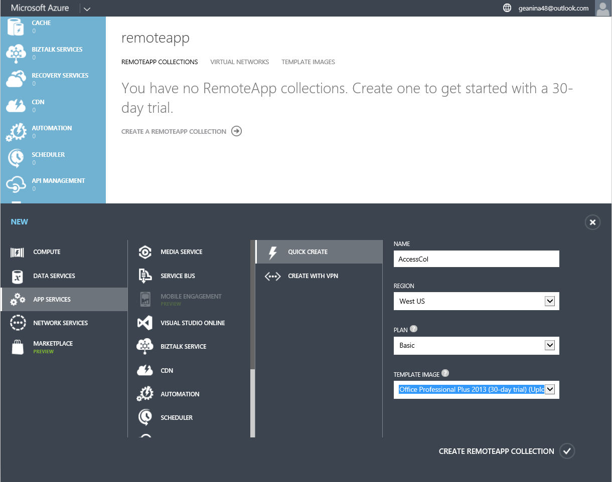
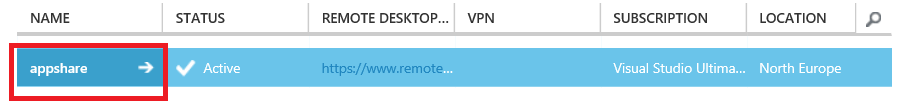
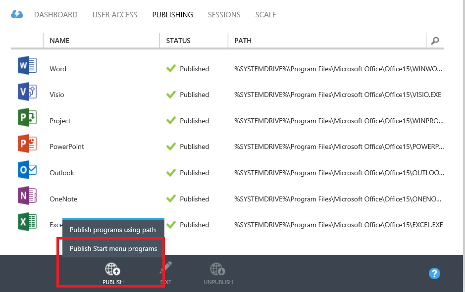
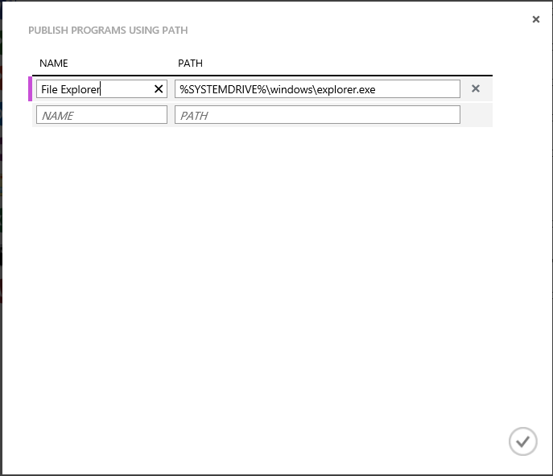
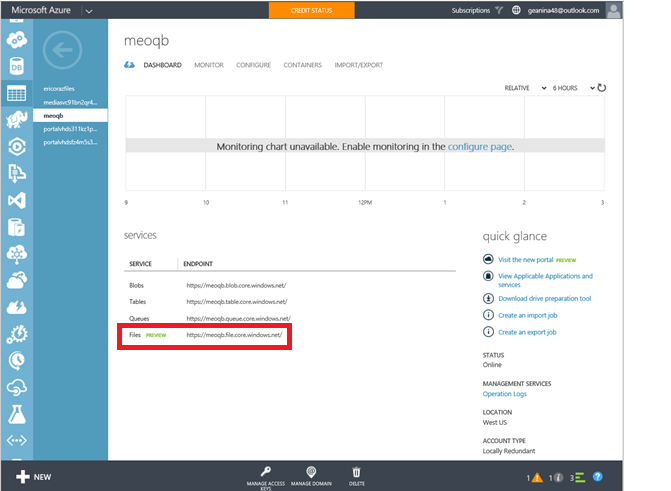
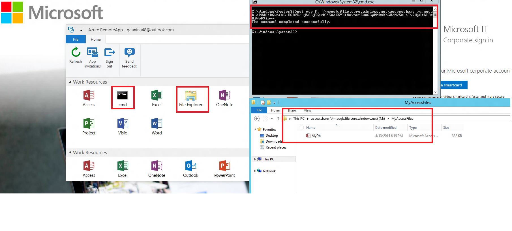
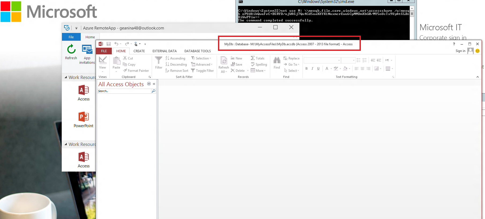

<properties
   pageTitle="Run any Windows app on any device with Azure RemoteApp | Microsoft Azure"
   description="Learn how to share any Windows app with your users by using Azure RemoteApp."
   services="remoteapp"
   documentationCenter=""
   authors="lizap"
   manager="mbaldwin"
   editor=""/>

<tags
   ms.service="remoteapp"
   ms.devlang="na"
   ms.topic="hero-article"
   ms.tgt_pltfrm="na"
   ms.workload="compute"
   ms.date="07/02/2016"
   ms.author="elizapo"/>

# Run any Windows app on any device with Azure RemoteApp

You can run a Windows application anywhere on any device, right now, seriously - just by using Azure RemoteApp. Whether it's a custom application written 10 years ago, or an Office app, your users no longer have to be tied to a specific operating system (like Windows XP) for those few applications.

With Azure RemoteApp, your users can also use their own Android or Apple devices and get the same experience they got on Windows (or on Windows Phones). This is accomplished by hosting your Windows application in a collection of Windows virtual machines on Azure - your users can access them from anywhere they have an internet connection. 

Read on for an example of exactly how to do this.

In this article, we're going to share Access with all of our users. However, you can use ANY app. As long as you can install your app on a Windows Server 2012 R2 computer, you can share it using the steps below. You can review the [app requirements](remoteapp-appreqs.md) to make sure your app will work.

Please note that because Access is a database, and we want that database to be useful, we will be doing a few extra steps to let users access the Access data share. If your app isn't a database, or you don't need your users to be able to access a file share, you can skip those steps in this tutorial

> [AZURE.NOTE] You need an Azure account to complete this tutorial:
> - You can [open an Azure account for free](https://azure.microsoft.com/free/?WT.mc_id=A261C142F): You get credits you can use to try out paid Azure services, and even after they're used up you can keep the account and use free Azure services, such as Websites. Your credit card will never be charged, unless you explicitly change your settings and ask to be charged.
> - You can [activate MSDN subscriber benefits](https://azure.microsoft.com/pricing/member-offers/msdn-benefits-details/?WT.mc_id=A261C142F): Your MSDN subscription gives you credits every month that you can use for paid Azure services.

## Create a collection in RemoteApp

Start by creating a collection. The collection serves as a container for your apps and users. Each collection is based on an image - you can create your own or use one provided with your subscription. For this tutorial, we're using the Office 2013 trial image - it contains the app that we want to share.

1. In the Azure portal, scroll down in the left hand nav tree until you see RemoteApp. Open that page.
2. Click **Create a RemoteApp collection**.
3. Click **Quick create** and enter a name for your collection.
4. Select the region you want to use to create your collection. For the best experience, select the region that is closest geographically to the location where your users will access the app. For example, in this tutorial, the users will be located in Redmond, Washington. The closest Azure region is **West US**.
5. Select the billing plan you want to use. The basic billing plan puts 16 users on a large Azure VM, while the standard billing plan has 10 users on a large Azure VM. As a general example, the basic plan works great for data entry-type workflow. For a productivity app, like Office, you'd want the standard plan.
6. Finally, select the  Office 2013 Professional image. This image contains Office 2013 apps. Just a reminder - this image is only good for trial collections and POCs. You' can't use this image in a production collection.
7. Now, click **Create RemoteApp collection**.

This starts creating your collection, but it can take up to an hour.

Now you're ready to add your users.

## Share the app with users

Once your collection has been created successfully, it’s time to publish Access to users and add the users who should have access to it.

If you have navigated away from the Azure RemoteApp node while the collection was being created, start by making your way back to it from the Azure home page.

2. Click the collection you created earlier to access additional options and configure the collection.

3. On the **Publishing** tab, click **Publish** at the bottom of the screen, and then click **Publish Start menu programs**.

4. Select the apps you want to publish from the list. For our purpose, we chose Access. Click **Complete**. Wait for the apps to finish publishing.

1. Once the app has finished publishing, head over to the **User Access** tab to add all the users that need access to your apps. Enter user names (email address) for your users and then click **Save**.

1. Now, it’s time to tell your users about these new apps and how to access them. To do this, send your users an email pointing them to the Remote Desktop client download URL.

## Configure access to Access

Some apps need extra configuration after you deploy them through RemoteApp. In particular, for Access, we're going to create a file share on Azure that any user can access. (If you don't want to do that, you can create a [hybrid collection](remoteapp-create-hybrid-deployment.md) [instead of our cloud collection] that lets your users access files and information on your local network.) Then, we'll need to tell our users to map a local drive on their computer to the Azure file system.

The first part you as the admin do. Then, we have some steps for your users.

1. Start by publishing the command line interface (cmd.exe). In the **Publishing** tab, select **cmd**, and then click **Publish > Publish program using path**.
2. Enter the name of the app and the path. For our purpose, use "File Explorer" as the name and "%SYSTEMDRIVE%\windows\explorer.exe" as the path.

3. Now you need to create an Azure [storage account](../storage/storage-create-storage-account.md). We named ours "accessstorage," so pick a name that's meaningful to you. (To misquote Highlander, there can be only one "accessstorage.")

4. Now go back to your dashboard so you can get the path to your storage (endpoint location). You'll use this in a bit, so make sure you copy it somewhere.

5. Next, once the storage account has been created, you need the primary access key. Click **Manage access keys**, and then copy the primary access key.
6. Now, set the context of the storage account and create a new file share for Access. Run the following cmdlets in an elevated Windows PowerShell window:

        $ctx=New-AzureStorageContext <account name> <account key>
    	$s = New-AzureStorageShare <share name> -Context $ctx

	So for our share, these are the cmdlets we run:

	    $ctx=New-AzureStorageContext accessstorage <key>
    	$s = New-AzureStorageShare <share name> -Context $ctx

Now, it's the user's turn. First, have your users install a [RemoteApp client](remoteapp-clients.md). Next, the users need to map a drive from their account to that Azure file share you created and add their Access files. This is how they do that:

1. In the RemoteApp client, access the published apps. Start the cmd.exe program.
2. Run the following command to map a drive from your computer to the file share:

		net use z: \\<accountname>.file.core.windows.net\<share name> /u:<user name> <account key>

	If you set the **/persistent** parameter to yes, the mapped drive will persist across sessions.
1. Now, launch the File Explorer app from RemoteApp. Copy any Access files you want to use in the shared app to the file share.

1. Finally, open Access, and then open the database that you just shared. You should see your data in Access running from the cloud.

Now you can use Access on any of your devices - just make sure you install a RemoteApp client.

<!--Every topic should have next steps and links to the next logical set of content to keep the customer engaged-->
## Next steps

Now that you've mastered creating a collection, try creating a [collection that uses Office 365](remoteapp-tutorial-o365anywhere.md). Or you can create a [hybrid collection ](remoteapp-create-hybrid-deployment.md)that can access your local network.

<!--Image references-->
 
