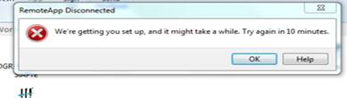
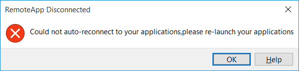
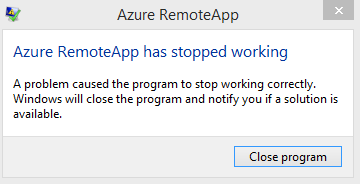

<properties 
    pageTitle="Azure RemoteApp Troubleshooting - Application launch and connection failures  | Microsoft Azure" 
    description="Learn how to troubleshoot issues with starting and connecting to applications in Azure RemoteApp." 
    services="remoteapp" 
	documentationCenter="" 
    authors="ericorman" 
    manager="mbaldwin" />

<tags 
    ms.service="remoteapp" 
    ms.workload="compute" 
    ms.tgt_pltfrm="na" 
    ms.devlang="na" 
    ms.topic="article" 
    ms.date="08/15/2016" 
    ms.author="elizapo" />

#Troubleshoot Azure RemoteApp - Application launch and connection failures 

> [AZURE.IMPORTANT]
> Azure RemoteApp is being discontinued. Read the [announcement](https://go.microsoft.com/fwlink/?linkid=821148) for details.

Applications hosted in Azure RemoteApp can fail to launch for a few different reasons. This article describes various reasons and error messages users might receive when trying to launch applications. It also talks about connection failures. (But this article does not describe issues when signing into the Azure RemoteApp client.)  

Read on for information about common error messages due to app launch and connection failures.

##We're getting you set up... Try again in 10 minutes.

This error means Azure RemoteApp is scaling up to meet the capacity need of your users. In the background more Azure RemoteApp VM instances are being created to handle the capacity needs of your users. Typically this takes around five minutes but can take up to 10 minutes. Sometimes, this doesn't happen fast enough and resources are needed immediately. For example a 9 AM scenario where many users need to use your app in Azure RemoteAppn at the same time. If this happens to you we can enable **capacity mode** on the back end. To do this open an Azure Support ticket and or email us at [remoteappforum@microsoft.com](mailto:remoteappforum@microsoft.com). Be certain to include your subscription ID in the request.  

## Could not auto-reconnect to your applications, please re-launch your application  

This error message is often seen if you were using Azure RemoteApp and then put your PC to sleep longer than 4 hours and then woke your PC up and the Azure RemoteApp client attempt to auto reconnect and timeout was exceeded.  Instruct users to navigate back to the application and attempt to open it from the Azure RemoteApp client.

 

## Problems with the temp profile 

This error occurs when your user profile (User Profile Disk) failed to mount and the user received a temporary profile.  Administrators should navigate to the collection in the Azure portal and then go to the **Sessions** tab and attempt to **Log Off** the user. This will force a full log off of the user session - then have the user attempt to launch an app again. If that fails contact Azure support and or email us at [remoteappforum@microsoft.com](mailto:remoteappforum@microsoft.com).

## Azure RemoteApp has stopped working

This error message means the Azure RemoteApp client is having an issue and needs to be restarted. Instruct users to close: select **Close program** and then launch the Azure RemoteApp client again.  If the issue continues open and Azure Support ticket and or email us at [remoteappforum@microsoft.com](mailto:remoteappforum@microsoft.com).

  

## An error occurred while Remote Desktop Connection was accessing this resource. Retry the connection or contact your system administrator

This is a generic error message - contact Azure support and or email us at [remoteappforum@microsoft.com](mailto:remoteappforum@microsoft.com) so we can investigate. 

 