<properties
    pageTitle="Accessing your apps from any device | Microsoft Azure"
    description="Learn what clients are supported for Azure RemoteApp and how to access your apps."
    services="remoteapp"
	documentationCenter=""
    authors="lizap"
    manager="mbaldwin" />

<tags
    ms.service="remoteapp"
    ms.workload="compute"
    ms.tgt_pltfrm="na"
    ms.devlang="na"
    ms.topic="article"
    ms.date="08/15/2016"
    ms.author="elizapo" />

# Accessing your apps in Azure RemoteApp

> [AZURE.IMPORTANT]
> Azure RemoteApp is being discontinued. Read the [announcement](https://go.microsoft.com/fwlink/?linkid=821148) for details.

One of the beauties of Azure RemoteApp is that you can access apps from any of your devices. Even better, you can start working on one device and then seamlessly transition to a second device and pick up right where you left off. To get started you need to download the appropriate client for your device and sign in to the service.

In this topic, we'll review the clients currently supported and how to download them before I show you how to sign in to RemoteApp from each of the clients.

## Supported clients

You can access RemoteApp using the steps below if your device is running one of these operating systems:

 - Windows 10 
 - Windows 8.1
 - Windows 8
 - Windows 7 Service Pack 1
 - Windows Phone 8.1
 - iOS
 - Mac OS X
 - Android

 What about thin clients? The following Windows Embedded thin clients are supported:

- Windows Embedded Standard 7
- Windows Embedded 8 Standard
- Windows Embedded 8.1 Industry Pro
- Windows 10 IoT Enterprise

## Downloading the client

No matter what platform you are using, the client you need to access RemoteApp can be found on the [Remote Desktop client download](https://www.remoteapp.windowsazure.com/ClientDownload/AllClients.aspx) page.

Clicking the different links will either directly start downloading the client or will send you to the client download page in the app store for that platform. Install the client by following the instructions on the screen.

Once you have installed the client on your device and launched it, jump to the corresponding section below to learn how to sign in to RemoteApp from that client.

## Android

Once you have installed the Microsoft Remote Desktop app from the Google Play store, you can find it in your app list under **Remote Desktop**.

1. Launching the app brings you to an empty Connection Center, unless you've already been using the app. To get started with Azure RemoteApp, tap the add button **""+""** and tap **Azure RemoteApp**.	

	 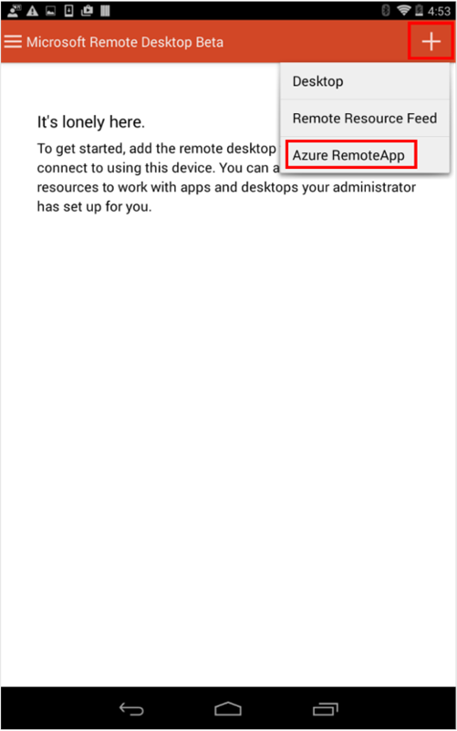

2. You need to sign in with your email address to access the service. Tap **Get started**.

	

3. On the next page, type in your **email address** and tap **Continue**. This begins the sign-in process using Azure Active Directory.

	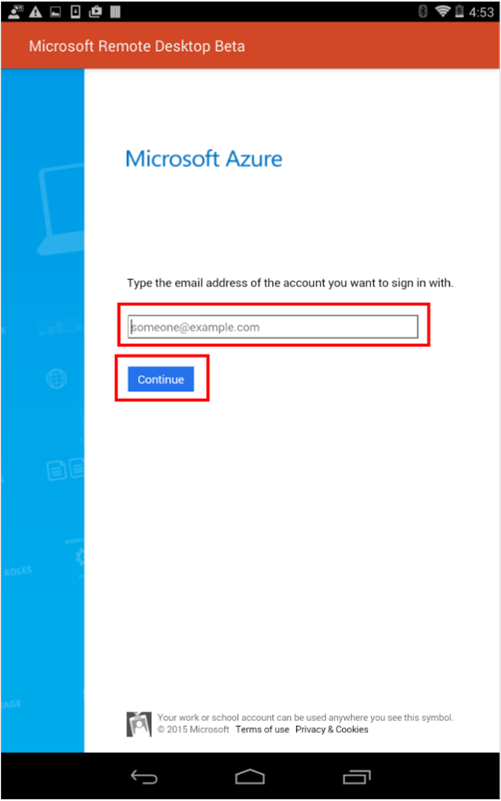

4. Follow the instructions on the screen to sign in with your Microsoft account (previously called "LiveID") or organization ID. Once signed in, you may be presented with a page listing all the invitations you have received. If you are, select the invitations you trust and tap **Done**.	

	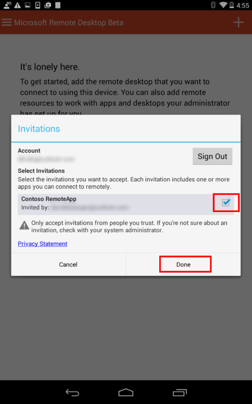

5. After accepting your invitations, the list of apps you have access to will be downloaded to your device and made available in the Connection Center. Tap one of the apps to start using it.

	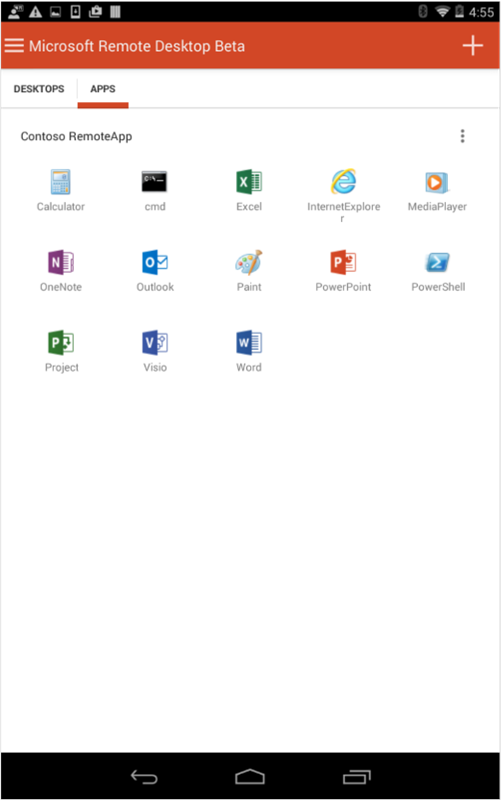

6. If you do not have an invitation yet, you can still try out the service. To do so, tap **Go to free trial** when prompted.

	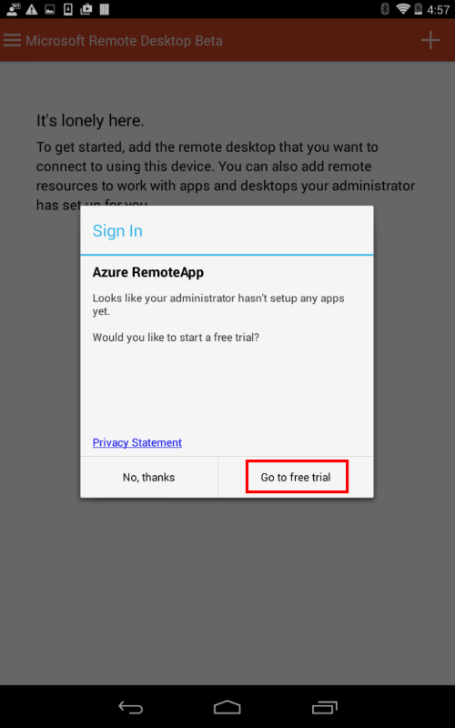

7. This will give you access to a basic set of apps to get you started with RemoteApp.

	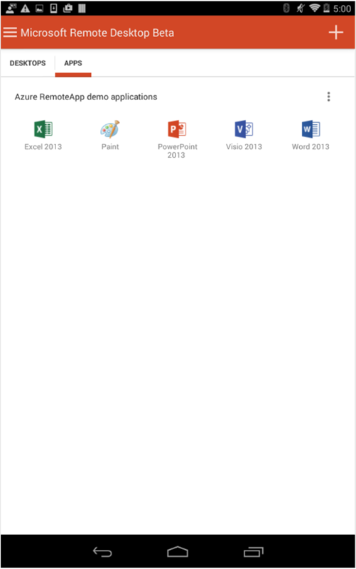

## iOS

Once you have installed the Microsoft Remote Desktop app from the App store, you can find it in your app list under **RD Client**.

1. Launching the app brings you to an empty Connection Center, unless you've already been using the app. To get started with Azure RemoteApp, tap the add button **""+""** and tap **Add Azure RemoteApp**.

	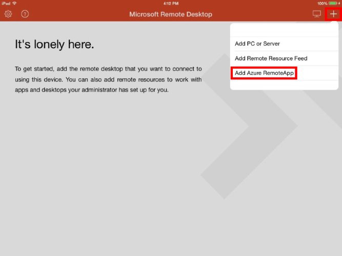

2. You need to sign in with your email address to access the service, to start that process, type in your **email address** and tap **Continue**.

	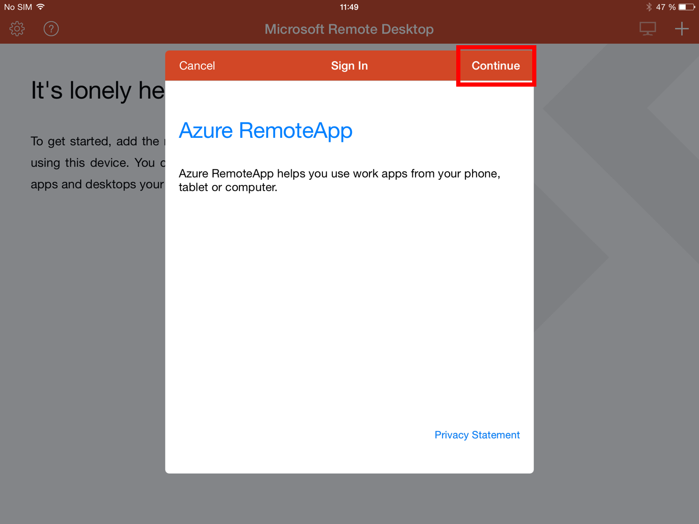

3. Follow the instructions on the screen to sign in with your Microsoft account (LiveID) or Organization ID. Once signed in, you may be presented with a page listing all the invitations you have received. If you are, select the invitations you trust and tap **Done**.

	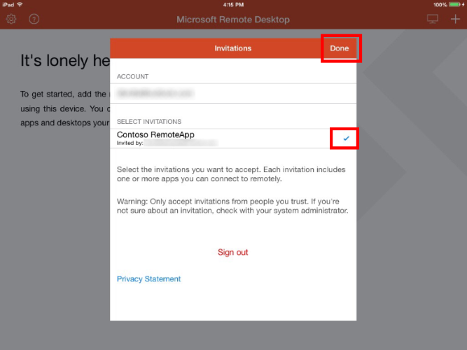

4. After accepting your invitations, the list of apps you have access to will be downloaded to your device and made available in the Connection Center. Tap one of the apps to launch it and start using it.

	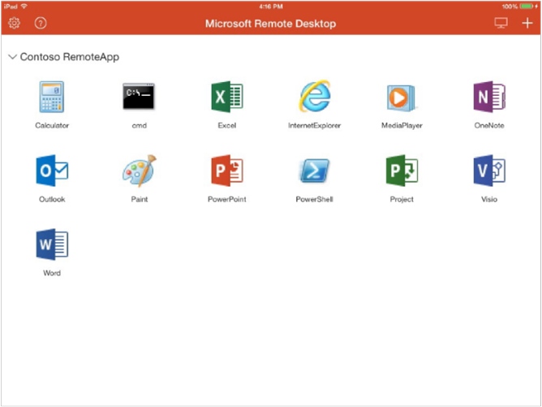

5. If you do not have an invitation yet, you can still try out the service. To do so, tap **Go to free trial** when prompted.

	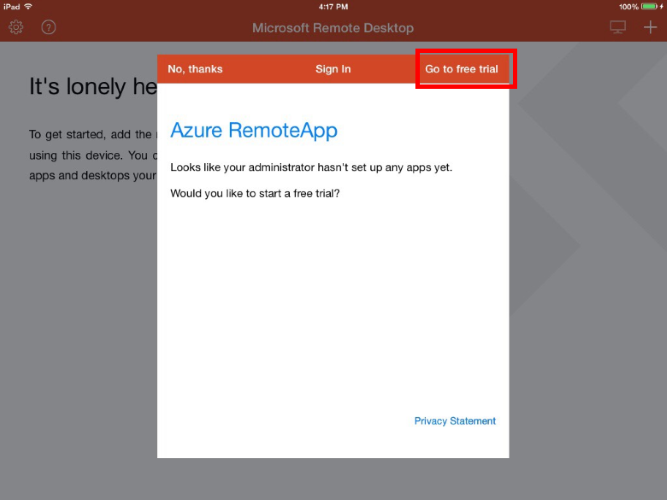

6. This will give you access to a basic set of apps to get you started with RemoteApp.

	

## Mac OS X

Once you have installed the Microsoft Remote Desktop app from the App store, you can find it in your app list under **Microsoft Remote Desktop**.

1. Launching the app brings you to an empty Connection Center, unless you've already been using the app. To get started with Azure RemoteApp, click the **Azure RemoteApp** button.

	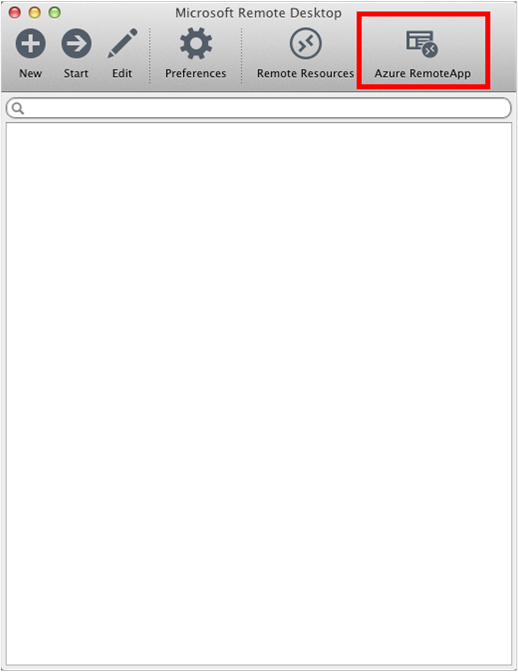

2. You need to sign in with your email address to access the service, to start that process, tap **Get Started**.

	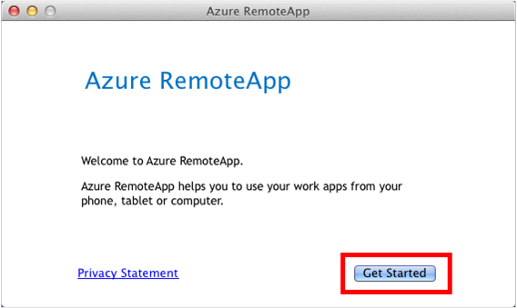

3. On the next page, type in your **email address** and tap **Continue**. This begins the sign in process using Azure Active Directory.

	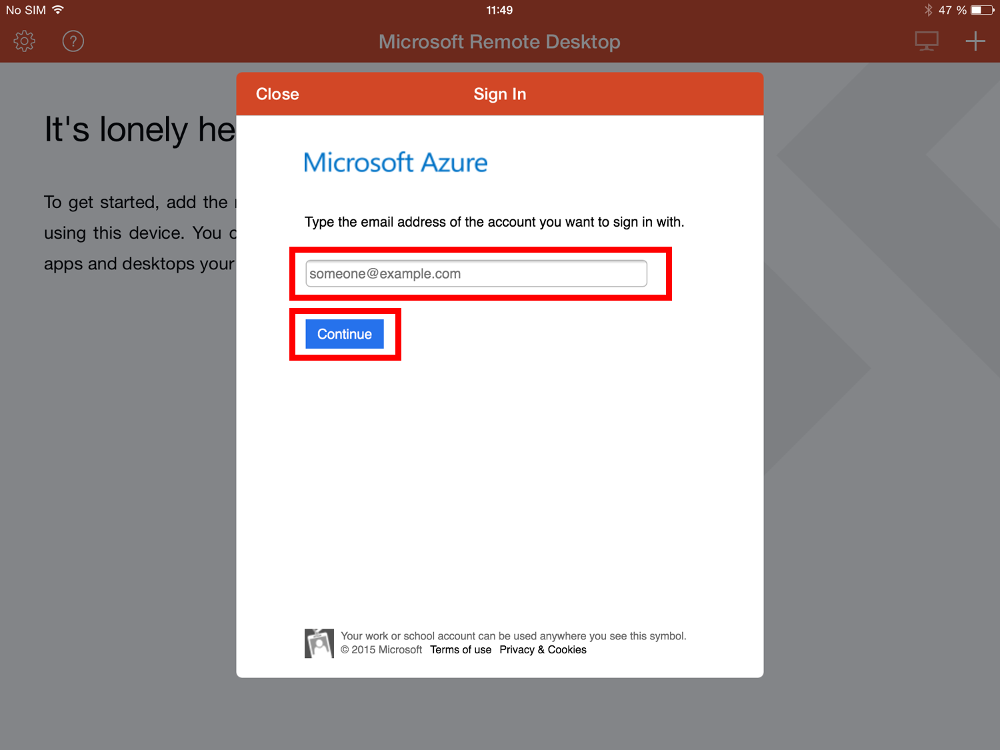

4. Follow the instructions on the screen to sign in with your Microsoft account (LiveID) or Organization ID. Once signed in, you may be presented with a page listing all the invitations you have received. If you are, select the invitations you trust and close the dialog.

	

5. After accepting your invitations, the list of apps you have access to will be downloaded to your device and made available in the Connection Center. Double-click one of the apps to launch it and start using it.

	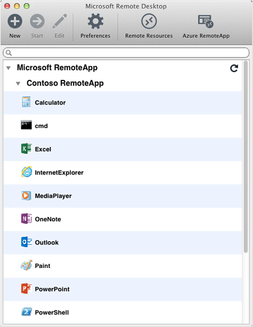

6. If you do not have an invitation yet, you can still try out the service. To do so, click **Go to free trial** when prompted.

	

7. This will give you access to a basic set of apps to get you started with RemoteApp.

	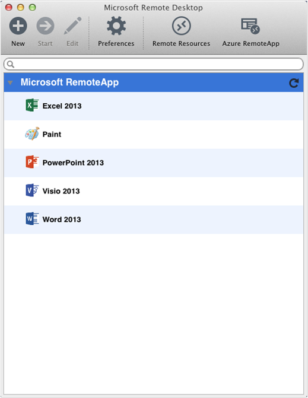

## Windows (All supported versions except Windows Phone)

The client launches automatically after it finishes installing, however when you need to access it again later it can be found in your app list under the name **Azure RemoteApp**.

1. Ater launching the client, the first page you see welcomes you to Azure RemoteApp. To proceed, click on **Get Started**.

	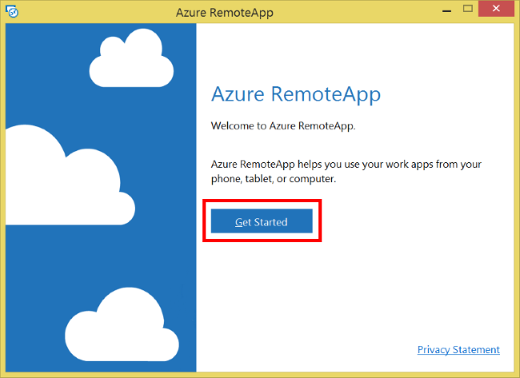

2. The next page starts the sign in process for Azure RemoteApp using Azure Active Directory. This process should look familiar if you have used Microsoft services in the past. Start by typing your **email address** and click **Continue**.

	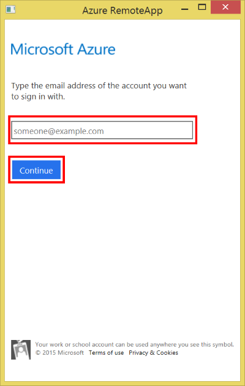

3. Follow the instructions on the screen to sign in with your Microsoft account (LiveID) or Organization ID. Once signed in, you may be presented with a page listing all the invitations you have received. If you are, select the invitations you trust and click **Done**.

	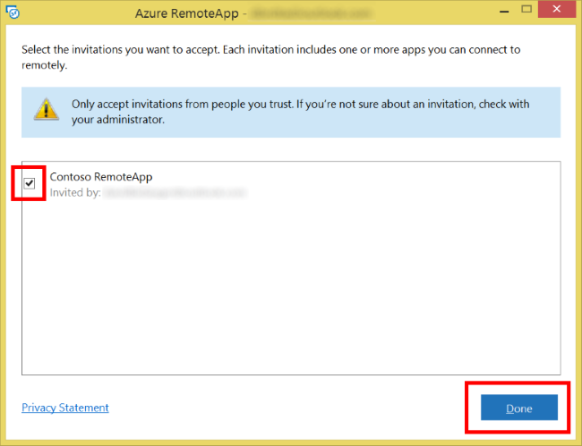

4. After accepting your invitations, the list of apps you have access to will be downloaded to your device and made available in the Connection Center. Double-click one of the apps to launch it and start using it.

	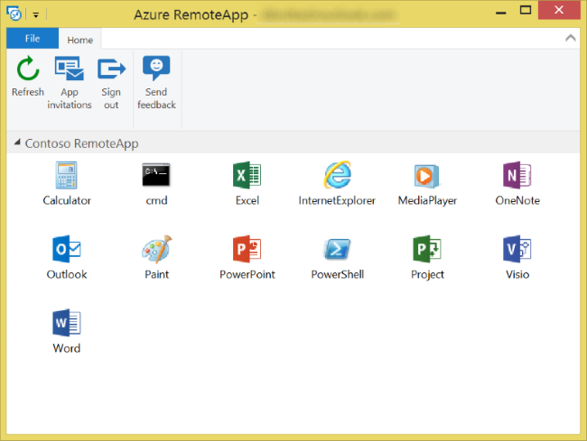

5. If no one has sent you an invitation yet, don't worry we've got you covered! You'll still have access to a demo collection so you can test out the service.

	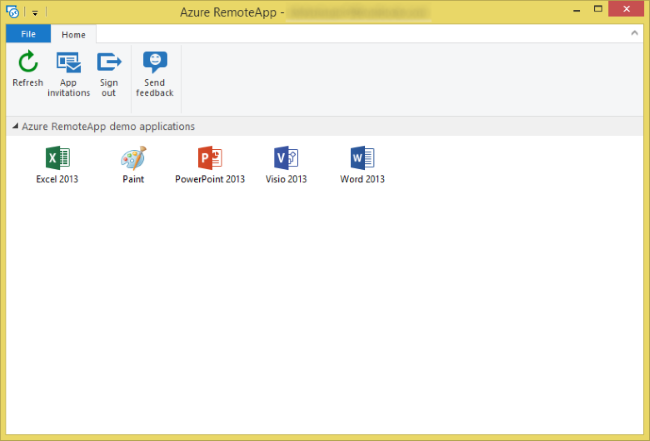

## Windows Phone 8.1

Once you have installed the Microsoft Remote Desktop app from the Windows Phone 8.1 store, you can find it in your app list under **Remote Desktop**.

1. Launching the app brings you directly to an empty Connection Center, unless you've already been using the app. To get started with Azure RemoteApp, tap the add button **""+""** at the bottom of the screen.

	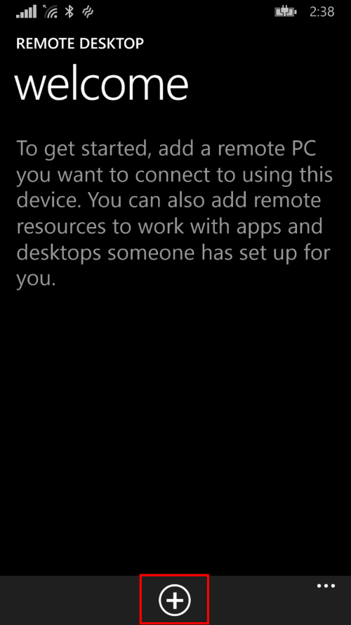

2. Next, tap on **Azure RemoteApp**.

	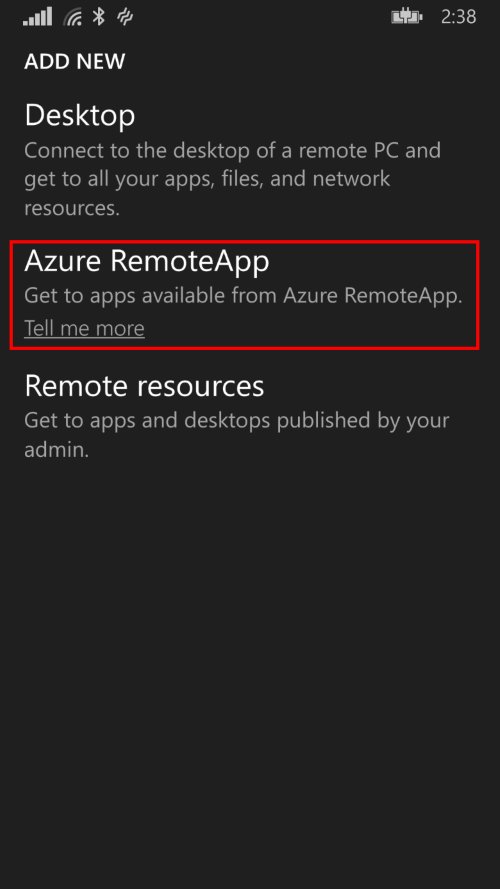

3. You need to sign in with your email address to access the service, to start that process, tap **connect**.

	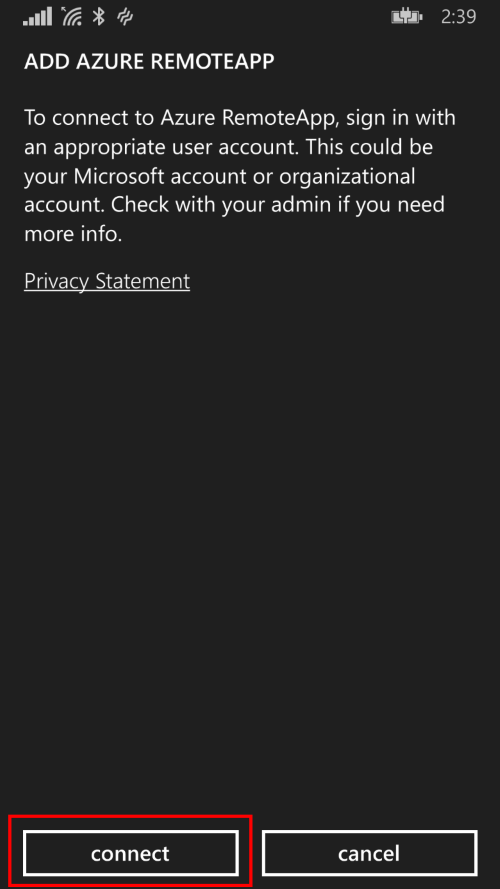

4. On the next page, type in your **email address** and tap **Continue**. This begins the sign in process using Azure Active Directory.

	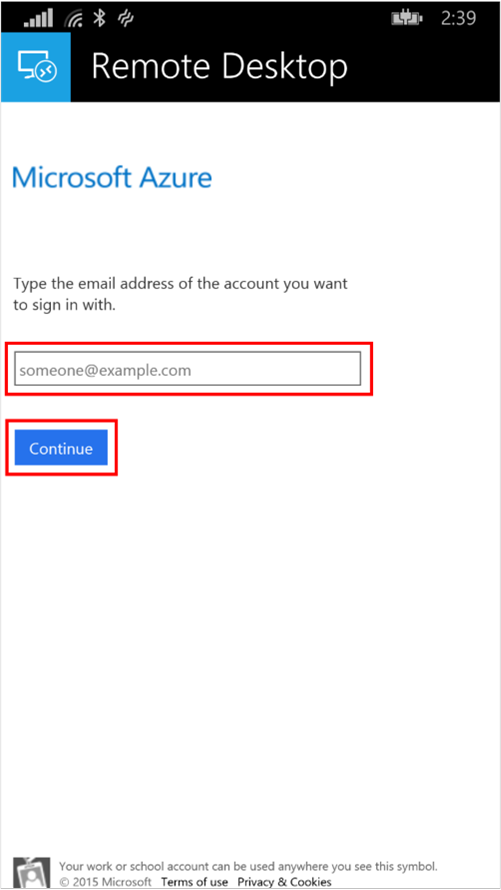

5. Follow the instructions on the screen to sign in with your Microsoft account (LiveID) or Organization ID. Once signed in, you may be presented with a page listing all the invitations you have received. If you are, select the invitations you trust and tap **save**.

	

6. After accepting your invitations, the list of apps you have access to will be downloaded to your device and made available in the Connection Center. Tap one of the apps to launch it and start using it.

	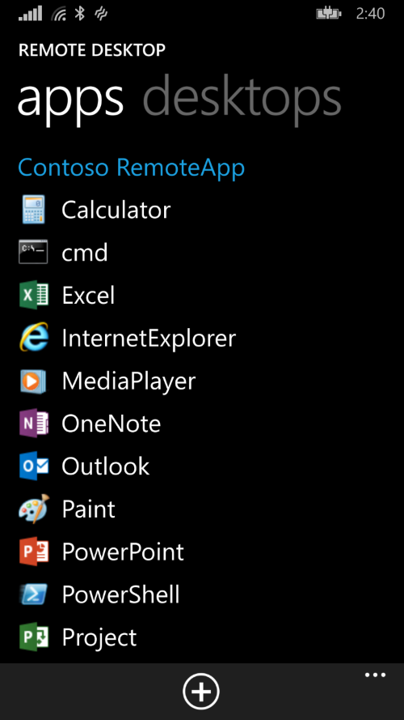

7. If you do not have an invitation yet, you can still try out the service. To do so, tap **yes** when prompted.

	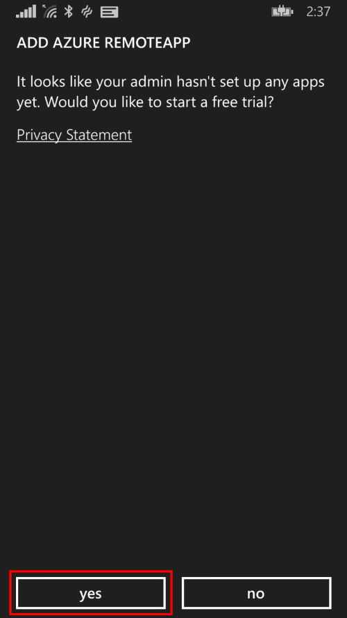

8. This will give you access to a basic set of apps to get you started with RemoteApp.

	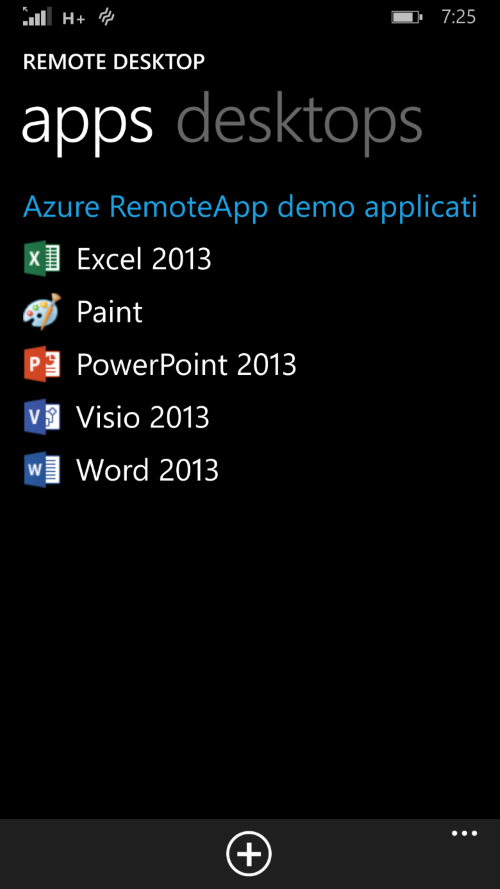
 