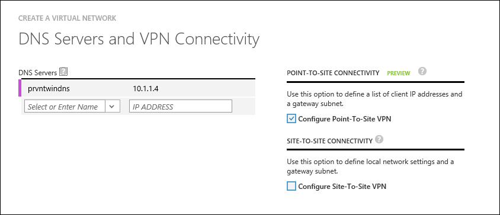

<properties
    pageTitle="Troubleshoot creating RemoteApp hybrid collections | Microsoft Azure"
    description="Learn how to troubleshoot RemoteApp hybrid collection creation failures"
    services="remoteapp"
    documentationCenter=""
    authors="vkbucha"
    manager="mbaldwin" />

<tags
    ms.service="remoteapp"
    ms.workload="compute"
    ms.tgt_pltfrm="na"
    ms.devlang="na"
    ms.topic="article"
    ms.date="08/15/2016"
    ms.author="elizapo" />

# Troubleshoot creating Azure RemoteApp hybrid collections

> [AZURE.IMPORTANT]
> Azure RemoteApp is being discontinued. Read the [announcement](https://go.microsoft.com/fwlink/?linkid=821148) for details.

A hybrid collection is hosted in and stores data in the Azure cloud but also lets users access data and resources stored on your local network. Users can access apps by logging in with their corporate credentials synchronized or federated with Azure Active Directory. You can deploy a hybrid collection that uses an existing Azure Virtual Network, or you can create a new virtual network. We recommend that you create or use a virtual network subnet with a CIDR range large enough for expected future growth for Azure RemoteApp.

Haven't created your collection yet? See [Create a hybrid collection](remoteapp-create-hybrid-deployment.md) for the steps.

If you are having trouble creating your collection, or if the collection isn't working the way you think it should, check out the following information.

## Your image is invalid ##
If you see a message like, "GoldImageInvalid" when you are waiting for Azure to provision your collection, it means that your template image doesn't meet the [defined image requirements](remoteapp-imagereqs.md). So, go read those [requirements](remoteapp-imagereqs.md), fix your image, and try to create your collection again.

## Does your VNET have network security groups defined? ##
If you have network security groups defined on the subnet you are using for your collection, make sure these [URLs and ports](remoteapp-ports.md) are accessible from within your subnet.

You can add additional network security groups to the VMs deployed by you in the subnet for tighter control.

## Are you using your own DNS servers? And are they accessible from your VNET subnet? ##
>[AZURE.NOTE] You have to make sure the DNS servers in your VNET are always up and always able to resolve the virtual machines hosted in the VNET. Don't use Google DNS for this.

For hybrid collections you use your own DNS servers. You specify them in your network configuration schema or through the management portal when you create your virtual network. DNS servers are used in the order that they are specified in a failover manner (as opposed to round robin).  
Please refer to [Name Resolution for VMs and Role Instances](../virtual-network/virtual-networks-name-resolution-for-vms-and-role-instances.md) to make sure your DNS servers are configured correcly.

Make sure the DNS servers for your collection are accessible and available from the VNET subnet you specified for this collection.

For example:

	<VirtualNetworkConfiguration>
    <Dns>
      <DnsServers>
        <DnsServer name="" IPAddress=""/>
      </DnsServers>
    </Dns>
	</VirtualNetworkConfiguration>

## Are you using an Active Directory domain controller in your collection? ##
Currently only one Active Directory domain can be associated with Azure RemoteApp. The hybrid collection supports only Azure Active Directory accounts that have been synced using DirSync tool from a Windows Server Active Directory deployment; specifically, either synced with the Password Synchronization option or synced with Active Directory Federation Services (AD FS) federation configured. You need to create a custom domain that matches the UPN domain suffix for your on-premises domain and set up directory integration.

See [Configuring Active Directory for Azure RemoteApp](remoteapp-ad.md) for more information.

Make sure the domain details provided are valid and the domain controller is reachable from the VM created in the subnet used for Azure Remote App. Also make sure the service account credentials supplied have permissions to add computers to the provided domain and that the AD name provided can be resolved from the DNS provided in the VNET.

## What domain name did you specify when you created your collection? ##

The domain name you created or added must be an internal domain name (not your Azure AD domain name) and must be in resolvable DNS format (contoso.local). For example, you have an Active Directory internal name (contoso.local) and an Active Directory UPN (contoso.com) - you have to use the internal name when you create your collection.
