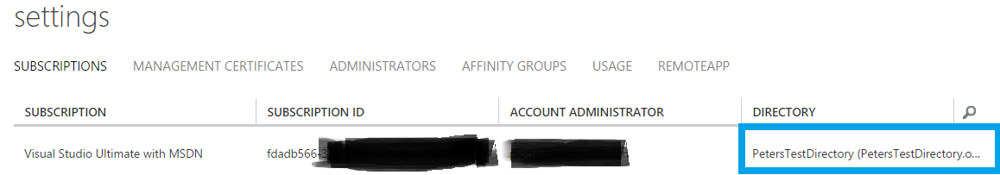

<properties 
    pageTitle="How to use Azure RemoteApp with Office 365 user accounts | Microsoft Azure"
	description="Learn how to use Azure RemoteApp with my Office 365 user accounts"
	services="remoteapp"
	documentationCenter="" 
	authors="piotrci" 
	manager="mbaldwin" />

<tags 
    ms.service="remoteapp" 
    ms.workload="compute" 
    ms.tgt_pltfrm="na" 
    ms.devlang="na" 
    ms.topic="article" 
    ms.date="08/15/2016" 
    ms.author="elizapo" />

# How to use Azure RemoteApp with Office 365 user accounts

> [AZURE.IMPORTANT]
> Azure RemoteApp is being discontinued. Read the [announcement](https://go.microsoft.com/fwlink/?linkid=821148) for details.

If you have an Office 365 subscription you have an Azure Active Directory that stores your user names and passwords used to access Office 365 services. For example, when your users activate Office 365 ProPlus they authenticate against Azure AD to check for licenses. Most customers would like to use the same directory with Azure RemoteApp.

If you are deploying Azure RemoteApp you are most likely using an Azure subscription that is associated with a different Azure AD. In order to use your Office 365 directory, you will need to move the Azure subscription into that directory.

For info on how to deploy Office 365 client applications, see [How to use your Office 365 subscription with Azure RemoteApp](remoteapp-officesubscription.md).
 
## Phase 1: Register your free Office 365 Azure Active Directory subscription
If you are using the Azure classic portal, use the steps in [Register your free Azure Active Directory subscription](https://technet.microsoft.com/library/dn832618.aspx) to get administrative access to your Azure AD via the Azure Management Portal. As the result of this process you should be able to log into the Azure portal and see your directory there – at this point you won’t see much more since the full Azure subscription you are using with Azure RemoteApp is in a different directory.

Remember the name and password of the administrator account you created in this step – they will be needed in Phase 2.

If you are using the Azure portal, check out [How to register and activate a free Azure Active Directory using Office 365 portal](http://azureblogger.com/2016/01/how-to-register-and-activate-a-free-azure-active-directory-using-office-365-portal/).

## Phase 2: Change the Azure AD associated with your Azure subscription.
We are going to change your Azure subscription from its current directory into the Office 365 directory we worked with in Phase 1.

Follow the instructions described in [Change the Azure Active Directory tenant in Azure RemoteApp](remoteapp-changetenant.md). Pay particular attention to the following steps:

- Step #1: If you have deployed Azure RemoteApp (ARA) in this subscription, make sure you remove all Azure AD user accounts from any ARA collections first, before trying anything else. Alternatively, you can consider deleting any existing collections.
- Step #2: This is a critical step. You need to use a Microsoft account (e.g. @outlook.com) as a Service Administrator on the subscription; this is because we cannot have any user accounts from the existing Azure AD attached to the subscription – if we do, we won’t be able to move it to a different Azure AD.
- Step #4: When adding an existing directory, the system will ask you to sign in with the administrator account for that directory. Make sure to use the administrator account from Phase 1.
- Step #5: Change the parent directory of the subscription to your Office 365 directory. The end result should be that under Settings -> Subscriptions your subscription lists the Office 365 directory. 

 

At this point your Azure RemoteApp subscription is associated with your Office 365 Azure AD; you can use the existing Office 365 user accounts with Azure RemoteApp!

