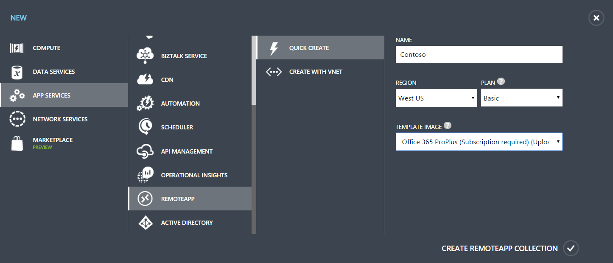

<properties 
    pageTitle="How to use your Office 365 subscription with Azure RemoteApp"
	description="Learn how you can use your Office 365 subscription in Azure RemoteApp to share Office apps."
	services="remoteapp"
	documentationCenter="" 
	authors="lizap" 
	manager="mbaldwin" />

<tags 
    ms.service="remoteapp" 
    ms.workload="compute" 
    ms.tgt_pltfrm="na" 
    ms.devlang="na" 
    ms.topic="article" 
    ms.date="09/02/2015" 
    ms.author="elizapo" />

# How to use your Office 365 subscription with Azure RemoteApp

Did you know that you can use your existing Office 365 subscription in Azure RemoteApp to share Office apps from the cloud? Read on for information on your Office 365 + Azure RemoteApp options, including links to articles about Office 365 that help you make the most of your subscription.

## Can I use my Office 365 subscription to run Office applications in Azure RemoteApp?

Yes! In fact, using your Office 365 subscription is the only way to bring your Office applications to Azure RemoteApp.

The great thing about your Office 365 subscription is that it lets you use the same user license on many different platforms and environments, including the Azure cloud. When you use Office applications in Azure RemoteApp you don't need to purchase additional licenses or configure your existing licenses in any special way. All you need is an Office 365 subscription that includes [Office 365 ProPlus](https://technet.microsoft.com/library/Gg702619.aspx).

Office 365 ProPlus enables [shared computer activation](https://technet.microsoft.com/library/Dn782860.aspx) - this feature enables temporary user-based activation for Office in virtual and cloud environments like Azure RemoteApp (and Remote Desktop Services).

Which Office 365 plans include Office 365 ProPlus? Check out the [Service availability within each plan](https://technet.microsoft.com/library/office-365-plan-options.aspx) table. Note that not all plans include Office 365 ProPlus (for example, the Office 365 Business plan). If your plan does not, consider upgrading to a plan that does (for example, Office 365 Education E3).

## Ok, so how are my Office 365 ProPlus licenses used with Azure RemoteApp?

Each user license for Office 365 ProPlus lets a single user activate Office applications on up to 5 computers plus tablets and phones. Each activation is registered with the user until they deactivate Office on the device. (Users can manage their devices in the [Office 365 portal](https://portal.office365.com/).)

As long as you (the admin) assign Office 365 ProPlus licenses to your users, they can use Office on their personal devices, as well as through your Azure RemoteApp collection.

## Which Office applications can I use with Office 365 and Azure RemoteApp?

You can use your Office 365 ProPlus subscription to share Office 2013 and Office 2016 (after it's released). Azure RemoteApp doesn't support earlier versions of Office.

## What about Visio Pro or Project Pro?

The Office 365 ProPlus image included in your RemoteApp subscription includes both Visio Pro and Project Pro. But you cannot use your Office 365 ProPlus subscription to activate those programs - they each have their own license. You can activate them in the [Office 365 portal](https://portal.office365.com/). 

You don't have to license these programs if you don't want to use them. Just activate the programs you want to use - and skip the others. You'll still see them in the image, but you can't use them. 

## How do I get started with Office 365 and Azure RemoteApp?

Now that you know the details of Office 365 licensing, let's get you started using it in Azure RemoteApp - it's very easy:

When you create your Azure RemoteApp collection, use the **Office 365 ProPlus (Subscription required)** image.

This image contains the latest version of Windows Server and Office 365 ProPlus. After you configure your collection (including publishing apps), your users simply log into Azure RemoteApp (by using their RemoteApp client) and provide their Office 365 credentials for any Office apps. Licenses are automatically delivered without any set up or management required.

## Can I create a custom image with Office 365 ProPlus?

You can create a custom image for your collection that contains Office 365 ProPlus. There are 2 choices - use the Azure gallery image we provide or you can create your own custom image and install Office 365 ProPlus there.

### Use the Azure gallery image

The easiest way to deploy Office 365 ProPlus to a collection is to [start with one of the Azure gallery images](remoteapp-image-on-azurevm.md) included in your Azure RemoteApp subscription. Make sure you choose the **Windows Server Remote Desktop Session Host with Office 365 ProPlus pre-installed** image. Then, install any other apps you want on that image, and you're good to go.

### Use a custom image

You can always create a custom image - you can create an [Azure VM](remoteapp-image-on-azurevm.md) or [create the image locally](remoteapp-create-custom-image.md) and upload it to Azure. In either case, make sure you install Office 365 ProPlus using the shared computer activation node. Use the [Office Deployment Tool](http://blogs.technet.com/b/odsupport/archive/2014/07/11/using-the-office-deployment-tool.aspx) and follow the [instructions](https://technet.microsoft.com/library/Dn782858.aspx) for installation.  

### Disable automatic updates for Office 365 ProPlus in your custom image - IMPORTANT

Your custom image is used by Azure RemoteApp as a template for adding additional resources as the demand from your users increases. To prevent delays and connection issues, disable automatic updated for Office in the image. If you do not, then every resource created with that template will automatically update when it is started. Instead, use the standard Azure RemoteApp process for updating your custom image. That way you update the Office applications once on the template image and then let Azure RemoteApp take care of getting the updates to your users.

To disable automatic updates, add the following to the Office Deployment Tool configuration file:

		<Updates Enabled="FALSE" />

So now your configuration file should contain these lines:
	
		<Display Level="NONE" AcceptEULA="TRUE" />
		<Propery Name="SharedComputerLicensing" Value="1" />
		<Updated Enabled="FALSE" />

## So how can I update an image with Office 365 ProPlus?

There are many reasons to update the image in your collection. Here are just a few:

- Get the latest Windows updates 
- Get the latest Office 365 ProPlus application updates
- Update your custom app
- Change other configuration settings for the image itself

For the end-to-end steps for updating your collection to use the image you updated, go [here](remoteapp-update.md). But for information on how to update the image and Office 365 ProPlus, check out the following information.

You have two options for updating your image - replace your image with a completely new one or manually update your existing image.

### Replace your image with the latest Azure gallery image + add customizations
With this option, you let Microsoft take care of the Windows Server and Office 365 ProPlus updates. Instead of updating your existing image, you'll create a completely new image based on the latest gallery image. Then, repeat any steps you did before to customize the image - install custom apps, modify the image configuration, etc.

The gallery images are regularly updated, so you can rest easy, knowing that your Windows Server and Office 365 ProPlus apps are up to date. Of course, the trade-off is that you'll have to apply your customizations every time you get a new image. You can create scripts to automate setting your customizations.

### Manually update your existing image

With this option, you use standard Windows tools to apply updates to the image. For Office 365 ProPlus, use the Office Deployment tool to download and install the latest updates or versions of Office 365 ProPlus.

> [AZURE.IMPORTANT] Remember - disable the Office 365 ProPlus automatic updates.

Need more information about using the Office Deployment Tool for updates?

- [Deploy Click-to-Run for Office 365 products by using the Office Deployment Tool](https://technet.microsoft.com/library/JJ219423.aspx)
- [Deploying and Updating Office 365 ProPlus Using the Office Deployment Tool](https://channel9.msdn.com/Events/Ignite/2015/BRK3168) (video)
- [Configure update settings for Office 365 ProPlus](https://technet.microsoft.com/library/dn761708.aspx)
