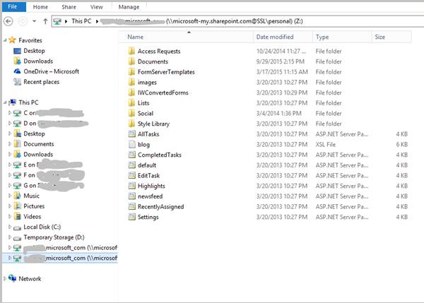

<properties
   pageTitle="How to integrate OneDrive for Business and Azure RemoteApp | Microsoft Azure"
   description="Learn how to use OneDrive for Business with Azure RemoteApp."
   services="remoteapp"
   documentationCenter=""
   authors="pavithir"
   manager="mbaldwin"
   editor=""/>

<tags
   ms.service="remoteapp"
   ms.devlang="na"
   ms.topic="hero-article"
   ms.tgt_pltfrm="na"
   ms.workload="compute"
   ms.date="01/13/2016"
   ms.author="elizapo"/>

# How to integrate OneDrive for Business and Azure RemoteApp

You can use OneDrive for Business as a file repository with Azure RemoteApp. OneDrive for Business is a great way to keep files synchronized across all your devices and workspaces. The [user profile disk](remoteapp-upd.md) (UPD) for a user is a place where users can store their files for Azure RemoteApp apps but these files are accessible only by using Azure RemoteApp. OneDrive for Business, on the other hand, allows the user to access files wherever and whenever they want without the pre-requisite of going through Azure RemoteApp. This article will cover the OneDrive for Business versions supported and the different ways in which admins can set up OneDrive for Business for Azure RemoteApp.

## Are all versions of OneDrive supported?

There are two versions of OneDrive: OneDrive and OneDrive for Business. Only OneDrive for Business is supported on Azure RemoteApp. The personal OneDrive does work but is not officially supported. Also, only the latest version of OneDrive for Business, aka the Next Gen Sync client, is supported on Azure RemoteApp (and RDSH/Citrix/Terminal servers).

>[AZURE.NOTE]  OneDrive (for consumers/personal edition) is not supported on Azure RemoteApp. Not all versions of OneDrive for Business are supported either as they haven’t been certified to work on Windows Server. Though both the new client (Next Gen Sync Client) and the older Groove versions might seem to work fine on Azure RemoteApp, as described in [https://support.microsoft.com/en-us/kb/2965687](https://support.microsoft.com/kb/2965687), the older sync engines will not have full functionality on Citrix / Terminal Servers (Windows Server). Use the new sync client on Azure RemoteApp (and other Windows Server deployments).

## What are the different set up options for OneDrive for Business?

- **Traditional setup of OneDrive for Business sync engine:** 
OneDrive for Business sync client can be installed on a server SKU (Remote Desktop as well as RemoteApp session/Terminal Server session) and folders selected for sync on the RemoteApp session, just like you would on a Windows client SKU. The default location where OneDrive for Business syncs files is the same location where the user profile disk used to store user data and settings on Azure RemoteApp resides -  under C:\users\<username>. This disk will follow the user to any VM they log into and hence the ODB files will follow the user too. The OneDrive for Business app needs to be published by the admin for all users, and users need to launch it on every new session (or the launch can be automated with a login script) to make sure the sync engine is activated. OneDrive for Business will download the whole file on the VM where the session is running. When syncing a user’s content, it is a heavy workload to sync everything (CPU/data transferred/storage taken) that is simply not optimized for terminal machines that have a large number of users that sign in briefly to each machine. With the selective syncing, the workload would be reduced but the concern still remains.
- **“Virtualize” the OneDrive for Business/redirect it from the local fat client into the session:**
If you are syncing OneDrive to a folder on the client device, under a drive, you can choose to [redirect](remoteapp-redirection.md) that drive to Azure RemoteApp – that drive should be same across all your users’ clients and they should have OneDrive synced to a folder under that drive. If they access RemoteApp from any other client, these files could potentially not be available (workaround -  they can always access their files using the online version of OneDrive). 
- **Present OneDrive for Business as a drive within the Azure RemoteApp environment without caching/syncing the files:**
(map OneDrive for Business http URL to a drive on the VM)
Mapping OneDrive for Business to the network drive within the RDSH environment is supported. Scenarios this can be used in: 
	- When thin clients (no local storage) are used to access Azure RemoteApp - Application requires files stored on OneDrive for Business, but would want them to "look" local and admin does not want to sync the files to a VM.
	- When there are many large files on OneDrive for Business that have been selected for syncing. Given the workload of syncing, all files might not be synced when the user wants to use them. Also if the total sizes of the files exceed 50 GB, they cannot be stored in the UPD.

In the above scenarios, admins can choose to go with the options of mapping a drive on the VM to the user’s OneDrive for Business http URL. Some options for enabling this:

- Have office binaries on the image and not activate the OneDrive for Business sync engine.
- Have NO Office binaries on the image – This case comes with a pre-requisite – Desktop Experience Pack. Specifically, the WebClient service (AKA WebDAV) needs to be installed as part of Desktop Experience Pack. 

### Install Desktop Experience Pack on Windows Server 2012 R2
To install the Desktop Experience Pack: 

1. In Server Manager, click **Manage -> Add Roles and Features**.
2. Click **Features**, and then **User Interfaces and Infrastructure -> Desktop Experience**.

### Map a drive to the OneDrive for Business URL

Follow the instructions on the support article:
[https://support.microsoft.com/kb/2616712](https://support.microsoft.com/kb/2616712)
 
An important step in the setup is to make sure that you select **keep me signed in**.

On a high-level, here are the instructions:

1.	Locate the URL for the drive. The URL used for the drive mapping is the one you get when you browse to your home directory in OneDrive for Business online. For example:
 
	https://microsoft-my.sharepoint.com/personal/alias_microsoft_com/_layouts/15/onedrive.aspx?AjaxDelta=1&isStartPlt1=something
2.	Open the URL using a browser on the RemoteApp session, and select **keep me signed in** before you log into the URL for your account.
3.	Open Windows Explorer and map a drive to the above URL. If the URL does not resolved, the shorter form can be used:
	
	https://microsoft-my.sharepoint.com/personal/alias_microsoft_com. 

	This immediately creates the mapped drive - it looks like this:
 
	