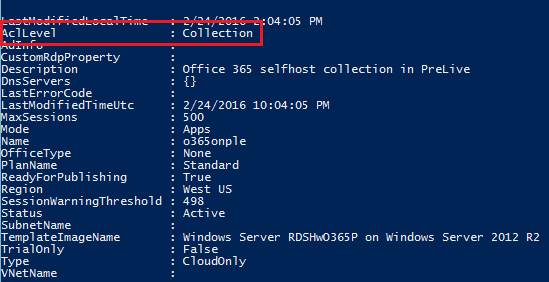

<properties
   pageTitle="Publish applications to individual users in an Azure RemoteApp collection (Preview) | Microsoft Azure"
   description="Learn how you can publish apps to individual users, instead of depending on groups, in Azure RemoteApp."
   services="remoteapp-preview"
   documentationCenter=""
   authors="piotrci"
   manager="mbaldwin"
   editor=""/>

<tags
   ms.service="remoteapp"
   ms.devlang="na"
   ms.topic="hero-article"
   ms.tgt_pltfrm="na"
   ms.workload="compute"
   ms.date="08/15/2016"
   ms.author="piotrci"/>

# Publish applications to individual users in an Azure RemoteApp collection (Preview)

> [AZURE.IMPORTANT]
> Azure RemoteApp is being discontinued. Read the [announcement](https://go.microsoft.com/fwlink/?linkid=821148) for details.

This article explains how to publish applications to individual users in an Azure RemoteApp collection. This is new functionality in Azure RemoteApp, currently in “private preview” and available only to select early adopters for evaluation purposes.

Originally Azure RemoteApp enabled only one way of “publishing” applications: the administrator would publish apps from the image and they would be visible to all users in the collection.

A common scenario is to include many applications in a single image and deploy one collection in order to reduce management costs. Oftentimes not all applications are relevant to all users – administrators would prefer to publish apps to individual users so they don’t see unnecessary applications in their application feed.

This is now possible in Azure RemoteApp – currently as a limited preview feature. Here is a brief summary of the new functionality:

1. A collection can be set into one of two modes:
 
  - the original “collection mode”, where all users in a collection can see all published applications. This is the default mode.
  - the new “application mode”, where users only see applications that have been explicitly assigned to them

2. At the moment the application mode can only be enabled using Azure RemoteApp PowerShell cmdlets.

  - When set to application mode, user assignment in the collection cannot be managed through the Azure portal. User assignment has to be managed through PowerShell cmdlets.

3. Users will only see the applications published directly to them. However, it may still be possible for a user to launch the other applications available on the image by accessing them directly in the operating system.
  - This feature does not provide a secure lockdown of applications; it only limits visibility in the application feed.
  - If you need to isolate users from applications, you will need to use separate collections for that.

## How to get Azure RemoteApp PowerShell cmdlets

To try the new preview functionality, you will need to use Azure PowerShell cmdlets. It is currently not possible to use the Azure Management portal to enable the new application publishing mode.

First, make sure you have the [Azure PowerShell module](../powershell-install-configure.md) installed.

Then launch the PowerShell console in administrator mode and run the following cmdlet:

		Add-AzureAccount

It will prompt you for your Azure user name and password. Once signed in, you will be able to run Azure RemoteApp cmdlets against your Azure subscriptions.

## How to check which mode a collection is in

Run the following cmdlet:

		Get-AzureRemoteAppCollection <collectionName>

The AclLevel property can have the following values:

- Collection: the original publishing mode. All users see all published apps.
- Application: the new publishing mode. Users see only the apps published directly to them.

## How to switch to application publishing mode

Run the following cmdlet:

		Set-AzureRemoteAppCollection -CollectionName -AclLevel Application

Application publishing state will be preserved: initially all users will see all of the original published apps.

## How to list users who can see a specific application

Run the following cmdlet:

		Get-AzureRemoteAppUser -CollectionName <collectionName> -Alias <appAlias>

This lists all users who can see the application.

Note: You can see the application aliases (called "app alias" in the syntax above) by running Get-AzureRemoteAppProgram -CollectionName <collectionName>.

## How to assign an application to a user

Run the following cmdlet:

		Add-AzureRemoteAppUser -CollectionName <collectionName> -UserUpn <user@domain.com> -Type <OrgId|MicrosoftAccount> -Alias <appAlias>

The user will now see the application in the Azure RemoteApp client and will be able to connect to it.

## How to remove an application from a user

Run the following cmdlet:

		Remove-AzureRemoteAppUser -CollectionName <collectionName> -UserUpn <user@domain.com> -Type <OrgId|MicrosoftAccount> -Alias <appAlias>

## Providing feedback
We appreciate your feedback and suggestions regarding this preview feature. Please fill out the [survey](http://www.instant.ly/s/FDdrb) to let us know what you think.

## Haven't had a chance to try the preview feature?
If you have not participated in the preview yet, please use this [survey](http://www.instant.ly/s/AY83p) to request access.
