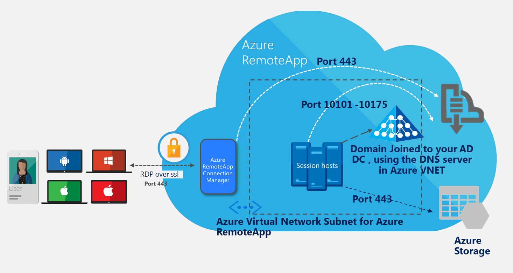
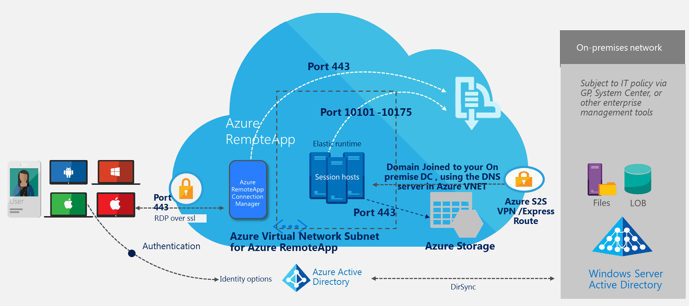

<properties
    pageTitle="How to plan your virtual network for an Azure RemoteApp collection | Microsoft Azure"
    description="Learn how to plan your virtual network for an Azure RemoteApp collection."
    services="remoteapp"
    documentationCenter="" 
    authors="mghosh1616"
    manager="mbaldwin" />

<tags
    ms.service="remoteapp"
    ms.workload="compute"
    ms.tgt_pltfrm="na"
    ms.devlang="na"
    ms.topic="article"
    ms.date="08/15/2016"
    ms.author="elizapo" />

# How to plan your virtual network for Azure RemoteApp

> [AZURE.IMPORTANT]
> Azure RemoteApp is being discontinued. Read the [announcement](https://go.microsoft.com/fwlink/?linkid=821148) for details.

This document describes how to set up your Azure virtual network (VNET) and the subnet for Azure RemoteApp. If you are unfamiliar with Azure virtual networks, this is a capability that helps you to virtualize your network infrastructure to the cloud and to create hybrid solutions with Azure and your on-premises resources. You can read more about it [here](../virtual-network/virtual-networks-overview.md).

If you want to define security policies for traffic (both incoming and outgoing) in your virtual network where you are deploying Azure RemoteApp, we strongly recommend creating a separate subnet for Azure RemoteApp from the rest of your deployments in the Azure virtual network. For more information on how to define security policies on your Azure virtual network subnet, please read [What is a Network Security Group (NSG)?](../virtual-network/virtual-networks-nsg.md).

## Types of Azure RemoteApp collections with Azure virtual networks

The following graphics show the two different collection options when you want to use a virtual network.

### Azure RemoteApp cloud collection with VNET

 

This represents an Azure RemoteApp collection where all the resources that the RemoteApp session hosts need to access are deployed in Azure. They can be in the same VNET as the RemoteApp VNET or a different VNET in Azure.

### Azure RemoteApp hybrid collection with VNET

This represents an Azure RemoteApp collection where some of the resources that the RemoteApp session hosts need to access are deployed on-premises. The RemoteApp VNET is linked to the on-premises network using Azure hybrid technologies like site-to-site VPN or Express Route.

## How the system works

Under the covers Azure RemoteApp deploys Azure virtual machines (with your uploaded image) to the virtual network subnet that you chose during provisioning. If you opted for a hybrid collection, we try to resolve the FQDN of the domain controller you entered in the provisioning workflow with the DNS server provided in the virtual network.  
If you are connecting to an existing virtual network, make sure to expose the necessary ports in your network security groups in your Azure RemoteApp subnet. 

We recommend you use a [large enough  subnet for Azure RemoteApp](remoteapp-vnetsizing.md). The largest supported by Azure Virtual network is /8 (using CIDR subnet definitions). Your subnet should be large enough to accommodate all the Azure RemoteApp VMs during scale-up when more users are accessing the apps. 

Following are the things you will need to enable on your virtual network subnet: 

2.	Outbound traffic from the subnet should be allowed on port range 10101-10175 to communicate with one of the internal Azure RemoteApp services.
3.	Outbound traffic should be allowed from your subnet to connect to Azure Storage on port 443
4.	If you have Active Directory hosted in Azure, make sure any VM within the virtual network subnet for Azure RemoteApp is able to connect to that domain controller. The DNS in the virtual network should be able to resolve the FQDN of this domain controller.

## Virtual network with forced tunneling

[Forced tunneling](../vpn-gateway/vpn-gateway-about-forced-tunneling.md) is now supported for all new Azure RemoteApp collections. We currently do not support the migration of an existing collection to support forced tunneling.  You will have to delete all your existing collections using the VNET that you are linking to Azure RemoteApp and create a new one to get forced tunneling enabled on your collections. 
